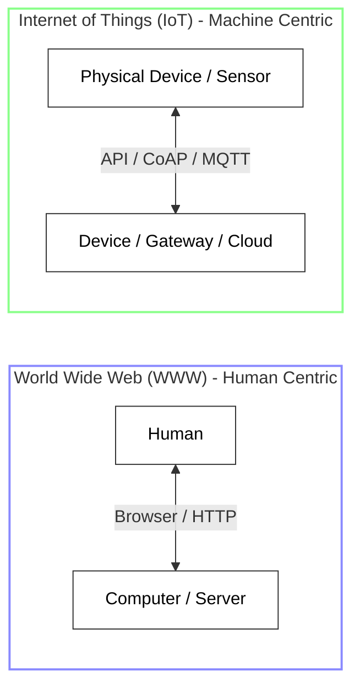
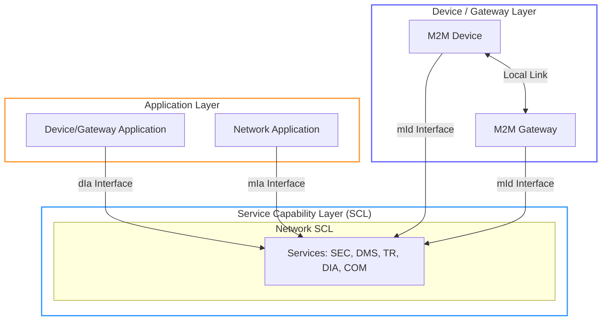
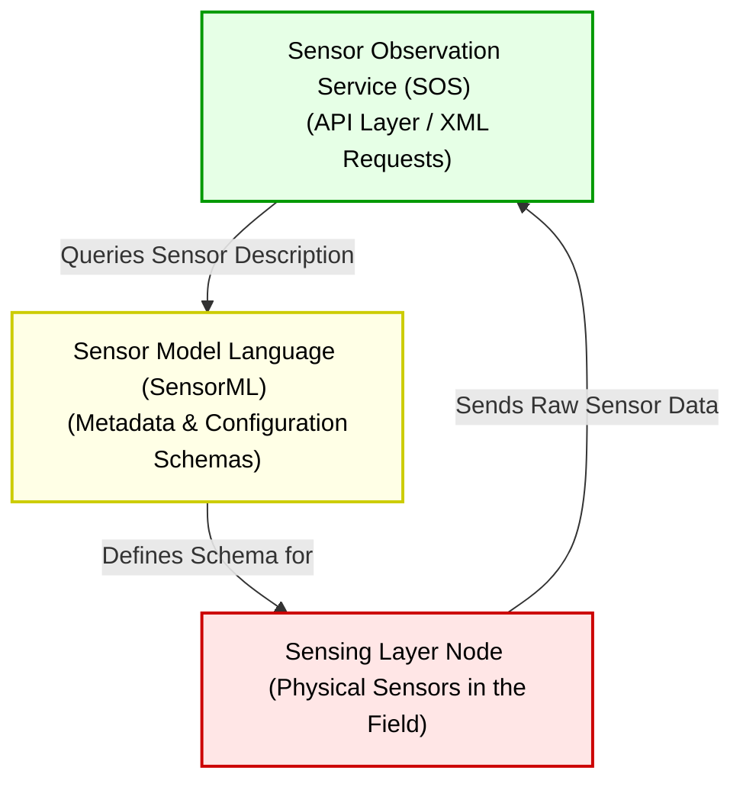

# Chapter 1 Diagrams

---

## 1. WWW vs. IoT Comparison
* **File Name:** `www_vs_iot.png`

---

## 2. ETSI M2M Functional Architecture
* **File Name:** `etsi_m2m_architecture.png`

---

## 3. OGC Functional Architecture
* **File Name:** `ogc_architecture.png`

---

## 4. Information-Driven Value Chain
* **File Name:** `information_value_chain.png`

```mermaid
flowchart LR
    PW["[1] Physical World<br>(Raw State: Temp/Press)"]
    S["[2] Sense<br>(Sensors: Digitalize Signal)"]
    T["[3] Transmit<br>(Networks: Data Packets)"]
    SA["[4] Store/Analyze<br>(Cloud: DB & Analytics)"]
    DA["[5] Decide/Act<br>(Actuators: Valves/Alarms)"]

    PW --> S
    S --> T
    T --> SA
    SA --> DA

    style PW fill:#f2f2f2,stroke:#666,stroke-width:2px,color:#000
    style S fill:#ffe6cc,stroke:#ff9933,stroke-width:2px,color:#000
    style T fill:#e6f2ff,stroke:#3399ff,stroke-width:2px,color:#000
    style SA fill:#e6ffe6,stroke:#33cc33,stroke-width:2px,color:#000
    style DA fill:#ffe6e6,stroke:#ff3333,stroke-width:2px,color:#000
```

