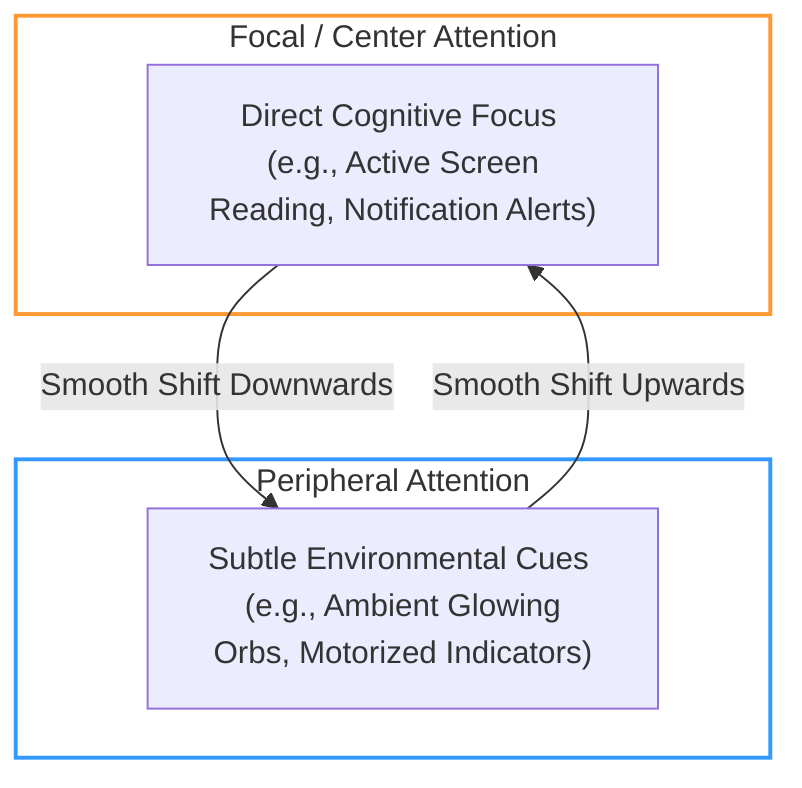
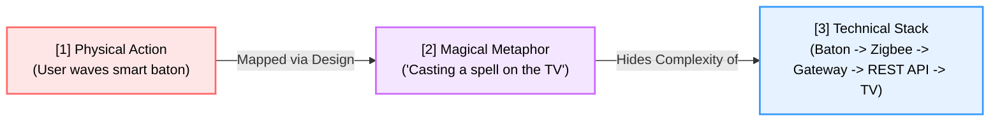

# Chapter 2 Diagrams

---

## 1. Calm Technology Attention Model
* **File Name:** `calm_technology_attention.png`

```mermaid
graph TD
    subgraph CENTER ["Focal / Center Attention"]
        FA["Direct Cognitive Focus <br> (e.g., Active Screen Reading, Notification Alerts)"]
    end
    
    subgraph PERIPHERY ["Peripheral Attention"]
        PA["Subtle Environmental Cues <br> (e.g., Ambient Glowing Orbs, Motorized Indicators)"]
    end
    
    FA -->|Smooth Shift Downwards| PA
    PA -->|Smooth Shift Upwards| FA
    
    style CENTER fill:none,stroke:#ff9933,stroke-width:2px
    style PERIPHERY fill:none,stroke:#3399ff,stroke-width:2px
```

---

## 2. Magic as Metaphor Mapping
* **File Name:** `magic_as_metaphor.png`

```mermaid
flowchart LR
    %% Steps
    UA["[1] Physical Action<br>(User waves smart baton)"]
    MM["[2] Magical Metaphor<br>('Casting a spell on the TV')"]
    TS["[3] Technical Stack<br>(Baton -> Zigbee -> Gateway -> REST API -> TV)"]

    %% Connection
    UA -->|Mapped via Design| MM
    MM -->|Hides Complexity of| TS

    %% Styling
    style UA fill:#ffe6e6,stroke:#ff6666,stroke-width:2px,color:#000
    style MM fill:#f5e6ff,stroke:#cc66ff,stroke-width:2px,color:#000
    style TS fill:#e6f2ff,stroke:#3399ff,stroke-width:2px,color:#000
```
