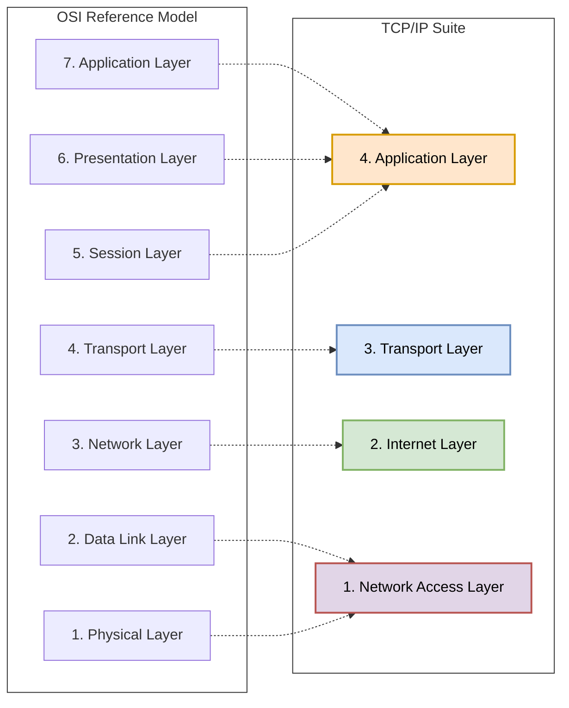
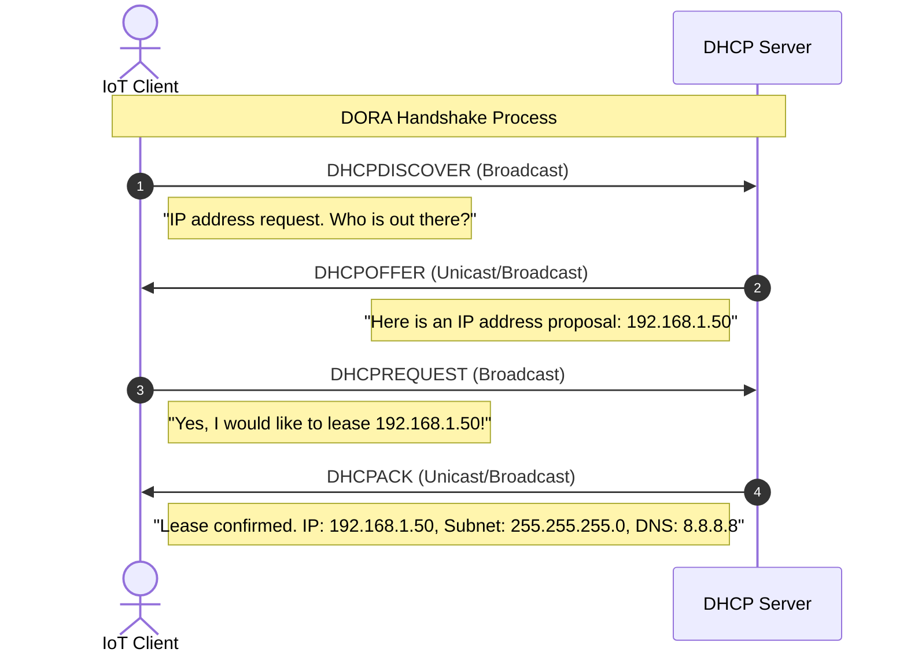
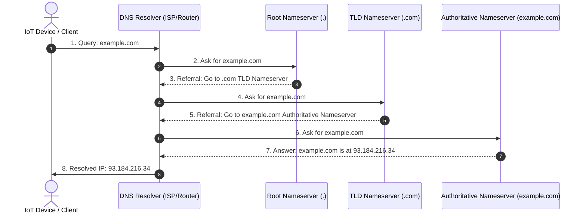
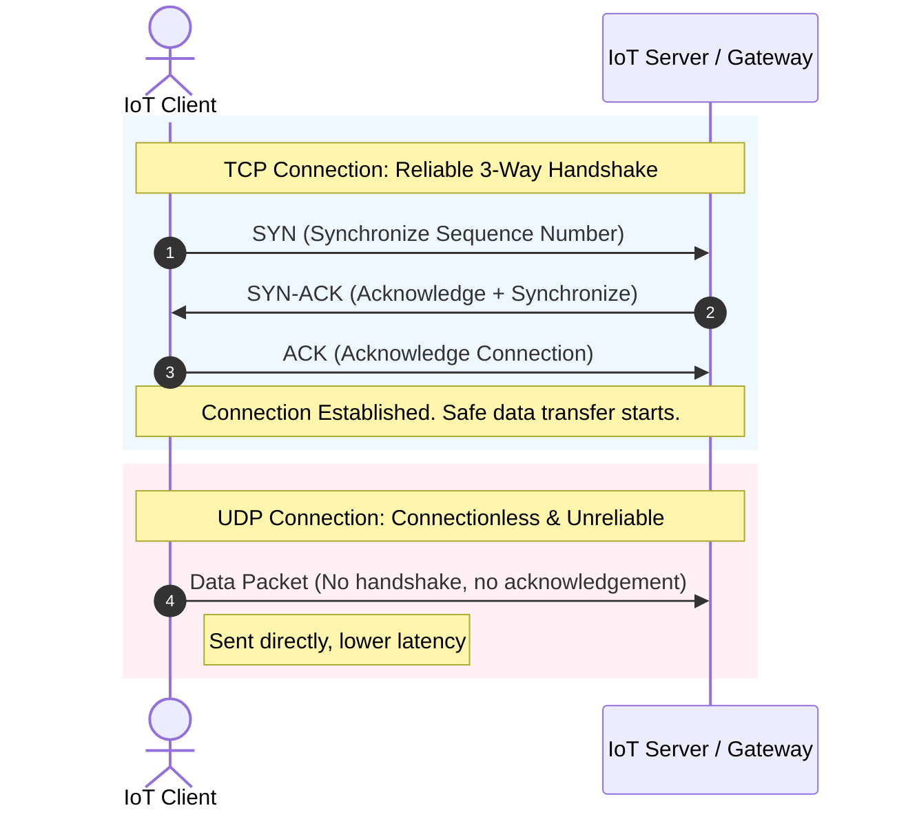
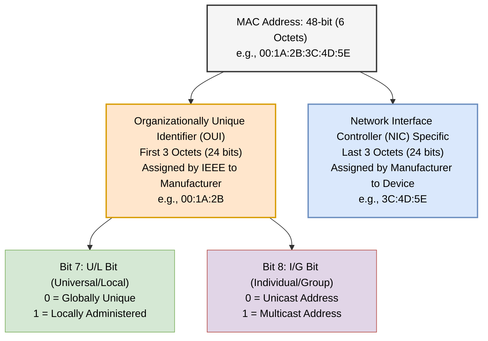
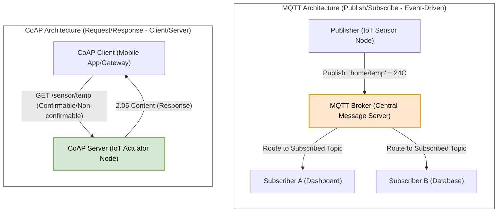

# Chapter 3 Diagrams

---

## 1. TCP/IP Protocol Suite vs OSI Model Mapping
* **File Name:** `tcp_ip_vs_osi.png`

---

## 2. DHCP Client-Server DORA Handshake
* **File Name:** `dhcp_handshake.png`

---

## 3. DNS Resolution Process
* **File Name:** `dns_resolution.png`

---

## 4. TCP 3-Way Handshake vs UDP Transmission
* **File Name:** `tcp_vs_udp.png`

---

## 5. MAC Address Structure
* **File Name:** `mac_address_format.png`

---

## 6. MQTT Pub/Sub vs CoAP Request/Response Architecture
* **File Name:** `mqtt_vs_coap.png`

