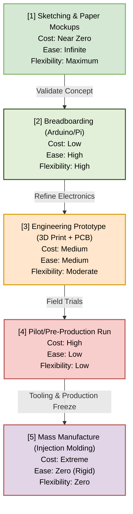
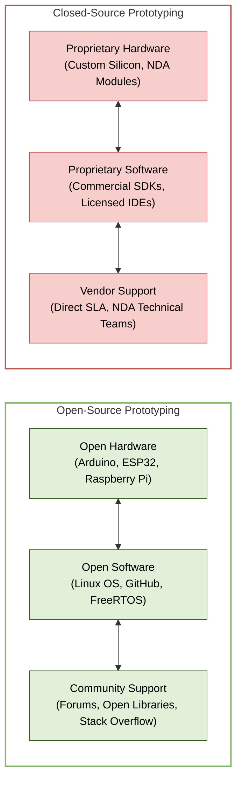

# Chapter 4 Diagrams

---

## 1. Cost vs. Ease of Prototyping Curve
* **File Name:** `cost_vs_ease.png`

---

## 2. Open Source vs. Closed Source Prototyping Ecosystems
* **File Name:** `open_vs_closed_source.png`

