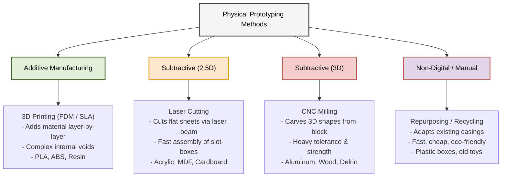
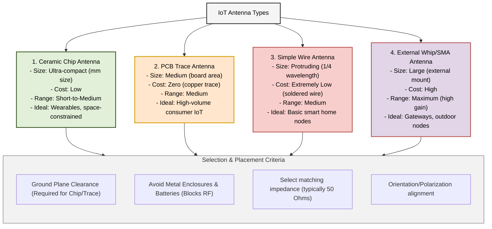

# Chapter 5 Diagrams

---

## 1. Comparison of Physical Prototyping Methods
* **File Name:** `physical_prototyping_methods.png`

---

## 2. IoT Antenna Types & Placement Selection Criteria
* **File Name:** `iot_antenna_types.png`

