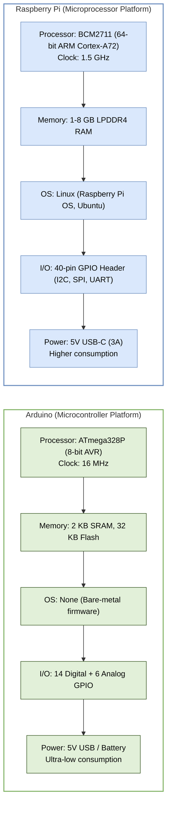
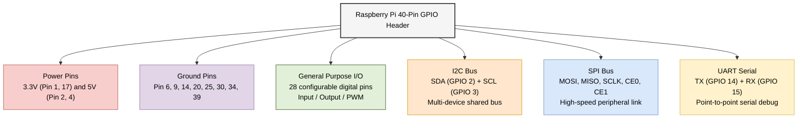

# Chapter 6 Diagrams

---

## 1. Arduino vs. Raspberry Pi Architecture Comparison
* **File Name:** `arduino_vs_raspberry_pi.png`

---

## 2. Raspberry Pi GPIO Pin Interfaces Mapping
* **File Name:** `rpi_gpio_interfaces.png`

