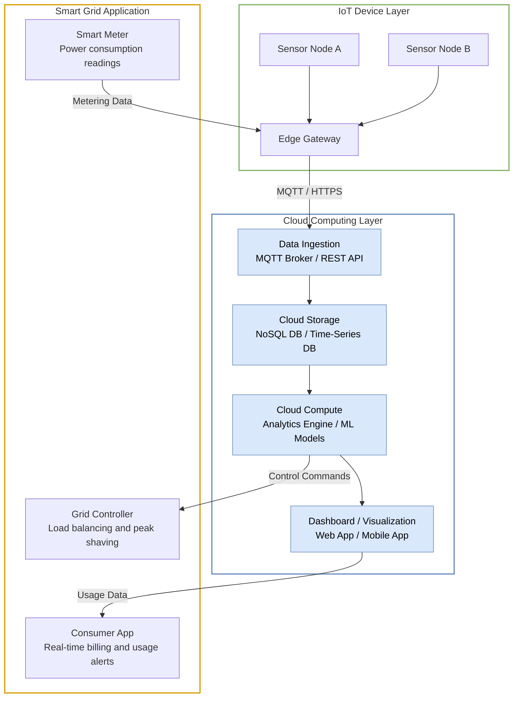
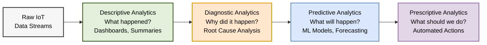

# Chapter 7 Diagrams

---

## 1. Cloud Computing in IoT Architecture
* **File Name:** `cloud_iot_architecture.png`

---

## 2. Big Data Analytics Pipeline for IoT
* **File Name:** `big_data_analytics.png`

