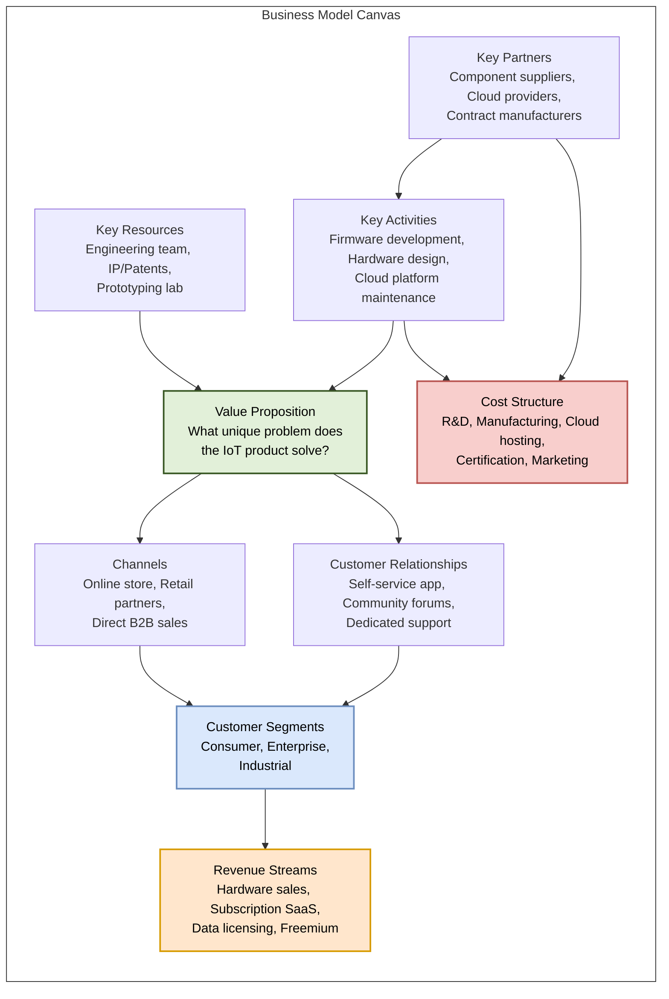
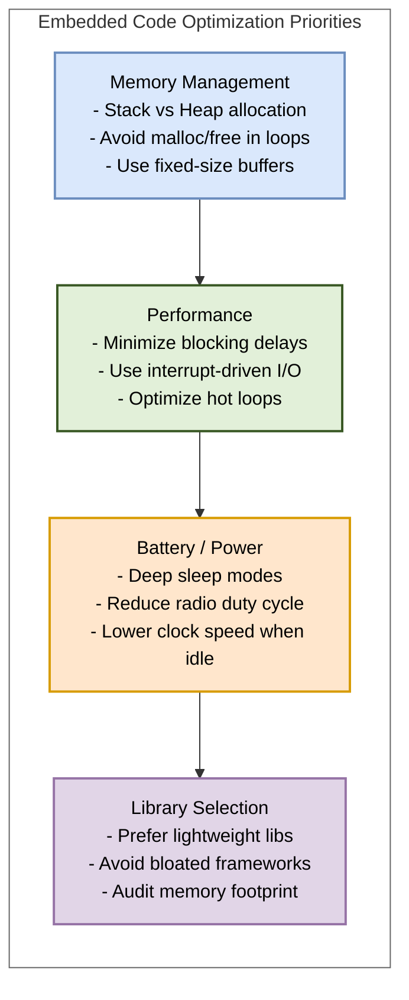

# Chapter 8 Diagrams

---

## 1. Business Model Canvas for IoT Startups
* **File Name:** `business_model_canvas.png`

---

## 2. Embedded Code Optimization Priorities
* **File Name:** `embedded_optimization.png`

