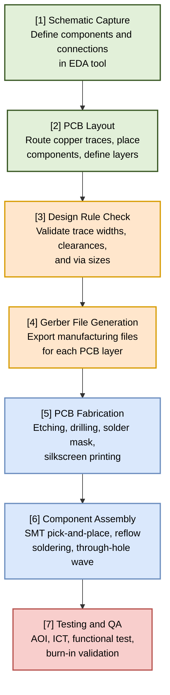
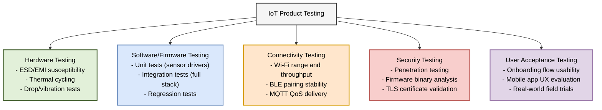

# Chapter 9 Diagrams

---

## 1. PCB Design to Mass Manufacturing Pipeline
* **File Name:** `pcb_manufacturing_pipeline.png`

---

## 2. IoT Product Testing Pyramid
* **File Name:** `iot_testing_pyramid.png`

