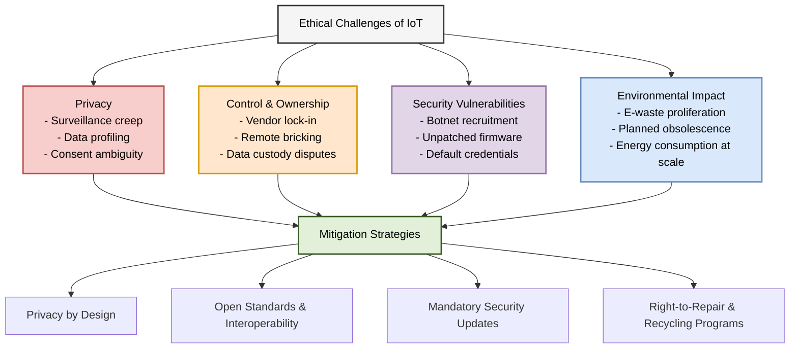
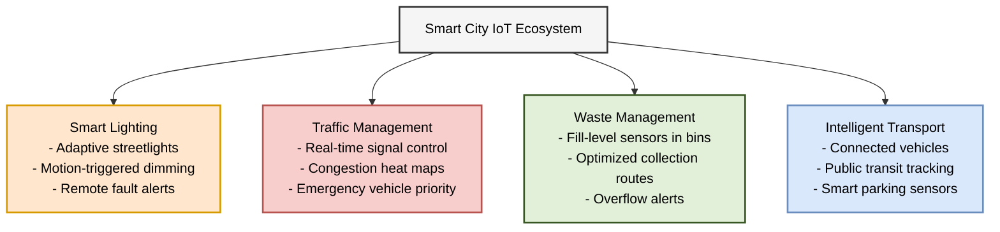

# Chapter 10 Diagrams

---

## 1. Ethical Challenges of IoT
* **File Name:** `iot_ethical_challenges.png`

```mermaid
flowchart TD
    Ethics["Ethical Challenges of IoT"]
    
    Ethics --> Privacy["Privacy<br>- Surveillance creep<br>- Data profiling<br>- Consent ambiguity"]
    Ethics --> Control["Control & Ownership<br>- Vendor lock-in<br>- Remote bricking<br>- Data custody disputes"]
    Ethics --> Security["Security Vulnerabilities<br>- Botnet recruitment<br>- Unpatched firmware<br>- Default credentials"]
    Ethics --> Environ["Environmental Impact<br>- E-waste proliferation<br>- Planned obsolescence<br>- Energy consumption at scale"]
    
    Privacy --> Solutions["Mitigation Strategies"]
    Control --> Solutions
    Security --> Solutions
    Environ --> Solutions
    
    Solutions --> S1["Privacy by Design"]
    Solutions --> S2["Open Standards & Interoperability"]
    Solutions --> S3["Mandatory Security Updates"]
    Solutions --> S4["Right-to-Repair & Recycling Programs"]

    style Ethics fill:#f5f5f5,stroke:#333,stroke-width:2px,color:#000
    style Privacy fill:#f8cecc,stroke:#b85450,stroke-width:2px,color:#000
    style Control fill:#ffe6cc,stroke:#d79b00,stroke-width:2px,color:#000
    style Security fill:#e1d5e7,stroke:#9673a6,stroke-width:2px,color:#000
    style Environ fill:#dae8fc,stroke:#6c8ebf,stroke-width:2px,color:#000
    style Solutions fill:#e2f0d9,stroke:#385723,stroke-width:2px,color:#000
```

---

## 2. Smart City IoT Application Areas
* **File Name:** `smart_city_iot.png`

```mermaid
flowchart TD
    SC["Smart City IoT Ecosystem"]
    
    SC --> Lighting["Smart Lighting<br>- Adaptive streetlights<br>- Motion-triggered dimming<br>- Remote fault alerts"]
    SC --> Traffic["Traffic Management<br>- Real-time signal control<br>- Congestion heat maps<br>- Emergency vehicle priority"]
    SC --> Waste["Waste Management<br>- Fill-level sensors in bins<br>- Optimized collection routes<br>- Overflow alerts"]
    SC --> ITS["Intelligent Transport<br>- Connected vehicles<br>- Public transit tracking<br>- Smart parking sensors"]

    style SC fill:#f5f5f5,stroke:#333,stroke-width:2px,color:#000
    style Lighting fill:#ffe6cc,stroke:#d79b00,stroke-width:2px,color:#000
    style Traffic fill:#f8cecc,stroke:#b85450,stroke-width:2px,color:#000
    style Waste fill:#e2f0d9,stroke:#385723,stroke-width:2px,color:#000
    style ITS fill:#dae8fc,stroke:#6c8ebf,stroke-width:2px,color:#000
```
