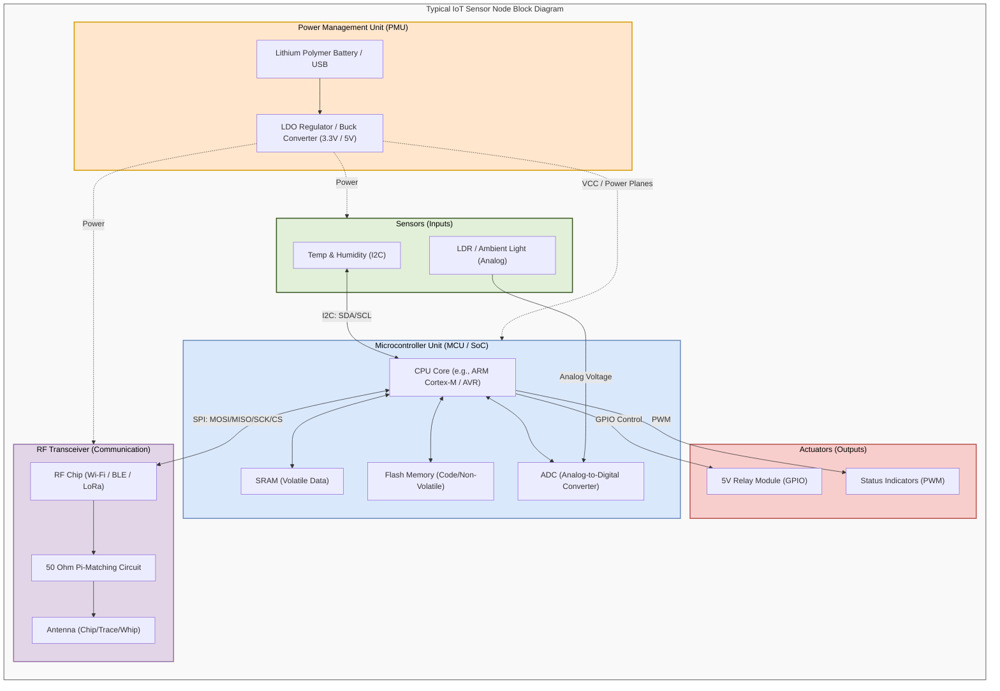
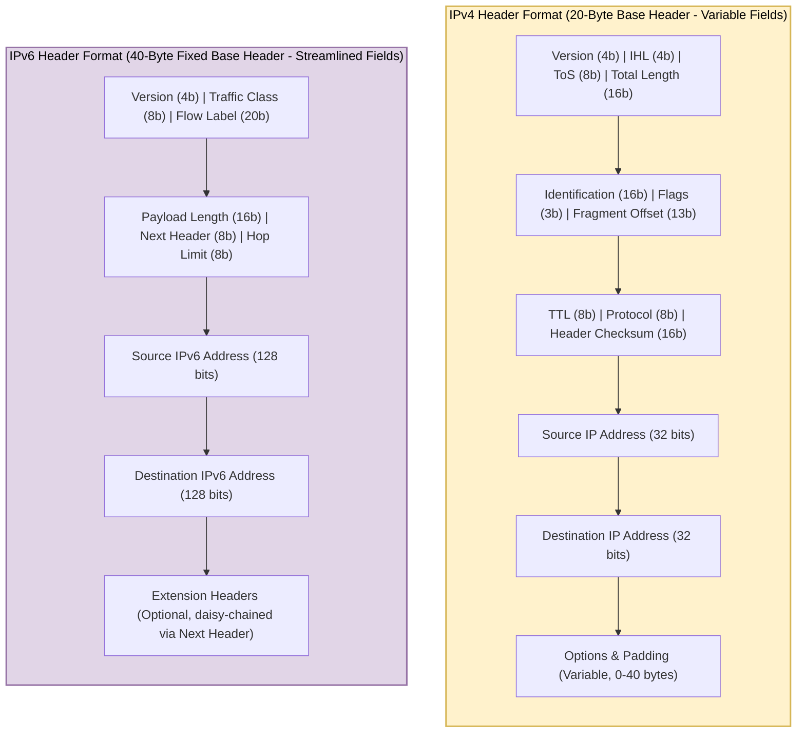

# Proposed Supplementary Diagrams for IoT Syllabus

This document outlines new, helpful diagrams to supplement the notes for the **OE-EC803A - Internet of Things (IoT)** syllabus, complete with their target chapters and copy-ready Mermaid source codes.

---

## 1. IoT Sensor Node Hardware Architecture
* **File Name:** `iot_sensor_node_blocks.png`
* **Chapter Name:** `chapter_06` (Prototyping Embedded Devices)
* **Mermaid Code:**

---

## 2. IPv4 vs. IPv6 Header Format Comparison
* **File Name:** `ipv4_vs_ipv6_headers.png`
* **Chapter Name:** `chapter_03` (Internet Principles)
* **Mermaid Code:**

