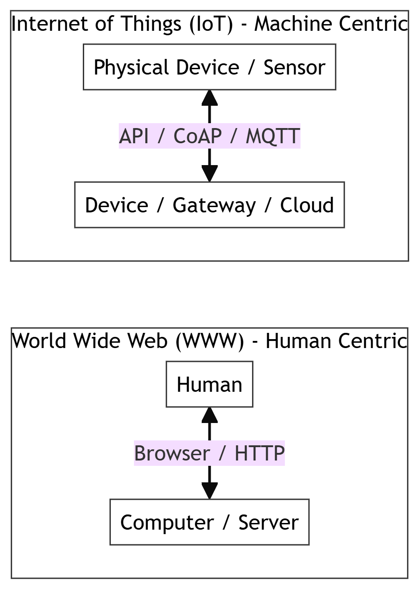
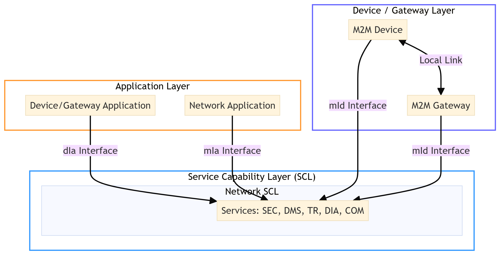
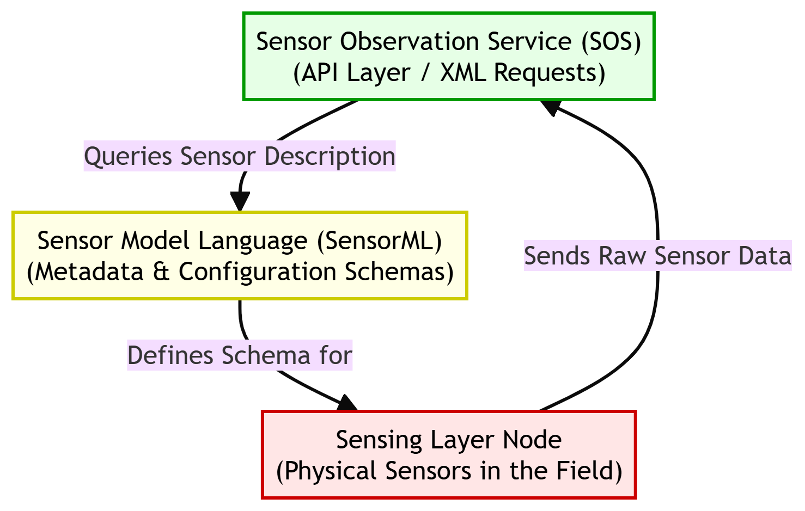
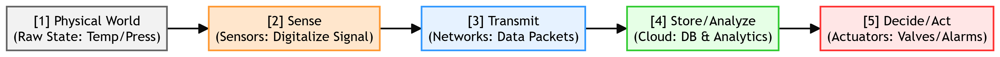

# Chapter 1: Introduction to IoT

This chapter compiles lecture-quality study notes and comprehensive exam answers for **Unit I: Introduction** of the OE-EC803A syllabus, adhering strictly to the **MAKAUT Answer Writing Guidelines**.

---

## 📝 Section 1: Definitions and Core Concepts (Q1.1)

### 1. Definition of Internet of Things (IoT)
The **Internet of Things (IoT)** is a dynamic global network infrastructure with self-configuring capabilities based on standard and interoperable communication protocols. It connects physical and virtual **"things"** embedded with sensors, actuators, microcontrollers, and communication interfaces, allowing them to gather, process, and exchange data with minimal human intervention.

### 2. WWW vs. IoT Comparison
*   **World Wide Web (WWW):** Connects **humans to information** using web browsers and standard protocols (HTTP/HTTPS) to access documents, web pages, and multimedia. It is a human-centric information network.
*   **Internet of Things (IoT):** Connects **devices to devices (things to things)**. It links physical objects, sensors, and actuators to exchange machine-generated data, trigger actions, and automate workflows. It is a machine-centric, physical-digital network.

### 3. Four Primary Application Areas
1.  **Consumer / Smart Home:** Smart thermostats (e.g., Nest), connected lighting (e.g., Philips Hue), and home security systems.
2.  **Industrial IoT (IIoT):** Predictive maintenance of machinery, supply chain asset tracking, and smart factory automation.
3.  **Healthcare:** Wearable health trackers, remote patient monitoring devices, and smart pill bottles.
4.  **Smart Infrastructure:** Intelligent transportation systems, smart electrical grids, and automatic environmental tracking (pollution/weather).

---

## 📝 Section 2: WSN, M2M and IoT Comparison (Q1.2)

### 1. Wireless Sensor Network (WSN) vs. IoT
*   **Wireless Sensor Network (WSN):** A localized network of spatially distributed autonomous devices (nodes) equipped with sensors to monitor physical or environmental conditions (e.g., temperature, pressure). WSNs focus on **data collection** and sending it to a central sink node; they typically lack direct internet connectivity or actuators to affect the environment.
*   **Internet of Things (IoT):** A global network that integrates WSNs, actuators, internet connectivity, cloud storage, and analytics. While WSNs only sense the world, IoT systems can **sense, think, and act** by feeding data to actuators to dynamically modify the environment.

### 2. M2M vs. IoT Characteristics

| Feature / Criteria | Machine-to-Machine (M2M) | Internet of Things (IoT) |
| :--- | :--- | :--- |
| **Scope of Connectivity** | Point-to-point, closed system (usually localized or cellular). | Global network, open standard internet protocols. |
| **Communication Type** | Device-to-device (usually direct, isolated links). | Device-to-device, Device-to-Cloud, and Cloud-to-Cloud. |
| **Hardware Focus** | Hardware-centric (focused on physical machine links). | Software & Data-centric (focused on API integration and analytics). |
| **Standards & Protocols** | Proprioceptive or legacy protocols (cellular/proprietary). | Open internet protocols (IP, TCP/IP, MQTT, CoAP). |
| **Value Focus** | Operational efficiency (monitoring single machine states). | Business transformation (big data analytics, value-driven chains). |

---

## 📝 Section 3: Flavors, Enchanted Objects and Creators (Q1.8)

### 1. The Concept of an "Enchanted Object"
Coined by David Rose, an **Enchanted Object** is a physical, everyday item that has been digitally enhanced with sensors, actuators, and internet connectivity, giving it extraordinary capabilities while maintaining its original, intuitive physical form.
*   **Example:** A standard umbrella handle that glows blue when the local weather report forecasts rain. It does not force the user to look at a smartphone screen; instead, it uses subtle, ambient cues to deliver information.

### 2. The Four "Flavors" (Architectures) of IoT Communication
1.  **Device-to-Device (D2D):** Two or more devices communicate directly with each other over local, short-range wireless links (e.g., Bluetooth, Zigbee) without routing data through an internet server.
2.  **Device-to-Cloud (D2C):** An IoT device connects directly to an internet cloud service (e.g., AWS IoT, Azure) using standard protocols like IP/TCP to upload data and receive control commands.
3.  **Device-to-Gateway (D2G / Gateway):** Constraint devices connect to an intermediate **gateway node** over local protocols. The gateway translates protocols, aggregates data, and forwards it to the internet cloud.
4.  **Back-End Data Sharing (C2C / Cloud-to-Cloud):** Cloud services communicate with other cloud databases via Web APIs (REST/JSON), allowing third-party services to share and analyze aggregated device data.

### 3. Categories of IoT Creators
*   **Makers & Hobbyists:** Use open-source platforms (Arduino, Raspberry Pi) to build custom home hacks and rapid, low-cost prototypes.
*   **Startups:** Focus on rapid market entry, using lean principles to launch niche consumer or enterprise products.
*   **Industrial Engineers:** Focus on operational efficiency, retrofitting legacy industrial machines with modern smart sensors.
*   **Corporate Developers & Enterprise Architects:** Build scalable, highly secure corporate cloud platforms to handle millions of streaming data connections.

---

## 📝 Section 4: M2M vs. IoT Health Band Case Study (Q1.3)

To illustrate the potential and benefits of an IoT-oriented approach over traditional M2M, let us compare their deployment in a wearable **Health Band**:

### 1. The M2M Approach
*   **Architecture:** The health band uses a cellular transmitter to send a user's heart rate directly to a doctor's monitor in a closed hospital network.
*   **Characteristics:**
    *   *Isolated:* Only sends raw sensor data.
    *   *No Integration:* The data cannot be accessed by other systems (e.g., the user's fitness apps, local pharmacies).
    *   *No Scale:* Limited to a point-to-point connection.

### 2. The IoT Approach
*   **Architecture:** The health band connects to the user's smartphone via Bluetooth Low Energy (BLE), which acts as a gateway to upload the data to an internet cloud.
*   **Characteristics & Benefits:**
    *   *Integration:* The data is shared via APIs with fitness trackers, calorie counter apps, and the user's electronic medical record (EMR).
    *   *Edge & Cloud Analytics:* The phone calculates immediate warnings locally, while the cloud performs predictive analytics on historical trends to warn of potential heart issues.
    *   *Scalability:* Updates can be pushed to the device firmware over-the-air (OTA).

---

## 📝 Section 5: Standard Architectural Models (Q1.4, Q1.5, Q1.6, Q1.7)

### 1. ETSI M2M Functional Architecture
The **European Telecommunications Standards Institute (ETSI)** defines a standardized, highly modular functional architecture for M2M communication:

#### Three Core Interfaces:
1.  **dIa (Device-to-Application):** Connects device applications to the local service capability layer.
2.  **mIa (M2M-to-Application):** Connects network applications to the network service capability layer.
3.  **mId (M2M-to-Device):** Connects the device/gateway layer to the network service capability layer.

#### Key Service Capabilities:
*   **SEC (Security):** Handles authentication and key management.
*   **DMS (Device Management):** Handles diagnostics and firmware updates.
*   **TR (Transaction Management):** Manages reliable data storage and queuing.

---

### 2. OGC Functional Architecture
The **Open Geospatial Consortium (OGC)** Sensor Web Enablement (SWE) framework focuses on making sensors discoverable and accessible over the web:

*   **Sensor Observation Service (SOS):** An API allowing clients to query real-time sensor observations.
*   **SensorML (Sensor Model Language):** An XML schema describing the metadata, parameters, and processing pipelines of the sensor systems.

---

### 3. Generic M2M System Solution Functional Layers
A complete end-to-end M2M system is composed of three main functional blocks:

1.  **M2M Area Network (Device Domain):** Comprises the sensors, actuators, and the local connectivity (e.g., Zigbee, Bluetooth, I2C bus) linking them to a local gateway.
2.  **Communication Network (Network Domain):** The bridge network carrying data across long distances (e.g., Cellular GSM/3G/4G, Wi-Fi, Ethernet, satellite).
3.  **M2M Applications (Application Domain):** The cloud backend where data is analyzed, databases are updated, and users view dashboards.

---

### 4. Information-Driven Value Chain
The **Information-Driven Value Chain** maps how raw sensor measurements are transformed into valuable business decisions:

1.  **Sense:** Sensors capture physical changes and convert them into electrical signals.
2.  **Transmit:** Wireless/wired modules send the digitized measurements across IP networks.
3.  **Store/Analyze:** Databases store the historical logs while analytics software processes the streams for anomalies.
4.  **Decide/Act:** Actuators execute control actions (e.g., shutting down a motor, opening a valve) based on the analytical findings.

---

## 📝 Section 6: Supplemental Exam Topics

### 1. Top Challenges of Implementing an IoT System
*   **Security & Privacy:** Constrained devices lack the memory to run heavy encryption algorithms, leaving them open to hacking.
*   **Interoperability:** Gaps in standardized platforms cause communication silos between different manufacturers.
*   **Data Volume:** Managing and processing the massive streams of unstructured data generated by millions of sensors.
*   **Power Limits:** Many remote sensors run on small batteries and must survive for years without a battery change.

### 2. IoT vs. Industrial IoT (IIoT)
*   **Internet of Things (IoT):** Typically consumer-oriented (e.g., smart home devices, health wearables). Focuses on **user convenience** and has moderate security and reliability requirements. A system crash is a minor inconvenience.
*   **Industrial IoT (IIoT):** Mission-critical industrial systems (e.g., power plants, manufacturing lines). Focuses on **system safety, zero downtime, and extreme reliability**. A system crash can lead to massive financial loss or loss of life.

### 3. ICT Trends Affecting IoT
*   **Cloud to Edge Computing:** Shifting heavy analytics from centralized cloud databases to localized edge gateways to reduce communication latency.
*   **IPv4 to IPv6 Migration:** Providing a massive address space to accommodate billions of unique connected endpoints.
*   **Low-Power Wide-Area Networks (LPWAN):** Rise of cellular protocols like NB-IoT and LoRaWAN designed specifically for low-power, long-distance sensor nodes.
