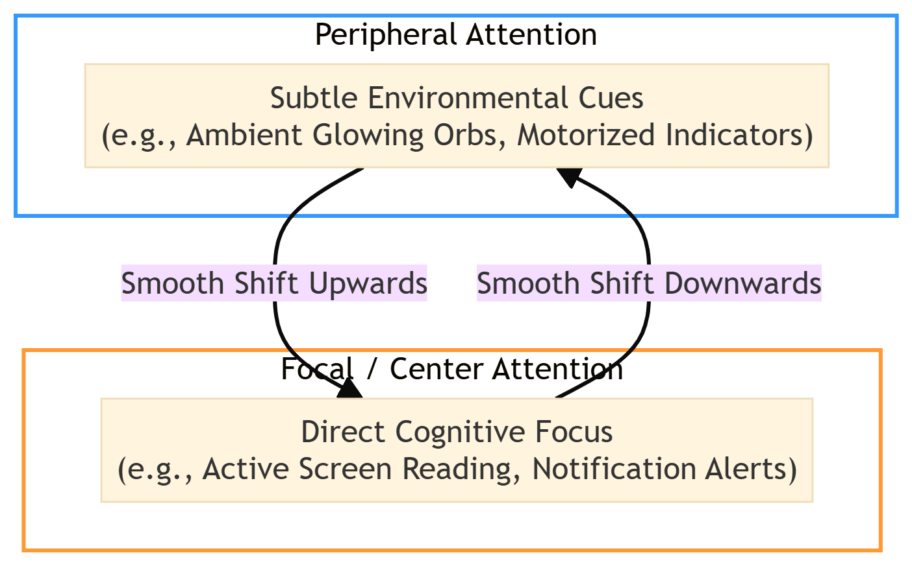
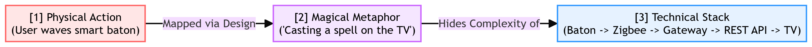

# Chapter 2: Design Principles for Connected Devices

This chapter compiles lecture-quality study notes and comprehensive exam answers for **Unit II: Design Principles** of the OE-EC803A syllabus, adhering strictly to the **MAKAUT Answer Writing Guidelines**.

---

## 📝 Section 1: Calm and Ambient Technology (Q2.2) [10M]

### 1. Definition and Origin
**Calm Technology** (coined by Mark Weiser and John Seely Brown at Xerox PARC in 1995) is a design paradigm stating that technology should inform us and be easily usable without demanding our focal attention. 
*   It is designed to remain primarily in the **periphery** of human attention, shifting smoothly to the **center** of attention only when necessary, and then returning to the periphery.
*   **Ambient Technology** represents the physical devices that implement Calm Technology by displaying data using subtle visual, auditory, or mechanical cues integrated directly into the physical environment.

---

### 2. Five Core Design Rules of Calm Technology

1.  **Peripheral Attention Priority:** The technology must utilize the user's peripheral vision and sensory systems. Most information should be absorbed subconsciously without interrupting the primary task (e.g., reading or conversing).
2.  **Seamless Shift Control:** The interface must allow the user to easily shift their focus from the peripheral background to the center of attention and back.
3.  **Enhancing Presence & Context:** The technology should provide subtle clues about what is happening around the user or in a remote system, fostering a sense of **situational presence** rather than isolation.
4.  **Peripheral Reach Extension:** It should extend the user's peripheral reach (the sense of control and awareness over distant systems) without adding cognitive overload.
5.  **Respecting Human Attention Limits:** Designers must respect the finite cognitive bandwidth of humans. The technology must minimize alarms, buzzes, and constant screen-checking.

---

### 3. Comparison: Calm Technology vs. Traditional Intrusive Technology

| Feature / Criteria | Calm and Ambient Technology | Traditional Intrusive Technology |
| :--- | :--- | :--- |
| **Primary Attention Focus** | Peripheral attention (senses, background). | Focal attention (active concentration). |
| **Cognitive Load** | Very low (passive absorption). | High (requires active processing & reading). |
| **Primary Interface** | Natural materials, lights, motion, sound. | Pixel-based screens, notifications, pop-ups. |
| **Information Delivery** | Continuous, low-frequency, ambient cues. | Discrete, high-frequency, jarring alerts. |
| **Physical Presence** | Blends seamlessly into the room's decor. | Stands out, demands direct eye contact. |
| **User Stress Level** | Minimizes anxiety (stress-reducing). | Induces fatigue and distraction (stress-inducing). |

---

### 4. Real-World Examples of Ambient Devices
*   **David Rose’s Ambient Orb:** A frosted glass sphere that glows in different colors depending on external data feeds. For example, it glows green if stock market indices are up, red if they are down, or yellow if traffic is heavy. Users track parameters in their peripheral vision without opening an app.
*   **The Ambient Umbrella:** A standard umbrella with a handle that pulses a blue light if the local weather report forecasts rain in the next few hours. The user simply glances at the umbrella stand before stepping out of the house.
*   **The Water Lamp:** A project at MIT that projects ripples of light onto the ceiling. The ripples represent local network traffic speed. Fast, hectic ripples indicate high network activity, while slow, calm ripples indicate idle networks, making data traffic visible as a natural phenomenon.

---

### 5. Advantages and Disadvantages

#### Advantages (5 Points):
1.  **Reduces Cognitive Fatigue:** Prevents information overload by keeping data streams in the peripheral background.
2.  **Blends into Environments:** Avoids cluttering home or office spaces with bright, distracting LCD screens.
3.  **Preserves Human Social Spaces:** Allows people to converse and work face-to-face without being constantly interrupted by screens.
4.  **Fosters Ambient Awareness:** Keeps users continuously but gently informed about remote parameters (e.g., weather, stock prices, home security status).
5.  **Energy Efficiency:** Ambient devices (using simple LEDs, motors, or e-paper) consume significantly less power than active screen terminals.

#### Disadvantages (5 Points):
1.  **Low Information Density:** Cannot convey complex, numeric, or high-precision text data (e.g., you cannot read an email on an ambient umbrella).
2.  **Increased Ambiguity:** Abstract cues (like color shifts or motor speeds) can be misinterpreted by the user, leading to confusion.
3.  **Inappropriate for Critical Alerts:** Unsuitable for urgent, life-safety alarms (e.g., a smoke detector or gas leak alarm must be intrusive and loud).
4.  **Debugging & Troubleshooting Difficulties:** Lacks screens or status readouts, making it difficult for users to know why a device is disconnected.
5.  **Accessibility Challenges:** Heavily relies on visual color-coding or subtle sounds, which may exclude users with color blindness, visual impairments, or hearing loss.

#### Conclusion:
Calm technology shifts our relationship with computers from active, attention-draining interactions to a peaceful coexistence, allowing connected devices to act as supportive, background assistants in our physical environments.

---

## 📝 Section 2: Core Design Principles for Connected Devices (Q2.1) [5M]

Connected physical devices represent a unique design challenge because they combine hardware, software, network latency, and physical interaction. The four pillars of this design system are:

---

### 1. Magic as Metaphor

#### Definition:
**Magic as Metaphor** is a design heuristic that uses concepts of magical objects from myth, folklore, and fantasy (e.g., magic wands, crystal balls, enchanted mirrors) to explain the invisible, highly complex workings of IoT systems to the end-user.

#### Application:
Because physical objects have no visible wires or software interfaces, users must form mental models of how they work. Aligning interactions with magical metaphors makes the system intuitive.
*   **Example 1 (Magic Wand):** Waving a smart gesture controller to turn off lights or change TV channels.
*   **Example 2 (Enchanted Mirror):** A bathroom mirror that displays weather, calendar alerts, and news updates as if it were a magical, talking mirror.

#### Limitations:
*   **Expectation Mismatch:** If an object is presented as "magical," users may expect it to do anything, leading to frustration when it fails or when its capabilities are limited.
*   **No Clear Error States (Lack of Debuggability):** Magic does not have error codes. If a "magic wand" does not work, the user has no way of knowing whether the battery is low, the Wi-Fi is down, or the API is offline.
*   **Cultural Variance:** Magical folklore differs globally, which can lead to poor metaphor adoption across different regions.

---

### 2. Privacy

#### Definition:
**Privacy** in the design of connected devices ensures that devices operating within the user's private physical spaces (e.g., homes, offices) respect their personal boundaries, maintain data autonomy, and prevent unauthorized surveillance.

#### Core Design Dimensions:
1.  **Consent and Control:** Users must have simple, explicit mechanisms to enable or disable data collection.
2.  **Contextual Integrity:** Data collected in one context (e.g., a smart thermostat tracking occupancy to optimize heating) must not be repurposed for another context (e.g., selling occupancy details to insurance companies).
3.  **Data Minimization:** Only collect the data absolutely necessary for the device's function. 
4.  **Local Processing (Edge Computing):** Process sensitive sensor data (such as voice recognition or camera frames) locally on the device or edge gateway instead of streaming raw feeds to the cloud.
5.  **Transparency:** Clear, physical indicators (e.g., a physical sliding shutter over a camera lens or a hardwired LED showing when a microphone is powered) must be present.

---

### 3. Web Thinking for Connected Devices

#### Definition:
**Web Thinking** is the practice of designing the architecture of physical IoT systems using the established, open, and scalable principles of the World Wide Web, rather than building isolated, proprietary software silos.

#### Key Principles:
*   **URIs/URLs for Physical Assets:** Give every sensor, actuator, and device a unique Web Address. This makes every physical object linkable, addressable, and discoverable.
*   **RESTful APIs:** Implement standard web commands (`GET` to read a sensor, `POST`/`PUT` to trigger an actuator, `DELETE` to clear a state) using open formats like JSON or XML.
*   **Loose Coupling:** Separate the hardware device from the client application. A smart bulb should simply expose a REST API; any developer can then write an app to control it without modifying the bulb's firmware.
*   **Physical Mashups:** Use web automation tools like **IFTTT (If This Then That)** or **Node-RED** to link devices across different manufacturers (e.g., "*If* smart security camera senses motion, *Then* send an HTTP POST request to blink my smart desk lamp").
*   **Reuse Existing Web Infrastructure:** Leverage standard security (HTTPS/TLS), caching mechanisms, domain name systems (DNS), and load balancers to scale device networks.

---

### 4. Affordances

#### Definition:
An **Affordance** (coined by James J. Gibson and adapted by Don Norman) refers to the physical properties of an object that suggest how it should be used (e.g., a handle *affords* pulling, a button *affords* pushing, a dial *affords* rotating).

#### The IoT Challenge: The Clash of Affordances
When digital capabilities are added to everyday physical objects, a conflict arises:
*   The object still has its traditional **physical affordance** (e.g., a smart mug looks like it is only for drinking coffee).
*   However, it now possesses **digital/hidden affordance** (e.g., it can monitor liquid levels, track temperatures, and pair via Bluetooth). Because these features are invisible, users do not know they exist.

#### Design Solutions:
1.  **Visual Signifiers:** Use subtle physical indicators (like a ring of LEDs, textured buttons, or small e-paper displays) to hint at digital functions.
2.  **Sensory Feedback Loops:** Provide immediate haptic vibrations, status sounds, or light changes to confirm when a digital sensor has registered a physical interaction.
3.  **Preserve Core Physical Utility (Graceful Degradation):** The object must continue to perform its primary physical function even if the digital network fails or the battery dies. A smart mug must still safely hold hot coffee; a smart door lock must still open with a mechanical key.
