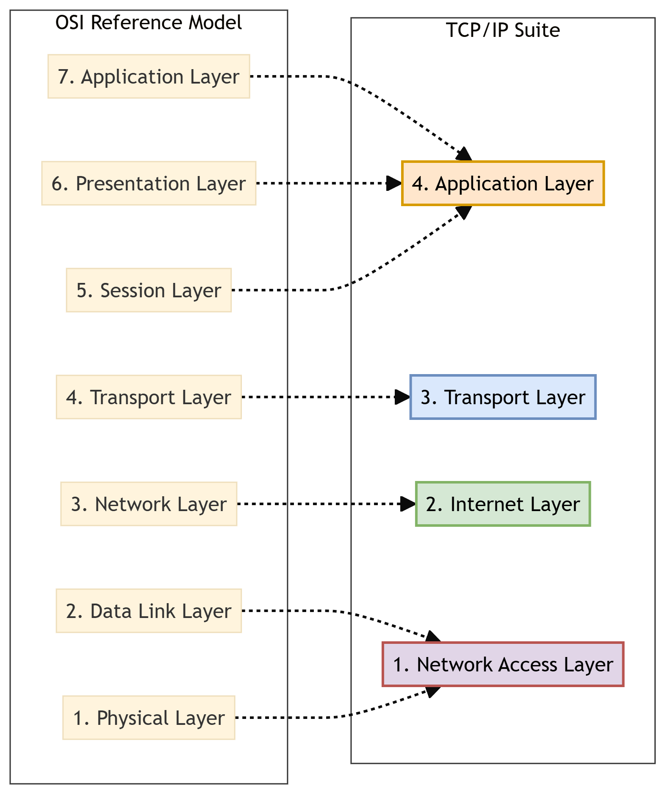
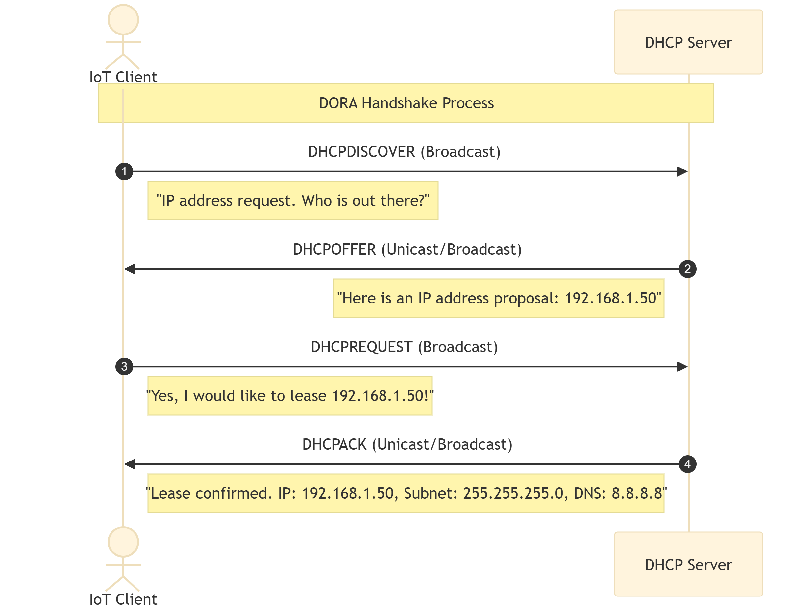
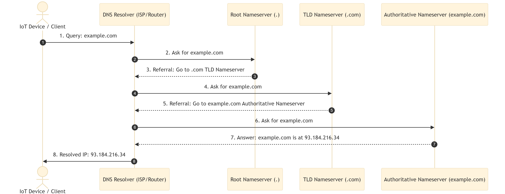
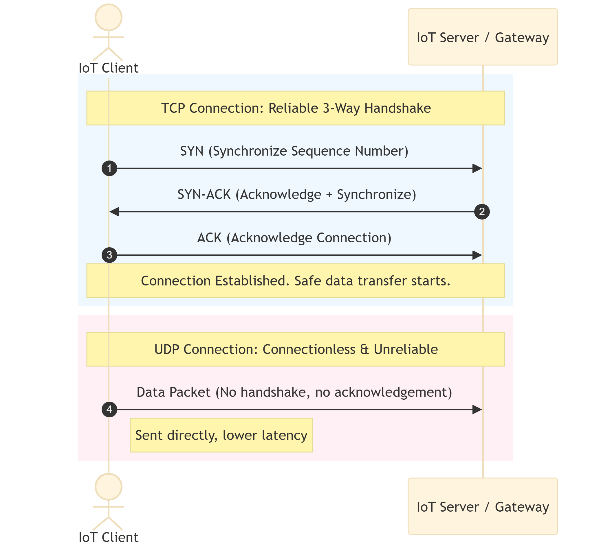
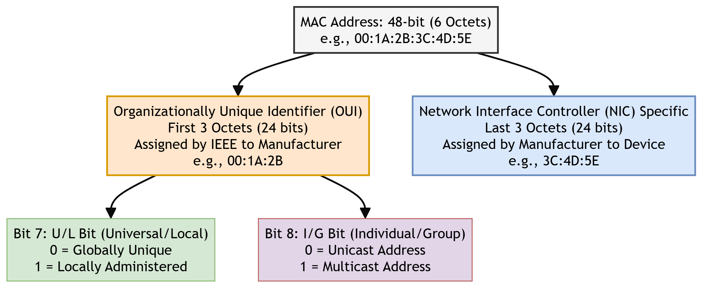
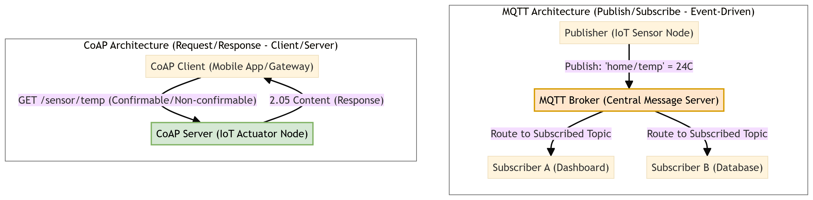

# Chapter 3: Internet Principles

This chapter compiles lecture-quality study notes and comprehensive exam answers for **Unit III: Internet Principles** of the OE-EC803A syllabus, adhering strictly to the **MAKAUT Answer Writing Guidelines**.

---

## 📝 Section 1: Internet Communications and the TCP/IP Suite

### 1. Introduction to Internet Communications
Internet communications form the backbone of the Internet of Things, enabling heterogeneous devices (sensors, gateways, servers) to exchange data globally. IoT leverages the existing TCP/IP architecture to ensure interoperability across diverse hardware platforms and physical transmission media.

### 2. TCP/IP Protocol Suite vs. OSI Reference Model
The **OSI (Open Systems Interconnection) Model** is a theoretical 7-layer framework developed by ISO, whereas the **TCP/IP Suite** is a practical 4-layer architecture implemented in real-world networking.



### 3. Detailed Layer Comparison and Protocol Examples

| TCP/IP Layer | Corresponding OSI Layer(s) | Primary Responsibility in IoT | Standard IoT/Internet Protocols |
| :--- | :--- | :--- | :--- |
| **4. Application** | Application (7), Presentation (6), Session (5) | Formats data, manages sessions, and defines client-server or pub/sub communication models. | HTTP, CoAP, MQTT, DNS, DHCP |
| **3. Transport** | Transport (4) | Establishes host-to-host connectivity, error checking, flow control, and packet sequencing. | TCP, UDP |
| **2. Internet** | Network (3) | Handles logical addressing, routing packets across multiple networks, and fragmentation. | IPv4, IPv6, ICMP, 6LoWPAN |
| **1. Network Access** | Data Link (2), Physical (1) | Defines physical media access (cables/radio waves), physical addressing, and framing. | Ethernet (802.3), Wi-Fi (802.11), BLE, Zigbee |

---

## 📝 Section 2: Bluetooth Low Energy (BLE) (Q3.1) [5M]

### 1. Definition and Core Features
**Bluetooth Low Energy (BLE)** (introduced in Bluetooth 4.0 as Bluetooth Smart) is a wireless personal area network (WPAN) technology designed by the Bluetooth Special Interest Group (SIG) specifically for low-power, low-latency, and low-data-rate short-range communications.

#### Core Features:
*   **Ultra-Low Power Consumption:** Devices can run for months or years on a single coin-cell battery (e.g., CR2032) by spending most of their time in a deep **sleep state**.
*   **Fast Connection Setup:** Connection establishment takes less than **3 milliseconds** (compared to 6 seconds in Classic Bluetooth), minimizing active RF radio uptime.
*   **Advertising Mode:** BLE devices can broadcast short packets of data ("advertisements") without establishing a formal connection, allowing quick sensor readouts (beacons).
*   **GATT (Generic Attribute Profile) Structure:** Organizes data hierarchically into Profiles, Services, and Characteristics, allowing standard read/write operations.

---

### 2. Comparison: Classic Bluetooth vs. Bluetooth Low Energy (BLE)

| Feature / Criteria | Classic Bluetooth (BR/EDR) | Bluetooth Low Energy (BLE) |
| :--- | :--- | :--- |
| **Primary Design Goal** | High-throughput continuous data stream. | Low duty cycle, ultra-low power consumption. |
| **Power Consumption** | High (1 Watt reference; active battery drain). | Ultra-low (0.01 to 0.05 Watts; sleeping mostly). |
| **Data Rate (Throughput)**| 1 to 3 Mbps. | 125 Kbps to 2 Mbps. |
| **Connection Setup Latency**| Up to 6 seconds. | Under 3 milliseconds. |
| **Voice / Audio Capability**| Supported (ideal for headsets/speakers). | Not natively designed for continuous audio (only BLE Audio). |
| **Network Topology** | Piconet (1 Master, max 7 active Slaves). | Scatternet & Mesh (unlimited nodes in Mesh). |
| **Operational State** | Always active / standby modes. | Sleep state by default, wakes up only to transmit. |

---

### 3. Advantages and Disadvantages of BLE in IoT

#### Advantages:
1.  **Extended Battery Life:** Fits coin-cell powered wearable medical patches and smart home sensors perfectly.
2.  **Low Hardware Cost:** Radio chips are highly integrated, small, and inexpensive.
3.  **Smartphone Integration:** Supported by almost all modern smartphones, eliminating the need for an external gateway.

#### Disadvantages:
1.  **Low Data Rates:** Inadequate for streaming video, images, or large files.
2.  **Short Range:** Typical indoor coverage is limited to 10–30 meters.
3.  **Incompatibility:** Not backward compatible with legacy Classic Bluetooth hardware.

---

## 📝 Section 3: IP Addressing & DHCP (Q3.2) [5M]

### 1. Static vs. Dynamic IP Addressing

| Addressing Method | Static IP Addressing | Dynamic IP Addressing |
| :--- | :--- | :--- |
| **Definition** | Manually configured and permanently assigned to a network interface. | Automatically assigned by a network server for a temporary duration. |
| **Ease of Configuration**| High overhead; requires manual entry on every device. | Zero-touch configuration for the client device. |
| **IP Reusability** | None; the IP remains reserved even if the device is offline. | High; inactive IPs return to the address pool. |
| **Security Risk** | Higher risk of targeted attacks as the IP never changes. | Lower risk; IP changes periodically. |
| **Ideal IoT Use Case** | Network gateways, local MQTT brokers, and central servers. | Edge sensor nodes, smart bulbs, and mobile clients. |

---

### 2. Working Principle of DHCP: The DORA Handshake
The **Dynamic Host Configuration Protocol (DHCP)** is an application layer protocol that automates the assignment of IP addresses, subnet masks, default gateways, and DNS server IPs.

The standard transaction uses a four-step process known as **DORA**:



1.  **DHCPDISCOVER (D):**
    *   **Action:** The client broadcasts a message to find any available DHCP server.
    *   **Source IP:** `0.0.0.0` | **Destination IP:** `255.255.255.255` (Broadcast).
2.  **DHCPOFFER (O):**
    *   **Action:** Any receiving DHCP server reserves an IP address and unicasts/broadcasts a proposal containing an IP address, lease time, subnet mask, and DNS information.
3.  **DHCPREQUEST (R):**
    *   **Action:** The client broadcasts a message accepting the proposal from a specific server, notifying other servers that their offers were declined.
4.  **DHCPACK (A):**
    *   **Action:** The server sends a confirmation packet. The client configures its network interface with the leased parameters.

---

### 3. Network Example of DHCP Working
Consider a **Smart Thermostat** boot-up sequence in a home network:
1.  On boot, the thermostat has no IP configuration. It broadcasts a `DHCPDISCOVER` packet over Wi-Fi.
2.  The home Wi-Fi Router (acting as the DHCP Server) receives this and checks its address pool. It replies with a `DHCPOFFER` proposing the IP `192.168.1.15` for a lease time of 24 hours.
3.  The thermostat replies with a `DHCPREQUEST` confirming it wants `192.168.1.15`.
4.  The router logs the MAC address of the thermostat against `192.168.1.15` and transmits a `DHCPACK`. The thermostat is now online.

---

### 4. Domain Name System (DNS) in IoT
*   **Concept:** IoT devices typically connect to cloud servers using human-readable domain names (e.g., `api.thingspeak.com` or `mqtt.eclipseprojects.io`) rather than hardcoded IP addresses. The **Domain Name System (DNS)** is a hierarchical distributed naming system that resolves these domain names into numeric IP addresses (IPv4 or IPv6) that routers use to forward data packets.
*   **Resolution Process:** As shown in the sequence below, the device queries a local DNS resolver, which recursively queries Root, Top-Level Domain (TLD), and Authoritative nameservers until the target IP is returned and cached.



---

## 📝 Section 4: TCP vs. UDP Transport Layer Protocols (Q3.3) [5M]

The Transport Layer manages how data is shipped across network endpoints. IoT uses two primary protocols: **TCP (Transmission Control Protocol)** and **UDP (User Datagram Protocol)**.



---

### 1. Comparison: TCP vs. UDP

| Feature / Criteria | TCP (Transmission Control Protocol) | UDP (User Datagram Protocol) |
| :--- | :--- | :--- |
| **Connection Type** | **Connection-oriented** (requires 3-way handshake). | **Connectionless** (packets sent independently). |
| **Reliability** | Guaranteed delivery (uses ACKs and retransmissions). | Best-effort delivery (no guarantees, packet loss possible). |
| **Data Flow Control** | Yes (sliding window controls flow; avoids congestion). | None (sends data as fast as the app generates it). |
| **Packet Overhead** | High (20-byte minimum header). | Low (8-byte header). |
| **Speed / Latency** | Slower (due to connection setup, sequencing, ACKs). | Fast (no connection overhead, lower latency). |
| **Transmission Type** | Byte stream. | Message/Datagram-oriented. |

---

### 2. Why UDP is Preferred in Constrained IoT Environments
Many IoT edge devices are battery-powered, resource-constrained microcontrollers connected over lossy wireless networks. UDP is preferred here because:
1.  **Power Conservation:** Establishing a TCP connection requires a 3-way handshake (SYN, SYN-ACK, ACK), and closing it requires a 4-step teardown. This high radio uptime drains batteries. UDP sends data immediately and enters sleep mode.
2.  **Reduced Overhead:** TCP's 20-byte header is 150% larger than UDP's 8-byte header. For small sensor payloads (e.g., a 2-byte temperature reading), TCP wastes bandwidth.
3.  **Low Latency / Real-Time Data:** For streaming parameters (e.g., GPS tracking or live industrial pressure updates), old data is useless. Retransmitting a lost packet (as TCP does) causes lag; UDP simply drops it and waits for the next live reading.
4.  **Application Layer Control:** Protocols like **CoAP** implement custom, lightweight reliability directly in the application layer over UDP, avoiding the resource-heavy overhead of transport-layer TCP.

---

## 📝 Section 5: IPv6 Protocol in IoT (Q3.4) [5M]

### 1. Benefits of IPv6 in IoT
The **Internet Protocol Version 6 (IPv6)** is replacing IPv4 as the default internet routing layer. Its integration is critical for IoT due to:
*   **Massive Address Space:** IPv6 uses 128-bit addresses, offering $3.4 \times 10^{38}$ unique addresses ($340\text{ undecillion}$). This ensures every single sensor node on earth can have a unique public IP.
*   **SLAAC (Stateless Address Autoconfiguration):** Devices generate their own IP address dynamically using local router advertisements and their MAC address, eliminating the need for a DHCP server.
*   **Header Simplicity & Router Efficiency:** IPv6 uses a fixed-length header format (40 bytes), allowing routers to process packets faster, reducing latency and gateway power usage.
*   **Built-in IPSec Security:** Cryptographic security (encryption and authentication) is natively supported.
*   **Optimized Multicasting:** Replaces wasteful IPv4 broadcasts with efficient multicast groups, preventing sleeping nodes from waking up for irrelevant broadcast traffic.

---

### 2. Length and Structure of IPv6 Address
*   **Length:** **128 bits** (16 bytes).
*   **Representation:** Represented as 8 groups of 4 hexadecimal digits, separated by colons (`:`).
*   **Standard Example:** `2001:0db8:85a3:0000:0000:8a2e:0370:7334`

#### Structural Breakdown:
An IPv6 address is split into two halves:
1.  **Network Prefix (First 64 bits):** Used for routing packets across the global internet. Typically provided by the ISP and local router.
2.  **Interface Identifier (Last 64 bits):** Identifies the specific host interface. Frequently derived from the device's physical 48-bit MAC address using the **EUI-64** format.

```text
+---------------------------------------+---------------------------------------+
|        Network Prefix (64 bits)       |      Interface Identifier (64 bits)    |
|  Global Routing + Subnet ID Info      |   Unique Host Address (MAC derived)   |
+---------------------------------------+---------------------------------------+
```

---

## 📝 Section 6: MAC Address & Ports (Q3.5) [5M]

### 1. MAC Address (Physical Address)
A **MAC (Media Access Control) address** is a unique, physical hardware identifier assigned to a Network Interface Controller (NIC) during manufacturing.

*   **Length:** **48 bits** (6 bytes).
*   **Layer:** Operates at the **Data Link Layer (Layer 2)** of the OSI model.
*   **Format:** Represented as 6 pairs of hexadecimal digits separated by colons or hyphens (e.g., `00:1A:2B:3C:4D:5E`).

---

### 2. MAC Address Structure
A standard 48-bit MAC address is split into two major parts:



1.  **Organizationally Unique Identifier (OUI):**
    *   **First 24 bits (3 octets):** Assigned by the IEEE Registration Authority to the hardware manufacturer (e.g., Apple, Intel, Espressif).
    *   *Bit 7 (U/L Bit):* Specfies whether the address is **Universally** administered (0) or **Locally** administered (1).
    *   *Bit 8 (I/G Bit):* Specifies whether the address is **Individual/Unicast** (0) or **Group/Multicast** (1).
2.  **NIC Specific (Extension Identifier):**
    *   **Last 24 bits (3 octets):** Assigned uniquely by the manufacturer to each individual physical chip.

---

### 3. Network Ports
While IP addresses locate a physical device on a network, **Ports** are logical endpoints within the operating system that route network traffic to specific software processes or services.

*   **Size:** **16-bit** unsigned integer (ranging from `0` to `65535`).
*   **Port Classifications:**
    1.  **Well-Known Ports (0 – 1023):** System ports reserved for standard core internet services (e.g., Port `80` for HTTP, Port `443` for HTTPS).
    2.  **Registered Ports (1024 – 49151):** Used by software applications and standard IoT services (e.g., Port `1883` for MQTT unencrypted, Port `8883` for MQTT over TLS).
    3.  **Dynamic / Private Ports (49152 – 65535):** Temporarily assigned to client applications requesting outbound network links.

---

## 📝 Section 7: IoT Application Layer Protocols (Q3.6) [15M]

The Application Layer governs how IoT devices format, structure, and request data. The three key protocols are **HTTP**, **CoAP**, and **MQTT**.



---

### 1. HTTP (Hypertext Transfer Protocol)
HTTP is the foundation of data communication for the World Wide Web, designed as a synchronous, request-response protocol.

*   **Working Principle:** A client establishes a TCP connection to a server, sends an HTTP request (GET, POST, PUT, DELETE) with verbose ASCII headers, and receives a response back.
*   **Strengths:**
    *   **Ubiquity:** Supported by almost all web servers, languages, and firewalls.
    *   **Ease of Integration:** Integrates directly with standard corporate databases and cloud storage platforms.
    *   **High Security:** Relies on robust HTTPS (TLS) encryption standards.
*   **Limitations in IoT:**
    *   **High Overhead:** Headers are in verbose plain text, often exceeding several hundred bytes, which is larger than typical sensor payloads.
    *   **Synchronous Pull Model:** The client must poll the server repeatedly to check for updates. Devices cannot receive real-time push events unless they keep a TCP socket open (draining batteries).
    *   **Memory Footprint:** Writing a full TCP/HTTP stack requires significant RAM and flash memory.

---

### 2. CoAP (Constrained Application Protocol)
CoAP is a specialized web transfer protocol designed by the IETF for resource-constrained nodes and networks (RFC 7252).

*   **Working Principle:** CoAP mimics the RESTful design of HTTP (GET/POST/PUT/DELETE) but runs over lightweight **UDP** instead of TCP. It uses highly compressed, fixed-length **binary headers** (minimum 4 bytes).
*   **Strengths:**
    *   **Extremely Low Overhead:** Minimizes header size, reducing packet fragmentation over low-power networks.
    *   **Designed for Microcontrollers:** Can easily run on chips with under 10 KB of RAM.
    *   **Supports Observation Mode:** A CoAP client can "observe" a resource. The server will push updates to the client whenever the state changes, eliminating the need for periodic client polling.
*   **Limitations:**
    *   **Transport Unreliability:** Because UDP is connectionless, CoAP must handle lost packets manually using built-in Confirmable (CON) and Non-confirmable (NON) message flags.
    *   **NAT Traversal Issues:** Firewalls and NAT gateways frequently block inbound UDP traffic, making it hard to contact sleep-wake nodes directly from the public internet.

---

### 3. MQTT (Message Queuing Telemetry Transport)
MQTT is an extremely lightweight, broker-based publish/subscribe messaging protocol designed by IBM in 1999 (now an OASIS standard).

*   **Working Principle:** Devices do not communicate directly. Instead, they connect to a central **MQTT Broker** via TCP. Clients publish data to specific text-based **Topics** (e.g., `home/kitchen/temp`), and other clients subscribe to those topics to receive real-time updates.
*   **Strengths:**
    *   **Event-Driven (Pub/Sub):** Separates the data publisher from the subscriber, ideal for one-to-many communications.
    *   **Low Bandwidth:** The binary header is tiny (minimum **2 bytes**).
    *   **Three Quality of Service (QoS) Levels:**
        1.  *QoS 0 (At most once):* Minimal overhead; packet sent without confirmation (fire and forget).
        2.  *QoS 1 (At least once):* Guarantees delivery by requiring an acknowledgement, but duplicates are possible.
        3.  *QoS 2 (Exactly once):* Highest reliability; uses a 4-step handshake to guarantee data arrives exactly once.
    *   **LWT (Last Will & Testament):** The broker automatically notifies other subscribers if a client disconnects unexpectedly.
*   **Limitations:**
    *   **Central Broker Dependency:** If the central broker fails, the entire IoT network goes offline (single point of failure).
    *   **TCP Keep-Alives:** Requires clients to send periodic "ping" packets to keep the TCP connection alive, which can drain battery reserves over time.
    *   **No Native Data Security:** Relies on transport layer security (TLS/SSL), which increases encryption overhead on small microcontrollers.

---

### 4. Comparison: HTTP vs. CoAP vs. MQTT

| Feature / Criteria | HTTP | CoAP | MQTT |
| :--- | :--- | :--- | :--- |
| **Architecture Model** | Client-Server (Request-Response) | Client-Server (Request-Response) | Broker-Client (Publish-Subscribe) |
| **Transport Layer** | TCP | UDP | TCP |
| **Header Format** | Verbose ASCII Text (100s of bytes) | Compressed Binary (min 4 bytes) | Compact Binary (min 2 bytes) |
| **Communication Mode**| Synchronous (Pull) | Asynchronous (Push/Pull via Observe) | Asynchronous (Event-Driven Push) |
| **Resource Constraints**| High (Not suitable for node chips) | Low (Excellent for microcontrollers) | Low to Medium (Broker handles load) |
| **QoS Support** | None (Relies on TCP layer) | Basic (CON/NON messages) | Rich (QoS 0, QoS 1, QoS 2) |
| **Real-time Push** | Hard (requires polling/websockets) | Easy (via Observation mode) | Native (via Publish/Subscribe) |

---

### 5. Conclusion
*   Use **HTTP** for cloud-to-cloud communications and web dashboard interfaces where bandwidth and power are unlimited.
*   Use **CoAP** for point-to-point operations on highly constrained nodes (e.g., smart utility meters) communicating over lossy networks.
*   Use **MQTT** for large-scale networks with many-to-many communication needs, real-time push requirements, and fluctuating network reliability (e.g., smart home automations).

---

## 📝 Section 8: Weightless Protocol (Q3.7) [5M][★★★★]

### 1. Definition & Overview
The **Weightless** protocol is an open standard LPWAN (Low-Power Wide-Area Network) communication protocol specifically optimized for machine-to-machine (M2M) and IoT communications. It operates in the **sub-GHz TV White Space (TVWS)** spectrum (the unused frequencies between active television channels), offering long-range and low-power operations.

### 2. Core Features of Weightless
*   **TV White Spaces Utilization:** Operates in UHF/VHF bands (typically 470–790 MHz), which provide superior signal penetration through walls and obstacles compared to 2.4 GHz bands.
*   **Narrowband Technology:** Employs narrow carrier bands (e.g., 180 kHz) to achieve high receiver sensitivity and long ranges (up to 10 km in urban areas, 30 km in line-of-sight).
*   **Symmetric Links:** Offers balanced downlink and uplink data rates, which is crucial for over-the-air firmware updates and command delivery.
*   **High Spectral Efficiency:** Uses techniques like TDMA (Time Division Multiple Access) and FDMA (Frequency Division Multiple Access) to handle thousands of endpoints per base station.
*   **Low Power Consumption:** Uses highly optimized sleep states, enabling nodes to run for over 10 years on a single AA battery.

---

## 📝 Section 9: Edge, Fog, Mist, and Cloud Computing (Q3.8) [5M][★★★★★]

To address latency, bandwidth constraints, and privacy issues, modern IoT architectures distribute computing tasks across multiple layers between the physical device and the remote cloud:

```text
[ Physical World ] 
       │
       ▼
 [ Mist Layer ]   ──► Computing on microcontrollers/sensors (closest to data)
       │
       ▼
 [ Edge Layer ]   ──► Computing on local gateways/controllers (same LAN)
       │
       ▼
 [ Fog Layer ]    ──► Computing on regional nodes/routers (local area network)
       │
       ▼
 [ Cloud Layer ]  ──► Computing on remote data centers (highest capacity)
```

### 1. Detailed Layer Comparison

| Criteria / Feature | Mist Computing | Edge Computing | Fog Computing | Cloud Computing |
| :--- | :--- | :--- | :--- | :--- |
| **Proximity to User/Device** | On-device (physical node). | Immediate proximity (gateway level, local LAN). | Near proximity (LAN/MAN node, network edge). | Remote (internet cloud servers). |
| **Processing Power** | Very low (microcontrollers). | Medium (gateways, industrial controllers). | High (regional servers/routers). | Virtually unlimited (data centers). |
| **Latency** | Extremely low (< 1 ms). | Very low (1–10 ms). | Low (10–100 ms). | High (100–500 ms+). |
| **Bandwidth Usage** | None (data processed where sensed). | Low (aggregates and filters before sending). | Medium (regional data aggregation). | High (requires streaming all raw data). |
| **Primary Use Case** | Basic raw filtering, sensor self-calibrations. | Real-time local safety shutdown, video processing. | Local area traffic coordination, smart grid substations. | Long-term trend forecasting, training ML models. |

