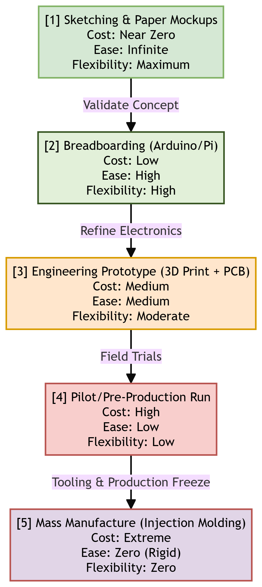
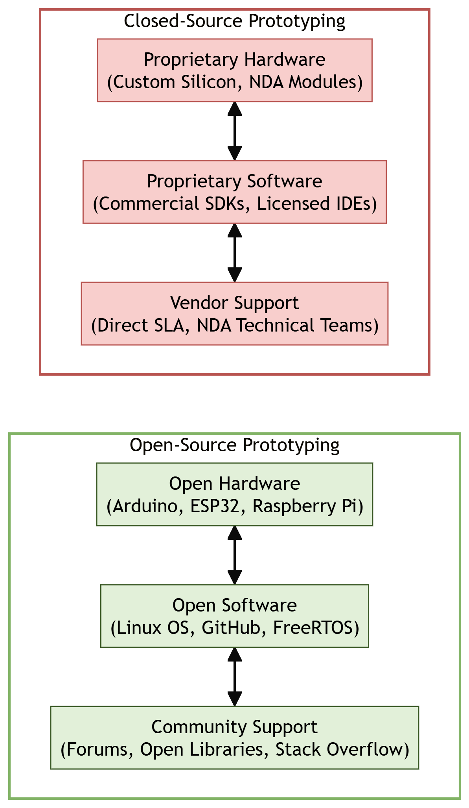

# Chapter 4: Thinking About Prototyping

This chapter compiles lecture-quality study notes and comprehensive exam answers for **Unit IV: Prototyping** of the OE-EC803A syllabus, adhering strictly to the **MAKAUT Answer Writing Guidelines**.

---

## 📝 Section 1: Thinking About Prototyping & The Cost vs. Ease Curve (Q4.2) [5M]

### 1. What is Prototyping in IoT?
An IoT **prototype** is an early, experimental, and tangible manifestation of a connected device system, built to validate technical assumptions, test user interactions, and discover potential hardware/software integration flaws before committing to expensive mass production.

### 2. The Cost vs. Ease of Prototyping Curve
As an IoT project progresses from an abstract idea to a commercial product, the relationship between development cost, speed (ease of editing), and system flexibility changes dramatically.

#### The Five Progressive Phases of the Prototyping Curve:
1.  **Phase 1: Sketching & Paper Mockups:**
    *   *Characteristics:* Pen, paper, or simple cardboard structures.
    *   *Cost:* Near zero.
    *   *Ease & Flexibility:* Infinite. Design edits can be done in seconds.
2.  **Phase 2: Breadboarding & Sandbox (e.g., Arduino/Raspberry Pi):**
    *   *Characteristics:* Solderless breadboards, jumper wires, off-the-shelf development boards.
    *   *Cost:* Low (a few dollars for chips/sensors).
    *   *Ease & Flexibility:* High. Changing connections or writing new firmware is fast and non-destructive.
3.  **Phase 3: Engineering Prototype (3D Printing & Custom PCB):**
    *   *Characteristics:* Custom PCB layout, 3D-printed enclosure, soldered components.
    *   *Cost:* Medium (tens to hundreds of dollars for custom boards and print runs).
    *   *Ease & Flexibility:* Moderate. Minor software tweaks are easy, but circuit re-design requires ordering new PCBs.
4.  **Phase 4: Pilot / Pre-Production Run:**
    *   *Characteristics:* Small batch run (e.g., 50–100 units) to test assembly pipelines and field deployment.
    *   *Cost:* High. Custom tooling and manual testing setups are required.
    *   *Ease & Flexibility:* Low. Hardware is frozen; only software updates can be made.
5.  **Phase 5: Mass Production:**
    *   *Characteristics:* High-volume runs (thousands of units) using injection-molded casings and automated PCB assembly line testing.
    *   *Cost:* Extreme upfront setup tooling costs (e.g., $10,000+ for steel molds).
    *   *Ease & Flexibility:* Zero. Any design change at this stage is financially catastrophic.

---

### 3. How Prototyping Bridges the Gap to Production
Prototyping acts as a risk-mitigation bridge between a conceptual design and a final manufactured product. It achieves this by:
*   **Identifying Hardware Vulnerabilities:** Discovering electrical noise, battery drain, or antenna interference issues in a low-risk environment.
*   **Firmware Logic Testing:** Isolating bugs in sensor sampling or connection reconnection logic before flashing thousands of devices.
*   **Validating Mechanical Fit:** Confirming that the PCB fits perfectly inside the plastic enclosure, and that connectors (e.g., USB port) align with outer cutouts.
*   **User Experience (UX) Feedback:** Testing if the physical size, button click feel, and light indicators are intuitive for the target user.

---

## 📝 Section 2: Open Source vs. Closed Source Paradigms (Q4.1) [5M]

IoT developers must decide whether to build prototypes using **Open-Source** platforms or **Closed-Source (Proprietary)** commercial solutions.

---

### 1. Comparison: Open Source vs. Closed Source in Prototyping

| Feature / Criteria | Open-Source Paradigm | Closed-Source (Proprietary) Paradigm |
| :--- | :--- | :--- |
| **Hardware Examples** | Arduino, Raspberry Pi, ESP32, BeagleBone. | Electric Imp, custom ASICs, locked-down OEM modules. |
| **Software/IDE** | Arduino IDE, GCC, FreeRTOS, Linux. | Keil, proprietary SDKs, vendor cloud compilers. |
| **Customizability** | Complete (full access to schematic files and code). | Limited (locked by vendor NDA or proprietary APIs). |
| **Upfront Cost** | Very low (often free software, cheap clone boards).| Higher (requires licenses, dev kits, seat keys). |
| **Development Speed** | Fast initial phase (millions of pre-written libraries). | Slower setup, but faster production transition. |
| **Support Channel** | Global community forums, GitHub issues. | Direct technical support, SLAs (Service Level Agreements). |
| **IP Protection** | Complex (often forces copyleft/open-sharing GPL). | High (protected under corporate licenses/secrets). |

---

### 2. Advantages and Disadvantages of Open Source

#### Advantages:
1.  **Massive Pre-Existing Libraries:** Access to millions of free code libraries on GitHub for almost any sensor, bypassing the need to write drivers from scratch.
2.  **No Vendor Lock-In:** If a microcontroller chip becomes unavailable, the system can be adapted to another vendor since the schematics and toolchain are open.
3.  **Low Barrier to Entry:** Hobbyists and startups can build functional prototypes with minimal capital.

#### Disadvantages:
1.  **Lack of Formal Support:** If a library has a critical bug, there is no vendor to call; you must rely on community goodwill or patch it yourself.
2.  **License Compliance Risks:** Accidentally mixing GPL-licensed code in commercial firmware can force a company to open-source its proprietary logic.
3.  **Inconsistent Documentation:** Community-supported platforms often suffer from outdated or incomplete documentation.

---

### 3. Advantages and Disadvantages of Closed Source

#### Advantages:
1.  **Guaranteed Quality & Support:** Direct access to technical engineers and Service Level Agreements ensures bugs are resolved rapidly.
2.  **Optimized for Production:** Vendor-managed modules often come pre-certified (e.g., FCC/CE rf certifications), saving months of testing.
3.  **High Intellectual Property (IP) Protection:** Keeps company code confidential, which is critical for securing venture capital.

#### Disadvantages:
1.  **High Costs:** Licensing fees and proprietary developer seats can be prohibitively expensive.
2.  **Vendor Dependency:** If the vendor goes bankrupt or shuts down its cloud services, your IoT product becomes useless.
3.  **Inflexibility:** Inability to modify internal register states or custom-configure hardware parameters.

---

## 📝 Section 3: Sketching, Familiarity, and Community (Q4.3) [5M]

Successful rapid prototyping in IoT relies on three human-centric pillars: **Sketching**, **Familiarity**, and **Tapping into the Community**.

---

### 1. The Role of "Sketching" in Early Prototyping
In IoT, **Sketching** is not limited to pencil drawing; it refers to the practice of building **low-fidelity, non-functional physical mockups** to explore concepts.
*   **Pencil & Paper Sketches:** Visualizing the physical shape of the device, user interface placement (screen, LEDs, buttons), and user flow diagrams.
*   **Cardboard & Foam Modeling:** Rapidly cutting out cardboards to construct a 3D model of the device. This helps verify the scale, how it fits in a user’s hand, or how it mounts on a wall.
*   **Software UI Mockups:** Creating non-functional, clickable phone screens using tools like Figma to test the app interface.
*   **Key Advantage:** Allows designers to discard bad ideas in minutes before spending time writing code or designing circuits.

---

### 2. The Role of "Familiarity" in Prototyping Speed
**Familiarity** refers to the developer's experience with their chosen tools (programming language, microcontroller family, CAD software).
*   **Reducing Cognitive Load:** Using a tool you already know (e.g., Arduino C/C++ or Python) eliminates the learning curve, allowing you to focus entirely on solving the prototype's core engineering problems.
*   **Rapid Iteration:** A familiar toolchain allows developers to write, upload, and test firmware updates in minutes.
*   **Avoid the "Perfection Trap":** During prototyping, the goal is speed, not elegant production-level optimization. Using familiar, slightly bloated, but functional platforms (like Raspberry Pi running Python) is preferred over writing raw, optimized assembly code for a new 8-bit chip.

---

### 3. The Significance of "Tapping into the Community"
The global IoT developer community is a powerful force multiplier for rapid prototyping.
*   **Collaborative Problem Solving:** Utilizing online communities (e.g., Arduino Forums, Stack Overflow, Hackster.io, ESP32 forum) to find quick fixes for obscure hardware bugs or compiler errors.
*   **Leveraging Open Source Packages:** Incorporating tested code bases (e.g., PubSubClient for MQTT, Adafruit libraries for sensors) to save months of manual register configuration.
*   **Crowdsourced Hardware Verification:** Reviewing open hardware designs (e.g., Adafruit Feather designs) to understand correct decoupling capacitor placements and antenna layouts.
*   **Conclusion:** In IoT, you are rarely the first person to encounter a specific technical problem. Tapping into the community allows you to stand on the shoulders of giants to bring a prototype to life quickly.
