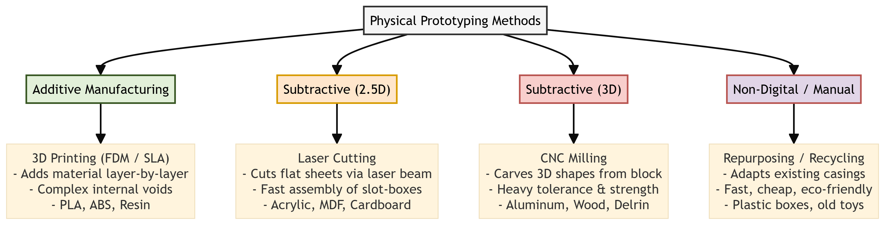
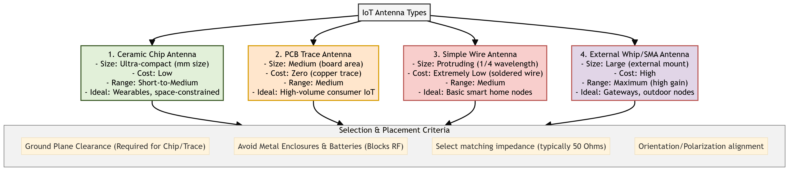

# Chapter 5: Prototyping the Physical Design

This chapter compiles lecture-quality study notes and comprehensive exam answers for **Unit V: Prototyping the Physical Design** of the OE-EC803A syllabus, adhering strictly to the **MAKAUT Answer Writing Guidelines**.

---

## 📝 Section 1: Digital and Non-digital Physical Prototyping Methods (Q5.2) [10M]

### 1. Introduction
Physical prototyping in IoT involves creating the mechanical structures and enclosures (casings) that protect the internal electronic components (microcontrollers, sensors, batteries) and provide a physical user interface. Choosing the correct manufacturing method is vital for matching the prototype's requirements with budget and timeline constraints.

---

### 2. Four Core Physical Prototyping Methods

#### A. 3D Printing (Additive Manufacturing)
*   **Working Principle:** A digital CAD (Computer-Aided Design) model is sliced into thin horizontal layers. The 3D printer builds the object by depositing material layer-by-layer (e.g., Fused Deposition Modeling (FDM) melts plastic filament; Stereolithography (SLA) cures liquid resin with UV light).
*   **Suitable Materials:** PLA, ABS, PETG, Nylon, Resin.
*   **Advantages:**
    1.  Allows creation of complex internal cavities and organic 3D shapes.
    2.  Low setup cost; files can be sent directly from a PC without custom tooling.
    3.  Highly customizable for one-off mockups.
*   **Disadvantages:**
    1.  Slow build times (often taking hours for a single enclosure).
    2.  Anisotropic strength: parts are weaker along the layer boundaries (may snap under shear stress).
    3.  Rough surface finish showing distinct layer lines (requires sanding/painting).

#### B. Laser Cutting (Subtractive 2.5D Manufacturing)
*   **Working Principle:** A high-power, computer-controlled laser beam cuts or engraves flat sheets of material along 2D vector paths.
*   **Suitable Materials:** Acrylic (PMMA), MDF (Medium-Density Fiberboard), plywood, cardboard, POM (Delrin).
*   **Advantages:**
    1.  Extremely fast (takes minutes to cut a flat layout).
    2.  Highly accurate with tight tolerances.
    3.  Excellent for building box enclosures using snap-together finger joints.
*   **Disadvantages:**
    1.  Restricted strictly to 2D profiles. Creating 3D shapes requires assembling multiple flat plates.
    2.  Hazardous fumes: cannot cut materials like PVC (which emits toxic chlorine gas).
    3.  Flat designs lack ergonomic curved surfaces.

#### C. CNC Milling (Subtractive 3D Manufacturing)
*   **Working Principle:** Computer Numerical Control (CNC) milling uses high-speed rotating cutting tools (drill bits) to subtract material from a solid block of stock material until the final shape is carved out.
*   **Suitable Materials:** Metals (Aluminum, Brass), engineering plastics (Delrin, Nylon, Polycarbonate), wood.
*   **Advantages:**
    1.  Superior mechanical strength and structural integrity.
    2.  Extremely precise tolerances (ideal for high-end mechanical components).
    3.  Produces smooth, production-quality surface finishes.
*   **Disadvantages:**
    1.  High material waste (chips are carved away and discarded).
    2.  Complex setup: requires detailed toolpath programming (G-code generation).
    3.  Machinery and tooling are expensive and require trained operators.

#### D. Repurposing & Recycling (Non-Digital / Manual)
*   **Working Principle:** Modifying existing, off-the-shelf plastic boxes, containers, or toys using hand tools (drills, saws, glue) to fit the prototype's electronics.
*   **Suitable Materials:** Commercial plastic project boxes, food storage containers, cardboard boxes.
*   **Advantages:**
    1.  Near-zero cost and immediate availability.
    2.  Highly functional: off-the-shelf IP-rated boxes are pre-tested for waterproofing.
    3.  Zero manufacturing setup time.
*   **Disadvantages:**
    1.  Limited strictly to pre-existing dimensions and shapes.
    2.  Hard to scale up or replicate identically for multiple prototypes.
    3.  Often looks unprofessional or unpolished without extensive manual detailing.

---

### 3. Comparison Matrix: Physical Prototyping Methods

| Feature / Criteria | 3D Printing | Laser Cutting | CNC Milling | Repurposing / Recycling |
| :--- | :--- | :--- | :--- | :--- |
| **Manufacturing Class**| Additive | Subtractive (2.5D) | Subtractive (3D) | Manual Adaptation |
| **Setup Cost** | Very Low | Low | High | Zero |
| **Production Speed** | Slow (Hours) | Very Fast (Minutes)| Medium (Complex setup) | Instant (Manual) |
| **Dimensional Limits** | Full 3D shapes | Flat 2D sheets | Full 3D blocks | Fixed existing shapes |
| **Structural Strength**| Moderate (Layer weak)| High (Sheet-dependent) | Very High (Monolithic) | High (Pre-fabricated) |
| **Material Waste** | Minimal | Medium (Scrap sheets)| Extremely High (Chips) | None |

---

## 📝 Section 2: IoT Antennas: Types, Selection, and Placement (Q5.1) [5M]

### 1. What is an IoT Antenna?
An **antenna** is a transducer that converts electrical signals (alternating currents) from the RF transceiver chip into electromagnetic radio waves in the air, and vice versa. It is the most critical hardware component governing the range and reliability of wireless IoT communication (Wi-Fi, BLE, LoRa, cellular).

---

### 2. Four Common Types of IoT Antennas

#### A. Ceramic Chip Antenna
*   **Description:** A tiny, surface-mount ceramic component soldered directly onto the PCB.
*   **Pros:** Extremely small footprint (often a few millimeters); rugged and unaffected by physical vibration.
*   **Cons:** Low gain and short-to-medium range; highly sensitive to nearby copper routing and component placement.

#### B. PCB Trace Antenna
*   **Description:** An antenna designed directly onto the PCB copper layers as a specific geometric trace (e.g., inverted-F trace).
*   **Pros:** Zero unit cost (part of the PCB manufacturing); moderate range and performance.
*   **Cons:** Takes up significant PCB surface area; design is locked once fabricated and cannot be tuned.

#### C. Wire Antenna
*   **Description:** A simple, insulated copper wire soldered directly to the RF output pin, cut to precisely $1/4$ of the target signal's wavelength.
*   **Pros:** Extremely cheap; simple and provides omnidirectional coverage.
*   **Cons:** Looks unpolished; manual assembly is required; inconsistent performance if the wire bends inside the case.

#### D. External Whip / SMA Antenna
*   **Description:** A flexible rubber antenna mounted on the outside of the enclosure, connected to the PCB via a coaxial cable and SMA connector.
*   **Pros:** Maximum range and high gain; adjustable orientation; isolates RF signals from internal board noise.
*   **Cons:** Expensive; bulky; requires a physical hole cutout in the enclosure.

---

### 3. Selection Criteria for IoT Antennas
When selecting an antenna, developers must evaluate:
1.  **Operating Frequency Band:** Match the antenna to the protocol (e.g., $2.4\text{ GHz}$ for Wi-Fi/BLE, $868/915\text{ MHz}$ for LoRa, or sub-GHz for Cellular).
2.  **Enclosure Size Constraints:** Wearables require compact Chip antennas; wall-mounted gateways can accommodate External Whip antennas.
3.  **Housing Material:** Plastic or glass enclosures allow RF waves to pass. Metal enclosures block RF completely, forcing the use of an external antenna.
4.  **Target Range & Environment:** Heavy concrete walls or long outdoor links demand high-gain external antennas.
5.  **Cost Limits:** High-volume consumer items prefer zero-cost PCB trace antennas.

---

### 4. Antenna Placement and Layout Guidelines (RF Best Practices)
To prevent signal loss and detuning:
*   **Avoid Metal Proximity:** Keep the antenna as far away as possible from batteries, metallic screws, shielding cans, and human hands (water in hands absorbs RF energy).
*   **Ground Plane Clearance:** Chip and Trace antennas require a dedicated "keep-out" zone on the PCB. No copper ground planes, traces, or vias should run underneath or near the antenna.
*   **Impedance Matching:** The transmission line from the RF transceiver to the antenna must be impedance-matched (typically $50\ \Omega$) using a Pi-matching circuit (inductors/capacitors) to prevent signal reflection.
*   **Case Clearance:** Keep a minimum $10\text{ mm}$ gap between the antenna and the plastic case wall to prevent the dielectric properties of the plastic from detuning the antenna's center frequency.
