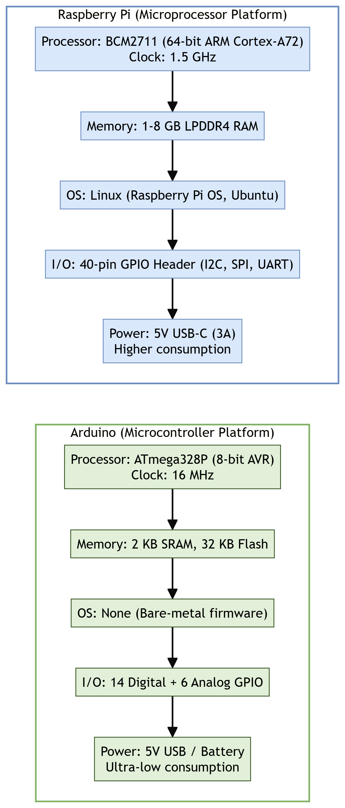
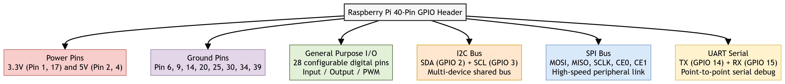

# Chapter 6: Prototyping Embedded Devices

This chapter compiles lecture-quality study notes and comprehensive exam answers for **Unit VI: Prototyping Embedded Devices** of the OE-EC803A syllabus, adhering strictly to the **MAKAUT Answer Writing Guidelines**.

---

## 📝 Section 1: Arduino vs. Raspberry Pi Platform Comparison (Q6.2) [5M]

### 1. Overview
The **Arduino** and **Raspberry Pi** represent the two dominant paradigms in IoT prototyping hardware: the **microcontroller** (bare-metal, real-time, single-task) and the **microprocessor** (OS-based, multi-tasking, general-purpose computing).

---

### 2. Detailed Feature Comparison

| Feature / Criteria | Arduino (e.g., Uno R3) | Raspberry Pi (e.g., Pi 4 Model B) |
| :--- | :--- | :--- |
| **Core Architecture** | 8-bit ATmega328P Microcontroller (AVR). | 64-bit BCM2711 Quad-core ARM Cortex-A72 Microprocessor (SoC). |
| **Clock Speed** | 16 MHz. | 1.5 GHz (nearly 100x faster). |
| **RAM** | 2 KB SRAM. | 1 GB to 8 GB LPDDR4. |
| **Flash/Storage** | 32 KB on-chip Flash. | MicroSD card (8 GB to 256 GB+). |
| **Operating System** | None (bare-metal firmware; code runs directly on the chip). | Full Linux distribution (Raspberry Pi OS, Ubuntu, Windows IoT Core). |
| **Programming Language**| C/C++ (via Arduino IDE). | Python, C/C++, Java, Node.js, and any Linux-supported language. |
| **I/O Capabilities** | 14 Digital I/O + 6 Analog Input pins. 10-bit ADC built-in. | 40-pin GPIO header (Digital only; no built-in ADC). Requires external ADC (e.g., MCP3008). |
| **Connectivity** | None on-board (requires external shields for Wi-Fi/BLE). | Built-in Wi-Fi (802.11ac), Bluetooth 5.0, Gigabit Ethernet, 2x USB 3.0. |
| **Power Consumption** | Ultra-low (~50 mA active). Can run on small batteries for months. | Higher (~600 mA to 1.2 A under load). Requires a stable 5V/3A USB-C supply. |
| **Boot Time** | Instant (microseconds; no OS to load). | 15–30 seconds (Linux kernel boot sequence). |
| **Target Application** | Real-time sensor reading, PWM motor control, dedicated single-task embedded loops. | Edge computing, image/video processing, running web servers, machine learning inference. |

---

### 3. Conclusion
*   Use **Arduino** when the project requires a single, deterministic, real-time control loop (e.g., reading a temperature sensor every 100 ms and triggering a relay).
*   Use **Raspberry Pi** when the project requires a full operating system, network stack, graphical processing, or complex multi-threaded logic (e.g., running an MQTT broker, hosting a web dashboard, or performing on-device machine learning).

---

## 📝 Section 2: Raspberry Pi Platform: Strengths, Limitations, and OS (Q6.3) [15M]

### 1. Introduction
The **Raspberry Pi** is a credit-card-sized, single-board computer (SBC) developed by the Raspberry Pi Foundation. It features a powerful ARM-based System-on-Chip (SoC), full Linux operating system support, and a 40-pin GPIO header for hardware interfacing, making it one of the most versatile platforms for IoT prototyping.

---

### 2. Strengths of Raspberry Pi in IoT (Minimum 5 Points)
1.  **Full Operating System Support:** Runs complete Linux distributions, providing access to thousands of pre-built packages, libraries, and developer tools (e.g., Python pip packages, Node.js npm modules, Docker containers).
2.  **High Processing Power:** The quad-core ARM Cortex-A72 at 1.5 GHz can handle computationally intensive edge tasks like real-time video analysis (OpenCV), local speech recognition, and lightweight machine learning inference (TensorFlow Lite).
3.  **Rich Connectivity Stack:** Built-in dual-band Wi-Fi (2.4 GHz and 5 GHz), Bluetooth 5.0 (with BLE), and Gigabit Ethernet eliminate the need for external connectivity modules.
4.  **Extensive Community and Documentation:** Millions of tutorials, GitHub repositories, and active community forums ensure rapid troubleshooting and code reuse.
5.  **Versatile I/O via 40-pin GPIO Header:** Supports I2C, SPI, UART, and general-purpose digital I/O for direct sensor and actuator interfacing without additional microcontrollers.
6.  **Low Cost:** Priced between $35 and $75 (depending on RAM variant), making it accessible for students, hobbyists, and small-run commercial prototypes.
7.  **HDMI Output:** Allows direct connection to monitors for local dashboard displays, kiosk-mode applications, or digital signage.

---

### 3. Limitations of Raspberry Pi in IoT (Minimum 5 Points)
1.  **No Built-in Analog-to-Digital Converter (ADC):** Cannot directly read analog sensors (e.g., potentiometers, LDRs). Requires external ADC chips like MCP3008 over SPI.
2.  **High Power Consumption:** Draws 600 mA to 1.2 A under load, making it unsuitable for battery-powered remote deployments without significant power management engineering.
3.  **Non-Real-Time Operating System:** Linux is a general-purpose OS with process scheduling and interrupts. It cannot guarantee deterministic, microsecond-level timing for critical real-time control loops (e.g., PID motor control).
4.  **SD Card Corruption Risk:** The operating system runs from a MicroSD card. Sudden power loss during a write operation can corrupt the filesystem, causing boot failures.
5.  **Thermal Throttling Under Sustained Load:** The BCM2711 SoC generates significant heat during sustained CPU-intensive tasks, causing automatic clock speed reduction (thermal throttling) unless a heatsink or active fan is installed.
6.  **Overkill for Simple Tasks:** Using a full Linux computer to blink an LED or read a single temperature sensor is wasteful in terms of cost, power, and complexity compared to a simple Arduino.

---

### 4. Supported Operating Systems

| Operating System | Description |
| :--- | :--- |
| **Raspberry Pi OS (formerly Raspbian)** | Official Debian-based Linux OS. Lightweight, optimized for Pi hardware. Available in Desktop (with GUI) and Lite (headless CLI) editions. |
| **Ubuntu Server / Desktop** | Canonical's official ARM64 builds. Ideal for server-grade IoT gateway applications and Docker container orchestration. |
| **Windows 10 IoT Core** | Microsoft's stripped-down Windows for ARM devices. Supports UWP (Universal Windows Platform) apps. No traditional desktop; headless or single-app kiosk mode. |
| **RISC OS** | A lightweight, non-Unix OS providing extremely fast boot times and low resource usage. Niche use. |
| **LibreELEC / OSMC** | Dedicated media center distributions based on Kodi. Used for smart display and digital signage IoT setups. |
| **RetroPie** | Retro gaming emulation distribution. Not directly IoT-relevant, but demonstrates the Pi's versatility. |

---

## 📝 Section 3: GPIO Pin Mapping and Electrical Safety Rules (Q6.1) [5M]

### 1. What are GPIO Pins?
**GPIO (General-Purpose Input/Output)** pins are programmable digital pins on the Raspberry Pi's 40-pin header that can be configured via software as either an **Input** (to read digital HIGH/LOW signals from sensors and switches) or an **Output** (to drive LEDs, relays, and other actuators).

---

### 2. Communication Buses Available on the GPIO Header
*   **I2C (Inter-Integrated Circuit):** A shared, two-wire bus (SDA for data, SCL for clock) supporting multiple slave devices on the same bus via unique 7-bit addresses. Used for sensors like BMP280 (pressure) and OLED displays.
*   **SPI (Serial Peripheral Interface):** A high-speed, full-duplex, four-wire bus (MOSI, MISO, SCLK, CS). Used for high-throughput devices like external ADCs (MCP3008) and SD card modules.
*   **UART (Universal Asynchronous Receiver-Transmitter):** A simple, point-to-point serial link (TX and RX) at configurable baud rates. Primarily used for serial debugging consoles and communication with GPS modules.

---

### 3. Five Critical Safety Guidelines for GPIO Pins
Failure to follow these rules can permanently damage the Raspberry Pi's BCM2711 SoC:
1.  **Never Exceed 3.3V on Any GPIO Pin:** All GPIO pins are rated at 3.3V logic levels. Connecting a 5V signal directly will destroy the pin's internal ESD protection diodes.
2.  **Never Draw More Than 16 mA Per Pin:** Each GPIO pin can safely source or sink a maximum of 16 mA. To drive high-current loads (motors, relays), use an external transistor (e.g., 2N2222) or a MOSFET driver.
3.  **Never Short 5V to 3.3V or GND:** Accidentally shorting the 5V power rail (Pin 2/4) to any 3.3V GPIO pin or GND will create a direct short circuit through the voltage regulator, potentially frying the board.
4.  **Always Use Current-Limiting Resistors:** When driving LEDs, always place a series resistor (e.g., $330\ \Omega$) to limit current below the 16 mA pin rating.
5.  **Never Connect or Disconnect Wires While Powered On (Hot-Plugging):** Always shut down the Pi and disconnect power before modifying the wiring on the GPIO header to prevent accidental shorts.

---

## 📝 Section 4: Alternative Prototyping Platforms (Q6.4) [10M]

### 1. BeagleBone Black

#### Overview:
The **BeagleBone Black** is an open-source, community-supported single-board computer manufactured by Texas Instruments. It is positioned as a more industrial-grade alternative to the Raspberry Pi.

#### Key Characteristics:
*   **Processor:** AM3358 ARM Cortex-A8 (1 GHz, 32-bit).
*   **Memory:** 512 MB DDR3 RAM + 4 GB on-board eMMC flash storage.
*   **GPIO:** 2 × 46-pin expansion headers providing **65 digital I/O pins**, 7 analog inputs (built-in 12-bit ADC), 4 timers, and 8 PWM outputs.
*   **OS:** Debian Linux (pre-installed on eMMC), Ubuntu, and Android.

#### Strengths:
1.  **Built-in ADC:** Unlike the Raspberry Pi, it has native analog input capability (7 channels at 1.8V max).
2.  **PRU (Programmable Real-Time Units):** Two independent 200 MHz real-time co-processors that can handle deterministic, microsecond-level I/O tasks alongside the main Linux OS.
3.  **On-board eMMC:** Avoids SD card corruption issues; boots from internal flash.

#### Limitations:
1.  Smaller community and fewer tutorials compared to Raspberry Pi.
2.  Lower CPU performance than the Pi 4 (single-core Cortex-A8 vs. quad-core Cortex-A72).

---

### 2. Electric Imp

#### Overview:
The **Electric Imp** is a proprietary, cloud-connected IoT development platform designed for rapid commercial product deployment. It is unique because it tightly integrates hardware, software, and a managed cloud backend into a single, vendor-controlled ecosystem.

#### Key Characteristics:
*   **Hardware Module:** A small, Wi-Fi-enabled microcontroller module (imp001, imp004m, imp006).
*   **Programming:** Uses a proprietary language called **Squirrel** (a lightweight, C-like scripting language).
*   **Architecture:** All device logic is split into two parts:
    *   **Device Code (Agent):** Runs on the physical module.
    *   **Cloud Code (Server):** Runs on Electric Imp's managed cloud servers.
*   **Security:** End-to-end hardware-verified TLS encryption from chip to cloud.

#### Strengths:
1.  **Zero-Configuration Security:** Hardware-level authentication eliminates the need for manual key management.
2.  **Rapid Cloud Integration:** Devices automatically connect to the vendor's cloud on boot, reducing backend infrastructure setup time.
3.  **Production-Ready:** Pre-certified modules (FCC/CE) accelerate the path from prototype to manufactured product.

#### Limitations:
1.  **Complete Vendor Lock-In:** If Electric Imp discontinues its cloud service, all connected devices become non-functional.
2.  **Proprietary Language:** Squirrel has a tiny community and minimal third-party library support.
3.  **Recurring Cloud Costs:** Requires ongoing subscription fees for the managed cloud backend.

---

### 3. Mobile Phones and Tablets as IoT Platforms

#### Overview:
Modern smartphones and tablets are powerful IoT development platforms due to their rich built-in sensor arrays and ubiquitous connectivity.

#### Key Characteristics:
*   **Built-in Sensors:** Accelerometer, gyroscope, magnetometer, barometer, ambient light sensor, proximity sensor, GPS, camera, microphone.
*   **Connectivity:** Wi-Fi, BLE, NFC, Cellular (4G/5G).
*   **Processing:** Multi-core ARM processors with GPUs capable of on-device machine learning inference.

#### Strengths:
1.  Eliminates the need to source, solder, and assemble individual sensor breakout boards.
2.  Pre-built user interfaces (touchscreen) for rapid app prototyping.
3.  Massive developer ecosystems (Android SDK, iOS Swift).

#### Limitations:
1.  High power consumption and large physical form factor compared to dedicated embedded boards.
2.  Not designed for always-on, unattended operation (battery drain, OS updates, thermal shutdowns).
3.  Limited direct GPIO access for custom hardware interfacing.

---

### 4. Plug Computing (Always-On IoT)

#### Overview:
A **Plug Computer** is a small, low-power, wall-socket-mounted computing device designed for always-on, unattended network services. It draws power directly from the wall outlet, eliminating battery concerns entirely.

#### Key Characteristics:
*   **Form Factor:** Shaped like a large wall charger or power adapter.
*   **Example Devices:** SheevaPlug, DreamPlug, GuruPlug.
*   **Processor:** ARM-based (e.g., Marvell Kirkwood 1.2 GHz).
*   **OS:** Runs standard Linux distributions.
*   **Connectivity:** Gigabit Ethernet, Wi-Fi, USB host ports.

#### Strengths:
1.  **Always-On by Design:** Powered directly from mains electricity; ideal for 24/7 home automation hubs, NAS (Network Attached Storage), or local MQTT brokers.
2.  **Extremely Small Footprint:** Occupies only a wall socket; no desk space or wiring clutter.
3.  **Silent Operation:** No fans or moving parts; passively cooled.

#### Limitations:
1.  **Very Limited GPIO:** Typically only USB and Ethernet ports; no direct sensor/actuator interfacing without USB-to-GPIO adapters.
2.  **Thermal Constraints:** Small enclosed form factor limits heat dissipation, restricting sustained CPU-intensive workloads.
3.  **Declining Market Availability:** Many original plug computer manufacturers have discontinued their products.
