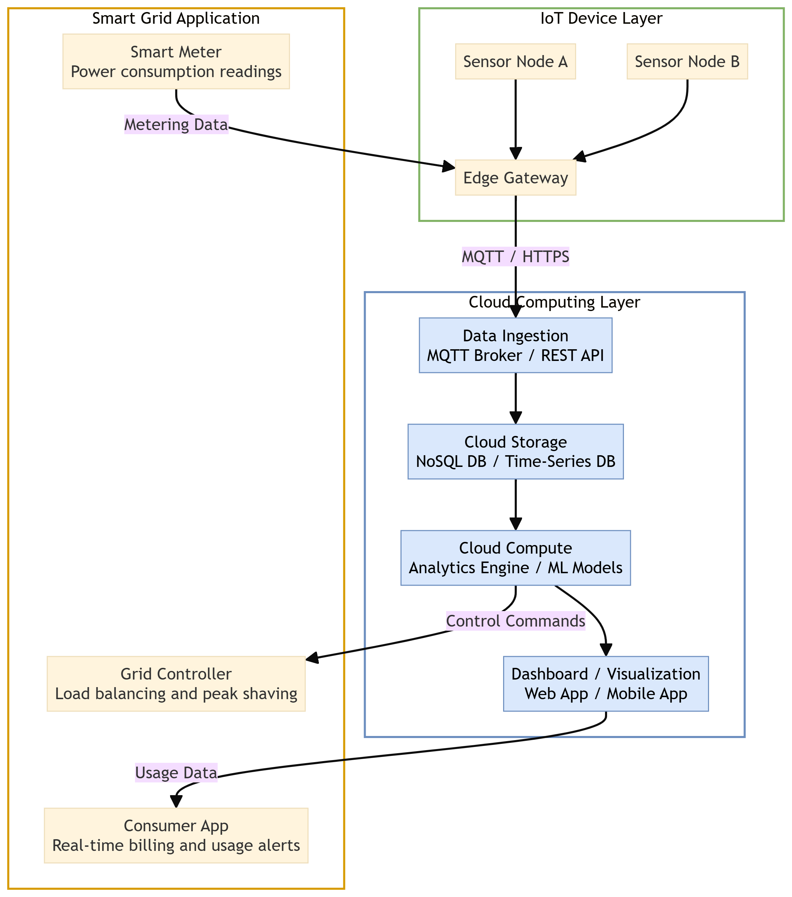
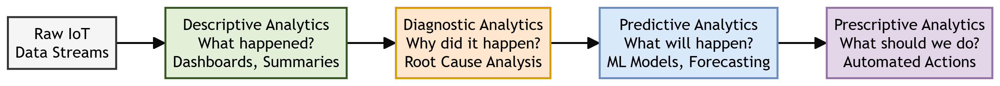

# Chapter 7: Prototyping Online Components

This chapter compiles lecture-quality study notes and comprehensive exam answers for **Unit VII: Prototyping Online Components** of the OE-EC803A syllabus, adhering strictly to the **MAKAUT Answer Writing Guidelines**.

---

## 📝 Section 1: The Role of APIs in IoT (Q7.1) [5M]

### 1. Definition
An **API (Application Programming Interface)** is a set of defined rules, protocols, and tools that allows different software applications to communicate with each other. In IoT, APIs serve as the bridge between physical devices (sensors/actuators) and online services (cloud platforms, databases, third-party applications).

---

### 2. Two Modes of API Usage in IoT

#### A. Consuming an Existing API
*   **Definition:** The IoT device or its gateway acts as a **client**, sending HTTP/REST requests to a third-party cloud API to retrieve or push data.
*   **Example:** A smart weather station sends a `GET` request to the OpenWeatherMap API to fetch a 5-day forecast, then displays it on a local e-paper screen.
*   **Key Benefit:** Eliminates the need to build your own data infrastructure; leverages existing, professionally maintained cloud services.

#### B. Writing (Exposing) a New API
*   **Definition:** The IoT device or its edge gateway acts as a **server**, exposing its own RESTful API endpoints so that external applications can read sensor data or control actuators.
*   **Example:** A smart greenhouse exposes a REST API endpoint `GET /api/sensors/soil-moisture` that returns the latest soil moisture reading in JSON format. Any authorized mobile app or dashboard can query this endpoint.
*   **Key Benefit:** Makes the IoT device a first-class citizen of the web, enabling integration with any standard web client, automation platform, or other IoT devices.

---

### 3. API Design Best Practices for IoT
1.  **Use RESTful Conventions:** Map CRUD operations to HTTP verbs (`GET` = Read, `POST` = Create, `PUT` = Update, `DELETE` = Remove).
2.  **Use JSON for Data Payloads:** Lightweight, human-readable, and universally parsed by every programming language.
3.  **Implement Authentication:** Use API keys or OAuth 2.0 tokens to prevent unauthorized access to device endpoints.
4.  **Version the API:** Use URL-based versioning (e.g., `/api/v1/sensors/`) to allow backward-compatible upgrades.

---

## 📝 Section 2: Cloud Computing in IoT and Smart Grid Applications (Q7.2) [10M]

### 1. Definition
**Cloud Computing** in IoT refers to the use of remote, internet-hosted servers and services to store, process, and analyze the massive volumes of data generated by distributed IoT device networks. Instead of processing data locally on each constrained device, data is transmitted to powerful cloud data centers.

---

### 2. Role of Cloud Computing in IoT

#### A. Data Storage
*   IoT devices generate continuous streams of time-stamped sensor readings. Cloud platforms provide virtually unlimited, elastically scalable storage (e.g., AWS S3, Google Cloud Storage, Azure Blob Storage) to archive this data.

#### B. Data Processing and Analytics
*   Cloud servers run computationally intensive analytics pipelines (batch processing, stream processing, machine learning model training) that would be impossible on edge microcontrollers.

#### C. Device Management
*   Cloud IoT platforms (e.g., AWS IoT Core, Azure IoT Hub, Google Cloud IoT) provide centralized dashboards for registering devices, monitoring their health, pushing Over-The-Air (OTA) firmware updates, and managing device twins (digital shadow copies).

#### D. Application Hosting
*   Web dashboards, mobile app backends, and notification services are hosted in the cloud, providing users with real-time visibility into their IoT networks from anywhere in the world.

---

### 3. Cloud Computing in Smart Grid Architecture

A **Smart Grid** is an electrical grid that uses IoT sensors, two-way digital communication, and cloud computing to monitor, analyze, and optimize the generation, distribution, and consumption of electricity.

#### Key Components:
1.  **Smart Meters:** Installed at consumer endpoints (homes, factories). They measure real-time electricity consumption and transmit readings to the cloud via cellular or Wi-Fi gateways.
2.  **Cloud Analytics Platform:** Receives metering data from millions of smart meters. Performs:
    *   **Demand Forecasting:** Uses historical consumption patterns and weather data to predict future electricity demand.
    *   **Load Balancing:** Dynamically reroutes power from over-supplied areas to under-supplied areas.
    *   **Peak Shaving:** Identifies demand spikes and signals distributed battery storage systems to discharge, reducing strain on the central grid.
3.  **Consumer-Facing Applications:** Cloud-hosted dashboards and mobile apps allow consumers to view their real-time energy consumption, compare it against neighbors, and receive alerts when usage exceeds a threshold.
4.  **Grid Controller Integration:** The cloud sends automated control commands to grid substations and distributed energy resources (solar inverters, wind turbines) to adjust power output in real-time.

#### Advantages of Cloud in Smart Grid:
1.  Centralized processing of millions of data points from distributed meters.
2.  Elastic scaling during peak demand periods.
3.  Historical trend analysis for long-term infrastructure planning.

#### Disadvantages:
1.  **Latency:** Cloud round-trip delays may be too slow for mission-critical grid protection relay decisions.
2.  **Data Privacy:** Granular energy consumption patterns can reveal private behavioral details about households.
3.  **Connectivity Dependency:** A WAN or internet outage disconnects all meters from the analytics engine.

---

## 📝 Section 3: Big Data Analytics in IoT (Q7.3) [10M]

### 1. Introduction
IoT networks generate massive, high-velocity, heterogeneous data streams (sensor readings, log files, video frames, GPS coordinates). **Big Data Analytics** provides the methods and tools to extract actionable intelligence from this data deluge.

---

### 2. The Four Levels of Data Analytics

#### Level 1: Descriptive Analytics ("What happened?")
*   **Objective:** Summarize raw historical data into understandable reports, charts, and dashboards.
*   **Techniques:** Aggregation, data visualization, statistical summaries (mean, median, min/max).
*   **IoT Use Case:** A factory floor dashboard displays the average temperature of 50 industrial ovens over the last 24 hours, flagging any that exceeded the safe threshold.

#### Level 2: Diagnostic Analytics ("Why did it happen?")
*   **Objective:** Drill down into the data to identify the root cause of an observed event or anomaly.
*   **Techniques:** Correlation analysis, data mining, pattern detection, drill-down queries.
*   **IoT Use Case:** After a factory oven overheated, the system cross-references the oven's temperature logs with the coolant flow sensor logs and discovers that a coolant pump failed 30 minutes before the temperature spike.

#### Level 3: Predictive Analytics ("What will happen?")
*   **Objective:** Use historical patterns and machine learning models to forecast future events.
*   **Techniques:** Regression models, time-series forecasting (ARIMA, LSTM), classification algorithms.
*   **IoT Use Case:** Based on the vibration frequency patterns of a motor over the past 6 months, a predictive maintenance model forecasts that the motor's ball bearing will fail within the next 14 days.

#### Level 4: Prescriptive Analytics ("What should we do?")
*   **Objective:** Automatically recommend or execute the optimal action based on predictions.
*   **Techniques:** Optimization algorithms, reinforcement learning, automated rule engines.
*   **IoT Use Case:** Based on the predicted bearing failure, the system automatically schedules a maintenance work order, reserves replacement parts from the inventory system, and assigns a technician — all without human intervention.

---

### 3. Comparison Table: Four Levels of IoT Data Analytics

| Analytics Level | Core Question | Complexity | Time Orientation | IoT Example |
| :--- | :--- | :--- | :--- | :--- |
| **Descriptive** | What happened? | Low | Past | Dashboard of average sensor values. |
| **Diagnostic** | Why did it happen? | Medium | Past | Root cause analysis of an alarm event. |
| **Predictive** | What will happen? | High | Future | Predicting equipment failure in 14 days. |
| **Prescriptive** | What should we do? | Very High | Future | Auto-scheduling a maintenance work order. |

---

## 📝 Section 4: Real-Time Reactions and Other Protocols (Q7.1, Q7.4) [5M]

### 1. Real-Time Reactions in IoT
**Real-time reactions** refer to the ability of an IoT system to process an incoming event and trigger an immediate, automated response without human intervention.
*   **Example:** A motion sensor detects an intruder at 2:00 AM. Within 200 milliseconds, the system triggers a siren, locks all smart doors, turns on floodlights, and pushes a notification to the homeowner's phone.

---

### 2. WebSockets for Real-Time IoT Communication
While HTTP is inherently a request-response protocol (the client must poll), **WebSockets** provide a persistent, full-duplex, bidirectional communication channel over a single TCP connection.

#### Working Principle:
1.  The client initiates a standard HTTP request with an `Upgrade: websocket` header.
2.  The server accepts and the connection is upgraded from HTTP to a persistent WebSocket channel.
3.  Both the client and server can now send messages to each other at any time without re-establishing a connection.

#### Strengths:
*   **Low Latency:** No connection re-establishment overhead; data flows instantly.
*   **Bidirectional:** The server can push alerts to the client without the client asking (true real-time).
*   **Browser Native:** Supported by all modern web browsers, making it ideal for live IoT dashboards.

#### Limitations:
*   **Resource Intensive:** Maintaining persistent connections to thousands of devices consumes significant server memory.
*   **Firewall Issues:** Some corporate firewalls and proxies block WebSocket upgrade requests.

---

### 3. Comparison: HTTP Polling vs. WebSockets vs. MQTT for Real-Time IoT

| Feature | HTTP Polling | WebSockets | MQTT |
| :--- | :--- | :--- | :--- |
| **Directionality** | Client-initiated only (pull). | Full-duplex (bidirectional push). | Broker-mediated (pub/sub push). |
| **Latency** | High (polling interval delay). | Very Low (persistent connection). | Low (broker routing delay). |
| **Overhead per Message** | High (full HTTP headers each time). | Low (small frame headers). | Very Low (2-byte min header). |
| **Best For** | Infrequent data checks. | Browser-based live dashboards. | Massive IoT device networks. |
