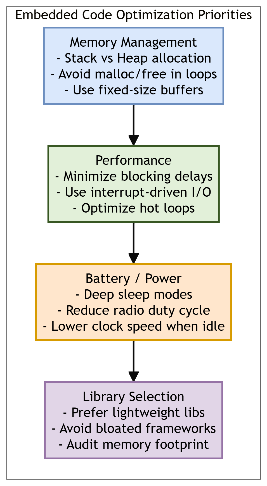
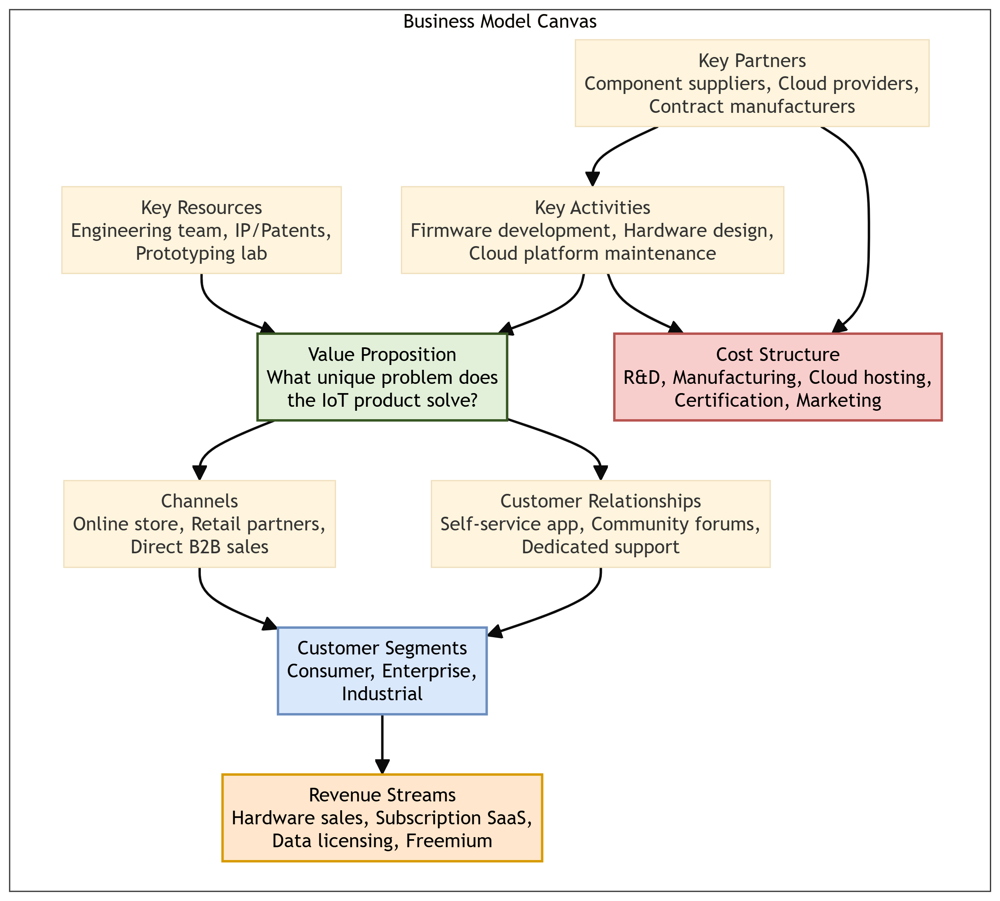

# Chapter 8: Embedded Code Development & Prototype to Reality

This chapter compiles lecture-quality study notes and comprehensive exam answers for **Unit VIII: Embedded Code Development & Prototype to Reality** of the OE-EC803A syllabus, adhering strictly to the **MAKAUT Answer Writing Guidelines**.

---

## 📝 Section 1: Writing Embedded Code for Resource-Constrained IoT Devices (Q8.1) [5M]

### 1. Introduction
IoT edge devices are built around resource-constrained microcontrollers with severely limited RAM (often 2–256 KB), flash storage (32 KB–1 MB), and battery capacity. Writing embedded firmware for these platforms demands rigorous attention to **memory management**, **power optimization**, and **library selection**.

---

### 2. Memory Management

#### Key Challenges:
*   Microcontrollers lack virtual memory or swap space. When RAM is full, the program crashes or behaves unpredictably.
*   The stack (for function calls and local variables) and the heap (for dynamic allocations) share a single, tiny RAM block.

#### Best Practices:
1.  **Prefer Static Allocation Over Dynamic Allocation:** Use fixed-size arrays and buffers allocated at compile time instead of calling `malloc()` and `free()` at runtime. Dynamic allocation on microcontrollers leads to **heap fragmentation**, where free memory exists but is split into non-contiguous blocks too small to satisfy a new allocation request.
2.  **Minimize Stack Depth:** Avoid deeply nested function calls and recursion. Each function call pushes a new frame onto the stack, consuming limited SRAM.
3.  **Use `const` and `PROGMEM`:** Store constant strings and lookup tables in Flash memory (read-only) instead of RAM to preserve the scarce SRAM for runtime variables.
4.  **Monitor Stack Usage:** Use stack canary values or compiler tools to detect stack overflow before deployment.

---

### 3. Performance Optimization

#### Best Practices:
1.  **Avoid Blocking Delays:** Replace `delay()` calls with non-blocking timer-based state machines using `millis()` or hardware timer interrupts. Blocking delays waste CPU cycles and prevent the processor from handling other tasks.
2.  **Use Interrupt-Driven I/O:** Configure hardware interrupts (e.g., GPIO pin change, UART receive complete) instead of busy-waiting polling loops. The CPU sleeps until an event triggers it.
3.  **Optimize Hot Loops:** Profile the firmware to identify the most frequently executed code sections (hot loops). Simplify arithmetic, use bitwise operations instead of multiplication/division, and unroll small loops.

---

### 4. Battery Life / Power Optimization

#### Best Practices:
1.  **Leverage Deep Sleep Modes:** Most microcontrollers (ESP32, ATmega, nRF52) offer deep sleep states where the CPU, radio, and most peripherals are powered down. The device wakes only on a timer interrupt or an external GPIO trigger.
2.  **Reduce Radio Duty Cycle:** The RF transceiver (Wi-Fi, BLE, LoRa) is the single largest power consumer. Minimize transmission frequency: send data in short, infrequent bursts rather than maintaining a persistent connection.
3.  **Lower Clock Speed When Idle:** Dynamically reduce the CPU clock frequency during low-activity periods using Dynamic Voltage and Frequency Scaling (DVFS).
4.  **Disable Unused Peripherals:** Power down ADC, DAC, SPI, I2C, and UART controllers that are not actively being used via peripheral clock gating registers.

---

### 5. Library Selection

#### Best Practices:
1.  **Prefer Lightweight, Single-Purpose Libraries:** Choose libraries specifically designed for embedded use (e.g., `TinyGPS++` over full-featured GPS parsers, `PubSubClient` for MQTT over heavyweight messaging frameworks).
2.  **Audit Memory Footprint:** Before adopting a library, compile it and check its Flash and RAM consumption using the compiler's memory usage report.
3.  **Avoid Bloated Frameworks:** General-purpose frameworks designed for desktop or server environments (e.g., full JSON parsers with DOM trees) waste kilobytes of precious RAM.

---

## 📝 Section 2: Debugging Embedded IoT Systems (Q8.3) [5M]

### 1. Definition
**Debugging** in embedded code development is the process of identifying, isolating, and resolving defects in firmware logic, hardware interaction failures, or communication protocol errors running on resource-constrained microcontrollers.

---

### 2. Common Debugging Methods

#### A. Serial Print Debugging (UART Logging)
*   **Method:** Insert `Serial.println()` or equivalent UART print statements at critical code points to output variable values and program flow markers to a connected serial monitor.
*   **Pros:** Simple, requires no special hardware.
*   **Cons:** Modifies code timing (can mask timing-sensitive race conditions); consumes UART peripheral and RAM for string buffers.

#### B. Hardware Debugger (JTAG / SWD)
*   **Method:** Connect a physical debug probe (e.g., J-Link, ST-Link, OpenOCD) to the microcontroller's JTAG or Serial Wire Debug (SWD) pins. Use an IDE (e.g., PlatformIO, Keil, IAR) to set breakpoints, step through code line-by-line, and inspect register/memory values in real-time.
*   **Pros:** Non-intrusive; does not alter code behavior; allows real-time variable inspection.
*   **Cons:** Requires additional hardware; complex setup; may not be available on all low-cost boards.

#### C. LED Indicator Debugging
*   **Method:** Toggle a GPIO-connected LED at specific code execution points to verify that the firmware reaches expected states.
*   **Pros:** Zero software overhead; works on the most constrained platforms.
*   **Cons:** Extremely limited information density (only binary on/off).

#### D. Logic Analyzer / Oscilloscope
*   **Method:** Probe I2C, SPI, or UART lines with a logic analyzer to capture and decode raw signal waveforms.
*   **Pros:** Reveals electrical timing issues, protocol violations, and bus contention.
*   **Cons:** Requires specialized test equipment.

---

### 3. Funding Channels for IoT Startups
Transitioning from a working prototype to a funded commercial venture requires capital. Common funding channels include:
1.  **Bootstrapping:** Self-funding using personal savings. Full control but limited capital.
2.  **Crowdfunding (Kickstarter / Indiegogo):** Pre-selling the product to early adopters. Validates market demand before manufacturing.
3.  **Angel Investors:** High-net-worth individuals providing seed capital in exchange for equity.
4.  **Venture Capital (VC):** Professional investment firms providing large funding rounds (Series A/B/C) for rapid scaling.
5.  **Government Grants & Accelerators:** Non-dilutive funding programs (e.g., SBIR, Startup India) and hardware accelerators (e.g., HAX, Techstars) providing mentorship and seed capital.

---

## 📝 Section 3: The Business Model Canvas for IoT Startups (Q8.2) [10M]

### 1. Definition
The **Business Model Canvas** (BMC), developed by Alexander Osterwalder, is a single-page strategic management tool that maps out the nine essential building blocks of a business. It provides a structured framework for IoT startups to define how they create, deliver, and capture value.

---

### 2. The Nine Building Blocks (Applied to IoT)

| # | Block | IoT Application |
| :--- | :--- | :--- |
| 1 | **Customer Segments** | Who are the target users? (e.g., Smart Home consumers, Industrial plant managers, Healthcare providers). |
| 2 | **Value Proposition** | What unique problem does the IoT product solve that existing solutions do not? (e.g., 50% energy savings via predictive HVAC control). |
| 3 | **Channels** | How does the product reach the customer? (e.g., Online D2C store, retail partnerships, B2B direct sales). |
| 4 | **Customer Relationships** | How is the customer engaged? (e.g., Self-service mobile app, community forums, dedicated account managers). |
| 5 | **Revenue Streams** | How does the business earn money? (e.g., One-time hardware sale, recurring SaaS subscription for cloud analytics, data licensing). |
| 6 | **Key Resources** | What assets are required? (e.g., Embedded engineering team, IP/patents, prototyping lab, cloud infrastructure). |
| 7 | **Key Activities** | What must the business do? (e.g., Firmware development, hardware design, cloud platform maintenance, customer support). |
| 8 | **Key Partnerships** | Who are the essential external partners? (e.g., Component suppliers, contract manufacturers, cloud platform providers like AWS/Azure). |
| 9 | **Cost Structure** | What are the major costs? (e.g., R&D salaries, BOM/component costs, cloud hosting, FCC/CE certification, marketing). |

---

### 3. Lean Startup Principles in IoT

The **Lean Startup** methodology (Eric Ries) guides IoT ventures to minimize waste and maximize learning speed:

#### A. Build-Measure-Learn Loop
1.  **Build:** Create a **Minimum Viable Product (MVP)** — the simplest functional version of the IoT device (e.g., a breadboard prototype with a single sensor and a basic cloud dashboard).
2.  **Measure:** Deploy the MVP to a small group of early adopters. Collect quantitative data (e.g., usage frequency, feature engagement, error rates).
3.  **Learn:** Analyze the data. Determine whether the core hypothesis is validated (proceed) or invalidated (pivot — change the product direction).

#### B. Pivot or Persevere
*   After each Build-Measure-Learn cycle, the startup must decide:
    *   **Persevere:** The data validates the hypothesis. Continue investing in the current product direction.
    *   **Pivot:** The data invalidates the hypothesis. Change the customer segment, value proposition, or technology platform.
*   IoT pivots are common: a product designed for consumer smart home use may pivot to industrial monitoring if consumer adoption is low but factory interest is high.

#### C. Validated Learning
*   Every experiment should produce **validated learning** — concrete, data-backed evidence about what customers actually want, not assumptions about what they should want.

---

### 4. Advantages and Disadvantages of Lean Startup in IoT

#### Advantages:
1.  Reduces financial risk by testing core assumptions before committing to expensive mass production tooling.
2.  Accelerates time-to-market by focusing only on features that customers actually use.
3.  Data-driven decisions replace guesswork.

#### Disadvantages:
1.  Hardware MVPs are more expensive and slower to iterate than software MVPs (you cannot simply push a code update to fix a PCB design flaw).
2.  Early adopters may not represent the broader market, leading to biased validation.
3.  Constant pivoting can demoralize the engineering team and confuse early customers.
