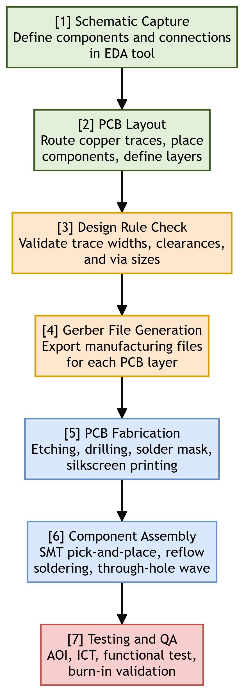
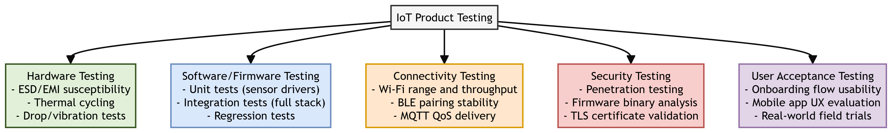

# Chapter 9: Moving to Manufacture

This chapter compiles lecture-quality study notes and comprehensive exam answers for **Unit IX: Moving to Manufacture** of the OE-EC803A syllabus, adhering strictly to the **MAKAUT Answer Writing Guidelines**.

---

## 📝 Section 1: PCB Design and Manufacturing for Commercial IoT Products (Q9.1) [10M]

### 1. Introduction
A **Printed Circuit Board (PCB)** is the physical substrate that mechanically supports and electrically interconnects electronic components (microcontrollers, sensors, power regulators, connectors) using conductive copper traces etched onto a laminated board. Transitioning from a prototype breadboard to a production PCB is a critical milestone in the IoT manufacturing pipeline.

---

### 2. Steps in PCB Design and Manufacturing

#### Step 1: Schematic Capture
*   **Action:** Using an Electronic Design Automation (EDA) tool (e.g., KiCad, Altium Designer, Eagle), the engineer creates a logical circuit diagram defining all components and their electrical connections.
*   **Output:** A netlist file mapping every pin-to-pin connection.

#### Step 2: PCB Layout (Board Design)
*   **Action:** The schematic netlist is imported into the PCB layout editor. The engineer places component footprints on the board and routes copper traces connecting them.
*   **Key Design Considerations:**
    *   **Trace Width:** Thicker traces for high-current power paths; thinner traces for low-current signals.
    *   **Layer Count:** Simple designs use 2-layer boards (top and bottom copper). Complex designs use 4-layer or 6-layer boards with dedicated power and ground planes for improved noise immunity.
    *   **Component Placement:** Place decoupling capacitors as close as possible to power pins. Keep the antenna away from copper planes and metal components.
    *   **Via Placement:** Use vias to route signals between layers. Minimize via count to reduce manufacturing cost and signal integrity loss.

#### Step 3: Design Rule Check (DRC)
*   **Action:** The EDA tool automatically verifies that all traces meet the fabrication house's minimum specifications for trace width, clearance between traces, hole sizes, and annular ring dimensions.
*   **Output:** A DRC report listing any violations that must be corrected before manufacturing.

#### Step 4: Gerber File Generation
*   **Action:** Export the final board design as Gerber files (the universal, industry-standard format). A complete Gerber set includes a separate file for each copper layer, solder mask layer, silkscreen layer, and the drill file.
*   **Output:** A ZIP archive of Gerber and drill files ready for submission to the PCB fabrication house.

#### Step 5: PCB Fabrication
*   **Action:** The fabrication house receives the Gerber files and manufactures the bare PCB:
    1.  Print the circuit pattern onto copper-clad laminate using photolithography.
    2.  Etch away unwanted copper using a chemical bath (e.g., ferric chloride).
    3.  Drill holes for through-hole components and vias using CNC drill machines.
    4.  Apply solder mask (the green/blue/red protective coating) and silkscreen (white component labels).
    5.  Apply surface finish (HASL, ENIG gold plating) to exposed copper pads.

#### Step 6: Component Assembly (PCB Assembly - PCBA)
*   **Action:** Electronic components are mounted and soldered onto the fabricated bare PCB:
    *   **SMT (Surface Mount Technology):** A pick-and-place machine positions tiny SMD components. The board passes through a reflow oven to melt solder paste and bond components.
    *   **Through-Hole (THT):** Larger connectors and heavy components are inserted through drilled holes and soldered using wave soldering or manual soldering.

#### Step 7: Testing and Quality Assurance
*   **Action:** Each assembled board undergoes rigorous testing:
    *   **AOI (Automated Optical Inspection):** Camera systems scan for missing components, solder bridges, and misalignment.
    *   **ICT (In-Circuit Testing):** Electrical probes test continuity, resistance, and capacitance of individual components and connections.
    *   **Functional Test:** The board is powered on and firmware is flashed. A test jig verifies that all sensors, communication links, and actuators function correctly.
    *   **Burn-In Test:** Boards are operated under stress conditions (elevated temperature) for 24–72 hours to weed out early-life failures (infant mortality).

---

## 📝 Section 2: IoT System Testing Before Mass Manufacture (Q9.2) [15M]

### 1. Introduction
Before committing to mass production, an IoT product must undergo a comprehensive, multi-layered testing regime to ensure reliability, safety, security, and user satisfaction.

---

### 2. Five Categories of IoT System Testing

#### A. Hardware Testing
*   **Objective:** Verify the physical durability and electrical robustness of the device.
*   **Tests:**
    1.  **ESD (Electrostatic Discharge) Testing:** Subject the device to high-voltage static discharge pulses (per IEC 61000-4-2) to ensure it survives real-world handling.
    2.  **Thermal Cycling:** Repeatedly cycle the device between extreme temperatures (e.g., -20°C to +70°C) to test solder joint reliability and component tolerance.
    3.  **Drop and Vibration Testing:** Drop the device from standard heights (e.g., 1.5 meters onto concrete) and subject it to sustained vibration profiles to simulate shipping and daily use.
    4.  **EMI/EMC Testing:** Ensure the device does not emit excessive electromagnetic interference and operates correctly in the presence of external RF noise (per FCC Part 15 / EN 55032).

#### B. Software / Firmware Testing
*   **Objective:** Ensure the embedded firmware is correct, stable, and free of critical bugs.
*   **Tests:**
    1.  **Unit Testing:** Test individual software modules (e.g., a single sensor driver function) in isolation.
    2.  **Integration Testing:** Test the interaction between multiple modules (e.g., sensor reading → data formatting → MQTT publish → cloud reception).
    3.  **Regression Testing:** Re-run all existing tests after every code change to ensure new commits do not break previously working features.
    4.  **OTA Update Testing:** Verify that Over-The-Air firmware updates install correctly, roll back gracefully on failure, and do not brick the device.

#### C. Connectivity Testing
*   **Objective:** Validate wireless communication range, stability, and data integrity.
*   **Tests:**
    1.  **Wi-Fi Range and Throughput:** Measure signal strength (RSSI) and data transfer rates at increasing distances and through various obstacle types (walls, floors).
    2.  **BLE Pairing Stability:** Test Bluetooth Low Energy device discovery, pairing, and data exchange across multiple smartphone models (Android and iOS).
    3.  **MQTT QoS Delivery:** Verify that messages published at QoS 1 and QoS 2 are reliably delivered even during intermittent network outages and reconnections.

#### D. Security Testing
*   **Objective:** Identify and remediate vulnerabilities before deployment.
*   **Tests:**
    1.  **Penetration Testing:** Ethical hackers attempt to compromise the device via network attacks, API abuse, and physical tampering.
    2.  **Firmware Binary Analysis:** Extract and decompile the firmware binary to check for hardcoded credentials, API keys, and unencrypted sensitive data.
    3.  **TLS/SSL Certificate Validation:** Confirm that the device correctly validates server certificates and rejects expired or self-signed certificates.
    4.  **Secure Boot Verification:** Ensure the bootloader only executes cryptographically signed firmware images.

#### E. User Acceptance Testing (UAT)
*   **Objective:** Validate the complete end-to-end user experience.
*   **Tests:**
    1.  **Onboarding Flow:** Test the first-time setup experience (unboxing → Wi-Fi provisioning → account creation → first data reading) across diverse user demographics.
    2.  **Mobile App UX:** Evaluate the companion mobile app for responsiveness, intuitiveness, and error handling.
    3.  **Real-World Field Trials:** Deploy 50–100 units to beta testers in actual home/office/industrial environments for 2–4 weeks and collect usage logs, crash reports, and qualitative feedback.

---

## 📝 Section 3: Scaling from Prototype to Manufacture (Q9.3) [10M]

### 1. Designing Kits
*   Before full mass production, many IoT startups release a **developer kit** — a small-batch, semi-assembled product sold to early adopters and partner developers.
*   **Purpose:** Validates the supply chain, tests assembly procedures, and generates early revenue and community feedback.
*   **Contents:** The PCB, pre-programmed firmware, an enclosure, mounting hardware, cables, and a quick-start guide.

---

### 2. Mass-Producing the Case and Fixtures (Injection Molding)
*   **Process:** Molten plastic (e.g., ABS, Polycarbonate) is injected at high pressure into a precision-machined steel mold cavity. After cooling, the mold opens and the solid plastic part is ejected.
*   **Advantages:** Produces thousands of identical, smooth, production-quality enclosures per day at very low per-unit cost (often < $0.50/unit at scale).
*   **Disadvantages:** Extremely high upfront tooling cost ($10,000–$100,000+ for steel molds). Any design change after mold fabrication requires a new mold.
*   **Design Constraints:** Parts must have draft angles (tapered walls) for easy ejection, uniform wall thickness to prevent warping, and rounded internal corners to avoid stress concentrations.

---

### 3. Obtaining Certifications
Before an IoT product can be legally sold in a target market, it must obtain regulatory certifications:

| Certification | Region | Scope |
| :--- | :--- | :--- |
| **FCC Part 15** | United States | Limits unintentional RF emissions from electronic devices. |
| **CE Marking** | European Union | Declares conformity with EU health, safety, and environmental directives. |
| **RoHS** | EU / Global | Restricts use of hazardous substances (lead, mercury, cadmium) in electronics. |
| **UL / IEC 62368-1** | Global | Electrical safety certification for audio/video and IT equipment. |
| **IC** | Canada | Radio equipment certification (equivalent to FCC). |

*   **Process:** Submit production samples and technical documentation to an accredited testing laboratory. Testing typically takes 4–8 weeks and costs $5,000–$30,000 depending on the number of radio interfaces.

---

### 4. Scaling Up Software
*   **Cloud Infrastructure Scaling:** Move from a single development server to auto-scaling cloud infrastructure (e.g., AWS ECS, Kubernetes) capable of handling millions of concurrent device connections.
*   **Device Fleet Management:** Implement centralized dashboards for monitoring device health, managing firmware versions, and performing bulk OTA updates across thousands of deployed devices.
*   **Database Scaling:** Transition from a single relational database to distributed NoSQL or time-series databases (e.g., InfluxDB, TimescaleDB, DynamoDB) designed for high-velocity IoT data ingestion.
*   **CI/CD Pipelines:** Establish continuous integration and continuous deployment pipelines for firmware and cloud services to enable rapid, tested, and automated releases.
