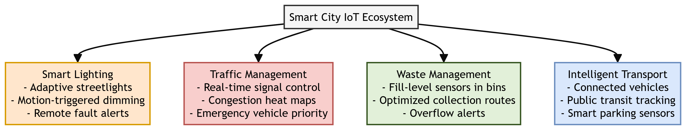
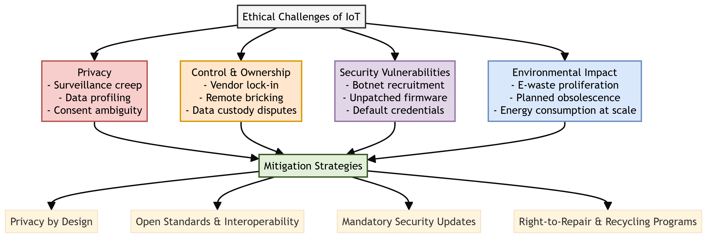

# Chapter 10: Ethics & Smart Cities

This chapter compiles lecture-quality study notes and comprehensive exam answers for **Unit X: Ethics** of the OE-EC803A syllabus, adhering strictly to the **MAKAUT Answer Writing Guidelines**.

---

## 📝 Section 1: IoT in Smart City Development & Intelligent Transportation Systems (Q10.1) [5M]

### 1. Introduction & Definitions
*   **Smart City:** An urban development vision that integrates **Information and Communication Technology (ICT)** and various physical **IoT sensor nodes** to securely manage municipal assets, optimize resource utilization, and improve the quality of life for citizens.
*   **Intelligent Transportation Systems (ITS):** An advanced application of IoT in transportation that gathers real-time data from vehicles, infrastructure, and users to improve transport safety, efficiency, and sustainability.



---

### 2. Core Application Areas of IoT in Smart Cities

#### A. Smart Lighting
*   **Working Principle:** Streetlights are equipped with **Light Dependent Resistors (LDRs)**, passive infrared (PIR) motion sensors, and wireless transceivers (such as LoRaWAN or Zigbee). They communicate with a central gateway, adjusting brightness dynamically based on ambient light levels and pedestrian/vehicle movement.
*   **Key Features:**
    *   **Adaptive Dimming:** Automatically dims streetlights to 20% brightness during late-night hours when no motion is detected, scaling up to 100% when a vehicle or pedestrian approaches.
    *   **Fault Detection:** Proactively reports failed bulbs or power issues to municipal dashboards, eliminating the need for physical inspections.

#### B. Traffic Management
*   **Working Principle:** IoT edge cameras, inductive loop sensors buried in roads, and radar systems collect traffic volume and velocity data. Microcontrollers process this data locally or send it to traffic control servers to run dynamic optimization algorithms.
*   **Key Features:**
    *   **Dynamic Signal Control:** Adjusts traffic light phase timings in real-time to match actual vehicle queues rather than relying on fixed timers.
    *   **Emergency Preemption:** Automatically switches traffic signals to green along the route of an approaching emergency vehicle (ambulance/fire engine) using GPS tracking.
    *   **Congestion Heat Mapping:** Generates live city-wide traffic congestion maps, pushing data to navigation apps to reroute drivers.

#### C. Waste Tracking
*   **Working Principle:** Smart bins are fitted with ruggedized **ultrasonic sensors** on their inner lids and narrow-band IoT (NB-IoT) cellular modules. The sensor measures the distance from the lid to the top of the waste pile to calculate the fill level.
*   **Key Features:**
    *   **Fill-Level Alerts:** Sends a threshold notification (e.g., "Bin 80% Full") to the central database.
    *   **Route Optimization:** Dynamic scheduling software plans the most efficient collection routes for waste trucks, skipping empty bins and reducing fuel costs.

#### D. Intelligent Transportation Systems (ITS)
*   **Working Principle:** Utilizes **Vehicle-to-Everything (V2X)** communication where vehicles talk to other vehicles (V2V) and road infrastructure (V2I). Sensors track public transit buses and smart parking lots detect vehicle occupancy.
*   **Key Features:**
    *   **Real-time Transit Tracking:** Calculates precise Estimated Time of Arrival (ETA) for buses and trains, displayed on smart bus stops and mobile applications.
    *   **Smart Parking:** Geomagnetic sensors in parking spots detect vehicle occupancy and display available spaces on digital street signage to minimize cruising traffic.

---

### 3. Real-World Example
*   **Barcelona, Spain:** Implemented a network of smart streetlights that double as Wi-Fi hotspots and environmental sensors. Combined with parking sensors and automated waste-collection bins, these implementations saved millions of euros annually in water, energy, and route logistics costs.

---

### 4. Advantages & Disadvantages of Smart Cities

| Category | Advantages | Disadvantages |
| :--- | :--- | :--- |
| **Environmental** | Reduces carbon emissions through optimized traffic flow and smart grid energy management. | Significant e-waste generation from retired sensor nodes and smart meters. |
| **Financial** | Drastically lowers municipal utility bills (lighting/waste) and maintenance overheads. | High upfront capital expenditure (CapEx) for city-wide infrastructure deployment. |
| **Social / Operational** | Enhances public safety via emergency signal priority and automated grid fault alerts. | Creates data privacy vulnerabilities through constant public tracking and surveillance. |

---

### 5. Conclusion
IoT in Smart Cities converts static, high-cost public utilities into dynamic, demand-driven systems. By integrating smart lighting, traffic management, waste tracking, and ITS, cities reduce carbon footprints and operational costs while improving citizen mobility and safety.

---

---

## 📝 Section 2: Ethical Challenges of the Internet of Things (Q10.2) [15M]

### 1. Introduction
The massive deployment of the Internet of Things (IoT) connects physical environments directly to the digital sphere. However, because security, privacy, and long-term sustainability are often compromised to achieve low unit costs and fast time-to-market, IoT poses deep ethical dilemmas. These issues can be categorized into four primary domains: privacy, control/ownership, security vulnerabilities, and environmental impact.



---

### 2. The Four Pillars of IoT Ethical Challenges

#### A. Privacy
*   **Surveillance Creep:** The passive collection of data by ambient sensors (e.g., smart home assistants, public environmental sensors, smart cameras) turns private and public spaces into continuous surveillance zones. 
*   **Data Profiling & Aggregation:** Individually benign data streams (e.g., smart plug electricity spikes, smart lock logs, smart TV watch history) can be aggregated and analyzed using machine learning to build highly sensitive profiles of a user's health, daily schedule, relationships, and behavior.
*   **Consent Ambiguity:** IoT devices often collect data passively. Passersby cannot easily give explicit, informed consent when entering a smart building or walking past an IoT-enabled outdoor node.

#### B. Control & Ownership
*   **Vendor Lock-in & Walled Gardens:** Manufacturers often force users into proprietary cloud ecosystems. If a user decides to move to a different provider, they may find their physical hardware is incompatible, or that they cannot export their historical data.
*   **Remote Bricking & Planned Obsolescence:** Because many IoT devices rely on the manufacturer's cloud servers, vendors can unilaterally render physical devices useless (bricking them) by shutting down active backends or terminating support for older models.
*   **Data Custody Disputes:** The question of who owns sensor data is unresolved. Manufacturers argue they own the data collected on their servers, while consumers argue they own the data generated by their physical lives.

#### C. Security Vulnerabilities
*   **Mirai-Class Botnets:** Hundreds of thousands of consumer IoT devices (IP cameras, baby monitors, home routers) ship with hardcoded default credentials and unpatched firmware. Attackers easily compromise these devices, grouping them into massive botnets to conduct crippling **Distributed Denial of Service (DDoS)** attacks.
*   **Physical Safety Risks:** Unlike software bugs that only affect data, compromised IoT hardware (e.g., smart door locks, connected medical pacemakers, smart electrical grids) can lead directly to physical injuries, home break-ins, or utility blackouts.
*   **Lack of Long-Term Updates:** Manufacturers routinely abandon software support for older IoT models within 1–2 years, leaving millions of active internet-facing devices permanently vulnerable to newly discovered exploits.

#### D. Environmental Impact
*   **E-Waste Proliferation:** Massive volumes of discarded, non-biodegradable microelectronics containing toxic heavy metals (lead, cadmium, mercury) accumulate in landfills.
*   **Short Lifecycles & Built-in Batteries:** Many tiny sensor nodes are designed as disposable items. Sealed designs with non-replaceable lithium batteries require the entire device to be discarded when the battery degrades.
*   **Energy Consumption at Scale:** While individual low-power sensors use negligible energy, the collective consumption of billions of always-on devices—and the cooling/computing power of the massive cloud data centers hosting their data—creates a significant global carbon footprint.

---

### 3. Mitigation Strategies & Ethical Solutions

#### A. Privacy by Design (PbD)
*   **Principle:** Privacy must be integrated into the system engineering process from the beginning.
*   **Implementation:** Perform local **edge computing** (e.g., voice activation processed on-device rather than sent to the cloud), minimize data collection, and automatically anonymize metadata before storage.

#### B. Open Standards & Interoperability
*   **Principle:** Break down proprietary silos to put control back in the hands of users.
*   **Implementation:** Build devices on open-source protocols (like Matter or Zigbee) and provide open APIs, allowing hardware to function locally and cross-communicate even if the manufacturer's cloud servers go offline.

#### C. Mandatory Security Lifecycles & Secure Defaults
*   **Principle:** Prevent the commoditization of insecure hardware.
*   **Implementation:** Enforce regulations that mandate unique default passwords per device, block the compilation of unencrypted firmware, and require manufacturers to commit to a declared minimum number of years for security updates.

#### D. Right-to-Repair & Circular Design
*   **Principle:** Shift IoT design from linear consumption to a circular economy.
*   **Implementation:** Design modular hardware with replaceable batteries, use biodegradable or highly recyclable enclosures, and implement take-back recycling programs sponsored by manufacturers.

---

### 4. Societal Advantages & Disadvantages (Ethical Perspective)

#### Advantages (Positive Ethical Impact)
1.  **Environmental Stewardship:** High-precision environmental sensors monitor air quality, water contamination, and forest cover, aiding global conservation efforts.
2.  **Life-Saving Healthcare:** Connected medical monitors (e.g., fall sensors, glucose monitors) send real-time distress signals, saving lives.
3.  **Physical Accessibility:** Voice and ambient home automation provide independent living capabilities for disabled and elderly populations.
4.  **Critical Infrastructure Safety:** Continuous structural monitoring of bridges, dams, and train tracks prevents structural failures.
5.  **Agricultural Sustainability:** Smart irrigation and soil nutrient tracking minimize pesticide runoffs and water waste.

#### Disadvantages (Negative Ethical Impact)
1.  **Erosion of Public Anonymity:** Smart city cameras and Wi-Fi trackers make it nearly impossible to walk through urban centers without being tracked.
2.  **The Digital Divide:** Smart public utilities and automated services benefit wealthy cities, leaving rural and economically disadvantaged communities further behind.
3.  **Extreme Information Asymmetry:** Tech conglomerates amass detailed catalogs of human routines, manipulating consumer buying habits and political views.
4.  **Toxic E-Waste Proliferation:** Landfills are polluted with millions of non-replaceable batteries and toxic heavy metals from discarded sensors.
5.  **Weaponization of Infrastructure:** Hijacked smart grids and public transportation control loops can be weaponized in geopolitical conflicts, targeting civilian populations.

---

### 5. Conclusion
Resolving the ethical challenges of the Internet of Things requires moving away from the "move fast and break things" hardware paradigm. Proactive engineering practices (like local processing and circular hardware design) must be supported by legislative policies (such as the GDPR, IoT Security Acts, and Right-to-Repair laws) to ensure that the global IoT mesh remains safe, private, and environmentally sustainable.

---

## 📝 Section 3: Smart City Architecture & Core Elements (Q10.3) [10M][★★★★]

Implementing a robust and scalable smart city requires a multi-tier information and service architecture. The four core elements/layers that define a standard smart city architecture are:

```text
       ┌───────────────────────────────┐
       │    Mobile Unified Service     │ ──► End-user access (mobile apps, citizen portals)
       └───────────────┬───────────────┘
                       ▼
       ┌───────────────────────────────┐
       │       Management Center       │ ──► Command & Control, decision-making, policies
       └───────────────┬───────────────┘
                       ▼
       ┌───────────────────────────────┐
       │   Urban Application Platform  │ ──► Shared software platforms (GIS, analytics, rules)
       └───────────────┬───────────────┘
                       ▼
       ┌───────────────────────────────┐
       │ Integrated Information Provider│ ──► Data integration, ingestion, storage, APIs
       └───────────────┬───────────────┘
                       ▼
             [ IoT Sensor Network ]
```

### 1. Integrated Information Provider
*   **Role:** This is the baseline data-ingestion layer. It gathers, integrates, and stores heterogeneous data streams from diverse municipal sensors (e.g., traffic cameras, water meters, air quality sensors, smart grids).
*   **Importance:** Acts as the single source of truth, cleaning and exposing raw sensor data through standardized APIs so that higher-level platforms can access it.

### 2. Urban Application Platform
*   **Role:** The engine layer of the smart city. It hosts the shared software platforms, GIS (Geographic Information System) mapping utilities, and core analytics engines (e.g., big data pipelines, machine learning modules).
*   **Importance:** Translates the aggregated data into actionable city-wide services (such as dynamic traffic routing, automatic streetlamp dimming schedules, or waste truck routing).

### 3. Management Center
*   **Role:** The administrative and command center of the smart city. It serves as the physical or virtual command room (control center) where city authorities monitor dashboards, manage incidents, configure automated alert thresholds, and coordinate municipal department responses.
*   **Importance:** Governs policy rules, monitors municipal KPIs, and manages emergency responses (such as dispatching repair crews when a water pipe burst is detected).

### 4. Mobile Unified Service
*   **Role:** The touchpoint layer for end users. It provides citizens, businesses, and municipal workers with a single, unified interface (usually via mobile applications or web portals) to access smart city features.
*   **Importance:** Allows citizens to check public transit ETAs, find available smart parking spaces, report local trash build-ups, and receive environmental or emergency alerts.

