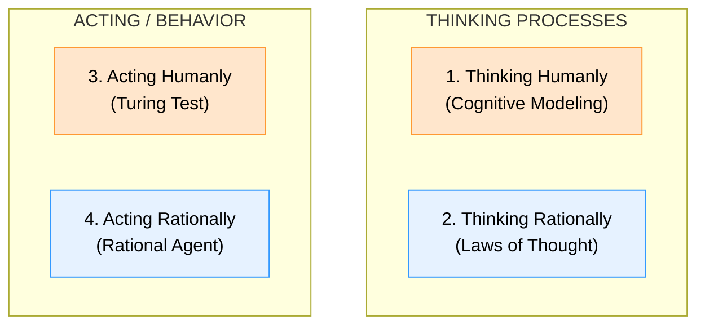
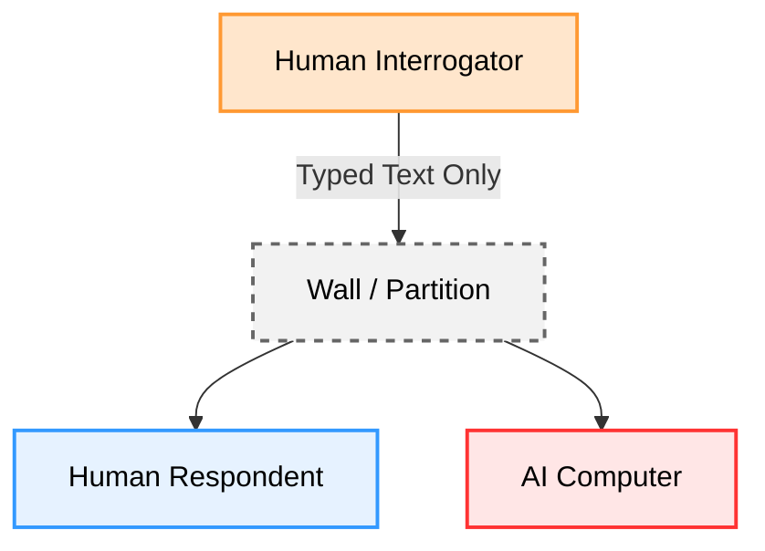
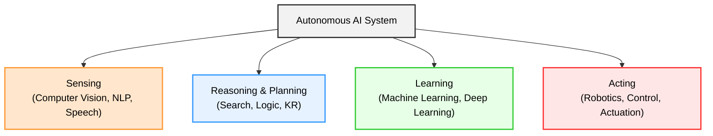
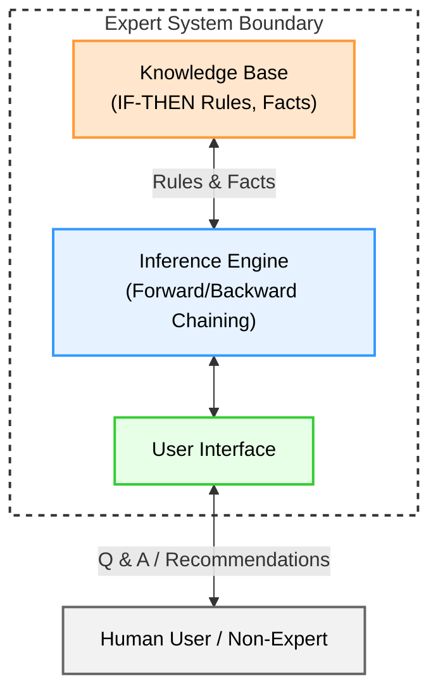

# Chapter 1 Diagrams

---

## 1. The Four Conceptual Approaches to AI Matrix
* **File Name:** `four_ai_approaches.png`

---

## 2. Turing Test Setup
* **File Name:** `turing_test_setup.png`

---

## 3. Functional Sub-fields/Components of AI
* **File Name:** `ai_components.png`

---

## 4. Expert System Architecture
* **File Name:** `expert_system_arch.png`

