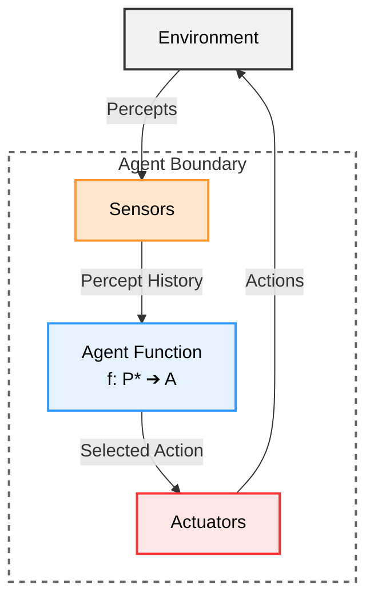
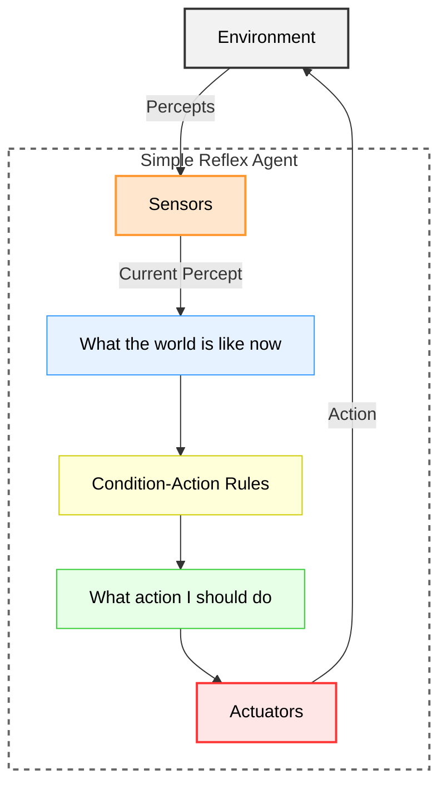
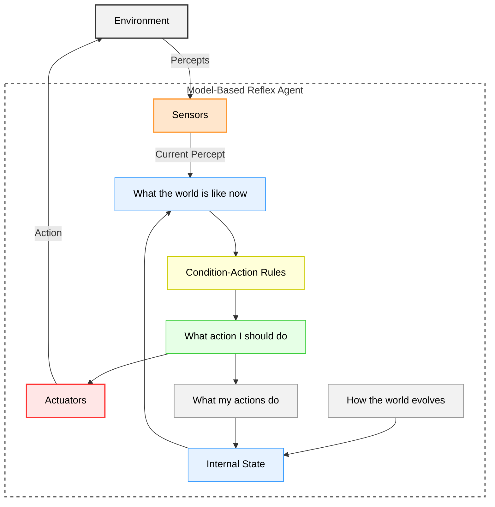
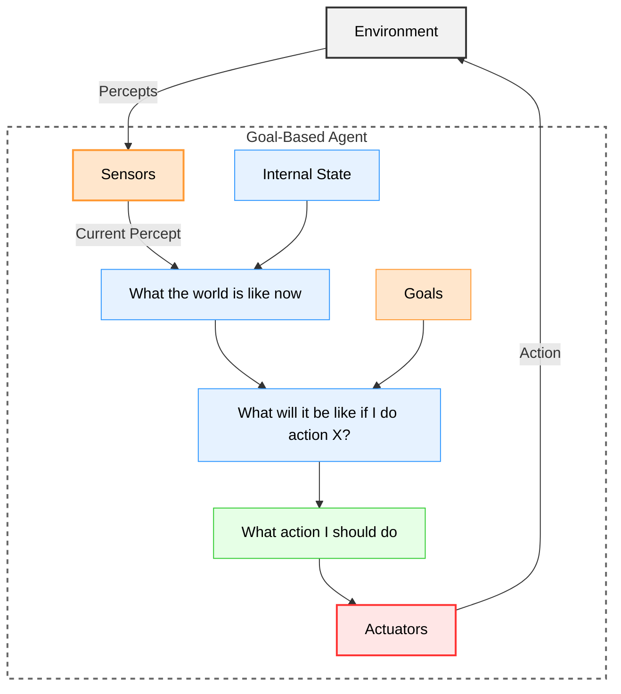
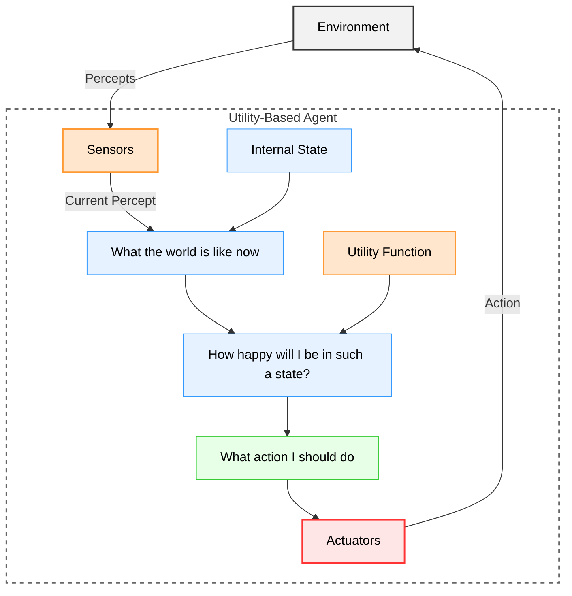
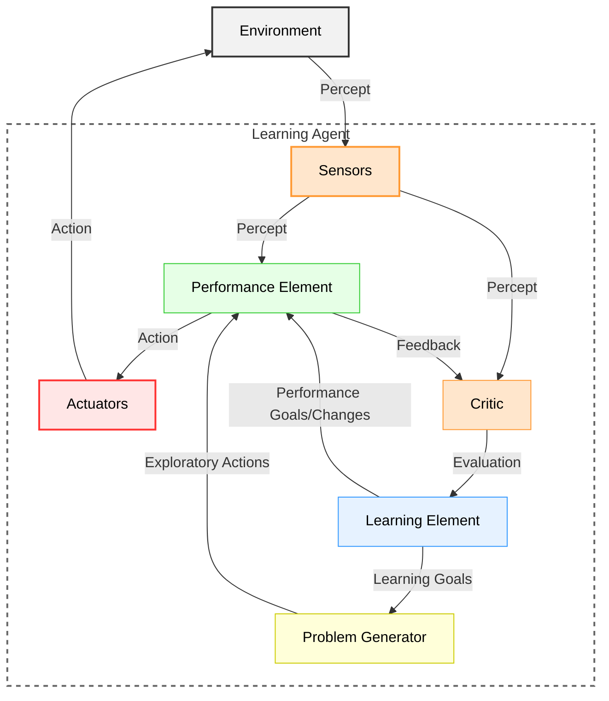

# Chapter 2 Diagrams

---

## 1. Environment-Agent Relationship
* **File Name:** `agent_environment.png`

---

## 2. Simple Reflex Agent Structure
* **File Name:** `simple_reflex_agent.png`

---

## 3. Model-Based Reflex Agent Structure
* **File Name:** `model_based_agent.png`

---

## 4. Goal-Based Agent Structure
* **File Name:** `goal_based_agent.png`

---

## 5. Utility-Based Agent Structure
* **File Name:** `utility_based_agent.png`

---

## 6. Learning Agent Structure
* **File Name:** `learning_agent.png`

