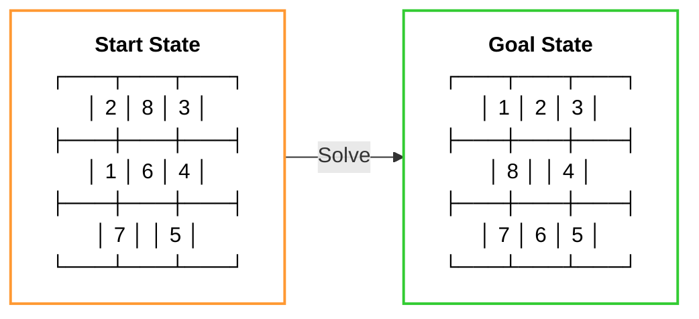
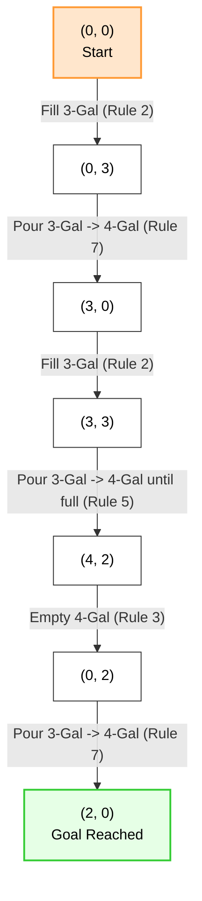
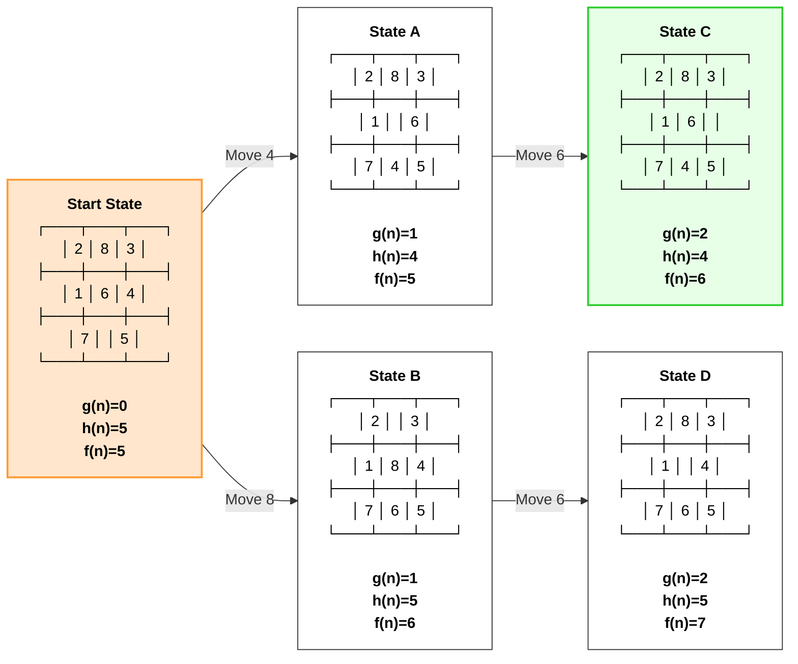

# Chapter 3 Diagrams

---

## 1. 8-Puzzle Start and Goal States
* **File Name:** `eight_puzzle_states.png`

---

## 2. Water Jug Traced Solution Path
* **File Name:** `water_jug_trace.png`

---

## 3. 8-Puzzle States with Heuristics and Path Cost
* **File Name:** `eight_puzzle_heuristics.png`

