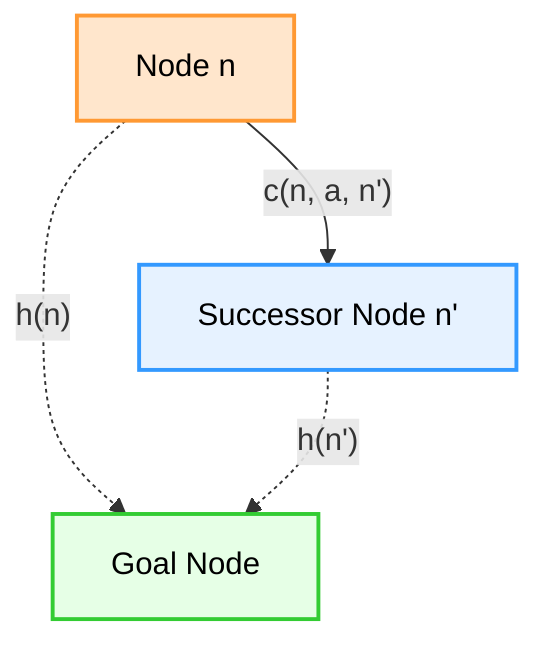
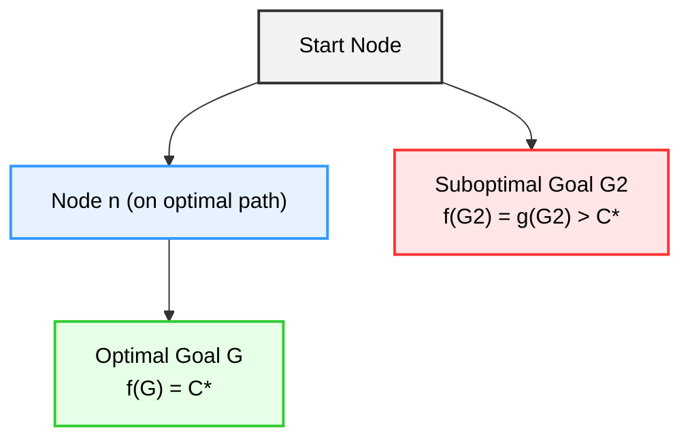
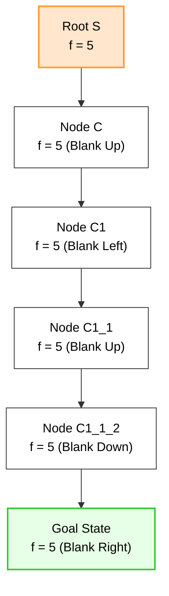
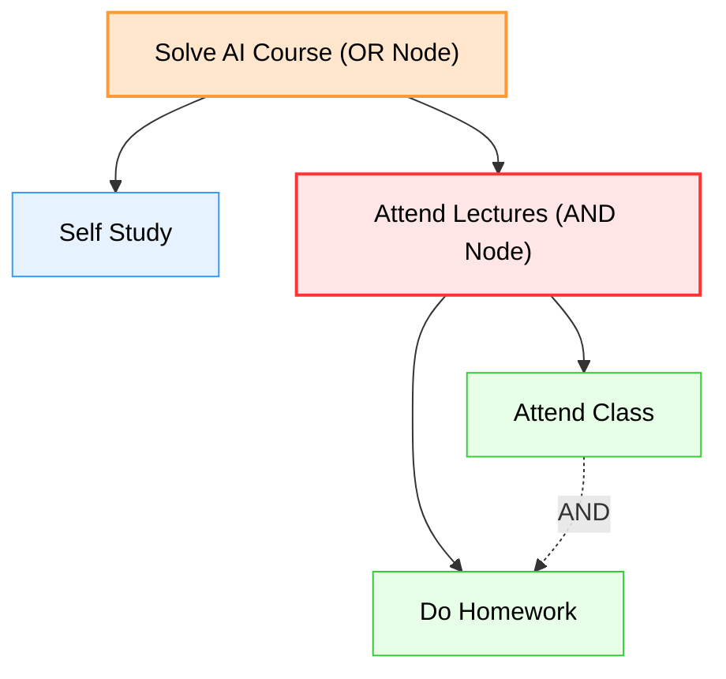

# Chapter 4 Diagrams

---

## 1. Heuristic Consistency Inequality Triangle
* **File Name:** `consistency_triangle.png`

---

## 2. A* Optimality Contradiction Tree
* **File Name:** `astar_optimality.png`

---

## 3. 8-Puzzle State Transition Trace
* **File Name:** `puzzle_search_tree.png`

---

## 4. AND-OR Graph Decompositions
* **File Name:** `and_or_graph.png`

