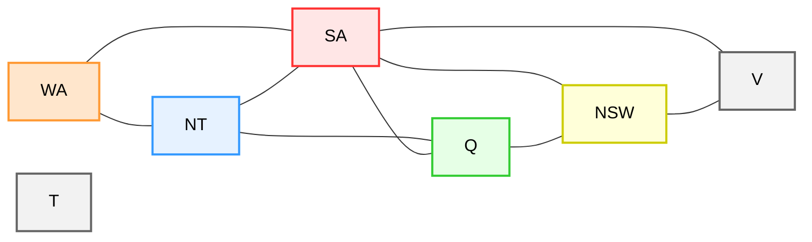

# Chapter 5 Diagrams

---

## 1. Australia Map-Coloring Outline/Graph
* **File Name:** `australia_map.png`

```mermaid
graph LR
    WA["WA"]
    NT["NT"]
    SA["SA"]
    Q["Q"]
    NSW["NSW"]
    V["V"]
    T["T"]

    WA --- NT
    WA --- SA
    NT --- SA
    NT --- Q
    SA --- Q
    SA --- NSW
    SA --- V
    Q --- NSW
    NSW --- V

    style WA fill:#ffe6cc,stroke:#ff9933,stroke-width:2px,color:#000
    style NT fill:#e6f2ff,stroke:#3399ff,stroke-width:2px,color:#000
    style SA fill:#ffe6e6,stroke:#ff3333,stroke-width:2px,color:#000
    style Q fill:#e6ffe6,stroke:#33cc33,stroke-width:2px,color:#000
    style NSW fill:#ffffd9,stroke:#cccc00,stroke-width:2px,color:#000
    style V fill:#f2f2f2,stroke:#666,stroke-width:2px,color:#000
    style T fill:#f2f2f2,stroke:#666,stroke-width:2px,color:#000
```
