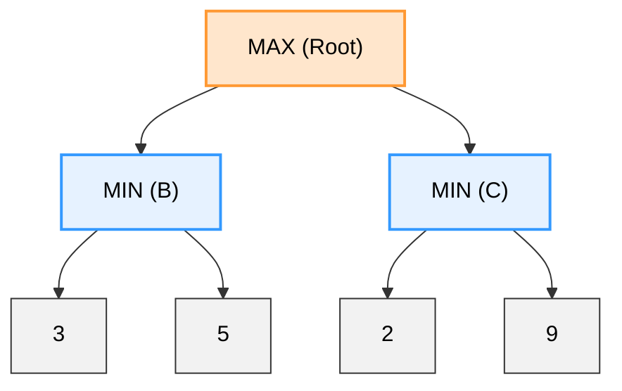
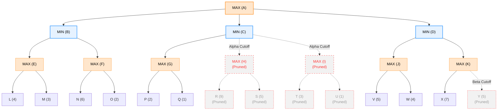

# Chapter 6 Diagrams

---

## 1. Minimax Game Tree
* **File Name:** `minimax_tree.png`

```mermaid
graph TD
    A["MAX (Root)"]
    B["MIN (B)"]
    C["MIN (C)"]
    L1["3"]
    L2["5"]
    L3["2"]
    L4["9"]

    A --> B
    A --> C
    B --> L1
    B --> L2
    C --> L3
    C --> L4

    style A fill:#ffe6cc,stroke:#ff9933,stroke-width:2px,color:#000
    style B fill:#e6f2ff,stroke:#3399ff,stroke-width:2px,color:#000
    style C fill:#e6f2ff,stroke:#3399ff,stroke-width:2px,color:#000
    style L1 fill:#f2f2f2,stroke:#333,stroke-width:1px,color:#000
    style L2 fill:#f2f2f2,stroke:#333,stroke-width:1px,color:#000
    style L3 fill:#f2f2f2,stroke:#333,stroke-width:1px,color:#000
    style L4 fill:#f2f2f2,stroke:#333,stroke-width:1px,color:#000
```

---

## 2. Alpha-Beta Pruning Game Tree
* **File Name:** `alphabeta_tree.png`

```mermaid
graph TD
    A["MAX (A)"]
    B["MIN (B)"]
    C["MIN (C)"]
    D["MIN (D)"]

    E["MAX (E)"]
    F["MAX (F)"]
    G["MAX (G)"]
    H["MAX (H) <br> (Pruned)"]
    I["MAX (I) <br> (Pruned)"]
    J["MAX (J)"]
    K["MAX (K)"]

    L["L (4)"]
    M["M (3)"]
    N["N (6)"]
    O["O (2)"]
    P["P (2)"]
    Q["Q (1)"]
    
    R["R (9) <br> (Pruned)"]
    S["S (5) <br> (Pruned)"]
    T["T (3) <br> (Pruned)"]
    U["U (1) <br> (Pruned)"]
    
    V["V (5)"]
    W["W (4)"]
    X["X (7)"]
    Y["Y (5) <br> (Pruned)"]

    A --> B
    A --> C
    A --> D

    B --> E
    B --> F
    
    C --> G
    C -.->|Alpha Cutoff| H
    C -.->|Alpha Cutoff| I
    
    D --> J
    D --> K

    E --> L
    E --> M
    F --> N
    F --> O
    
    G --> P
    G --> Q
    
    H -.-> R
    H -.-> S
    I -.-> T
    I -.-> U
    
    J --> V
    J --> W
    K --> X
    K -.->|Beta Cutoff| Y

    style A fill:#ffe6cc,stroke:#ff9933,stroke-width:2px,color:#000
    style B fill:#e6f2ff,stroke:#3399ff,stroke-width:2px,color:#000
    style C fill:#e6f2ff,stroke:#3399ff,stroke-width:2px,color:#000
    style D fill:#e6f2ff,stroke:#3399ff,stroke-width:2px,color:#000
    
    style E fill:#ffe6cc,stroke:#ff9933,stroke-width:1px,color:#000
    style F fill:#ffe6cc,stroke:#ff9933,stroke-width:1px,color:#000
    style G fill:#ffe6cc,stroke:#ff9933,stroke-width:1px,color:#000
    style H fill:#f2f2f2,stroke:#ff3333,stroke-width:1px,stroke-dasharray: 5 5,color:#ff3333
    style I fill:#f2f2f2,stroke:#ff3333,stroke-width:1px,stroke-dasharray: 5 5,color:#ff3333
    style J fill:#ffe6cc,stroke:#ff9933,stroke-width:1px,color:#000
    style K fill:#ffe6cc,stroke:#ff9933,stroke-width:1px,color:#000

    style R fill:#f2f2f2,stroke:#ff3333,stroke-dasharray: 3 3,color:#999
    style S fill:#f2f2f2,stroke:#ff3333,stroke-dasharray: 3 3,color:#999
    style T fill:#f2f2f2,stroke:#ff3333,stroke-dasharray: 3 3,color:#999
    style U fill:#f2f2f2,stroke:#ff3333,stroke-dasharray: 3 3,color:#999
    style Y fill:#f2f2f2,stroke:#ff3333,stroke-dasharray: 3 3,color:#999
```
