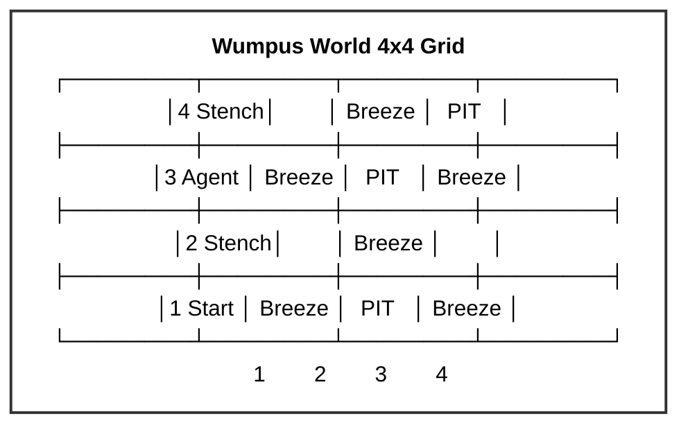

# Chapter 7 Diagrams

---

## 1. Wumpus World Grid Layout
* **File Name:** `wumpus_world_grid.png`

```mermaid
flowchart TD
    Grid["<b>Wumpus World 4x4 Grid</b><br>┌────────┬────────┬────────┬────────┐<br>│4 Stench│        │ Breeze │  PIT   │<br>├────────┼────────┼────────┼────────┤<br>│3 Agent │ Breeze │  PIT   │ Breeze │<br>├────────┼────────┼────────┼────────┤<br>│2 Stench│        │ Breeze │        │<br>├────────┼────────┼────────┼────────┤<br>│1 Start │ Breeze │  PIT   │ Breeze │<br>└────────┴────────┴────────┴────────┘<br>&nbsp;&nbsp;&nbsp;&nbsp;1&nbsp;&nbsp;&nbsp;&nbsp;&nbsp;&nbsp;&nbsp;&nbsp;2&nbsp;&nbsp;&nbsp;&nbsp;&nbsp;&nbsp;&nbsp;&nbsp;3&nbsp;&nbsp;&nbsp;&nbsp;&nbsp;&nbsp;&nbsp;&nbsp;4"]
    
    style Grid fill:#fff,stroke:#333,stroke-width:2px,color:#000
```
