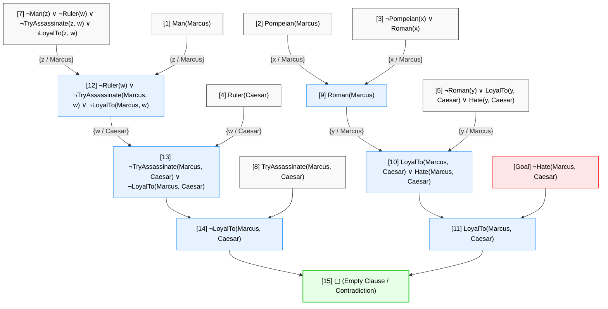
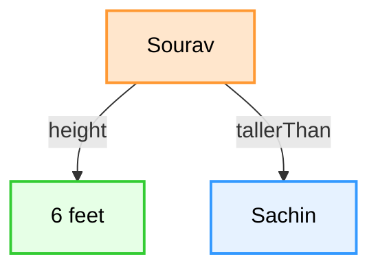

# Chapter 8 Diagrams

---

## 1. Resolution Refutation Proof Tree
* **File Name:** `resolution_steps.png`

```mermaid
graph TD
    %% Base Clauses
    C2["[2] Pompeian(Marcus)"]
    C3["[3] ¬Pompeian(x) ∨ Roman(x)"]
    C5["[5] ¬Roman(y) ∨ LoyalTo(y, Caesar) ∨ Hate(y, Caesar)"]
    C1["[1] Man(Marcus)"]
    C7["[7] ¬Man(z) ∨ ¬Ruler(w) ∨ ¬TryAssassinate(z, w) ∨ ¬LoyalTo(z, w)"]
    C4["[4] Ruler(Caesar)"]
    C8["[8] TryAssassinate(Marcus, Caesar)"]
    CGoal["[Goal] ¬Hate(Marcus, Caesar)"]

    %% Intermediate Resolvents
    C9["[9] Roman(Marcus)"]
    C10["[10] LoyalTo(Marcus, Caesar) ∨ Hate(Marcus, Caesar)"]
    C11["[11] LoyalTo(Marcus, Caesar)"]
    C12["[12] ¬Ruler(w) ∨ ¬TryAssassinate(Marcus, w) ∨ ¬LoyalTo(Marcus, w)"]
    C13["[13] ¬TryAssassinate(Marcus, Caesar) ∨ ¬LoyalTo(Marcus, Caesar)"]
    C14["[14] ¬LoyalTo(Marcus, Caesar)"]
    C15["[15] ▢ (Empty Clause / Contradiction)"]

    %% Resolution Edges
    C2 -->|"{x / Marcus}"| C9
    C3 -->|"{x / Marcus}"| C9
    
    C9 -->|"{y / Marcus}"| C10
    C5 -->|"{y / Marcus}"| C10
    
    C10 --> C11
    CGoal --> C11
    
    C7 -->|"{z / Marcus}"| C12
    C1 -->|"{z / Marcus}"| C12
    
    C12 -->|"{w / Caesar}"| C13
    C4 -->|"{w / Caesar}"| C13
    
    C13 --> C14
    C8 --> C14
    
    C14 --> C15
    C11 --> C15

    style C1 fill:#f9f9f9,stroke:#333,stroke-width:1px,color:#000
    style C2 fill:#f9f9f9,stroke:#333,stroke-width:1px,color:#000
    style C3 fill:#f9f9f9,stroke:#333,stroke-width:1px,color:#000
    style C4 fill:#f9f9f9,stroke:#333,stroke-width:1px,color:#000
    style C5 fill:#f9f9f9,stroke:#333,stroke-width:1px,color:#000
    style C7 fill:#f9f9f9,stroke:#333,stroke-width:1px,color:#000
    style C8 fill:#f9f9f9,stroke:#333,stroke-width:1px,color:#000
    style CGoal fill:#ffe6e6,stroke:#ff3333,stroke-width:1px,color:#000
    
    style C9 fill:#e6f2ff,stroke:#3399ff,stroke-width:1px,color:#000
    style C10 fill:#e6f2ff,stroke:#3399ff,stroke-width:1px,color:#000
    style C11 fill:#e6f2ff,stroke:#3399ff,stroke-width:1px,color:#000
    style C12 fill:#e6f2ff,stroke:#3399ff,stroke-width:1px,color:#000
    style C13 fill:#e6f2ff,stroke:#3399ff,stroke-width:1px,color:#000
    style C14 fill:#e6f2ff,stroke:#3399ff,stroke-width:1px,color:#000
    style C15 fill:#e6ffe6,stroke:#33cc33,stroke-width:2px,color:#000
```

---

## 2. Semantic Network
* **File Name:** `semantic_network.png`

```mermaid
graph TD
    Sourav["Sourav"]
    Sachin["Sachin"]
    Height["6 feet"]

    Sourav -->|height| Height
    Sourav -->|tallerThan| Sachin

    style Sourav fill:#ffe6cc,stroke:#ff9933,stroke-width:2px,color:#000
    style Sachin fill:#e6f2ff,stroke:#3399ff,stroke-width:2px,color:#000
    style Height fill:#e6ffe6,stroke:#33cc33,stroke-width:2px,color:#000
```
