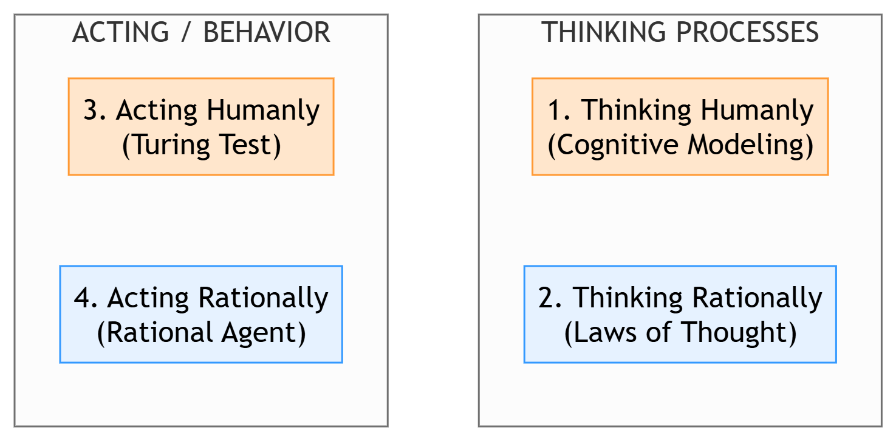
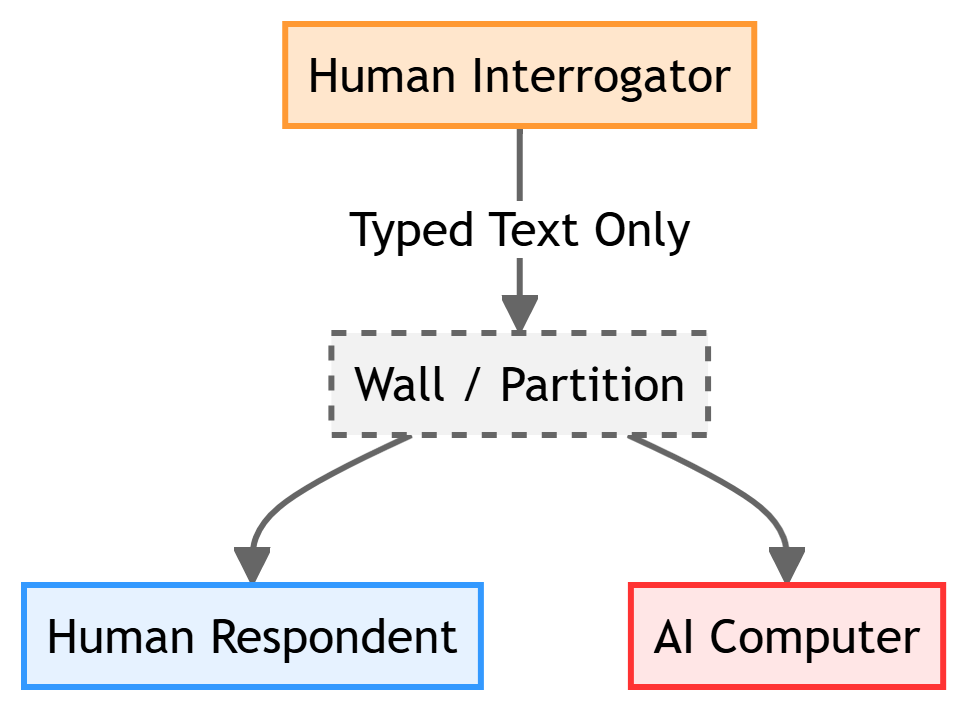
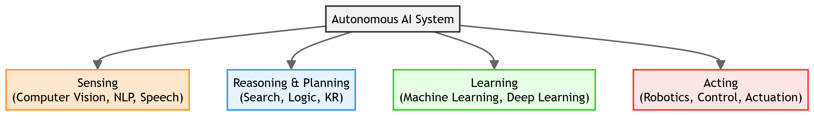
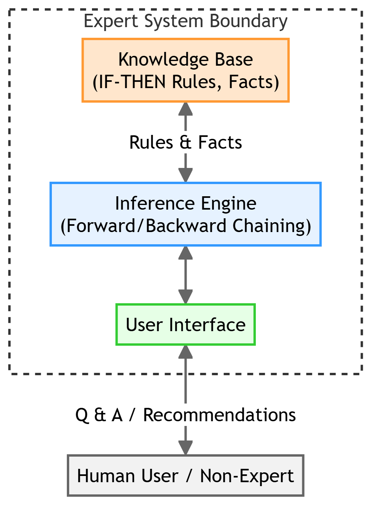

# Chapter 1: Introduction to Artificial Intelligence

This chapter compiles high-scoring study notes and complete exam answers for **Unit I: Introduction** of the OE-EC804A syllabus, adhering strictly to the **MAKAUT Answer Writing Guidelines**.

---

## 📝 Section 1: Definition and Four Approaches to AI (Q1.1)

### 1. Definition of Artificial Intelligence (AI)
**Artificial Intelligence** is a branch of Computer Science and Engineering concerned with building smart, autonomous systems capable of performing tasks that typically require human intelligence, such as visual perception, decision-making, learning, reasoning, and natural language understanding.

### 2. The Four Conceptual Approaches to AI
Historically, researchers have defined AI along two dimensions: **thought processes vs. behavior**, and **human-like performance vs. ideal rationality**. This yields four distinct conceptual views:

#### Detailed Comparison of the Four Views:

| Conceptual Approach | Core Philosophy / Focus | Methodology & Realization |
| :--- | :--- | :--- |
| **1. Thinking Humanly** | Focuses on mimicking the inner mental processing and cognitive activities of the human brain. | Implemented via **Cognitive Science** and neuroimaging. Systems are tested by comparing their decision steps to human experimental data. |
| **2. Thinking Rationally** | Focuses on using formal logic and the mathematical laws of thought to achieve "correct" reasoning. | Uses **Propositional/First-Order Logic** and syllogisms (e.g., "If A implies B, and A is true, then B is true"). |
| **3. Acting Humanly** | Focuses on creating machines that perform physical and cognitive actions indistinguishable from a human. | Evaluated via the **Turing Test**. The system's inner logic is irrelevant; only the external, observable behavior matters. |
| **4. Acting Rationally** | Focuses on building **Rational Agents** that act to achieve the best possible outcome (or best expected outcome under uncertainty). | Realized through decision theory, search algorithms, and control theory. This is the **standard modern view** of AI. |

---

## 📝 Section 2: The Turing Test Benchmark (Q1.2)

### 1. Definition and Setup
Introduced by **Alan Turing** in 1950, the **Turing Test** (originally the *Imitation Game*) is an operational test of machine intelligence. 

*   **Setup:** A human interrogator communicates with one human and one computer via typed text terminals in separate rooms. 
*   **Success Criterion:** If the interrogator cannot reliably tell the computer apart from the human after 5 minutes of questioning, the machine passes the test.

### 2. Six Key Capabilities Required to Pass the Test
To pass the Turing Test, a machine must possess the following six primary sub-fields of AI:

1.  **Natural Language Processing (NLP):** To communicate successfully in a natural language (like English).
2.  **Knowledge Representation:** To store facts and beliefs acquired before or during the conversation.
3.  **Automated Reasoning:** To use stored information to answer questions, draw conclusions, and find logical connections.
4.  **Machine Learning:** To adapt to new circumstances, detect patterns, and learn from experience.
5.  **Computer Vision** *(Total Turing Test requirement)*: To perceive physical objects and actions of the interrogator.
6.  **Robotics** *(Total Turing Test requirement)*: To physically move, interact with, and manipulate the physical environment.

---

## 📝 Section 3: Foundational Disciplines of AI (Q1.3)

Artificial Intelligence is a highly interdisciplinary field. The major contributing disciplines include:

1.  **Philosophy (400 BC -- Present):**
    *   *Contribution:* Formulated the ideas that the mind is like a machine, that knowledge is represented in formal languages, and that logical rules can be used to derive conclusions.
2.  **Mathematics (c. 800 -- Present):**
    *   *Contribution:* Provided the tools of **formal logic** (Boolean algebra), **probability theory** (handling uncertainty), and **algorithms** (computation limits and tractability).
3.  **Economics (1776 -- Present):**
    *   *Contribution:* Contributed utility theory, decision theory, and game theory, which govern how a rational agent makes choices to maximize its expected payoff.
4.  **Neuroscience (1861 -- Present):**
    *   *Contribution:* Mapped out how the physical brain processes information, laying the biological foundation for **Artificial Neural Networks (ANNs)**.
5.  **Psychology / Cognitive Science (1879 -- Present):**
    *   *Contribution:* Provided cognitive models to understand how humans think, perceive, and act, guiding the design of human-centric AI systems.
6.  **Control Theory & Cybernetics (1948 -- Present):**
    *   *Contribution:* Contributed feedback loops and the mathematical models to design adaptive, self-regulating systems (e.g., PID controllers, homeostatic systems).

---

## 📝 Section 4: Components and Sub-fields of AI (Q1.4)

### 1. Functional Sub-fields of AI
AI is comprised of several interacting components, each addressing a specific dimension of intelligence:

*   **Computer Vision:** Enables machines to extract, process, and understand structured information from digital images or videos.
*   **Natural Language Processing (NLP):** Enables computers to process, analyze, and synthesize human languages (syntax, semantics, and pragmatics).
*   **Machine Learning (ML):** The core engine that allows algorithms to improve their performance automatically on a task through exposure to training data.
*   **Expert Systems:** Specialized software systems that emulate the decision-making ability of a human expert in a narrow domain.
*   **Automated Planning & Decision Making:** Search and logical reasoning systems designed to select sequences of actions to reach a desired goal state.
*   **Robotics:** Integrates vision, control theory, and machine learning to build physical machines that can manipulate objects and navigate environments autonomously.

---

## 📝 Section 5: Expert Systems (Q1.5)

### 1. Definition
An **Expert System (ES)** is an interactive, computer-based decision-making system that uses knowledge and inference procedures to solve complex, domain-specific problems that typically require human expertise (e.g., medical diagnosis, financial analysis, mineral exploration).

### 2. Detailed Architecture of an Expert System
A standard Expert System consists of three main non-overlapping components:

#### Core Components Explained:
1.  **Knowledge Base (KB):** The warehouse of high-quality domain-specific facts, rules, and heuristics compiled from human experts. Information is typically stored in the form of **IF-THEN production rules**.
2.  **Inference Engine:** The processing engine that applies logical rules to the Knowledge Base to deduce new information or solve the user's query. It operates in two main modes:
    *   **Forward Chaining (Data-Driven):** Starts with known facts and applies rules to infer new facts (reaches a conclusion).
    *   **Backward Chaining (Goal-Driven):** Starts with a goal or hypothesis and works backward to find supporting facts.
3.  **User Interface:** The communication interface that allows a non-expert user to input queries, view recommendations, and inspect the system's reasoning path (via an **Explanation Facility**).

### 3. Advantages and Disadvantages of Expert Systems

#### Advantages (At least 5 points):
1.  **High Availability:** Expert knowledge is accessible 24/7 on ordinary computer systems, removing dependency on scarce human experts.
2.  **Consistency:** Does not suffer from fatigue, emotional stress, or cognitive bias; always applies rules uniformly.
3.  **Speed & Efficiency:** Processes large volumes of complex, rule-based data in milliseconds, reducing diagnosis or lookup times.
4.  **Preservation of Expertise:** Captures and preserves the invaluable knowledge of senior experts before they retire or leave an organization.
5.  **Explanatory Capability:** The system can explicitly print out its exact step-by-step reasoning path (Why/How a conclusion was reached), increasing user trust.

#### Disadvantages (At least 5 points):
1.  **Lack of Common Sense:** Completely lacks general, everyday common-sense knowledge; cannot adapt if a problem falls slightly outside its narrow domain.
2.  **High Maintenance Costs:** Domain knowledge changes over time, requiring expensive manual updates and validation of the rules database.
3.  **Knowledge Acquisition Bottleneck:** Extracting tacit knowledge from human experts and translating it into rigid IF-THEN rules is extremely slow and difficult.
4.  **Inability to Learn Automatically:** Unlike modern machine learning systems, traditional expert systems cannot learn from new experiences; rules must be coded manually.
5.  **Brittleness:** If rules in the Knowledge Base contain contradictions or gaps, the system may crash or produce highly incorrect recommendations without warning.
