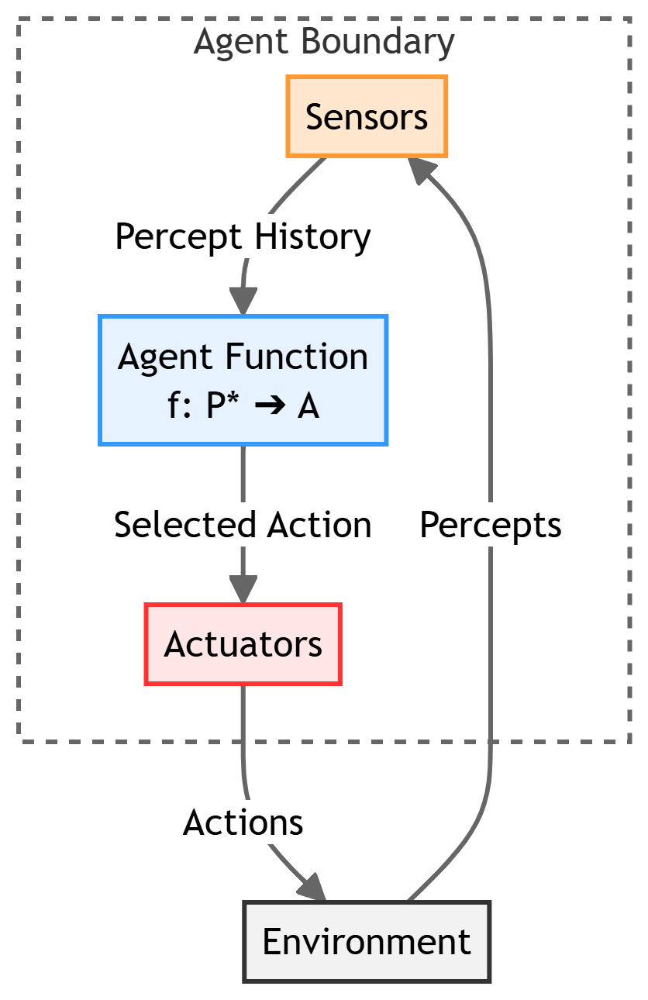
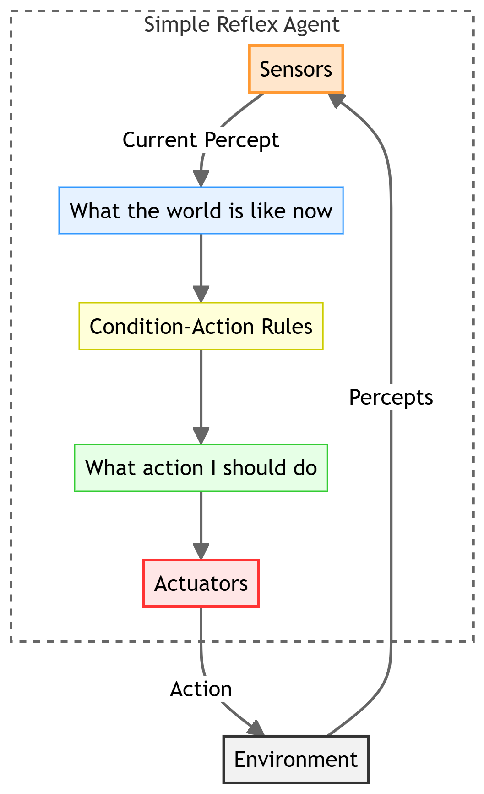
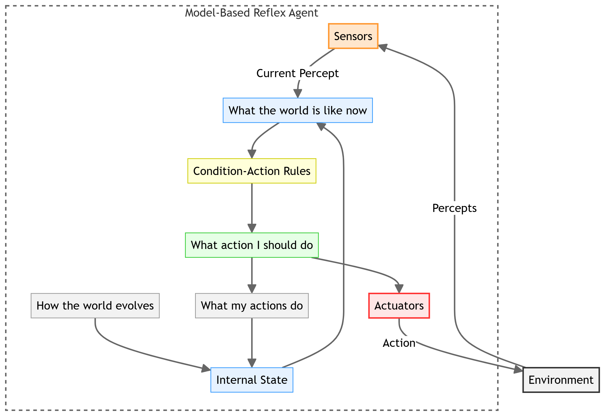
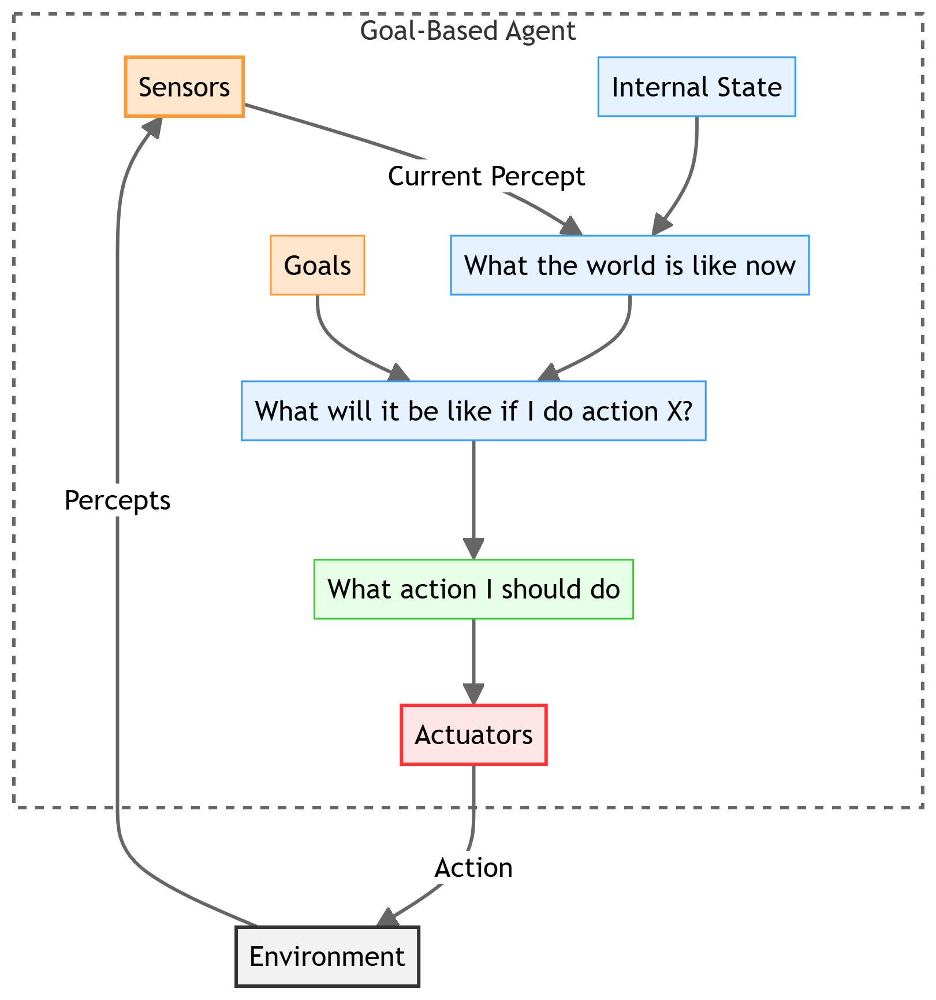
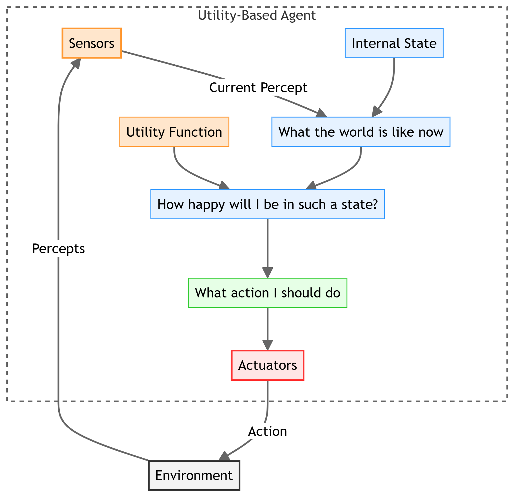
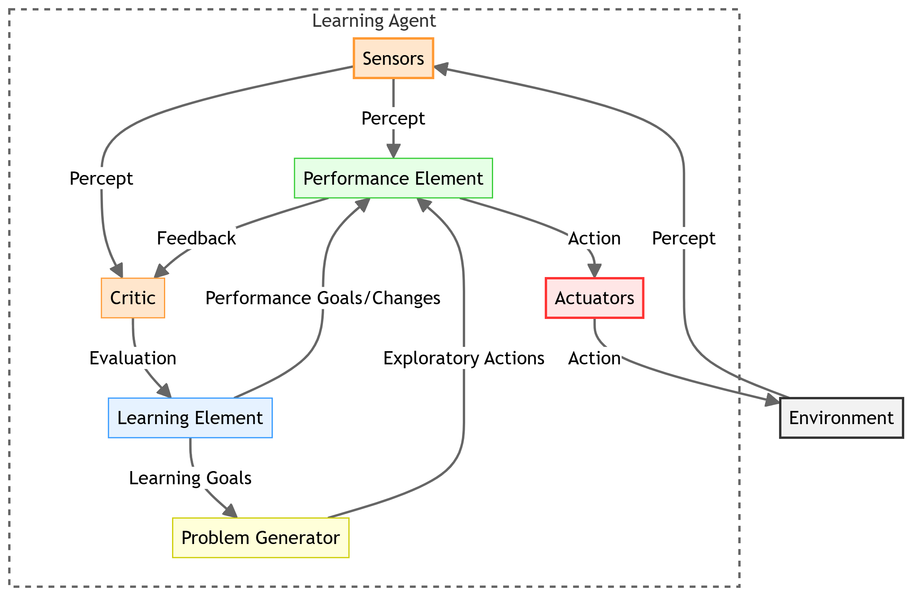

# Chapter 2: Intelligent Agents

This chapter compiles high-scoring study notes and complete exam answers for **Unit II: Intelligent Agents** of the OE-EC804A syllabus, adhering strictly to the **MAKAUT Answer Writing Guidelines**.

---

## 📝 Section 1: Definition of Agent, Environment, and Percept Sequence (Q2.1)

### 1. Definitions

*   **Agent:** An **Agent** is anything that can be viewed as perceiving its environment through sensors and acting upon that environment through actuators.
*   **Environment:** The **Environment** is the surrounding or context in which the agent operates and interacts. It is the world that the agent perceives and acts upon.
*   **Percept Sequence:** An agent's **Percept Sequence** is the complete history of everything that the agent has perceived (received via its sensors) from the beginning of its operation to the present moment.

### 2. Relationship and Core Mathematical Formulation
An agent's behavior is mathematically described by the **Agent Function ($f$)**, which maps any given percept sequence to a specific action:
$$f: P^* \rightarrow A$$
Where:
*   $P^*$ is the set of all possible percept sequences (of any length).
*   $A$ is the set of all possible actions.

In practice, the agent function is implemented by an **Agent Program**, which runs on a physical architecture (hardware/processor):
$$\text{Agent} = \text{Architecture} + \text{Program}$$

---

## 📝 Section 2: PEAS Description (Q2.2)

### 1. Definition of PEAS
To design a rational agent, we must specify its task environment, which is summarized using the **PEAS** framework:
*   **P** -- **Performance Measure:** The metric used to evaluate how successful the agent's behavior is.
*   **E** -- **Environment:** The external context, objects, and variables the agent interacts with.
*   **A** -- **Actuators:** The devices or output mechanisms the agent uses to perform actions.
*   **S** -- **Sensors:** The inputs or devices the agent uses to perceive the environment.

### 2. Comparative PEAS Examples for Standard Systems

| Agent Type | Performance Measure (P) | Environment (E) | Actuators (A) | Sensors (S) |
| :--- | :--- | :--- | :--- | :--- |
| **Automated Taxi Driver** | Safe arrival, speed, legal driving, passenger comfort, profits. | Roads, other traffic, pedestrians, weather, customers. | Steering wheel, accelerator, brakes, horn, display/speech. | Cameras, LIDAR, sonar, GPS, speedometer, odometer, engine sensors. |
| **Medical Diagnosis System** | Patient health, minimized cost, no legal liability, diagnostic accuracy. | Patient, hospital staff, laboratory test reports. | Screen displays (diagnoses, prescriptions, tests), alerts. | Keyboard/voice input (symptoms, history, test results). |
| **Part-Picking Robot** | % of parts in correct bins, speed, safety (no damaged parts). | Conveyor belt, physical parts, bins. | Jointed robotic arm, hand/gripper, motor controller. | Cameras (vision sensors), pressure/force sensors in gripper. |
| **Refinery Controller** | Purity, safety, throughput, energy efficiency, cost minimization. | Pipes, chemical reactors, valves, heaters. | Valves, pumps, heaters, alarms, control panels. | Temperature gauges, pressure sensors, flow-rate sensors. |

---

## 📝 Section 3: The Five Basic Agent Structures (Q2.3)

All AI agents can be structured into one of five basic architectural types based on their internal reasoning mechanisms:

### 1. Simple Reflex Agents
*   **Working Principle:** Selects actions based *only* on the current percept, ignoring the history of percepts. Uses **condition-action rules** (e.g., "IF brake lights in front are on, THEN initiate braking").
*   **Limitation:** Only works if the environment is fully observable.
*   **Diagram:**

### 2. Model-Based Reflex Agents
*   **Working Principle:** Maintains an internal **state** (model of the world) to track aspects of the environment that cannot be seen right now. It updates the state based on how the world evolves and what the agent's actions do.
*   **Diagram:**

### 3. Goal-Based Agents
*   **Working Principle:** Combines the world model with explicit **goal** information to choose actions that will achieve the desired goal state. Uses search and planning.
*   **Diagram:**

### 4. Utility-Based Agents
*   **Working Principle:** Uses a **utility function** (mapping states to real numbers) to measure how desirable a particular state is (its "happiness" or utility level). Allows trade-offs when goals conflict or have uncertainty.
*   **Diagram:**

### 5. Learning Agents
*   **Working Principle:** Separates the agent into four conceptual components:
    1.  **Learning Element:** Responsible for making improvements by learning from experience.
    2.  **Performance Element:** The standard agent that selects external actions (equivalent to the entire agent in previous structures).
    3.  **Critic:** Evaluates the agent's behavior against an external performance standard and provides feedback.
    4.  **Problem Generator:** Suggests new exploratory actions (suboptimal in the short term) to discover new knowledge.
*   **Diagram:**

---

## 📝 Section 4: Nature of Environments (Q2.4)

Task environments vary across several properties, which dictate the complexity of the agent design:

### 1. Environment Properties Explained

*   **Fully Observable vs. Partially Observable:**
    *   *Fully Observable:* The agent's sensors detect the complete state of the environment at each point in time (e.g., Chess).
    *   *Partially Observable:* Sensors have noise, limits, or gaps, leaving parts of the state unknown (e.g., Poker, Driving).
*   **Deterministic vs. Stochastic:**
    *   *Deterministic:* The next state of the environment is completely determined by the current state and the action executed by the agent (e.g., Chess).
    *   *Stochastic:* The next state is uncertain, containing random probabilities (e.g., weather, coin flips). *Strategic* refers to environments where the uncertainty comes only from other agents.
*   **Episodic vs. Sequential:**
    *   *Episodic:* The agent’s experience is divided into atomic, independent episodes. Action choice in one episode does not affect the next (e.g., part classification on assembly line).
    *   *Sequential:* Current decisions affect all future decisions and states (e.g., Chess, Driving).
*   **Static vs. Dynamic:**
    *   *Static:* The environment does not change while the agent is deciding its action (e.g., Crossword puzzle).
    *   *Dynamic:* The environment continues to change while the agent is formulating its decision (e.g., Driving). *Semidynamic* means the environment doesn't change, but the agent's performance score decreases with time spent thinking (e.g., Chess with a clock).
*   **Discrete vs. Continuous:**
    *   *Discrete:* Has a finite or countable number of distinct states, percepts, and actions (e.g., Chess board positions).
    *   *Continuous:* Variables (speed, location, temperature) are represented by continuous real numbers (e.g., Driving).
*   **Single-agent vs. Multi-agent:**
    *   *Single-agent:* Only one agent operates in the environment (e.g., Sudoku, Solitaire).
    *   *Multi-agent:* Multiple interacting agents coexist (e.g., Chess, Traffic). Can be competitive (Chess) or cooperative (Driving rules).

### 2. Comparison Matrix of Common Environments

| Environment | Observable | Deterministic | Episodic | Static | Discrete | Agent |
| :--- | :--- | :--- | :--- | :--- | :--- | :--- |
| **Chess (with clock)** | Fully | Strategic | Sequential | Semidynamic | Discrete | Multi |
| **Taxi Driving** | Partially | Stochastic | Sequential | Dynamic | Continuous | Multi |
| **Image Analysis** | Fully | Deterministic | Episodic | Static | Discrete | Single |
| **Medical Diagnosis** | Partially | Stochastic | Sequential | Dynamic | Continuous | Multi |
| **Sudoku** | Fully | Deterministic | Sequential | Static | Discrete | Single |
