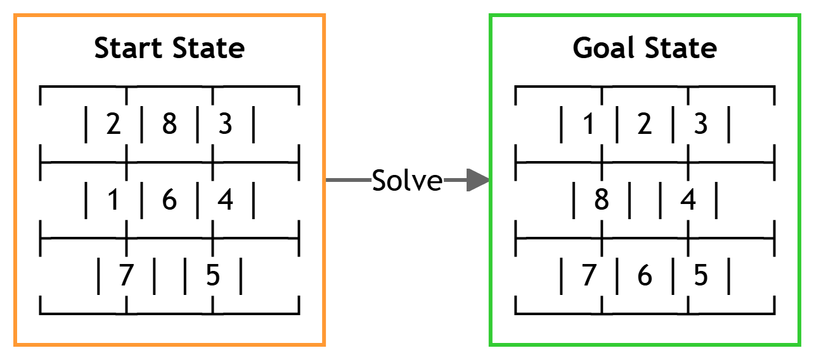
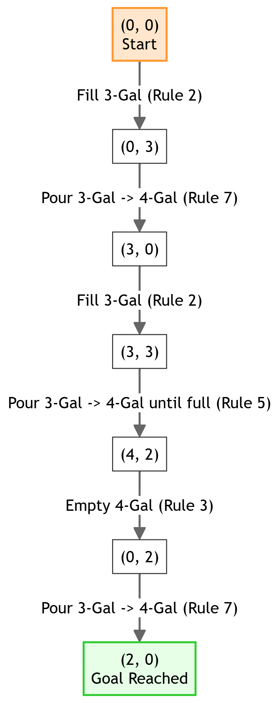

# Chapter 3: Solving Problems by Searching (Uninformed Search)

This chapter compiles high-scoring study notes and complete exam answers for **Unit III: Solving Problems by Searching** of the OE-EC804A syllabus, adhering strictly to the **MAKAUT Answer Writing Guidelines**.

---

## 📝 Section 1: Problem-Solving Agents and Formulation (Q3.1)

### 1. Definition of Problem-Solving Agents
A **Problem-Solving Agent** is a type of goal-based agent that decides what to do by finding sequences of actions that lead to desirable states. It uses search algorithms to plan ahead before executing actions in the physical world.

### 2. Steps in Problem Formulation
Problem formulation is the process of deciding what actions and states to consider, given a goal. It consists of 5 core components:

1.  **Initial State:** The state in which the agent starts (e.g., $In(Arad)$).
2.  **Actions:** The set of possible actions available to the agent at a given state. Mathematically, $Actions(s)$ returns the set of actions that can be executed in state $s$.
3.  **Transition Model:** A description of what each action does. It is represented by a function $Result(s, a)$ that returns the state reached by executing action $a$ in state $s$.
4.  **Goal Test:** A function that determines whether a given state is a goal state. Can be explicit (e.g., $s = In(Bucharest)$) or implicit (e.g., $s$ satisfies a check like checkmate).
5.  **Path Cost:** A function that assigns a numeric cost to a path. The step cost of taking action $a$ in state $s$ to reach state $s'$ is denoted by $c(s, a, s')$. The path cost $g(n)$ is the sum of step costs along the path.

### 3. State Space Representation
The **State Space** is the set of all states reachable from the initial state by any sequence of actions. It is represented as a directed graph where:
*   **Nodes:** Represent individual states.
*   **Directed Edges:** Represent actions (transitions).

---

## 📝 Section 2: Evaluation Criteria for Search Algorithms (Q3.2)

A search algorithm's performance is evaluated using four standard criteria:

1.  **Completeness:** Is the algorithm guaranteed to find a solution if one exists?
2.  **Time Complexity:** How long (number of generated nodes or steps) does it take to find a solution?
3.  **Space Complexity:** How much memory does the algorithm require to perform the search?
4.  **Optimality:** Does the strategy find the path with the lowest path cost among all solutions?

### Key Parameters:
*   $b$: Branching factor (maximum number of successors of any node).
*   $d$: Depth of the shallowest goal node.
*   $m$: Maximum depth of the state space (can be $\infty$).

---

## 📝 Section 3: BFS vs. DFS Comparison (Q3.3)

### 1. Feature Comparison Table

| Feature / Criteria | Breadth-First Search (BFS) | Depth-First Search (DFS) |
| :--- | :--- | :--- |
| **Search Strategy** | Explores level-by-level (expands all nodes at depth $d$ before depth $d+1$). | Explores deep into a branch first; backtracks only when it hits a dead end. |
| **Data Structure** | FIFO Queue (First-In, First-Out) | LIFO Stack (Last-In, First-Out) or Recursion |
| **Completeness** | **Yes** (if branching factor $b$ is finite). | **No** (fails in infinite paths or cyclic state spaces). |
| **Time Complexity** | $O(b^d)$ (Exponential) | $O(b^m)$ (Exponential; worse than BFS if $m \gg d$) |
| **Space Complexity** | $O(b^d)$ (Stores all frontier nodes in memory). | $O(bm)$ (Linear; extremely memory-efficient). |
| **Optimality** | **Yes** (if all step costs are equal/uniform). | **No** (returns the first path found, not necessarily the shortest). |

### 2. Why DFS is Not Always Complete
DFS is not complete because it can traverse down an infinite path or get trapped in a cycle in the state space graph. If a cycle or infinite path exists on a branch to the left of the goal node, DFS will continue down that branch forever, never backtracking to explore other branches containing the goal.

---

## 📝 Section 4: IDDFS and UCS Algorithms (Q3.4)

### 1. Iterative Deepening Depth-First Search (IDDFS)

*   **Working Principle:** Combines the benefits of BFS (optimal and complete) and DFS (low memory). It runs Depth-Limited Search (DLS) repeatedly with increasing depth limits ($l = 0, 1, 2, \dots$) until a goal is found.
*   **Evaluation:**
    *   *Completeness:* Yes (if $b$ is finite).
    *   *Optimality:* Yes (if step costs are uniform).
    *   *Time Complexity:* $O(b^d)$
    *   *Space Complexity:* $O(bd)$ (Linear space).

#### IDDFS Algorithm:
```text
function ITERATIVE-DEEPENING-SEARCH(problem) returns a solution, or failure
  for depth = 0 to infinity do
    result <- DEPTH-LIMITED-SEARCH(problem, depth)
    if result != cutoff then return result
```

---

### 2. Uniform-Cost Search (UCS)

*   **Working Principle:** Generalizes BFS for arbitrary step costs. It expands the frontier node $n$ that has the lowest accumulated path cost $g(n)$ from the start state.
*   **Evaluation:**
    *   *Completeness:* Yes (if all step costs $\ge \epsilon > 0$).
    *   *Optimality:* Yes (always expands the lowest-cost path first).
    *   *Time & Space Complexity:* $O(b^{1 + \lfloor C^*/\epsilon \rfloor})$, where $C^*$ is the cost of the optimal solution and $\epsilon$ is the minimum step cost.

#### UCS Algorithm:
```text
function UNIFORM-COST-SEARCH(problem) returns a solution, or failure
  node <- a node with State = problem.INITIAL-STATE, Path-Cost = 0
  frontier <- a priority queue ordered by Path-Cost, with node as the only element
  explored <- an empty set
  
  loop do
    if IS-EMPTY(frontier) then return failure
    node <- POP(frontier) /* chooses the lowest-cost node */
    if problem.GOAL-TEST(node.State) then return SOLUTION(node)
    add node.State to explored
    for each action in problem.ACTIONS(node.State) do
      child <- CHILD-NODE(problem, node, action)
      if child.State is not in explored or frontier then
        INSERT(child, frontier)
      else if child.State is in frontier with higher Path-Cost then
        replace that frontier node with child
```

---

## 📝 Section 5: Formulations of Classic Puzzles (Q3.5)

### 1. 8-Puzzle Problem Formulation

*   **States:** Board configurations specifying the locations of the 8 tiles (1 to 8) and the blank space in a $3\times3$ grid.
*   **Initial State:** Any valid board configuration (e.g., a scrambled grid).
*   **Actions:** Move the blank space `Left`, `Right`, `Up`, or `Down`.
*   **Transition Model:** Returns the board configuration after shifting the blank space in the specified direction.
*   **Goal Test:** Matches a target configuration (e.g., tiles in numerical order with blank at the bottom right).
*   **Path Cost:** Each step costs 1 ($g(n) = \text{number of moves}$).



---

### 2. The Missionaries and Cannibals Problem (3M, 3C)

*   **Problem Statement:** Three missionaries and three cannibals must cross a river using a boat that holds at most two people, with the constraint that the number of cannibals must never exceed the number of missionaries on either bank (otherwise the cannibals eat the missionaries). The boat must have at least one person to cross.

#### State Formulation:
*   Represented as a 3-tuple: $(M, C, B)$
    *   $M$: Number of missionaries on the **left bank** ($0 \le M \le 3$).
    *   $C$: Number of cannibals on the **left bank** ($0 \le C \le 3$).
    *   $B$: Location of the boat ($1$ for left bank, $0$ for right bank).
*   *Note:* The state of the right bank is implicitly $(3-M, 3-C, 1-B)$.

#### Constraints (Safety Conditions):
For any state $(M, C, B)$, it is safe if and only if:
1.  If $M > 0$, then $M \ge C$ (Left bank is safe).
2.  If $3-M > 0$, then $(3-M) \ge (3-C)$ (Right bank is safe).

#### Actions (Transitions):
Let $(m, c)$ be the number of missionaries and cannibals placed in the boat ($1 \le m+c \le 2$).
*   If $B = 1$ (moving left to right):
    $$Result((M, C, 1), (m, c)) = (M-m, C-c, 0)$$
*   If $B = 0$ (moving right to left):
    $$Result((M, C, 0), (m, c)) = (M+m, C+c, 1)$$

#### Step-by-Step Solution Path:
Starting at $(3, 3, 1)$ and ending at $(0, 0, 0)$:

| Step | Current State $(M, C, B)$ | Action Taken (Boat Contents) | Direction | Resulting State |
| :--- | :--- | :--- | :--- | :--- |
| **0** | $(3, 3, 1)$ | Send 2 Cannibals (0M, 2C) | Left $\rightarrow$ Right | $(3, 1, 0)$ |
| **1** | $(3, 1, 0)$ | Return 1 Cannibal (0M, 1C) | Right $\rightarrow$ Left | $(3, 2, 1)$ |
| **2** | $(3, 2, 1)$ | Send 2 Cannibals (0M, 2C) | Left $\rightarrow$ Right | $(3, 0, 0)$ |
| **3** | $(3, 0, 0)$ | Return 1 Cannibal (0M, 1C) | Right $\rightarrow$ Left | $(3, 1, 1)$ |
| **4** | $(3, 1, 1)$ | Send 2 Missionaries (2M, 0C)| Left $\rightarrow$ Right | $(1, 1, 0)$ |
| **5** | $(1, 1, 0)$ | Return 1M & 1C (1M, 1C) | Right $\rightarrow$ Left | $(2, 2, 1)$ |
| **6** | $(2, 2, 1)$ | Send 2 Missionaries (2M, 0C)| Left $\rightarrow$ Right | $(0, 2, 0)$ |
| **7** | $(0, 2, 0)$ | Return 1 Cannibal (0M, 1C) | Right $\rightarrow$ Left | $(0, 3, 1)$ |
| **8** | $(0, 3, 1)$ | Send 2 Cannibals (0M, 2C) | Left $\rightarrow$ Right | $(0, 1, 0)$ |
| **9** | $(0, 1, 0)$ | Return 1 Cannibal (0M, 1C) | Right $\rightarrow$ Left | $(0, 2, 1)$ |
| **10**| $(0, 2, 1)$ | Send 2 Cannibals (0M, 2C) | Left $\rightarrow$ Right | $(0, 0, 0)$ |

---

### 3. The Water Jug Problem (4-Gal and 3-Gal Jugs)

*   **Problem Statement:** You have a 4-gallon jug and a 3-gallon jug with no measuring marks. You need to get exactly 2 gallons of water into the 4-gallon jug using a pump.

#### State Formulation:
Represented as a 2-tuple: $(x, y)$
*   $x$: Gallons of water in the 4-gallon jug ($0 \le x \le 4$).
*   $y$: Gallons of water in the 3-gallon jug ($0 \le y \le 3$).
*   **Initial State:** $(0, 0)$
*   **Goal State:** $(2, y)$ where $y$ can be any value.

#### Production Rules:

| Rule Number | Condition | Action | Result | Description |
| :--- | :--- | :--- | :--- | :--- |
| **1** | $x < 4$ | Fill 4-Gal Jug | $(4, y)$ | Fill the 4-gallon jug completely. |
| **2** | $y < 3$ | Fill 3-Gal Jug | $(x, 3)$ | Fill the 3-gallon jug completely. |
| **3** | $x > 0$ | Empty 4-Gal Jug | $(0, y)$ | Pour all water out of the 4-gallon jug. |
| **4** | $y > 0$ | Empty 3-Gal Jug | $(x, 0)$ | Pour all water out of the 3-gallon jug. |
| **5** | $x+y \ge 4$ and $y > 0$ | Pour 3-Gal $\rightarrow$ 4-Gal until full | $(4, y - (4 - x))$ | Fill 4-Gal jug from 3-Gal jug. |
| **6** | $x+y \ge 3$ and $x > 0$ | Pour 4-Gal $\rightarrow$ 3-Gal until full | $(x - (3 - y), 3)$ | Fill 3-Gal jug from 4-Gal jug. |
| **7** | $x+y \le 4$ and $y > 0$ | Pour all 3-Gal $\rightarrow$ 4-Gal | $(x+y, 0)$ | Empty 3-Gal jug contents into 4-Gal. |
| **8** | $x+y \le 3$ and $x > 0$ | Pour all 4-Gal $\rightarrow$ 3-Gal | $(0, x+y)$ | Empty 4-Gal jug contents into 3-Gal. |

#### Traced Solution Steps:


