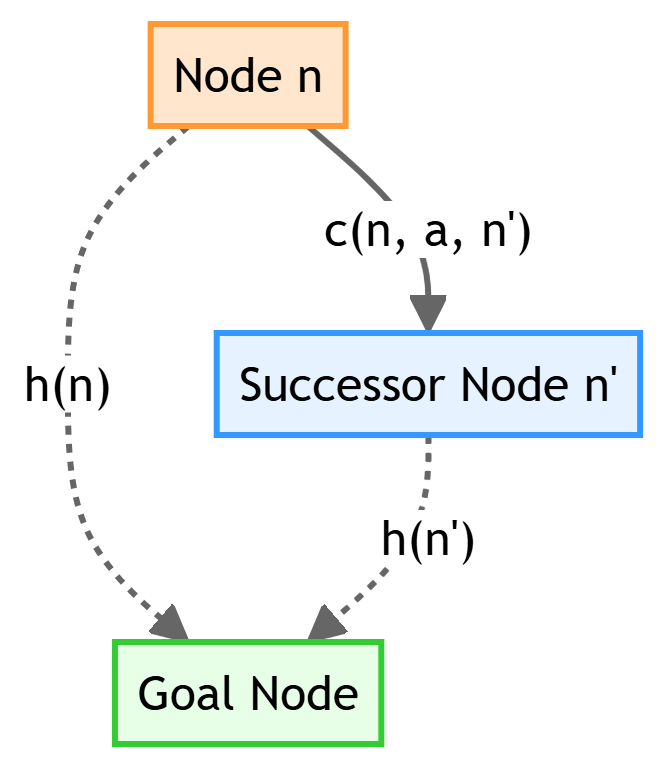
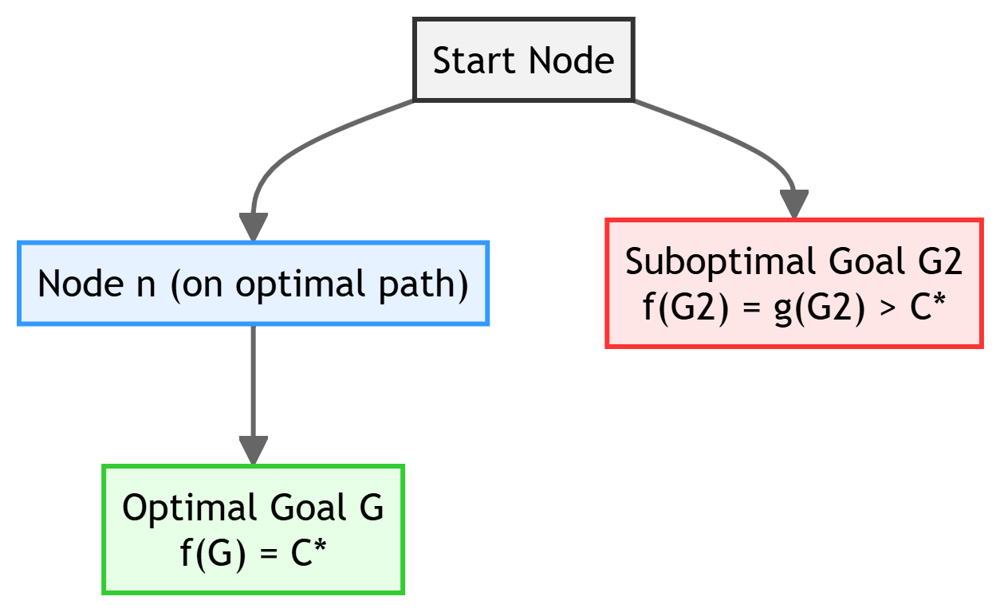
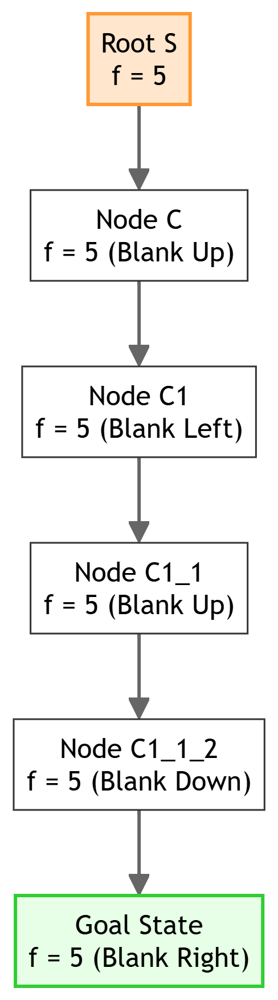
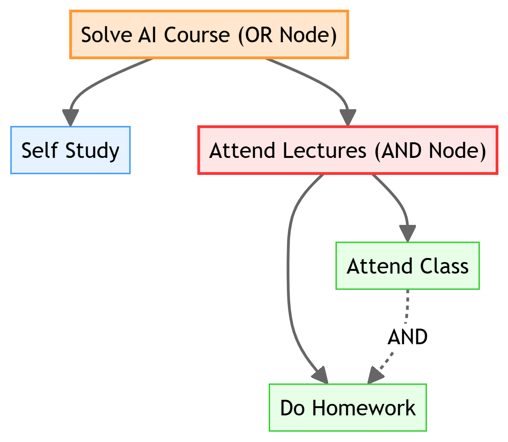

# Chapter 4: Informed Search & Exploration

This chapter compiles high-scoring study notes and complete exam answers for **Unit IV: Informed Search & Exploration** of the OE-EC804A syllabus, adhering strictly to the **MAKAUT Answer Writing Guidelines**.

---

## 📝 Section 1: Greedy Best-First Search vs. A* Search (Q4.1)

### 1. Comparison Table

| Feature / Criteria | Greedy Best-First Search | A* Search |
| :--- | :--- | :--- |
| **Evaluation Function** | $f(n) = h(n)$ (Uses only the heuristic estimate to goal). | $f(n) = g(n) + h(n)$ (Combines cost-so-far and estimated cost-to-goal). |
| **Search Bias** | Highly greedy. Can easily wander down false paths if heuristics are inaccurate. | Balanced. Optimizes both total path cost and remaining distance. |
| **Completeness** | **No** (can get stuck in loops in cyclic graphs). | **Yes** (if branching factor $b$ is finite and step costs $c \ge \epsilon > 0$). |
| **Optimality** | **No** (returns the first path found, which is often suboptimal). | **Yes** (if $h(n)$ is admissible for trees, or consistent for graphs). |
| **Space Complexity** | $O(b^m)$ (Frontier nodes are kept in memory). | $O(b^d)$ (Stores all generated nodes in memory; high memory cost). |

### 2. Conditions for A* Optimality and Completeness
A* Search is guaranteed to be:
1.  **Optimal (Tree Search):** If the heuristic $h(n)$ is **admissible** (never overestimates the true cost to reach the goal).
2.  **Optimal (Graph Search):** If the heuristic $h(n)$ is **consistent (or monotonic)** (satisfies triangle inequality).
3.  **Complete:** If the branching factor $b$ is finite, and all step costs are positive ($c(s, a, s') \ge \epsilon > 0$).

---

## 📝 Section 2: Admissibility and Consistency of Heuristics (Q4.2)

### 1. Admissibility
A heuristic function $h(n)$ is **admissible** if it never overestimates the actual cost to reach the goal state from node $n$. Mathematically:
$$0 \le h(n) \le h^*(n)$$
Where $h^*(n)$ is the true, optimal cost to reach the goal from $n$. (Note: $h(Goal) = 0$).

### 2. Consistency (Monotonicity)
A heuristic $h(n)$ is **consistent** (or monotonic) if, for every node $n$ and every successor $n'$ generated by action $a$, the estimated cost of reaching the goal from $n$ is no greater than the step cost of moving from $n$ to $n'$ plus the estimated cost of reaching the goal from $n'$:
$$h(n) \le c(n, a, n') + h(n')$$
This is equivalent to the **triangle inequality** in geometry.



### 3. Proof: Consistent Heuristic is Admissible
We can prove this by induction on the number of steps $k$ from node $n$ to the goal.
*   **Base Case:** If $k = 0$, $n$ is the goal. $h(Goal) = 0 \le h^*(Goal) = 0$. (True).
*   **Inductive Step:** Suppose $h(n_i) \le h^*(n_i)$ holds for all nodes $n_i$ that are $k$ steps from the goal. Let $n$ be $k+1$ steps from the goal. By consistency:
    $$h(n) \le c(n, a, n') + h(n')$$
    Since $n'$ is $k$ steps from the goal, by inductive hypothesis, $h(n') \le h^*(n')$. Therefore:
    $$h(n) \le c(n, a, n') + h^*(n')$$
    Since $c(n, a, n') + h^*(n')$ is the optimal cost $h^*(n)$ from $n$ via $n'$, we get:
    $$h(n) \le h^*(n)$$
    Thus, any consistent heuristic is admissible. $\blacksquare$

---

## 📝 Section 3: Simulated Annealing Search (Q4.3)

### 1. Working Principle
**Simulated Annealing** is a local search technique based on the metallurgical process of annealing (heating and slowly cooling metal to reduce defects). It avoids getting stuck in local maxima by occasionally accepting "bad" moves (moves that decrease the value of the evaluation function) with a probability that decreases over time.

### 2. Algorithm Steps
1.  Initialize the current state and set the temperature $T$ to a high starting value.
2.  At each step, select a random neighbor of the current state.
3.  Calculate the value difference: $\Delta E = Value(Neighbor) - Value(Current)$.
4.  If $\Delta E > 0$ (the neighbor is better), accept the move immediately.
5.  If $\Delta E \le 0$ (the neighbor is worse), accept the move with probability:
    $$P = e^{\frac{\Delta E}{T}}$$
6.  Decrease the temperature $T$ according to a **cooling schedule**.
7.  Repeat until $T \approx 0$ or a termination condition is met.

### 3. Impact of the Cooling Schedule
*   **If the temperature is lowered slowly enough:** The probability of accepting worse states decreases gradually. The algorithm behaves like a random walk initially (exploring widely) and transitions smoothly into a pure greedy local search (hill-climbing) at the end. This is mathematically guaranteed to converge to the **global optimum** with probability 1.
*   **If the cooling schedule is too fast:** The algorithm freezes too quickly, trapping the system in a **local optimum** (suboptimal state).

---

## 📝 Section 4: Mathematical Proofs in Informed Search (Q4.4)

### 1. Proof: A* Tree Search is Admissible (Optimal)
We prove A* optimality by contradiction.
Let $G_2$ be a suboptimal goal node (i.e., $g(G_2) > C^*$, where $C^*$ is the optimal path cost). Let $G$ be the optimal goal node ($g(G) = C^*$).
Suppose A* terminates by selecting $G_2$ from the priority queue. 



At some point before selecting $G_2$, there must be a node $n$ on the frontier that lies on the optimal path to $G$.
*   Since $h(n)$ is admissible: $h(n) \le h^*(n)$.
*   Therefore:
    $$f(n) = g(n) + h(n) \le g(n) + h^*(n) = f^*(n) = C^*$$
*   Since $G_2$ is a goal node, $h(G_2) = 0$, which gives:
    $$f(G_2) = g(G_2) + h(G_2) = g(G_2) > C^*$$
*   Combining the two inequalities:
    $$f(n) \le C^* < f(G_2)$$
*   Since $f(n) < f(G_2)$, the priority queue would select and expand node $n$ before selecting $G_2$. This contradicts the assumption that $G_2$ was popped first. Thus, A* must select the optimal goal node. $\blacksquare$

---

### 2. Proof: Consistent Heuristic implies Monotonic f-values
Let $n'$ be a successor of node $n$ generated by action $a$.
The $f$-value of $n$ is:
$$f(n) = g(n) + h(n)$$
The $f$-value of $n'$ is:
$$f(n') = g(n') + h(n') = g(n) + c(n, a, n') + h(n')$$
By consistency of the heuristic:
$$h(n) \le c(n, a, n') + h(n')$$
Adding $g(n)$ to both sides:
$$g(n) + h(n) \le g(n) + c(n, a, n') + h(n')$$
Which simplifies directly to:
$$f(n) \le f(n')$$
Thus, the $f$-value of nodes along any path is monotonically non-decreasing when using a consistent heuristic. $\blacksquare$

---

## 📝 Section 5: A* Search Solving the 8-Puzzle (Q4.5)

### 1. Heuristic Selection
We use the **Manhattan Distance** ($h_{MD}$) as our admissible and consistent heuristic. It is the sum of the horizontal and vertical distances of the tiles from their goal positions.
$$h_{MD} = \sum_{i=1}^{8} \left( |x_{current, i} - x_{goal, i}| + |y_{current, i} - y_{goal, i}| \right)$$

### 2. Trace Example: Initial State to Goal State
Let our Initial State and Goal State be:
```text
  Initial State (S)             Goal State (G)
    +---+---+---+             +---+---+---+
    | 2 | 8 | 3 |             | 1 | 2 | 3 |
    +---+---+---+             +---+---+---+
    | 1 | 6 | 4 |    ---->    | 8 |   | 4 |
    +---+---+---+             +---+---+---+
    | 7 |   | 5 |             | 7 | 6 | 5 |
    +---+---+---+             +---+---+---+
```

#### Step-by-Step Search Tree Expansion:

1.  **Root Node (S):** $g(S) = 0$
    *   Manhattan distances:
        *   `1`: $(1,0) \rightarrow (0,0) \Rightarrow \text{dist} = 1$
        *   `2`: $(0,0) \rightarrow (1,0) \Rightarrow \text{dist} = 1$
        *   `3`: $(2,0) \rightarrow (2,0) \Rightarrow \text{dist} = 0$
        *   `4`: $(2,1) \rightarrow (2,1) \Rightarrow \text{dist} = 0$
        *   `5`: $(2,2) \rightarrow (2,2) \Rightarrow \text{dist} = 0$
        *   `6`: $(1,1) \rightarrow (1,2) \Rightarrow \text{dist} = 1$
        *   `7`: $(0,2) \rightarrow (0,2) \Rightarrow \text{dist} = 0$
        *   `8`: $(1,0) \rightarrow (0,1) \Rightarrow \text{dist} = 2$
    *   $h(S) = 1+1+0+0+0+1+0+2 = 5$
    *   $f(S) = 0 + 5 = 5$. Expand $S$ (blank can move Left, Right, or Up).

2.  **Successors of S:**
    *   **Node A (Move Left):** Blank shifts to $(0,2)$ (swaps with `7`).
        *   $g(A) = 1$, $h(A) = 6 \Rightarrow f(A) = 7$.
    *   **Node B (Move Right):** Blank shifts to $(2,2)$ (swaps with `5`).
        *   $g(B) = 1$, $h(B) = 6 \Rightarrow f(B) = 7$.
    *   **Node C (Move Up):** Blank shifts to $(1,1)$ (swaps with `6`).
        *   $g(C) = 1$, $h(C) = 4$ (tiles `6` and `8` move closer) $\Rightarrow f(C) = 1 + 4 = 5$.
    *   *Decision:* Pop and expand **Node C** ($f(C) = 5$).

3.  **Successors of Node C:** (Blank at $(1,1)$ can move Left, Right, Up, or Down).
    *   **Node C1 (Move Left):** Swaps with `1`. $g(C1) = 2$, $h(C1) = 3 \Rightarrow f(C1) = 5$.
    *   **Node C2 (Move Right):** Swaps with `4`. $g(C2) = 2$, $h(C2) = 5 \Rightarrow f(C2) = 7$.
    *   **Node C3 (Move Up):** Swaps with `8`. $g(C3) = 2$, $h(C3) = 3 \Rightarrow f(C3) = 5$.
    *   **Node C4 (Move Down):** Swaps with `6` (reverts to start $S$). $g(C4) = 2$, $h(C4) = 5 \Rightarrow f(C4) = 7$.
    *   *Decision:* Node C1 and Node C3 both have $f = 5$. Let's expand **Node C1**.

4.  **Successors of Node C1:** (Blank at $(0,1)$ can move Up, Down, or Right).
    *   **Node C1_1 (Move Up):** Swaps with `2`.
        *   Board configuration is: `[ , 2, 3] / [1, 8, 4] / [7, 6, 5]`.
        *   $g(C1\_1) = 3$, $h(C1\_1) = 2 \Rightarrow f(C1\_1) = 5$.
    *   *Decision:* Pop and expand **Node C1_1** ($f = 5$).

5.  **Successors of Node C1_1:** (Blank at $(0,0)$ can move Right or Down).
    *   **Node C1_1_1 (Move Right):** Swaps with `2`.
        *   Board is: `[2,  , 3] / [1, 8, 4] / [7, 6, 5]`. (Repeated state, skip).
    *   **Node C1_1_2 (Move Down):** Swaps with `1`.
        *   Board is: `[1, 2, 3] / [ , 8, 4] / [7, 6, 5]`.
        *   $g = 4$, $h = 1$ (only `8` is out of place) $\Rightarrow f = 5$.
    *   *Decision:* Pop and expand **Node C1_1_2** ($f = 5$).

6.  **Successors of Node C1_1_2:** (Blank at $(0,1)$ can move Up, Down, or Right).
    *   **Node C1_1_2_1 (Move Right):** Swaps with `8`.
        *   Board is: `[1, 2, 3] / [8,  , 4] / [7, 6, 5]`.
        *   $g = 5$, $h = 0$ (Goal state reached!) $\Rightarrow f = 5$.



---

## 📝 Section 6: Local Search and Optimization Techniques (Q4.6)

### 1. Hill-Climbing Search

*   **Definition:** A local search algorithm that continually moves in the direction of increasing value (upland) to find the peak. It does not maintain a search tree, only the current state.
*   **Three Major Limitations:**
    1.  **Local Maxima:** A peak that is higher than each of its neighboring states, but lower than the global maximum. The algorithm gets stuck here.
    2.  **Ridges:** A sequence of local maxima forming a ridge. The slope leads up the ridge, but neighbors in any cardinal direction lead down, causing the algorithm to oscillate and stall.
    3.  **Plateaus:** A flat area of the state space where all neighboring states have the same value (flat local maximum or shoulder). The search gets lost in a random walk.
*   **Solutions:**
    *   *Stochastic Hill Climbing:* Chooses randomly from among the uphill moves.
    *   *Random-Restart Hill Climbing:* Conducts a series of searches from randomly generated initial states, saving the best peak found.

---

### 2. Local Beam Search
*   **Working Principle:** Instead of keeping track of one state (like Hill-Climbing), Local Beam Search tracks $k$ states. It begins with $k$ randomly generated states. At each step, all the successors of all $k$ states are generated. If any one is a goal, the algorithm halts. Otherwise, it selects the $k$ best successors from the complete list and repeats.
*   **Difference from Multi-Start Hill-Climbing:** In random-restart hill-climbing, each search runs independently. In local beam search, information is shared among the parallel threads: useful steps are highlighted, and poor performing paths are abandoned in favor of promising ones.

---

### 3. AO* Search (AND-OR Graph Search)

*   **Definition:** AO* is an informed search algorithm used to find solutions in **AND-OR graphs**, which represent problems that can be decomposed into smaller sub-problems.
*   *OR node:* Represents choices (e.g., to solve problem P, solve either P1 or P2).
*   *AND node:* Represents decomposition (e.g., to solve problem P, solve *both* P3 and P4).
*   **Example Scenario:**

To clear the course via lectures, the agent must complete *both* sub-tasks (AND branch). AO* computes the cost using:
$$f(n) = g(n) + \sum h(\text{sub-problems})$$
It updates costs backward from child nodes to parent nodes to find the optimal sub-tree.

---

## 📝 Section 7: Informed Search Properties & Linear Space Search (Q4.7) [5M][★★★★]

Standard heuristic searches (like A* and Greedy Best-First Search) are powerful but suffer from high memory requirements. Understanding their complexity limits and alternative linear-memory algorithms is essential for practical pathfinding.

---

### 1. Heuristic Search Concept & Greedy Expansion
*   **Concept:** Heuristic search uses problem-specific knowledge (beyond the basic problem definition) to guide the search. While uninformed search (BFS/DFS) blindly traverses the tree, informed search uses a **heuristic function $h(n)$** to estimate the cost of the cheapest path from node $n$ to the goal.
*   **Node Expansion Criteria:** **Greedy Best-First Search (GBFS)** expands the node that is estimated to be **closest to the goal** (the node with the lowest $h(n)$ value, setting its evaluation function $f(n) = h(n)$).

### 2. Space Complexity of Greedy Search
*   **Frontier Storage:** Like A*, Greedy Search maintains a frontier (priority queue) of all generated but unexpanded nodes.
*   **Worst-case Complexity:** In the worst case, the algorithm must store all nodes along the paths in memory. This leads to an exponential space complexity of **$O(b^l)$** (or $O(b^m)$), where $b$ is the branching factor and $l$ is the maximum depth of the search space.

### 3. Recursive Best-First Search (RBFS)
**Recursive Best-First Search (RBFS)** is an informed search algorithm that mimics the best-first behavior of A* search but runs in **linear space**.

#### A. Working Principle:
1.  RBFS uses a recursive depth-first execution style.
2.  Instead of keeping all nodes in memory, it only keeps track of the current path and its immediate siblings.
3.  **The $f$-limit:** Each recursive call is passed an **$f$-limit** representing the $f$-value of the best alternative path available from any ancestor of the current node.
4.  **Back-propagation & Backtracking:** 
    *   If the current node's $f$-value exceeds the $f$-limit, the recursion backtracks (unwinds) to explore the alternative path.
    *   *Crucially:* As the recursion unwinds, RBFS replaces the $f$-value of each ancestor node in the path with the **best $f$-value of its children**.
    *   *Memory/Recall Trade-off:* This allows the algorithm to "remember" the quality of the best leaf in the pruned subtree, so it can decide whether to re-explore it later without having to keep the entire subtree structure in RAM.

#### B. Complexity Analysis:
*   **Space Complexity:** **$O(bd)$** (where $b$ is the branching factor and $d$ is the search depth). Since it only keeps the current path and siblings in memory, its space usage is linear, resolving A*'s major memory bottleneck.
*   **Time Complexity:** In the worst case, RBFS can have exponential time complexity ($O(b^d)$) because it is prone to **node regeneration**—it may repeatedly expand and throw away the same subtrees if the $f$-values fluctuate frequently.
*   **Optimality:** RBFS is optimal if the heuristic function $h(n)$ is **admissible**.

