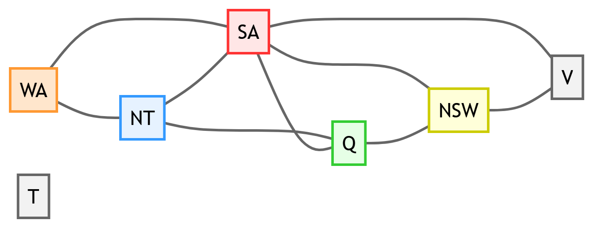

# Chapter 5: Constraint Satisfaction Problems

This chapter compiles high-scoring study notes and complete exam answers for **Unit V: Constraint Satisfaction Problems** of the OE-EC804A syllabus, adhering strictly to the **MAKAUT Answer Writing Guidelines**.

---

## 📝 Section 1: Introduction to Constraint Satisfaction Problems (Q5.1)

### 1. Definition of a CSP
A **Constraint Satisfaction Problem (CSP)** is a mathematical problem defined as a set of objects whose state must satisfy a number of constraints or limitations. Unlike standard search problems where states are "black boxes", CSP states use a structured representation defined by variables and constraints.

A CSP is formally defined by three components:
1.  **Variables ($V$):** A set of variables, $\{V_1, V_2, \dots, V_n\}$.
2.  **Domains ($D$):** A set of domains, $\{D_1, D_2, \dots, D_n\}$, where each domain $D_i$ is a set of allowable values for variable $V_i$.
3.  **Constraints ($C$):** A set of constraints that specify allowable combinations of values. Each constraint consists of a tuple of variables and the relations between them (e.g., $V_1 \ne V_2$).

### 2. Map-Coloring Example
*   **Problem:** Color the map of Australia (with territories: Western Australia $WA$, Northern Territory $NT$, Queensland $Q$, New South Wales $NSW$, Victoria $V$, South Australia $SA$, Tasmania $T$) using three colors (`Red`, `Green`, `Blue`) such that no two adjacent territories share the same color.



*   **Variables ($V$):** $\{WA, NT, Q, NSW, V, SA, T\}$
*   **Domains ($D$):** $D_i = \{\text{Red}, \text{Green}, \text{Blue}\}$ for all variables.
*   **Constraints ($C$):** Adjacent regions must have different colors:
    *   $WA \ne NT$, $WA \ne SA$
    *   $NT \ne SA$, $NT \ne Q$
    *   $SA \ne Q$, $SA \ne NSW$, $SA \ne V$
    *   $Q \ne NSW$
    *   $NSW \ne V$
*   **Solution Example:**
    *   $WA = \text{Red}$, $NT = \text{Green}$, $Q = \text{Red}$, $NSW = \text{Green}$, $V = \text{Red}$, $SA = \text{Blue}$, $T = \text{Red}$.

---

## 📝 Section 2: Solving Cryptarithmetic Problems (Q5.2)

### 1. Problem Formulation
Cryptarithmetic is a constraint satisfaction puzzle where letters in a mathematical sum represent unique digits from $0$ to $9$.
```text
    S E N D
  + M O R E
  ---------
  M O N E Y
```

#### Variables ($V$):
*   Core letter variables: $\{S, E, N, D, M, O, R, Y\}$
*   Auxiliary carry variables: $\{C_1, C_2, C_3, C_4\}$ where $C_i \in \{0, 1\}$ represents the carry from the $i$-th column from right to left.

#### Domains ($D$):
*   For letters $S$ and $M$ (leading digits, cannot be 0): $D_S, D_M = \{1, 2, 3, 4, 5, 6, 7, 8, 9\}$
*   For other letters: $\{0, 1, 2, 3, 4, 5, 6, 7, 8, 9\}$
*   For carries: $\{0, 1\}$

#### Constraints ($C$):
1.  **Global Alldifferent Constraint:** $Alldifferent(S, E, N, D, M, O, R, Y)$ (each letter must be assigned a unique digit).
2.  **Column Addition Constraints:**
    *   *Column 1 (Units):* $D + E = Y + 10 \times C_1$
    *   *Column 2 (Tens):* $C_1 + N + R = E + 10 \times C_2$
    *   *Column 3 (Hundreds):* $C_2 + E + O = N + 10 \times C_3$
    *   *Column 4 (Thousands):* $C_3 + S + M = O + 10 \times C_4$
    *   *Column 5 (Ten-Thousands):* $C_4 = M$

---

### 2. Step-by-Step Deduction Process

1.  **Determine $M$:**
    *   From Column 5: $C_4 = M$.
    *   Since $C_4$ is a carry from Column 4, and the maximum possible sum of two single digits plus a carry is $9 + 9 + 1 = 19$, the carry $C_4$ can only be $1$.
    *   Therefore: **$M = 1$**, and **$C_4 = 1$**.

2.  **Analyze Column 4:**
    *   $C_3 + S + M = O + 10 \times C_4 \Rightarrow C_3 + S + 1 = O + 10$.
    *   Since $S \le 9$ and $C_3 \le 1$, the maximum left-hand side is $1 + 9 + 1 = 11$.
    *   Therefore, $O$ must be $0$ or $1$.
    *   Since $M = 1$ and all letters must be unique, $O$ cannot be $1$.
    *   Therefore: **$O = 0$**.
    *   Substituting $O = 0$: $C_3 + S + 1 = 10 \Rightarrow S = 9 - C_3$.

3.  **Analyze Column 3:**
    *   $C_2 + E + O = N + 10 \times C_3 \Rightarrow C_2 + E + 0 = N + 10 \times C_3 \Rightarrow C_2 + E = N + 10 \times C_3$.
    *   If $C_3 = 1$, then $C_2 + E = N + 10$. For this to hold with $E, N \le 9$, we need $E \ge 9$. But if $E = 9$, then $N$ would equal $C_2 - 1$, which is either $-1$ or $0$. But $O=0$, so $N$ cannot be $0$.
    *   If $E = 8$ and $C_2 = 1$, then $N = 9 - 10 = -1$ (impossible).
    *   Thus, $C_3$ cannot be $1$.
    *   Therefore: **$C_3 = 0$**.
    *   Since $S = 9 - C_3$, we get: **$S = 9$**.
    *   Since $C_3 = 0$, the Column 3 equation becomes: $C_2 + E = N$.
    *   Since $E \ne N$ (alldifferent), the carry $C_2$ must be $1$.
    *   Therefore: **$C_2 = 1$**, which gives: **$N = E + 1$**.

4.  **Analyze Column 2:**
    *   $C_1 + N + R = E + 10 \times C_2 \Rightarrow C_1 + N + R = E + 10$.
    *   Substitute $N = E + 1$ into the equation:
        $$C_1 + (E + 1) + R = E + 10 \Rightarrow C_1 + R + 1 = 10 \Rightarrow R = 9 - C_1 - 1 = 8 - C_1$$
    *   If $C_1 = 0$, then $R = 8$.
    *   If $C_1 = 1$, then $R = 7$.

5.  **Analyze Column 1 & Solve:**
    *   We have remaining unassigned digits: $\{2, 3, 4, 5, 6, 7, 8\}$ (since $0, 1, 9$ are assigned).
    *   Let's test $R = 8$ (implies $C_1 = 0$):
        *   Then $D + E = Y$ (since $C_1 = 0$).
        *   We need $D + E \le 8$ (so no carry is generated).
        *   Since $N = E + 1$, if $E = 5$, then $N = 6$ (valid). If $E = 6$, $N = 7$.
        *   Let's test $E = 5$:
            *   Then $N = 6$.
            *   Remaining digits: $\{2, 3, 4, 7\}$. (Since $R = 8$, $E = 5$, $N = 6$, $M = 1$, $O = 0$, $S = 9$).
            *   From Column 1: $D + E = Y \Rightarrow D + 5 = Y$.
            *   If we choose $D = 7$ from the remaining digits, $7 + 5 = 12 \Rightarrow Y = 2$, and carry $C_1 = 1$.
            *   But we assumed $C_1 = 0$ (so $R = 8$), which is a contradiction ($C_1$ cannot be both 0 and 1).
    *   Therefore, $C_1$ must be $1$, which gives: **$R = 7$** and **$C_1 = 1$**.
    *   Substitute $C_1 = 1$:
        *   From Column 1: $D + E = Y + 10$.
        *   Remaining digits: $\{2, 3, 4, 5, 6, 8\}$ (since $0, 1, 7, 9$ are assigned).
        *   Since $N = E + 1$, and $R=7$ is assigned:
            *   If $E = 5$, then $N = 6$. (Available digits left: $\{2, 3, 4, 8\}$).
            *   Then $D + 5 = Y + 10 \Rightarrow D - 5 = Y$.
            *   From available digits $\{2, 3, 4, 8\}$, if we choose $D = 8$, then $Y = 8 - 5 = 3$ (which is available).
            *   This satisfies all alldifferent constraints!

### 3. Final Solution Values
*   **$S = 9$**
*   **$E = 5$**
*   **$N = 6$**
*   **$D = 8$**
*   **$M = 1$**
*   **$O = 0$**
*   **$R = 7$**
*   **$Y = 3$**

#### Check:
```text
     9 5 6 8
   + 1 0 8 5
   ---------
    1 0 6 5 3   (Correct: 9568 + 1085 = 10653)
```

---

## 📝 Section 3: Flexible CSPs, Solvers, and Constraint Programming (Q5.3) [5M][★★★★]

Standard Constraint Satisfaction Problems treat constraints as "hard"—either they are satisfied or the assignment is invalid. However, real-world scheduling or configuration problems are often overconstrained, requiring alternative formulation and programming models.

---

### 1. Flexible CSPs
*   **Definition:** A **Flexible CSP** (also known as a soft CSP or hierarchical CSP) is a formulation where some constraints are treated as soft preferences rather than hard rules.
*   **Constraint Relaxation:** If a problem has no solution that satisfies all conditions, a Flexible CSP **relaxes constraints** to find an acceptable solution.
*   **How it Works:** 
    *   Hard constraints must be satisfied.
    *   Soft constraints are assigned a preference value, weight, or cost. The goal is to find a variable assignment that maximizes total utility or minimizes the cost/penalty of violated soft constraints.

### 2. Backtracking Search for Finite Domain CSPs
*   **Solving Strategy:** Constraint satisfaction problems on finite domains are typically solved using a form of **Backtracking Search**.
*   **Working Principle:** Backtracking search is an uninformed depth-first search (DFS) dedicated to CSPs:
    1.  **Sequential Assignment:** It assigns a value to one variable at a time.
    2.  **Constraint Checking:** Before proceeding to the next variable, it checks whether the current assignment violates any constraints.
    3.  **Backtrack Step:** If a conflict is detected, it immediately backtracks to the previously assigned variable and tries a different value in its domain.
*   **Underlying Mechanics:** Because backtracking search must unwind its decisions in reverse chronological order, it is fundamentally based on a **Last-In, First-Out (LIFO)** data structure (stack) and implemented via **Recursion**.

### 3. Languages for Constraint Programming
*   **Standard Language:** **Prolog** (Programming in Logic) is the primary logic programming language used for programming Constraint Programming.
*   **Why Prolog?** 
    *   Prolog has built-in support for backtracking, logic variables, and unification.
    *   It features libraries like **CLP(FD)** (Constraint Logic Programming over Finite Domains) which allow developers to declare variables, domain bounds, and constraints mathematically. The language's internal execution engine automatically solves the CSP without the developer writing the search loop manually.
    *   General-purpose languages (like C, Fortran, or C#) require custom search libraries or engines to achieve the same declarative logic.

