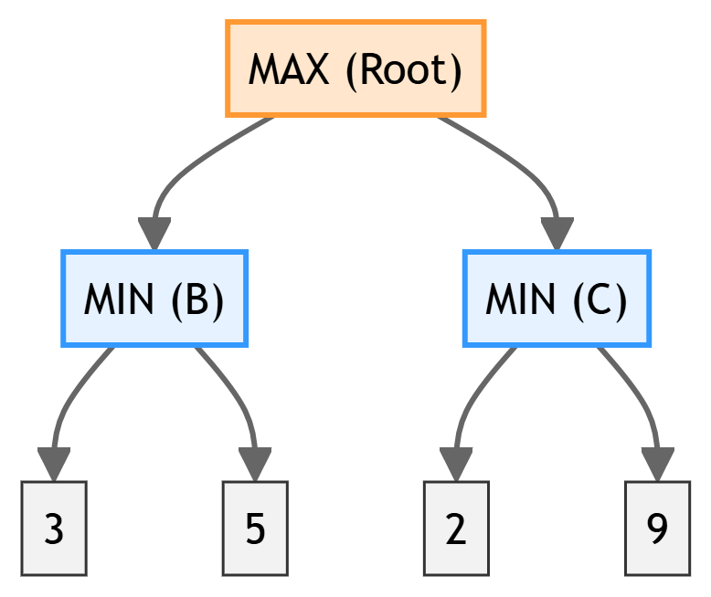
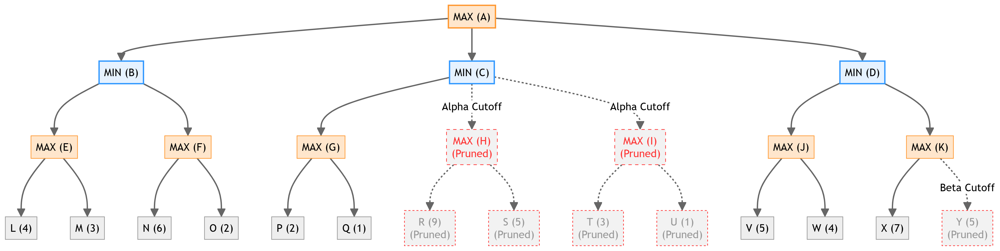

# Chapter 6: Adversarial Search

This chapter compiles high-scoring study notes and complete exam answers for **Unit VI: Adversarial Search** of the OE-EC804A syllabus, adhering strictly to the **MAKAUT Answer Writing Guidelines**.

---

## 📝 Section 1: Minimax Game-Playing Procedure (Q6.1)

### 1. Definition and Working Principle
**Minimax** is a recursive decision-making algorithm used in two-player, zero-sum, perfect-information games (e.g., Chess, Tic-Tac-Toe). 
*   **Zero-sum:** The utility gained by one player is exactly equal to the utility lost by the opponent.
*   **Two Players:**
    *   **MAX:** Tries to maximize the final utility score.
    *   **MIN:** Tries to minimize MAX's final utility score (maximizing their own advantage).

The algorithm performs a depth-first search of the game tree. It computes the utility values of leaf nodes and propagates them upward:
*   At a **MAX node**, the value is the *maximum* of the children's values.
*   At a **MIN node**, the value is the *minimum* of the children's values.

### 2. Time and Space Complexity
*   **Time Complexity:** $O(b^d)$, where $b$ is the branching factor (legal moves) and $d$ is the maximum depth of the game tree.
*   **Space Complexity:** $O(bd)$ (Linear space, similar to DFS, storing the active path from root to leaf).

---

## 📝 Section 2: Alpha-Beta Pruning (Q6.2)

### 1. Working Principle
**Alpha-Beta Pruning** is an optimization technique for the minimax algorithm that cuts off branches that cannot possibly influence the final decision. It maintains two values throughout the search:
*   **Alpha ($\alpha$):** The value of the best (highest-value) choice found so far at any choice point along the path for MAX. Initialized to $-\infty$.
*   **Beta ($\beta$):** The value of the best (lowest-value) choice found so far at any choice point along the path for MIN. Initialized to $+\infty$.

#### The Pruning Rule:
During search, if a node's beta value is less than or equal to its alpha value ($\beta \le \alpha$), the remaining children of that node do not need to be evaluated (they are pruned).

*   **Alpha-Cutoff ($\alpha$-cutoff):** Occurs at a MIN node when it discovers a value less than or equal to the alpha value of a parent MAX node.
*   **Beta-Cutoff ($\beta$-cutoff):** Occurs at a MAX node when it discovers a value greater than or equal to the beta value of a parent MIN node.

---

### 2. Trace Example: 3-Level Branching Game Tree

Let's execute Minimax and Alpha-Beta Pruning on the game tree shown in Figure 1, where **MAX** is at the root node (A), **MIN** is at level 1 (B, C, D), and MAX is at level 2 (E to K).

#### Step-by-Step Pruning and Minimax Trace:

##### **Branch B (Left Side of Root):**
1.  **Analyze Node E:**
    *   Children: L ($4$) and M ($3$).
    *   Since E is a MAX node, $Value(E) = \max(4, 3) = 4$.
    *   Propagate to B: Since B is a MIN node, B's current beta ($\beta_B$) becomes $\min(+\infty, 4) = 4$.
2.  **Analyze Node F:**
    *   Children: N ($6$) and O ($2$).
    *   Since F is a MAX node, $Value(F) = \max(6, 2) = 6$.
    *   Propagate to B: $\beta_B = \min(4, 6) = 4$.
3.  **Evaluate Node B:**
    *   Since E ($4$) and F ($6$) are evaluated, $Value(B) = \min(4, 6) = 4$.
    *   Propagate to Root A: Since A is a MAX node, A's alpha ($\alpha_A$) becomes $\max(-\infty, 4) = 4$.

---

##### **Branch C (Middle of Root):**
We search with $\alpha = 4$ and $\beta = +\infty$.
1.  **Analyze Node G:**
    *   Children: P ($2$) and Q ($1$).
    *   Since G is a MAX node, $Value(G) = \max(2, 1) = 2$.
    *   Propagate to C (MIN node): $\beta_C$ becomes $\min(+\infty, 2) = 2$.
    *   **Check Pruning Condition at C:**
        *   We have $\alpha_C = 4$ (passed down from A) and $\beta_C = 2$.
        *   Since $\beta_C \le \alpha_C$ ($2 \le 4$), an **Alpha-Cutoff** occurs at MIN node C!
        *   The remaining children of C (nodes **H** and **I**) are **pruned**.
        *   Thus, we do not examine leaves **R ($9$), S ($5$), T ($3$), U ($1$)**.
        *   $Value(C) = 2$.

---

##### **Branch D (Right Side of Root):**
We search with $\alpha = 4$ and $\beta = +\infty$.
1.  **Analyze Node J:**
    *   Children: V ($5$) and W ($4$).
    *   Since J is a MAX node, $Value(J) = \max(5, 4) = 5$.
    *   Propagate to D (MIN node): $\beta_D$ becomes $\min(+\infty, 5) = 5$.
    *   At this point, $\alpha_D = 4$ and $\beta_D = 5$. (No pruning yet).
2.  **Analyze Node K:**
    *   Children: X ($7$).
    *   **Check Pruning Condition at K:**
        *   K is a MAX node, currently evaluating child X ($7$).
        *   $Value(K) \ge 7$.
        *   Since D is a MIN node above K, D's beta $\beta_D = 5$.
        *   If K's value is $\ge 7$, D (MIN) will definitely choose J ($5$) over K ($\ge 7$).
        *   Therefore, since $Value(K) \ge 7 > \beta_D$ ($7 \ge 5$), a **Beta-Cutoff** occurs at MAX node K!
        *   The remaining child of K (node **Y ($5$)**) is **pruned**.
3.  **Evaluate Node D:**
    *   $Value(D) = \min(Value(J), Value(K)) = \min(5, 7) = 5$.

---

##### **Evaluate Root A:**
*   $Value(A) = \max(Value(B), Value(C), Value(D)) = \max(4, 2, 5) = 5$.
*   **Optimal Move for Maximizer:** Choose move to **Node D**.

#### Final Audit Summary:
*   **Minimax values of intermediate nodes:**
    *   $E = 4$, $F = 6$, $G = 2$, $J = 5$, $K = 7$.
    *   $B = 4$, $C = 2$, $D = 5$, $A = 5$.
*   **Pruned Branches:**
    *   Nodes **H** and **I** (and their children R, S, T, U) via **Alpha-Cutoff** at node C.
    *   Leaf **Y** via **Beta-Cutoff** at node K.
*   **Number of terminal leaves examined:** $9$ out of $14$ leaves (L, M, N, O, P, Q, V, W, X).
