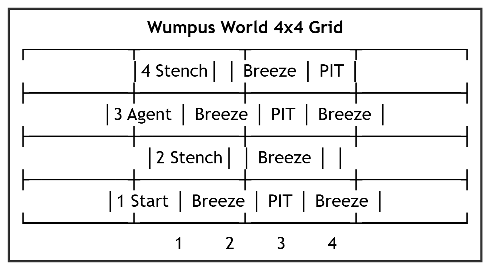

# Chapter 7: Logical Agents

This chapter compiles high-scoring study notes and complete exam answers for **Unit VII: Logical Agents** of the OE-EC804A syllabus, adhering strictly to the **MAKAUT Answer Writing Guidelines**.

---

## 📝 Section 1: Propositional Logic Definitions and Tautology Proof (Q7.1)

### 1. Key Definitions in Propositional Logic

*   **Tautology:** A logical sentence that is true under every possible truth assignment of its variables. It represents a statement that is logically, necessarily true (e.g., $P \lor \neg P$).
*   **Contradiction (Unsatisfiable):** A logical sentence that is false under every possible truth assignment of its variables. It represents a statement that is logically impossible (e.g., $P \land \neg P$).
*   **Contingency:** A logical sentence that can be either true or false depending on the truth values assigned to its variables. Most everyday propositions are contingencies (e.g., $P \land Q$).

---

### 2. Proof: $(((P \rightarrow Q) \rightarrow P) \rightarrow P)$ is a Tautology
This formula is known as **Peirce's Law**. We construct a truth table to evaluate its truth value across all possible combinations of $P$ and $Q$.

| Row | $P$ | $Q$ | $P \rightarrow Q$ | $(P \rightarrow Q) \rightarrow P$ | $((P \rightarrow Q) \rightarrow P) \rightarrow P$ |
| :--- | :---: | :---: | :---: | :---: | :---: |
| **1** | T | T | T | T | **T** |
| **2** | T | F | F | T | **T** |
| **3** | F | T | T | F | **T** |
| **4** | F | F | T | F | **T** |

#### Explanation of Steps:
*   *Column 4 ($P \rightarrow Q$):* False only when $P$ is True and $Q$ is False (Row 2).
*   *Column 5 ($(P \rightarrow Q) \rightarrow P$):* Implication is false only if the premise ($(P \rightarrow Q)$) is True and the conclusion ($P$) is False. This happens in Row 3 (T $\rightarrow$ F) and Row 4 (T $\rightarrow$ F).
*   *Column 6 ($((P \rightarrow Q) \rightarrow P) \rightarrow P$):* Implication is false only if Column 5 is True and $P$ is False. Let's verify:
    *   Row 1: T $\rightarrow$ T $\Rightarrow$ True.
    *   Row 2: T $\rightarrow$ T $\Rightarrow$ True.
    *   Row 3: F $\rightarrow$ F $\Rightarrow$ True.
    *   Row 4: F $\rightarrow$ F $\Rightarrow$ True.

**Conclusion:** Since the final column is True in all possible rows, the sentence $(((P \rightarrow Q) \rightarrow P) \rightarrow P)$ is proved to be a **Tautology**. $\blacksquare$

---

## 📝 Section 2: Logical Inference Rules (Q7.2)

Inference rules are patterns of logical deduction that derive a conclusion from premises.

### 1. Modus Ponens
*   **Syntax:**
    $$\frac{P, \quad P \rightarrow Q}{Q}$$
*   **Description:** If both $P$ and "If $P$ then $Q$" are true, then $Q$ must be true.
*   **Truth Table Validation:**
    *   We show that the sentence $((P \land (P \rightarrow Q)) \rightarrow Q)$ is a Tautology.

| $P$ | $Q$ | $P \rightarrow Q$ | $P \land (P \rightarrow Q)$ | $(P \land (P \rightarrow Q)) \rightarrow Q$ |
| :---: | :---: | :---: | :---: | :---: |
| T | T | T | T | **T** |
| T | F | F | F | **T** |
| F | T | T | F | **T** |
| F | F | T | F | **T** |

---

### 2. Modus Tollens
*   **Syntax:**
    $$\frac{\neg Q, \quad P \rightarrow Q}{\neg P}$$
*   **Description:** If $P$ implies $Q$, and $Q$ is false, then $P$ must be false.
*   **Truth Table Validation:**
    *   We show that the sentence $((\neg Q \land (P \rightarrow Q)) \rightarrow \neg P)$ is a Tautology.

| $P$ | $Q$ | $\neg P$ | $\neg Q$ | $P \rightarrow Q$ | $\neg Q \land (P \rightarrow Q)$ | $(\neg Q \land (P \rightarrow Q)) \rightarrow \neg P$ |
| :---: | :---: | :---: | :---: | :---: | :---: | :---: |
| T | T | F | F | T | F | **T** |
| T | F | F | T | F | F | **T** |
| F | T | T | F | T | F | **T** |
| F | F | T | T | T | T | **T** |

---

### 3. Resolution Rule
*   **Syntax:**
    $$\frac{P \lor Q, \quad \neg P \lor R}{Q \lor R}$$
*   **Description:** If we know that $P$ or $Q$ is true, and we also know that either $\neg P$ or $R$ is true, then we can resolve the conflict to conclude that $Q$ or $R$ must be true.
*   **Unit Resolution (Special Case where $R$ is empty):**
    $$\frac{P \lor Q, \quad \neg P}{Q}$$

---

## 📝 Section 3: Knowledge-Based Agents and Wumpus World (Q7.3)

### 1. Knowledge-Based Agents
A **Knowledge-Based Agent** is an agent whose internal state is defined by a **Knowledge Base (KB)** -- a set of representations of facts (sentences) about the world expressed in a formal logic language.

The agent interacts with its KB using two main functions:
*   **`TELL`:** Adds a new sentence (percept information or inferred fact) to the knowledge base.
*   **`ASK`:** Queries the knowledge base to determine what action should be taken next.

#### The KB-Agent Working Loop:
```text
function KB-AGENT(percept) returns an action
  persistent: KB, a knowledge base
              t, a counter, initially 0

  TELL(KB, MAKE-PERCEPT-SENTENCE(percept, t))
  action <- ASK(KB, MAKE-ACTION-QUERY(t))
  TELL(KB, MAKE-ACTION-SENTENCE(action, t))
  t <- t + 1
  return action
```

---

### 2. The Wumpus World Environment
The **Wumpus World** is a grid environment used to demonstrate logical reasoning. An agent must navigate the grid to find a heap of gold and return safely without falling into a pit or being eaten by the beast (the Wumpus).



#### PEAS Description of Wumpus World:
*   **P (Performance):** $+1000$ for climbing out of the cave with gold; $-1000$ for falling into a pit or being eaten; $-1$ for each action taken; $-10$ for using the arrow.
*   **E (Environment):** $4 \times 4$ grid of rooms. Pits are placed randomly (each cell has $0.2$ probability of containing a pit). The Wumpus is in a single random cell. Gold is in a single random cell.
*   **A (Actuators):** Turn Left, Turn Right, Forward, Grab (gold), Shoot (arrow), Climb (out).
*   **S (Sensors):**
    *   *Stench:* Felt in cells adjacent to the Wumpus.
    *   *Breeze:* Felt in cells adjacent to pits.
    *   *Glitter:* Felt in the cell containing the gold.
    *   *Bump:* Felt when walking into a wall.
    *   *Scream:* Heard anywhere in the cave when the Wumpus is killed.

---

### 3. Step-by-Step Safe Logic Reasoning Example
Let the agent start at cell $(1,1)$. Let's trace how the agent reasons using logic rules to move safely:

1.  **Initial Percept at $(1,1)$:** `[None, None, None, None, None]` (No Stench, No Breeze).
    *   *Logical Rule:* If there is no Breeze at $(1,1)$, then there is no pit in $(1,2)$ and $(2,1)$.
    *   *Logical Rule:* If there is no Stench at $(1,1)$, then the Wumpus is not in $(1,2)$ or $(2,1)$.
    *   *Deduction:* Cells **$(1,2)$** and **$(2,1)$** are safe.
2.  **Move to $(2,1)$:**
    *   *Percept at $(2,1)$:* `[None, Breeze, None, None, None]` (Breeze detected).
    *   *Logical Rule:* A Breeze at $(2,1)$ implies a pit exists in one of the adjacent cells: $(1,1)$, $(2,2)$, or $(3,1)$.
    *   *Deduction:* Since $(1,1)$ is the start and is safe, the pit is either in $(2,2)$ or $(3,1)$. The agent cannot determine which one is the pit yet, so it backtracks.
3.  **Return to $(1,1)$ and move to $(1,2)$:**
    *   *Percept at $(1,2)$:* `[Stench, None, None, None, None]` (Stench detected, No Breeze).
    *   *Logical Rule:* Since there is no Breeze at $(1,2)$, adjacent cells $(1,3)$ and $(2,2)$ have no pits.
    *   *Deduction:*
        *   Since $(2,2)$ has no pit, the pit detected from $(2,1)$ must be in **$(3,1)$**.
        *   A Stench at $(1,2)$ implies the Wumpus is in $(1,1)$, $(1,3)$, or $(2,2)$.
        *   Since $(1,1)$ is safe, and $(2,2)$ has no Stench (verified earlier from $1,1$), the Wumpus must be in **$(1,3)$**.
    *   *Resulting Safe Plan:* Cell **$(2,2)$** is free of both pits and Wumpus, and is safe to enter next.
