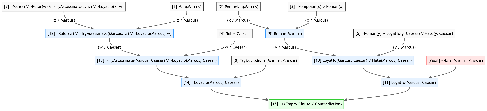
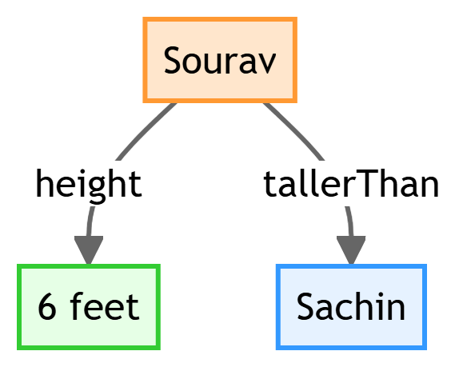

# Chapter 8: First-Order Logic & Knowledge Representation

This chapter compiles high-scoring study notes and complete exam answers for **Unit VIII: First-Order Logic & Knowledge Representation** of the OE-EC804A syllabus, adhering strictly to the **MAKAUT Answer Writing Guidelines**.

---

## 📝 Section 1: Declarative vs. Procedural Knowledge and Production Systems (Q8.1)

### 1. Comparison of Knowledge Types

| Feature | Declarative Knowledge | Procedural Knowledge |
| :--- | :--- | :--- |
| **Definition** | Knowledge that represents static facts, assertions, and concepts about the world. | Knowledge that represents the steps, rules, and procedures to perform a task. |
| **Nature** | **"Knowing what"** (Passive, descriptive facts). | **"Knowing how"** (Active, procedural steps). |
| **Representation** | First-Order Logic, semantic networks, database schemas, frames. | Rules, algorithms, subroutines, step-by-step procedures. |
| **Modifiability** | Very easy to add, delete, or update facts independently. | Hard to modify; changes in one step can break subsequent steps. |
| **Execution** | Needs an external interpreter or inference engine to process. | Executable directly by the processor/system. |

### 2. Production Systems in Knowledge Representation
A **Production System** is a modular cognitive model of problem-solving consisting of three main components:
1.  **Production Rules (Rule Base):** A set of IF-THEN rules of the form:
    $$\text{IF } \langle\text{Condition/Pattern}\rangle \longrightarrow \text{THEN } \langle\text{Action}\rangle$$
2.  **Working Memory (Database):** Holds the current facts and assertions representing the system's current state.
3.  **Recognize-Act Cycle (Inference Engine):**
    *   *Match:* Compares working memory facts against the IF conditions of production rules.
    *   *Conflict Resolution:* If multiple rules match, a conflict resolution strategy (e.g., recency, specificity, rule priority) selects one rule.
    *   *Act:* Executes the action part of the selected rule, updating the working memory.

---

## 📝 Section 2: Horn Clauses and Skolemisation (Q8.2)

### 1. Horn Clause
A **Horn Clause** is a disjunction of literals (clause) containing **at most one positive (unnegated) literal**. It is the foundation of logic programming (like PROLOG).

There are three types of Horn clauses:
1.  **Definite Clause:** Exactly one positive literal (e.g., $\neg p \lor \neg q \lor r$, which is equivalent to $(p \land q) \rightarrow r$).
2.  **Fact:** A single positive literal with no negative literals (e.g., $p$).
3.  **Goal Clause:** No positive literals (e.g., $\neg p \lor \neg q$, equivalent to $\neg(p \land q)$).

#### Proof: $p \rightarrow q$ is a Horn Clause
By logical equivalence, the implication $p \rightarrow q$ can be written as:
$$\neg p \lor q$$
This is a disjunction of literals containing exactly one positive literal ($q$) and one negative literal ($\neg p$). By definition, since it contains at most one positive literal, $p \rightarrow q$ is a **Horn Clause** (specifically, a definite clause). $\blacksquare$

---

### 2. Skolemisation
**Skolemisation** is the process of eliminating existential quantifiers ($\exists$) in a First-Order Logic formula, replacing them with concrete terms (constants or functions) without changing the satisfiability of the formula.

#### Rules for Skolemisation:
1.  **If the existential quantifier is NOT within the scope of any universal quantifier ($\forall$):** Replace the variable with a new, unique constant (a **Skolem Constant**).
    *   *Example:* $\exists x P(x) \Longrightarrow P(A)$ (where $A$ is a new constant).
2.  **If the existential quantifier lies within the scope of one or more universal quantifiers ($\forall$):** Replace the existential variable with a new function (a **Skolem Function**) whose arguments are the universally quantified variables.
    *   *Example:* $\forall x \exists y Loves(x, y) \Longrightarrow \forall x Loves(x, F(x))$ (where $F(x)$ is a new function mapping each $x$ to its corresponding $y$).

---

## 📝 Section 3: PROLOG Programming (Q8.3)

### 1. Recursive Factorial Program
```prolog
% Base Case: Factorial of 0 is 1.
factorial(0, 1).

% Recursive Case: Factorial of N (N > 0) is F.
factorial(N, F) :-
    N > 0,
    N1 is N - 1,
    factorial(N1, F1),
    F is N * F1.
```

### 2. Recursive Greatest Common Divisor (GCD) Program
```prolog
% Base Case: GCD of X and 0 is X.
gcd(X, 0, X) :- !.

% Recursive Case: GCD(X, Y) using Euclidean algorithm (modulo operator).
gcd(X, Y, G) :-
    Y > 0,
    R is X mod Y,
    gcd(Y, R, G).
```

---

## 📝 Section 4: Clausal Form (CNF) and Resolution Refutation Proofs (Q8.4)

### 1. Step-by-Step Procedure to Convert to CNF
1.  **Eliminate Implications & Biconditionals:** Replace $A \Rightarrow B$ with $\neg A \lor B$.
2.  **Move Negations Inward:** Apply De Morgan's laws and double-negation rules (e.g., $\neg(A \land B) \equiv \neg A \lor \neg B$, $\neg \forall x P(x) \equiv \exists x \neg P(x)$).
3.  **Standardize Variables:** Rename variables so that each quantifier binds a unique variable name.
4.  **Skolemise:** Eliminate existential quantifiers ($\exists$) using Skolem constants/functions.
5.  **Drop Universal Quantifiers ($\forall$):** Since all remaining variables are universally quantified, we can drop the quantifiers.
6.  **Distribute $\lor$ over $\land$:** Structure into Conjunctive Normal Form (CNF) (e.g., $(A \lor B) \land (C \lor D)$).
7.  **Isolate Clauses:** Write each conjunct as a separate clause.

---

### 2. CNF Conversion Example
Convert the following to CNF:
$$(\forall x)(P(x) \Rightarrow ((\forall y)(P(y) \Rightarrow P(f(x, y))) \land \neg (\forall y)(Q(x, y) \Rightarrow P(y))))$$

*   **Step 1: Eliminate implications**
    $$(\forall x)(\neg P(x) \lor ((\forall y)(\neg P(y) \lor P(f(x, y))) \land \neg (\forall y)(\neg Q(x, y) \lor P(y))))$$
*   **Step 2: Move negations inward**
    *   Focus on $\neg (\forall y)(\neg Q(x, y) \lor P(y))$:
        $$\neg (\forall y)(\dots) \Longrightarrow \exists y \neg(\neg Q(x, y) \lor P(y)) \Longrightarrow \exists y (Q(x, y) \land \neg P(y))$$
    *   Reassemble:
        $$(\forall x)(\neg P(x) \lor ((\forall y)(\neg P(y) \lor P(f(x, y))) \land \exists y (Q(x, y) \land \neg P(y))))$$
*   **Step 3: Standardize variables**
    Rename the second $y$ to $z$ to prevent overlap:
    $$(\forall x)(\neg P(x) \lor ((\forall y)(\neg P(y) \lor P(f(x, y))) \land \exists z (Q(x, z) \land \neg P(z))))$$
*   **Step 4: Skolemise**
    The existential variable $z$ is within the scope of universal quantifier $x$. Replace $z$ with Skolem function $h(x)$:
    $$(\forall x)(\neg P(x) \lor ((\forall y)(\neg P(y) \lor P(f(x, y))) \land (Q(x, h(x)) \land \neg P(h(x)))))$$
*   **Step 5: Drop universal quantifiers**
    $$\neg P(x) \lor ((\neg P(y) \lor P(f(x, y))) \land Q(x, h(x)) \land \neg P(h(x)))$$
*   **Step 6: Distribute $\lor$ over $\land$**
    Apply distributive law: $A \lor (B \land C \land D) \equiv (A \lor B) \land (A \lor C) \land (A \lor D)$.
    *   **Clause 1:** $\neg P(x) \lor \neg P(y) \lor P(f(x, y))$
    *   **Clause 2:** $\neg P(x) \lor Q(x, h(x))$
    *   **Clause 3:** $\neg P(x) \lor \neg P(h(x))$

---

### 3. Resolution Refutation Proof Case Study
*   *Statements:* "Everyone who enters in a theatre has bought a ticket. Person who does not have money can't buy a ticket. Vinod enters a theatre."
*   *Goal:* Prove that "Vinod has money" ($HasMoney(Vinod)$).

#### FOPL Representation:
1.  "Everyone who enters in a theatre has bought a ticket":
    $$\forall x (Enters(x) \rightarrow BoughtTicket(x)) \Longrightarrow \neg Enters(x) \lor BoughtTicket(x)$$
2.  "Person who does not have money can't buy a ticket":
    $$\forall y (\neg HasMoney(y) \rightarrow \neg BoughtTicket(y)) \Longrightarrow \text{Implication: } BoughtTicket(y) \rightarrow HasMoney(y) \Longrightarrow \neg BoughtTicket(y) \lor HasMoney(y)$$
3.  "Vinod enters a theatre":
    $$Enters(Vinod)$$
4.  **Negated Goal:**
    $$\neg HasMoney(Vinod)$$

#### Resolution Proof:
*   *Step 1:* Resolve Clause 1 ($\neg Enters(x) \lor BoughtTicket(x)$) and Clause 3 ($Enters(Vinod)$) using substitution $\{x/Vinod\}$:
    *   **Inferred Clause 5:** $BoughtTicket(Vinod)$
*   *Step 2:* Resolve Clause 2 ($\neg BoughtTicket(y) \lor HasMoney(y)$) and Clause 5 ($BoughtTicket(Vinod)$) using substitution $\{y/Vinod\}$:
    *   **Inferred Clause 6:** $HasMoney(Vinod)$
*   *Step 3:* Resolve Clause 6 ($HasMoney(Vinod)$) and Negated Goal ($\neg HasMoney(Vinod)$):
    *   **Inferred Clause 7:** $\Box$ (Empty clause / Contradiction).
*   **Conclusion:** Since the empty clause is derived, the negated goal is false. Thus, **Vinod has money**. $\blacksquare$

---

## 📝 Section 5: Predicate Logic Case Study -- Marcus Hated Caesar (Q8.5)

### 1. FOPL Representation
1.  *Marcus was a man:* $Man(Marcus)$
2.  *Marcus was Pompeian:* $Pompeian(Marcus)$
3.  *All Pompeians were Romans:* $\forall x (Pompeian(x) \rightarrow Roman(x)) \Longrightarrow \neg Pompeian(x) \lor Roman(x)$
4.  *Caesar was a ruler:* $Ruler(Caesar)$
5.  *All Romans were either loyal to Caesar or hated him:*
    $$\forall x (Roman(x) \rightarrow LoyalTo(x, Caesar) \lor Hate(x, Caesar)) \Longrightarrow \neg Roman(x) \lor LoyalTo(x, Caesar) \lor Hate(x, Caesar)$$
6.  *Everyone is loyal to someone:* $\forall x \exists y LoyalTo(x, y) \Longrightarrow \forall x LoyalTo(x, f(x))$ (where $f(x)$ is a Skolem function).
7.  *People only try to assassinate rulers they are not loyal to:*
    $$\forall x \forall y (Man(x) \land Ruler(y) \land TryAssassinate(x, y) \rightarrow \neg LoyalTo(x, y))$$
    $$\Longrightarrow \neg Man(x) \lor \neg Ruler(y) \lor \neg TryAssassinate(x, y) \lor \neg LoyalTo(x, y)$$
8.  *Marcus tried to assassinate Caesar:* $TryAssassinate(Marcus, Caesar)$

---

### 2. Resolution Refutation Proof
*   **Negated Goal:** $\neg Hate(Marcus, Caesar)$



**Conclusion:** The contradiction proves that the negated goal is false. Therefore, **Marcus hated Caesar**. $\blacksquare$

---

## 📝 Section 6: Knowledge Representation Techniques (Q8.6)

### 1. Semantic Networks
*   **Definition:** A graphical representation of knowledge consisting of nodes (objects/concepts) and directed, labeled edges (relations).
*   *Sourav is 6 feet tall and is taller than Sachin:*



---

### 2. Frames
*   **Definition:** A collection of attributes (called **slots**) and associated values (called **fillers**) that describe an entity. Support class-inheritance.
*   **Example Frame:**
```text
  Frame: Patient
    isa: Person
    Age: default_value (30)
    Doctor: default_value (Dr. Smith)
    
  Frame: John
    isa: Patient
    Age: 45                 (Inherits Doctor as Dr. Smith; overrides Age to 45)
```

---

### 3. Fuzzy Logic
*   **Definition:** A form of many-valued logic where truth values are real numbers between $0$ (completely false) and $1$ (completely true), representing degrees of membership in a set.
*   **Fuzzy Set Operations:**
    *   **Union ($\cup$):** $\mu_{A \cup B}(x) = \max(\mu_A(x), \mu_B(x))$
    *   **Intersection ($\cap$):** $\mu_{A \cap B}(x) = \min(\mu_A(x), \mu_B(x))$
    *   **Complement ($\bar{A}$):** $\mu_{\bar{A}}(x) = 1 - \mu_A(x)$
*   **Crisp vs. Fuzzy Set Difference:** A crisp set has binary membership ($\mu(x) \in \{0, 1\}$; an element is either in the set or not), while a fuzzy set allows continuous degrees of membership ($\mu(x) \in [0, 1]$; e.g., a person can be "partially tall" with membership $0.7$).

---

### 4. Neural Networks and Genetic Algorithms
*   **Hebb's Rule:** A learning rule stating that the weight of a connection between two neurons increases if both neurons are active at the same time ("Neurons that fire together, wire together"):
    $$\Delta w_{ij} = \eta \times a_i \times a_j$$
    Where $\eta$ is learning rate, and $a_i, a_j$ are neuron activations.
*   **Genetic Algorithms Operators:**
    *   **Crossover:** Combines genetic material from two parent chromosomes to create offspring (e.g., cutting parents at a point and swapping tails).
    *   **Mutation:** Randomly alters one or more gene values in a chromosome (e.g., flipping a bit from 0 to 1) with low probability to maintain genetic diversity.
