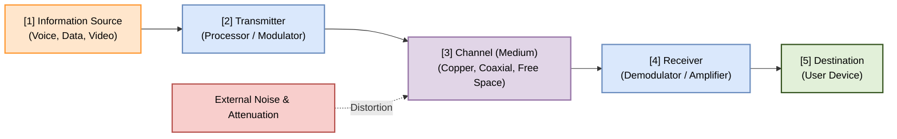
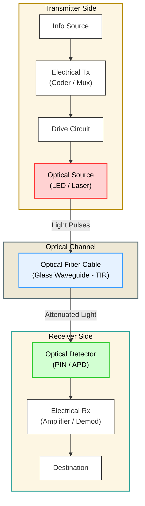
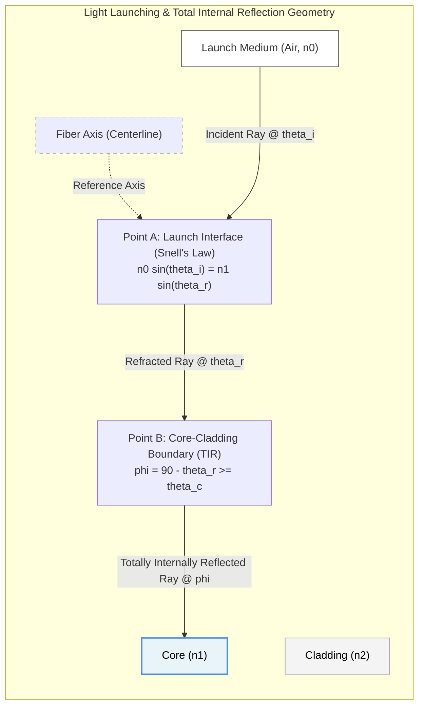

# Diagrams Registry: PE-EC801B - Chapter 01

This document contains copy-ready Mermaid source codes for the diagrams referenced in the Chapter 1 notes. These codes can be rendered to PNGs using the local Mermaid editor.

---

## 1. General Communication System Block Diagram
* **File Name:** `general_comm_block.png`
* **Mermaid Code:**

---

## 2. Fiber Optic Communication System Block Diagram
* **File Name:** `fiber_comm_block.png`
* **Mermaid Code:**

---

## 3. Ray Propagation & Acceptance Angle Geometry
* **File Name:** `ray_propagation.png`
* **Mermaid Code:**

