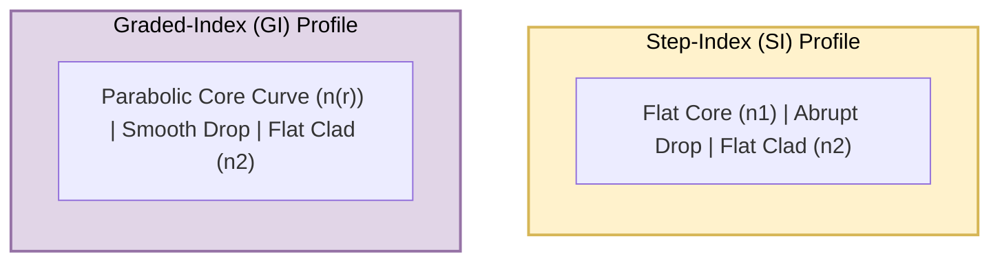
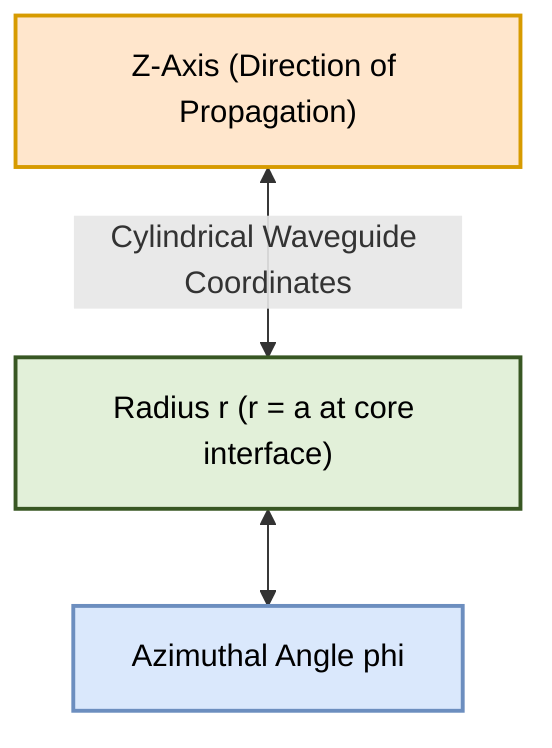

# Diagrams Registry: PE-EC801B - Chapter 02

This document contains copy-ready Mermaid source codes for the diagrams referenced in the Chapter 2 notes. These codes can be rendered to PNGs using the local Mermaid editor.

---

## 1. Refractive Index Profiles (Step-Index vs. Graded-Index)
* **File Name:** `index_profiles.png`
* **Mermaid Code:**

---

## 2. Cylindrical Coordinate Boundaries
* **File Name:** `cylindrical_coords.png`
* **Mermaid Code:**

