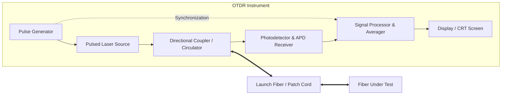
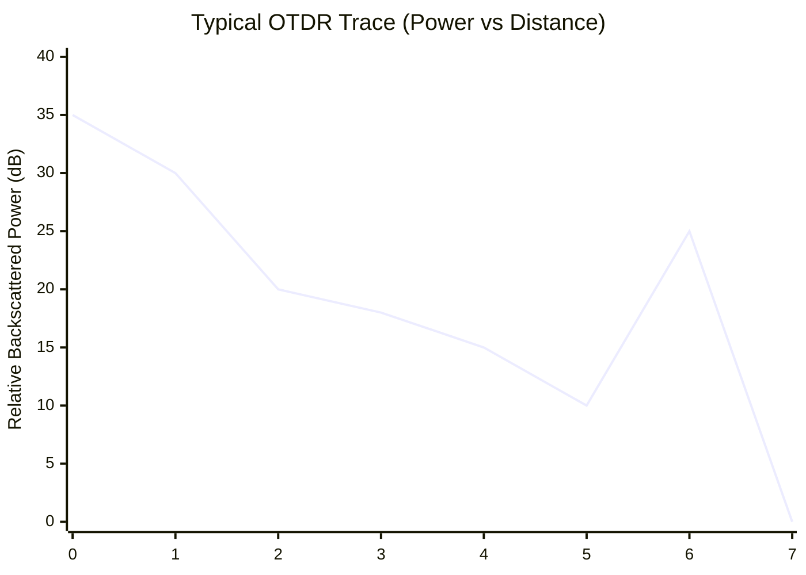
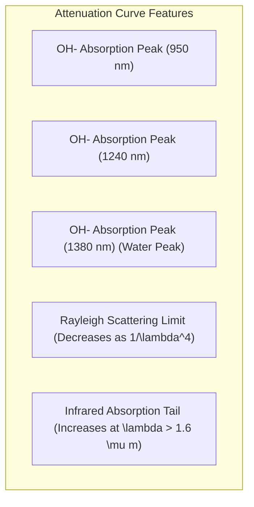
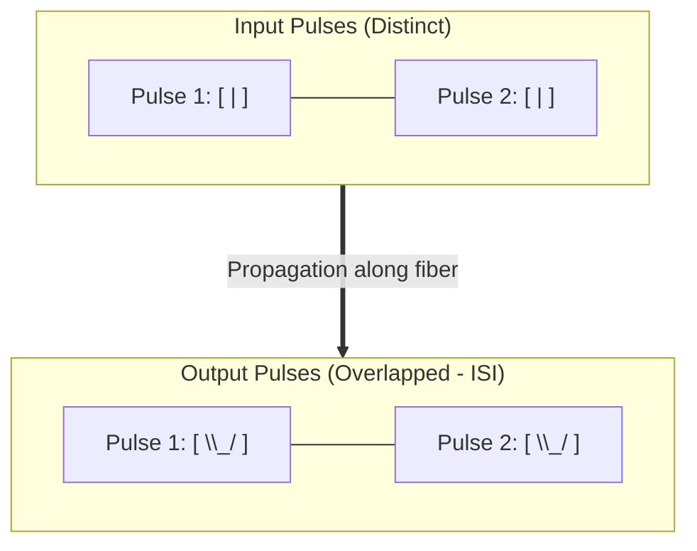
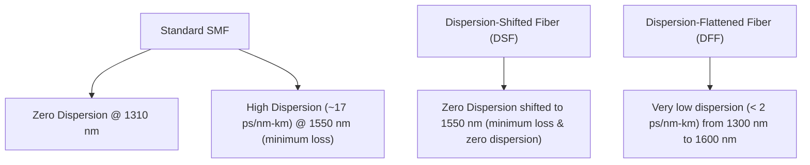
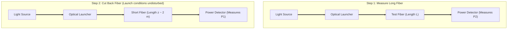

# Diagrams Registry: PE-EC801B - Chapter 03

This registry contains copy-ready Mermaid source codes for diagrams related to Chapter 3 (Signal Degradation on Optical Fibers).

---

## 1. OTDR Block Diagram
This block diagram represents the internal components of an Optical Time Domain Reflectometer (OTDR).

* **File Name:** `otdr_block.png`
* **Mermaid Code:**

---

## 2. OTDR Trace Waveform
This diagram represents a typical OTDR trace, highlighting the various reflective and non-reflective events along the fiber length.

* **File Name:** `otdr_trace.png`
* **Mermaid Code:**

*(Note: For LaTeX rendering, a high-quality vector plot using TikZ or pgfplots will be generated representing:)*
1.  **Start:** Front panel connector Fresnel reflection peak.
2.  **Linear Slope:** Rayleigh backscattering loss.
3.  **Step Down (No peak):** Non-reflective loss event (e.g., fusion splice).
4.  **Sharp Peak + Step Down:** Reflective loss event (e.g., mechanical splice or connector).
5.  **Final Peak + Drop to Noise Floor:** Cleaved fiber end face Fresnel reflection.

---

## 3. Fiber Attenuation vs. Wavelength Curve
This curve details the attenuation bands of silica glass as a function of wavelength, highlighting the three transmission windows and the water absorption peaks.

* **File Name:** `attenuation_curve.png`
* **Mermaid Code:**

*(Note: The LaTeX compilation will represent this as a continuous curve with three highlighted windows:)*
*   **Window I ($850\text{ nm}$):** Attenuation $\approx 2.5\ \text{dB/km}$.
*   **Window II ($1310\text{ nm}$):** Attenuation $\approx 0.4\ \text{dB/km}$, zero chromatic dispersion.
*   **Window III ($1550\text{ nm}$):** Attenuation $\approx 0.2\ \text{dB/km}$, absolute minimum attenuation.

---

## 4. Pulse Broadening and dispersion
This flowchart depicts how light pulses broaden and overlap (Inter-Symbol Interference) as they propagate down a dispersive fiber.

* **File Name:** `pulse_broadening.png`
* **Mermaid Code:**

---

## 5. Dispersion Curves
This flowchart represents the dispersion characteristics of standard single-mode fibers vs. dispersion-shifted/flattened fibers.

* **File Name:** `dispersion_curves.png`
* **Mermaid Code:**

---

## 6. Cut-Back Method Setup
This diagram illustrates the two-step measurement setup of the Cut-Back method for attenuation measurement.

* **File Name:** `cut_back_method.png`
* **Mermaid Code:**

