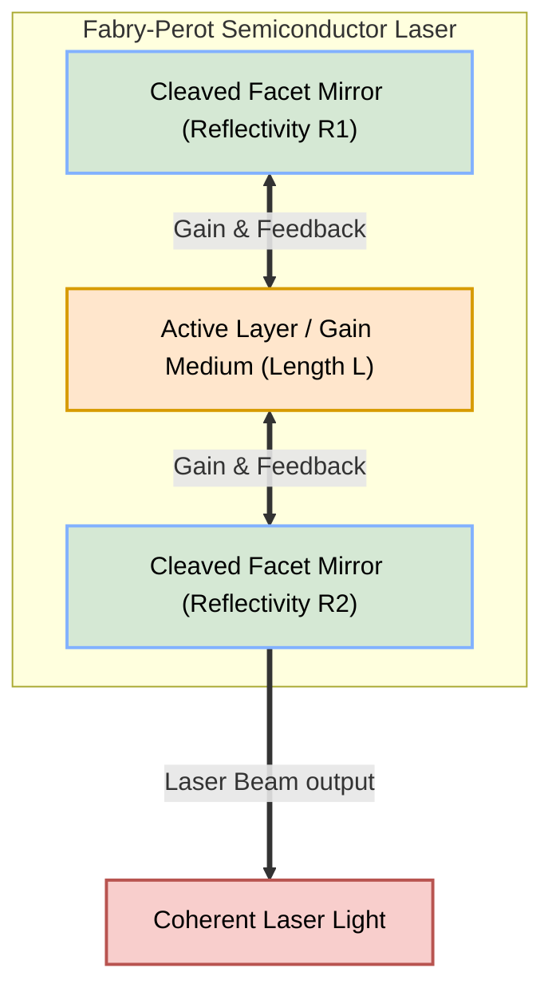
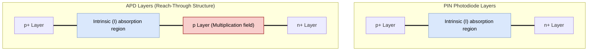

# Diagrams Registry: PE-EC801B - Chapter 04

This registry contains copy-ready Mermaid source codes for diagrams related to Chapter 4 (Optical Sources & Detectors).

---

## 1. Fabry-Perot Laser Cavity
This diagram illustrates the structure of a semiconductor Fabry-Perot cavity laser, highlighting the active region, cleaved facet mirrors, and output beam.

* **File Name:** `laser_cavity.png`
* **Mermaid Code:**

---

## 2. Digital Optical Receiver
This diagram represents the block diagram of a digital optical receiver, showing the conversion from optical signal to decision outputs.

* **File Name:** `optical_receiver.png`
* **Mermaid Code:**

---

## 3. PIN vs. APD Structure Comparison
This diagram details the difference in physical structures and depletion regions between a standard PIN photodiode and an Avalanche Photodiode (APD).

* **File Name:** `detector_structures.png`
* **Mermaid Code:**

*(Note: For LaTeX output, this will be represented as a labeled cross-sectional schematic diagram showing the electric field profiles.)*
