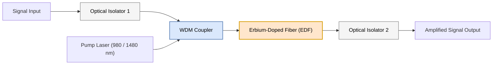
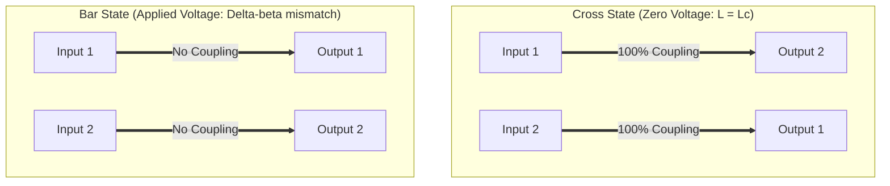
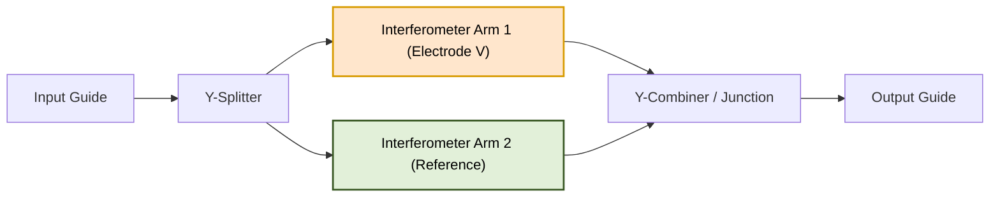
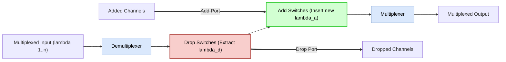
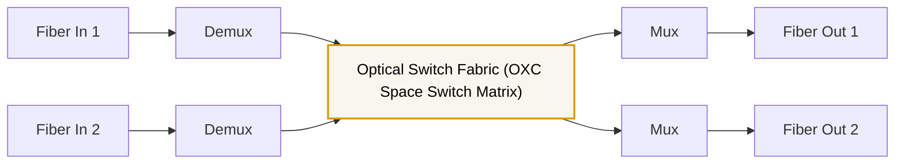
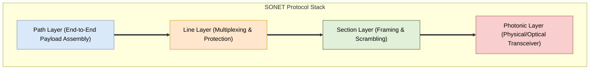

# Diagrams Registry: PE-EC801B - Chapter 05

This registry contains copy-ready Mermaid source codes for diagrams related to Chapter 5 (Optical Switches & Amplifiers).

---

## 1. EDFA Block Diagram
This block diagram represents the physical layout of an Erbium-Doped Fiber Amplifier (EDFA), showing the input signal, optical isolators, WDM coupler, pump laser, and the Erbium-doped fiber spool.

* **File Name:** `edfa_block.png`
* **Mermaid Code:**

---

## 2. Directional Coupler Switch States
This diagram illustrates the cross state (zero applied voltage) and bar state (voltage applied) of a symmetric directional coupler switch.

* **File Name:** `directional_coupler.png`
* **Mermaid Code:**

---

## 3. MZI Switch Layout
This diagram details the layout of a Mach-Zehnder Interferometer (MZI) switch on Lithium Niobate ($\text{LiNbO}_3$), showing Y-junction splitters/combiners and the parallel arms.

* **File Name:** `mzi_switch.png`
* **Mermaid Code:**

---

## 4. OADM Architecture Block Diagram
This diagram represents the block diagram of a generic Optical Add-Drop Multiplexer (OADM), showing demuxing, switching, and muxing stages.

* **File Name:** `oadm_block.png`
* **Mermaid Code:**

---

## 5. OXC Wavelength Routing Architecture
This diagram illustrates an Optical Cross-Connect (OXC) mesh node, routing channels across multiple incoming and outgoing fibers.

* **File Name:** `oxc_routing.png`
* **Mermaid Code:**

---

## 6. SONET Protocol Layer Stack
This diagram shows the four-layer protocol stack of SONET, from the Path layer down to the Photonic layer.

* **File Name:** `sonet_layers.png`
* **Mermaid Code:**

