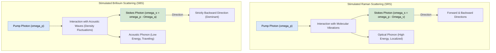
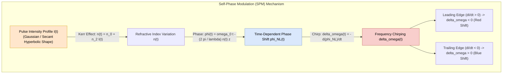
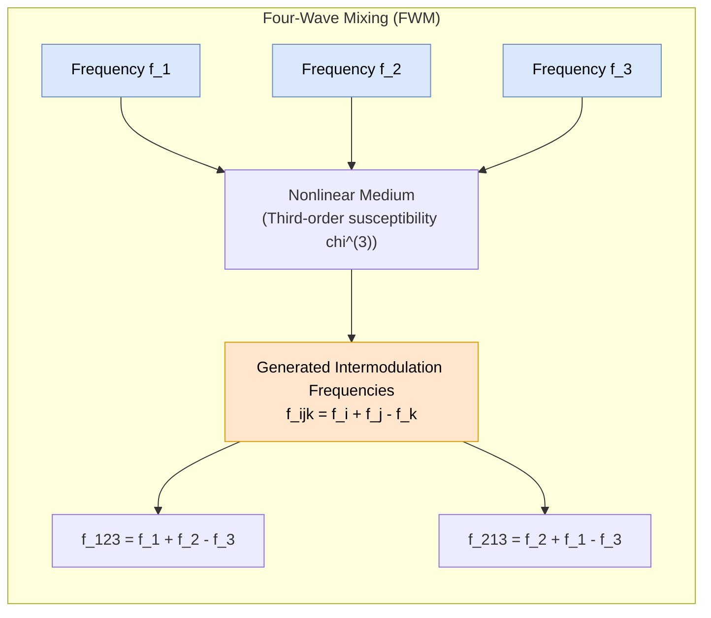
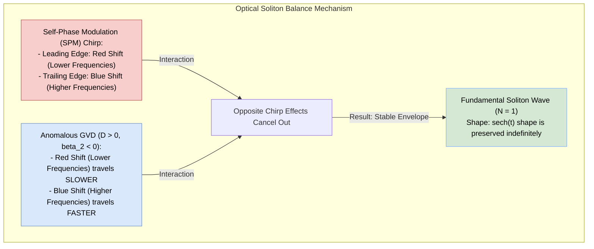

# Diagrams Registry: PE-EC801B - Chapter 06

This registry contains copy-ready Mermaid source codes for diagrams related to Chapter 6 (Nonlinear Effects).

---

## 1. Stimulated Scattering Processes (SRS vs. SBS)
This diagram illustrates the difference between Stimulated Raman Scattering (SRS) and Stimulated Brillouin Scattering (SBS) in terms of their physical mechanisms, phonon interactions, and propagation directions.

* **File Name:** `srs_vs_sbs.png`
* **Mermaid Code:**

---

## 2. Self-Phase Modulation (SPM) Frequency Chirping
This block diagram outlines the step-by-step physical process of Self-Phase Modulation (SPM) showing how a pulse's intensity profile induces refractive index changes, phase shifts, and resulting frequency chirp.

* **File Name:** `spm_chirp.png`
* **Mermaid Code:**

---

## 3. Four-Wave Mixing (FWM) Frequency Generation
This diagram shows the third-order nonlinear interaction in Four-Wave Mixing (FWM), where three signals beat together to generate new intermodulation products.

* **File Name:** `fwm_frequencies.png`
* **Mermaid Code:**

---

## 4. Soliton Propagation Balance
This diagram explains the physical mechanism of fundamental soliton propagation in optical fibers, where the chirp introduced by anomalous Group Velocity Dispersion (GVD) is exactly counteracted by the chirp of Self-Phase Modulation (SPM).

* **File Name:** `soliton_balance.png`
* **Mermaid Code:**

