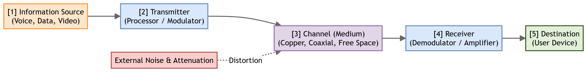
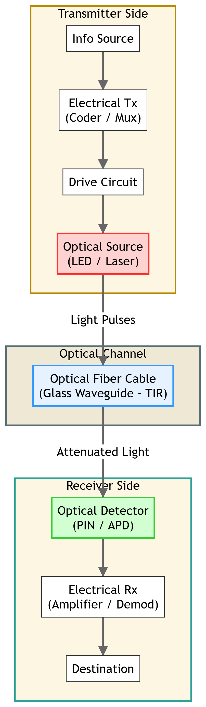
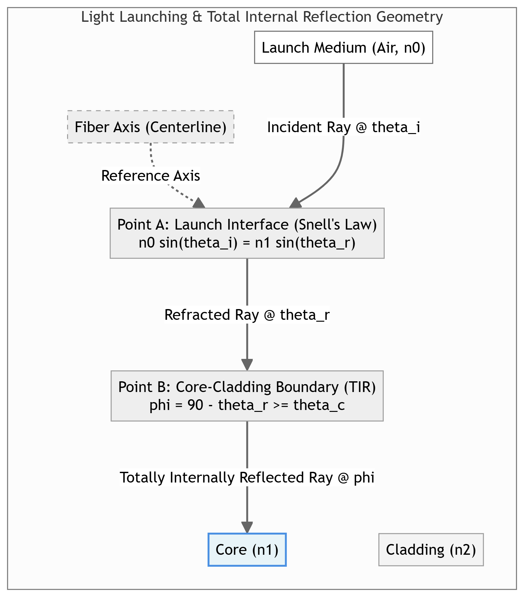

# Chapter 1: Introduction to Optical Fiber Communication

This chapter compiles lecture-quality study notes and comprehensive exam answers for **Unit I: Introduction** of the PE-EC801B syllabus, adhering strictly to the **MAKAUT Answer Writing Guidelines** and **LaTeX Compatibility Rules**.

---

## Section 1: Basics of Optical Communication [10M] [Priority: High]

### 1. General vs. Fiber Optic Communication Systems
A communication system transmits information from a source to a destination. In an optical communication system, light is used as the information carrier, and the transmission medium is an optical fiber cable.

#### A. General Communication System Block Diagram
A standard communication system consists of three main elements: Transmitter, Channel, and Receiver.

1.  **Information Source:** Generates the input message signal (analog voice, digital data, video).
2.  **Transmitter:** Processes and modulates the source signal onto a suitable carrier wave (RF, microwave) for transmission.
3.  **Channel (Medium):** The physical path over which the modulated signal propagates (free space, copper wire, coaxial cable). Noise and attenuation degrade the signal here.
4.  **Receiver:** Demodulates and amplifies the received signal, converting it back to the original message format.
5.  **Destination:** The final recipient of the transmitted message.

#### B. Fiber Optic Communication System Block Diagram
An optical fiber communication system adapts the general framework to use light signals and optical fibers.

1.  **Information Source & Electrical Transmitter:** Converts non-electrical messages (like voice) into electrical signals and processes them (coding, multiplexing).
2.  **Drive Circuit:** Modulates the electrical signal into a drive current suitable for operating the optical source.
3.  **Optical Source:** Converts electrical signal variations into light pulses.
    *   *LED (Light Emitting Diode):* Used for low-speed, short-distance transmission.
    *   *Laser Diode:* Used for high-speed, long-distance transmission.
4.  **Optical Fiber Cable (Channel):** A cylindrical glass/plastic waveguide that guides light pulses via **Total Internal Reflection (TIR)**.
5.  **Optical Detector (Photodetector):** Converts the received light pulses back into electrical current.
    *   *PIN Photodiode:* Simple, low noise, no internal gain.
    *   *APD (Avalanche Photodiode):* High sensitivity, high response speed, possesses internal multiplication gain.
6.  **Electrical Receiver (Amplifier/Demodulator):** Amplifies the weak photodetector current, filters out noise, and reconstructs the original signal.
7.  **Destination:** The end-user device or computer system.

---

### 2. Advantages & Disadvantages of Optical Fiber Communication

#### A. Advantages
*   **Enormous Bandwidth:** Light frequencies are in the terahertz range ($10^{14}\ \text{Hz}$), providing a transmission bandwidth-distance product thousands of times greater than copper cables or microwave links.
*   **Low Attenuation (Transmission Loss):** Modern silica glass fibers have losses as low as $0.2\ \text{dB/km}$ at $\lambda = 1550\ \text{nm}$, allowing signal transmission over $100\ \text{km}$ without repeaters.
*   **Immunity to Electromagnetic Interference (EMI):** Being made of dielectric materials (glass/plastic), fibers are completely unaffected by external magnetic fields, lightning strikes, high-voltage lines, or radio frequency signals.
*   **Small Size and Lightweight:** An optical fiber has a core/cladding diameter of about $125\ \mu\text{m}$, making cables much thinner and lighter than copper bundles.
*   **High Security & No Crosstalk:** Light is confined entirely within the fiber core. There is no electromagnetic radiation escaping the cable, making unauthorized tapping virtually impossible and eliminating crosstalk between adjacent fibers.
*   **Electrical Isolation:** Since fibers are non-conductive, there is no risk of electrical shocks, short circuits, or ground loops, making them safe for hazardous environments (chemical plants, oil refineries).

#### B. Disadvantages
*   **High Initial Installation Cost:** The cost of specialized optical transmitters, receivers, and deployment equipment is higher than copper equivalents.
*   **Fragility and Splicing Difficulty:** Glass fibers are fragile and susceptible to damage under bending stress. Splicing (joining) two fibers requires expensive fusion splicing tools and highly skilled technicians.
*   **Specialized Components:** Optical connectors, splitters, and amplifiers are complex to design and align.
*   **Cannot Carry Electrical Power:** Unlike copper wires, optical fibers cannot transmit electrical power directly to remote equipment (e.g., telephone sets, sensors).

---

## Section 2: Ray Optics & Light Propagation Principles [15M] [Priority: High]

Light propagation in large-core fibers ($d \gg \lambda$) is modeled using **Geometric (Ray) Optics**, assuming light travels in straight lines (rays) and changes direction at interfaces between different media.

### 1. Refraction, Snell's Law, Critical Angle, and Total Internal Reflection (TIR)

*   **Refraction:** The bending of a light ray as it passes from one transparent medium with refractive index $n_1$ to another with refractive index $n_2$, caused by the change in the speed of light.
*   **Snell's Law:** Governs refraction at the interface of two media:
    $$n_1 \sin(\theta_1) = n_2 \sin(\theta_2)$$
    where $\theta_1$ is the angle of incidence and $\theta_2$ is the angle of refraction.

*   **Critical Angle ($\theta_c$):** When light travels from a denser medium ($n_1$) to a rarer medium ($n_2$, where $n_1 > n_2$), the refracted ray bends away from the normal. As the angle of incidence ($\theta_1$) increases, the angle of refraction ($\theta_2$) reaches $90^\circ$ (propagating along the interface). The angle of incidence that causes $\theta_2 = 90^\circ$ is the **Critical Angle ($\theta_c$)**:
    $$n_1 \sin(\theta_c) = n_2 \sin(90^\circ) \implies \theta_c = \sin^{-1}\left(\frac{n_2}{n_1}\right)$$

*   **Total Internal Reflection (TIR):** The phenomenon where a light ray traveling in a denser medium hits the interface with a rarer medium and is entirely reflected back into the denser medium.
    *   *Conditions for TIR:*
        1.  The light ray must travel from a medium of higher refractive index ($n_1$) to a medium of lower refractive index ($n_2$) ($n_1 > n_2$).
        2.  The angle of incidence at the interface must exceed the critical angle ($\theta_i > \theta_c$).

---

### 2. Acceptance Angle & Numerical Aperture (NA) Derivation

The **Acceptance Angle ($\theta_a$)** is the maximum angle of incidence at the air-core interface for which the light ray will be totally internally reflected at the core-cladding interface and thus propagate along the fiber. The **Numerical Aperture (NA)** represents the light-gathering capacity of the fiber.

#### Step-by-Step Derivation:
1.  Let $n_0$ be the refractive index of the launching medium (usually air, $n_0 = 1$), $n_1$ be the core refractive index, and $n_2$ be the cladding refractive index ($n_1 > n_2$).
2.  Let a light ray enter the fiber core from the launching medium at an angle of incidence $\theta_i$ with the fiber axis. Let $\theta_r$ be the angle of refraction inside the core.
3.  By **Snell's Law** at the air-core interface (Point A):
    $$n_0 \sin(\theta_i) = n_1 \sin(\theta_r) \quad \text{--- (Eq 1.1)}$$
4.  The refracted ray travels through the core and strikes the core-cladding interface (Point B) at an angle of incidence $\phi$. From the geometry of the right-angled triangle ABC:
    $$\phi = 90^\circ - \theta_r \quad \text{--- (Eq 1.2)}$$
5.  For the ray to undergo Total Internal Reflection (TIR) at Point B, we must have:
    $$\phi \ge \theta_c \implies \sin(\phi) \ge \sin(\theta_c)$$
6.  Since $\sin(\theta_c) = \frac{n_2}{n_1}$, this condition becomes:
    $$\sin(\phi) \ge \frac{n_2}{n_1} \quad \text{--- (Eq 1.3)}$$
7.  Using Eq 1.2, we rewrite $\sin(\phi)$ as:
    $$\sin(\phi) = \sin(90^\circ - \theta_r) = \cos(\theta_r)$$
8.  Substituting this into Eq 1.3:
    $$\cos(\theta_r) \ge \frac{n_2}{n_1}$$
9.  Using the trigonometric identity $\sin(\theta_r) = \sqrt{1 - \cos^2(\theta_r)}$:
    $$\sin(\theta_r) \le \sqrt{1 - \left(\frac{n_2}{n_1}\right)^2} = \sqrt{\frac{n_1^2 - n_2^2}{n_1^2}} = \frac{\sqrt{n_1^2 - n_2^2}}{n_1}$$
10. Substitute this inequality back into Snell's Law (Eq 1.1):
    $$n_0 \sin(\theta_i) \le n_1 \left( \frac{\sqrt{n_1^2 - n_2^2}}{n_1} \right) = \sqrt{n_1^2 - n_2^2}$$
11. The maximum angle of incidence $\theta_i = \theta_a$ (Acceptance Angle) occurs at the limit:
    $$\sin(\theta_a) = \frac{\sqrt{n_1^2 - n_2^2}}{n_0}$$
12. For air launching ($n_0 = 1$), the **Acceptance Angle ($\theta_a$)** is:
    $$\theta_a = \sin^{-1}\left(\sqrt{n_1^2 - n_2^2}\right)$$
13. The **Numerical Aperture (NA)** is defined as the sine of the acceptance angle in air:
    $$\text{NA} = \sin(\theta_a) = \sqrt{n_1^2 - n_2^2}$$
14. Using the **Relative Refractive Index Difference ($\Delta$)**:
    $$\Delta = \frac{n_1^2 - n_2^2}{2 n_1^2} \approx \frac{n_1 - n_2}{n_1}$$
    We can rewrite the expression as:
    $$n_1^2 - n_2^2 = 2 n_1^2 \Delta \implies \text{NA} = n_1 \sqrt{2 \Delta}$$

---

### 3. Meridional vs. Skew Rays
Light rays propagating along an optical fiber are classified based on their path and intersection with the fiber's central axis.

| Feature / Criteria | Meridional Rays | Skew Rays |
| :--- | :--- | :--- |
| **Path Definition** | Pass through the fiber's longitudinal axis. | Do not pass through the fiber's longitudinal axis. |
| **Propagation Geometry** | Confined to a single plane containing the axis (meridional plane). | Follow a helical or spiral path around the axis. |
| **Mathematical Analysis** | Simple; modeled using 2D geometry and ray tracing. | Complex; requires 3D cylindrical geometry. |
| **Acceptance Condition** | Determined by the standard NA equation: $\sin(\theta_a) = \text{NA}$. | Can be accepted at larger launch angles than meridional rays. |
| **Total Internal Reflection** | Occurs at a flat cylindrical surface point. | Occurs along a helical trajectory path at the core boundary. |

---

## Section 3: Electromagnetic Model & Vector Nature of Light [5M] [Priority: Medium]

When the core diameter ($d$) of the fiber is comparable to the wavelength of the light ($\lambda$), geometric optics fails. In this regime, light must be modeled as electromagnetic waves using Maxwell's equations.

### 1. Ray Model vs. Wave Model

| Feature / Criteria | Ray Model (Geometric Optics) | Wave Model (Waveguide Theory) |
| :--- | :--- | :--- |
| **Light Representation** | Discrete light rays traveling in straight lines. | Continuous electromagnetic waves (E & H fields). |
| **Wavelength Assumption** | Assumes wavelength is negligible ($\lambda \to 0$). | Accounts for finite wavelength ($\lambda$). |
| **Fiber Compatibility** | Valid only for multimode fibers ($d \gg \lambda$). | Mandatory for single-mode fibers ($d \approx \lambda$). |
| **Target Phenomena** | Describes refraction, reflection, critical angle, and NA. | Explains diffraction, interference, modal cutoff, and dispersion. |
| **Resulting Concept** | Light paths (continuous geometric angles). | Discrete electromagnetic modes (guided wave patterns). |

---

### 2. Vector Nature of Light & cylindrical Dielectric Rod
Light waves consist of oscillating electric ($\vec{E}$) and magnetic ($\vec{H}$) fields, which are vectors perpendicular to each other and to the direction of propagation.

*   **Maxwell's Equations:** Light propagation in a cylindrical dielectric rod (representing the fiber core) is modeled by solving the electromagnetic wave equations in cylindrical coordinates $(r, \phi, z)$:
    $$\nabla^2 \vec{E} - n^2 \mu_0 \epsilon_0 \frac{\partial^2 \vec{E}}{\partial t^2} = 0$$
*   **Modes of Propagation:** Because of the vector boundary conditions at the cylindrical core-cladding interface, the electromagnetic waves cannot propagate as simple transverse electromagnetic (TEM) waves. Instead, they form discrete modes:
    1.  **Transverse Electric (TE) Modes:** No electric field component in the direction of propagation ($E_z = 0$).
    2.  **Transverse Magnetic (TM) Modes:** No magnetic field component in the direction of propagation ($H_z = 0$).
    3.  **Hybrid Modes (HE and EH):** Both electric and magnetic fields have non-zero components in the direction of propagation ($E_z \neq 0, H_z \neq 0$). These arise because of skew rays and the cylindrical boundary curvature.

---

## Section 4: Practice Problems [10M] [Priority: High]

### 🧮 Problem 1.1: Critical Angle Calculation
**Given:**
*   Core refractive index ($n_1$) = **1.82**
*   Cladding refractive index ($n_2$) = **1.73**

**Formula:**
$$\theta_c = \sin^{-1}\left(\frac{n_2}{n_1}\right)$$

**Substitution & Calculation:**
$$\theta_c = \sin^{-1}\left(\frac{1.73}{1.82}\right)$$
$$\theta_c = \sin^{-1}(0.95055)$$
$$\theta_c \approx 71.91^\circ$$

**Final Answer:**
The critical angle at the core-cladding interface is **$71.91^\circ$**.

---

### 🧮 Problem 1.2: Numerical Aperture & Index Tuning
**Given:**
*   Core refractive index ($n_1$) = **1.48**
*   Cladding refractive index ($n_2$) = **1.46**
*   Target NA = **0.23**

**Formulas:**
1.  $\text{NA} = \sqrt{n_1^2 - n_2^2}$
2.  $n_2' = \sqrt{n_1^2 - (\text{NA}')^2}$

**Step 1: Calculate the initial NA:**
$$\text{NA} = \sqrt{(1.48)^2 - (1.46)^2}$$
$$\text{NA} = \sqrt{2.1904 - 2.1316} = \sqrt{0.0588}$$
$$\text{NA} \approx 0.242$$

**Step 2: Calculate the new cladding index ($n_2'$) for target $\text{NA} = 0.23$:**
$$n_2' = \sqrt{(1.48)^2 - (0.23)^2}$$
$$n_2' = \sqrt{2.1904 - 0.0529} = \sqrt{2.1375}$$
$$n_2' \approx 1.462$$

**Final Answer:**
*   The initial Numerical Aperture is **0.242**.
*   The new cladding refractive index ($n_2'$) required to change the NA to $0.23$ is **1.462**.

---

### 🧮 Problem 1.3: Acceptance Angle in Air
**Given:**
*   Core refractive index ($n_1$) = **1.50**
*   Cladding refractive index ($n_2$) = **1.47**
*   Launch medium = Air ($n_0 = 1$)

**Formulas:**
1.  Critical Angle: $\theta_c = \sin^{-1}\left(\frac{n_2}{n_1}\right)$
2.  Numerical Aperture: $\text{NA} = \sqrt{n_1^2 - n_2^2}$
3.  Acceptance Angle: $\theta_a = \sin^{-1}(\text{NA})$

**Substitution & Calculation:**
1.  **Critical Angle ($\theta_c$):**
    $$\theta_c = \sin^{-1}\left(\frac{1.47}{1.50}\right) = \sin^{-1}(0.98)$$
    $$\theta_c \approx 78.52^\circ$$
2.  **Numerical Aperture (NA):**
    $$\text{NA} = \sqrt{(1.50)^2 - (1.47)^2} = \sqrt{2.25 - 2.1609} = \sqrt{0.0891}$$
    $$\text{NA} \approx 0.2985$$
3.  **Acceptance Angle ($\theta_a$):**
    $$\theta_a = \sin^{-1}(0.2985)$$
    $$\theta_a \approx 17.37^\circ$$

**Final Answer:**
*   The critical angle is **$78.52^\circ$**.
*   The Numerical Aperture is **0.2985**.
*   The acceptance angle in air is **$17.37^\circ$**.
