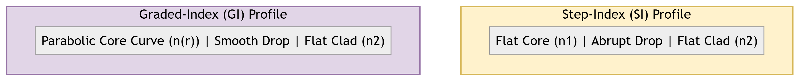
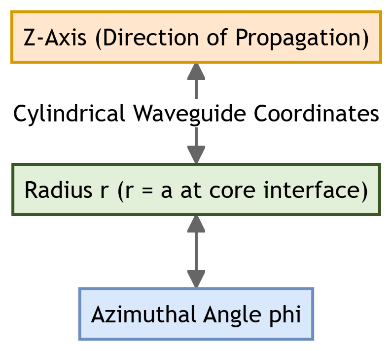

# Chapter 2: Optical Fibers & Waveguide Theory

This chapter compiles lecture-quality study notes and comprehensive exam answers for **Unit II: Optical Fibers** of the PE-EC801B syllabus, adhering strictly to the **MAKAUT Answer Writing Guidelines** and **LaTeX Compatibility Rules**.

---

## Section 1: Fiber Classification & Index Profiles [10M] [Priority: High]

Optical fibers are categorized according to their refractive index profiles and the number of electromagnetic modes they propagate.

### 1. Step-Index (SI) vs. Graded-Index (GI) Fibers

*   **Step-Index (SI) Fiber:** The core has a uniform refractive index ($n_1$) throughout, which drops abruptly (in a "step") to a lower cladding refractive index ($n_2$) at the core-cladding boundary.
*   **Graded-Index (GI) Fiber:** The refractive index of the core decreases continuously in a parabolic profile from the center ($n_1$) out to the cladding boundary ($n_2$). The profile is governed by:
    $$n(r) = \begin{cases} n_1 \sqrt{1 - 2\Delta\left(\frac{r}{a}\right)^\alpha} & \text{for } r < a \\ n_2 = n_1 \sqrt{1 - 2\Delta} & \text{for } r \ge a \end{cases}$$
    where $a$ is the core radius, $\alpha$ is the profile parameter ($\alpha \approx 2$ for a parabolic profile), and $r$ is the radial distance.

| Feature / Criteria | Step-Index (SI) Fiber | Graded-Index (GI) Fiber |
| :--- | :--- | :--- |
| **Index Profile** | Abrupt step at core-cladding boundary. | Continuous, parabolic decrease from center. |
| **Light Propagation** | Zig-zag paths via discrete reflections (TIR). | Continuous sinusoidal, curving refraction paths. |
| **Intermodal Dispersion** | High; rays travel different lengths, causing pulse spread. | Low; helical rays travel faster in outer regions, self-focusing. |
| **Bandwidth** | Low (typically **20 MHz·km** for multimode). | High (typically **2 GHz·km** for multimode). |
| **Numerical Aperture** | Constant across the core: $\text{NA} = \sqrt{n_1^2 - n_2^2}$. | Maximum at axis, decreases to zero at cladding boundary. |
| **Source Coupling** | Easy; large core and constant NA. | Moderately difficult; requires precise alignment. |

---

### 2. Single-Mode (SMF) vs. Multimode (MMF) Fibers

*   **Single-Mode Fiber (SMF):** Has a small core diameter ($8\text{--}10\ \mu\text{m}$) which permits only the fundamental mode ($\text{HE}_{11}$) to propagate at the operating wavelength.
*   **Multimode Fiber (MMF):** Has a larger core diameter ($50\text{--}100\ \mu\text{m}$) which allows many hundreds of different electromagnetic modes to propagate simultaneously.

| Feature / Criteria | Single-Mode Fiber (SMF) | Multimode Fiber (MMF) |
| :--- | :--- | :--- |
| **Core Diameter** | Very small ($8\text{--}10\ \mu\text{m}$). | Large ($50\text{--}100\ \mu\text{m}$). |
| **Mode Count** | Exactly 1 mode ($\text{HE}_{11}$). | Hundreds of modes ($N \gg 100$). |
| **Intermodal Dispersion** | Zero (only one mode exists). | High (significant mode delay differences). |
| **Compatible Sources** | Laser Diodes (LD) only. | LEDs and Laser Diodes. |
| **Attenuation / Losses** | Extremely low ($0.2\ \text{dB/km}$ at 1550 nm). | Moderately high ($1.0\text{--}3.0\ \text{dB/km}$). |
| **Applications** | Long-haul telecom, undersea cables. | Short-haul LANs, data centers, building backbones. |

---

## Section 2: Key Waveguide Parameters [5M] [Priority: High]

### 1. Normalized Frequency (V-number)
The **V-number** is a dimensionless parameter that determines the number of modes supported by a step-index fiber and dictates its wave propagation limits.
*   **Equation:**
    $$V = \frac{2\pi a}{\lambda} \text{NA} = \frac{2\pi a}{\lambda} \sqrt{n_1^2 - n_2^2}$$
    where $a$ is the core radius, and $\lambda$ is the operating wavelength in free space.
*   **Single-Mode Propagation Condition:** A step-index fiber propagates only the fundamental $\text{HE}_{11}$ mode if the V-number is less than the first zero of the Bessel function $J_0$:
    $$V < 2.405$$
*   **Guided Modes Count ($N$):**
    *   For Step-Index Multimode Fibers ($V \gg 2.405$):
        $$N_{SI} \approx \frac{V^2}{2}$$
    *   For Graded-Index Parabolic Fibers ($\alpha = 2$):
        $$N_{GI} \approx \frac{V^2}{4}$$
        *(GI fibers support half the number of modes as SI fibers for the same V-number).*

---

### 2. Cutoff Wavelength ($\lambda_c$)
The **Cutoff Wavelength** is the transition wavelength above which the fiber supports only a single mode ($\text{HE}_{11}$). Below $\lambda_c$, higher-order modes begin to propagate, and the fiber becomes multimode.
*   **Equation:**
    $$\lambda_c = \frac{2\pi a \text{NA}}{V_c} = \frac{2\pi a \sqrt{n_1^2 - n_2^2}}{2.405}$$
    where $V_c = 2.405$ is the single-mode cutoff limit.

---

### 3. Mode-Field Diameter (MFD)
In single-mode fibers, the light is not entirely confined within the core; a fraction of the optical power propagates as an evanescent wave inside the cladding. The **Mode-Field Diameter (MFD)** is a measure of the radial distribution of the optical power of the fundamental mode.
*   **Definition:** The radial distance between the points where the optical power density drops to $1/e^2$ (or electric field strength drops to $1/e$) of its maximum value at the fiber axis.
*   **Marcuse Formula (for Step-Index Fibers):**
    $$\frac{W}{a} \approx 0.65 + 1.619 V^{-1.5} + 2.879 V^{-6}$$
    where $W$ is the mode-field radius ($MFD = 2W$), and $a$ is the core radius.
*   **Significance:** A smaller MFD increases light confinement but makes splice alignment more sensitive and increases susceptibility to nonlinear effects.

---

## Section 3: Waveguide Mode Theory & Modal Analysis [15M] [Priority: High]

To describe light propagation in fibers of sub-wavelength dimensions, we solve the vector wave equation derived from Maxwell's equations under cylindrical boundary conditions.

### 1. Maxwell's Equations in Cylindrical Coordinates

In cylindrical coordinates $(r, \phi, z)$, assuming waves propagate in the $z$-direction with propagation constant $\beta$ and time-harmonic dependence $e^{j(\omega t - \beta z)}$, the electric ($\vec{E}$) and magnetic ($\vec{H}$) field vectors are:
$$\vec{E} = \vec{E}_0(r, \phi) e^{j(\omega t - \beta z)}, \quad \vec{H} = \vec{H}_0(r, \phi) e^{j(\omega t - \beta z)}$$

Maxwell's curl equations ($\nabla \times \vec{E} = -j\omega\mu\vec{H}$ and $\nabla \times \vec{H} = j\omega\epsilon\vec{E}$) yield the following component equations:
1.  $\frac{1}{r}\frac{\partial E_z}{\partial \phi} + j\beta E_\phi = -j\omega\mu H_r$
2.  $-j\beta E_r - \frac{\partial E_z}{\partial r} = -j\omega\mu H_\phi$
3.  $\frac{1}{r}\left[\frac{\partial}{\partial r}(r E_\phi) - \frac{\partial E_r}{\partial \phi}\right] = -j\omega\mu H_z$
4.  $\frac{1}{r}\frac{\partial H_z}{\partial \phi} + j\beta H_\phi = j\omega\epsilon E_r$
5.  $-j\beta H_r - \frac{\partial H_z}{\partial r} = j\omega\epsilon E_\phi$
6.  $\frac{1}{r}\left[\frac{\partial}{\partial r}(r H_\phi) - \frac{\partial H_r}{\partial \phi}\right] = j\omega\epsilon E_z$

---

### 2. Transverse Fields in Terms of Longitudinal Fields
By algebraic manipulation of components 1, 2, 4, and 5, the transverse field components ($E_r, E_\phi, H_r, H_\phi$) can be expressed entirely in terms of the longitudinal field components ($E_z, H_z$):
$$E_r = \frac{-j}{q^2} \left[ \beta \frac{\partial E_z}{\partial r} + \frac{\omega\mu}{r} \frac{\partial H_z}{\partial \phi} \right] \quad \text{--- (Eq 2.1)}$$
$$E_\phi = \frac{-j}{q^2} \left[ \frac{\beta}{r} \frac{\partial E_z}{\partial \phi} - \omega\mu \frac{\partial H_z}{\partial r} \right] \quad \text{--- (Eq 2.2)}$$
$$H_r = \frac{-j}{q^2} \left[ \beta \frac{\partial H_z}{\partial r} - \frac{\omega\epsilon}{r} \frac{\partial E_z}{\partial \phi} \right] \quad \text{--- (Eq 2.3)}$$
$$H_\phi = \frac{-j}{q^2} \left[ \frac{\beta}{r} \frac{\partial H_z}{\partial \phi} + \omega\epsilon \frac{\partial E_z}{\partial r} \right] \quad \text{--- (Eq 2.4)}$$
where $q^2 = k^2 n^2 - \beta^2 = \omega^2\mu\epsilon - \beta^2$.

This reduction simplifies the waveguide analysis to solving a scalar wave equation for $E_z$ and $H_z$ and applying boundary conditions.

---

### 3. Helmholtz Wave Equation & Bessel Solutions
The wave equation for the longitudinal components $E_z$ (and similarly for $H_z$) is:
$$\frac{\partial^2 E_z}{\partial r^2} + \frac{1}{r}\frac{\partial E_z}{\partial r} + \frac{1}{r^2}\frac{\partial^2 E_z}{\partial \phi^2} + q^2 E_z = 0$$

Using separation of variables, $E_z(r, \phi) = F(r) e^{j\nu\phi}$ (where $\nu$ is an integer representing azimuthal variation), we obtain the **Bessel Differential Equation** for the radial function $F(r)$:
$$\frac{d^2 F}{dr^2} + \frac{1}{r}\frac{dF}{dr} + \left(q^2 - \frac{\nu^2}{r^2}\right) F = 0$$

#### Solutions:
1.  **Core Region ($r < a$, index $n_1$):**
    The transverse parameter is $u^2 = a^2(k_0^2 n_1^2 - \beta^2) > 0$. The solution must remain finite at $r=0$, which requires the **Bessel function of the first kind ($J_\nu$)**:
    $$E_z(r, \phi) = A J_\nu\left(\frac{u r}{a}\right) e^{j\nu\phi}, \quad H_z(r, \phi) = B J_\nu\left(\frac{u r}{a}\right) e^{j\nu\phi}$$
2.  **Cladding Region ($r > a$, index $n_2$):**
    For guided waves, the fields must decay to zero as $r \to \infty$. The transverse parameter is $w^2 = a^2(\beta^2 - k_0^2 n_2^2) > 0$. The solution requires the **Modified Bessel function of the second kind ($K_\nu$)**:
    $$E_z(r, \phi) = C K_\nu\left(\frac{w r}{a}\right) e^{j\nu\phi}, \quad H_z(r, \phi) = D K_\nu\left(\frac{w r}{a}\right) e^{j\nu\phi}$$

---

### 4. Boundary Conditions & Eigenvalue Equation
At the core-cladding interface ($r = a$), the tangential components of the electric and magnetic fields must be continuous:
$$E_z(a^-) = E_z(a^+), \quad H_z(a^-) = H_z(a^+)$$
$$E_\phi(a^-) = E_\phi(a^+), \quad H_\phi(a^-) = H_\phi(a^+)$$

Substituting the Bessel solutions for $E_z$ and $H_z$ into Equations 2.2 and 2.4 to find $E_\phi$ and $H_\phi$, and matching them at $r = a$ yields a system of four linear equations for constants $A, B, C$, and $D$. Setting the determinant of this system to zero gives the transcendental **Characteristic Equation**:
$$\left[ \frac{J_\nu'(u)}{u J_\nu(u)} + \frac{K_\nu'(w)}{w K_\nu(w)} \right] \left[ \frac{J_\nu'(u)}{u J_\nu(u)} + \frac{n_2^2}{n_1^2} \frac{K_\nu'(w)}{w K_\nu(w)} \right] = \nu^2 \left( \frac{1}{u^2} + \frac{1}{w^2} \right) \left( \frac{1}{u^2} + \frac{n_2^2}{n_1^2} \frac{1}{w^2} \right)$$

*   For $\nu = 0$, the right-hand side is zero. The equations decouple, yielding:
    *   **TE Modes ($\nu=0, E_z=0$):** $\frac{J_0'(u)}{u J_0(u)} + \frac{K_0'(w)}{w K_0(w)} = 0$
    *   **TM Modes ($\nu=0, H_z=0$):** $\frac{J_0'(u)}{u J_0(u)} + \frac{n_2^2}{n_1^2} \frac{K_0'(w)}{w K_0(w)} = 0$
*   For $\nu \neq 0$, the fields are coupled, producing hybrid **HE** and **EH** modes.

---

## Section 4: Practice Problems [10M] [Priority: High]

### 🧮 Problem 2.1: Multimode Step-Index Fiber Characterization
**Given:**
*   Core diameter ($2a$) = $80\ \mu\text{m} \implies$ core radius ($a$) = $40\ \mu\text{m} = 40 \times 10^{-6}\ \text{m}$
*   Core refractive index ($n_1$) = **1.48**
*   Relative refractive index difference ($\Delta$) = $1.5\% = 0.015$
*   Operating wavelength ($\lambda$) = $0.85\ \mu\text{m} = 0.85 \times 10^{-6}\ \text{m}$

**Formulas:**
1.  Numerical Aperture: $\text{NA} = n_1\sqrt{2\Delta}$
2.  Normalized Frequency: $V = \frac{2\pi a}{\lambda}\text{NA}$
3.  Total Guided Modes: $N \approx \frac{V^2}{2}$

**Step 1: Calculate the Numerical Aperture (NA):**
$$\text{NA} = 1.48 \times \sqrt{2 \times 0.015} = 1.48 \times \sqrt{0.03}$$
$$\text{NA} = 1.48 \times 0.1732 = 0.2563$$

**Step 2: Calculate the V-number:**
$$V = \frac{2\pi \times 40 \times 10^{-6}}{0.85 \times 10^{-6}} \times 0.2563$$
$$V = \frac{251.327}{0.85} \times 0.2563 \approx 295.68 \times 0.2563$$
$$V \approx 75.78$$

**Step 3: Calculate the number of guided modes ($N$):**
$$N = \frac{(75.78)^2}{2} = \frac{5742.6}{2} \approx 2871$$

**Final Answer:**
*   The Normalized Frequency (V-number) is **75.78**.
*   The total number of guided modes is **2871**.

---

### 🧮 Problem 2.2: Cutoff Wavelength of Single-Mode Fiber
**Given:**
*   Core radius ($a$) = $4\ \mu\text{m} = 4 \times 10^{-6}\ \text{m}$
*   Core refractive index ($n_1$) = **1.48**
*   Relative refractive index difference ($\Delta$) = $0.2\% = 0.002$
*   Cutoff V-number ($V_c$) = **2.405**

**Formulas:**
1.  Numerical Aperture: $\text{NA} = n_1\sqrt{2\Delta}$
2.  Cutoff Wavelength: $\lambda_c = \frac{2\pi a \text{NA}}{V_c}$

**Step 1: Calculate the Numerical Aperture (NA):**
$$\text{NA} = 1.48 \times \sqrt{2 \times 0.002} = 1.48 \times \sqrt{0.004}$$
$$\text{NA} = 1.48 \times 0.06325 \approx 0.0936$$

**Step 2: Calculate the Cutoff Wavelength ($\lambda_c$):**
$$\lambda_c = \frac{2\pi \times (4 \times 10^{-6}\ \text{m}) \times 0.0936}{2.405}$$
$$\lambda_c = \frac{2.352 \times 10^{-6}}{2.405}\ \text{m}$$
$$\lambda_c \approx 0.978 \times 10^{-6}\ \text{m} = 0.978\ \mu\text{m} = 978\ \text{nm}$$

**Final Answer:**
The cutoff wavelength of the single-mode fiber is **$0.978\ \mu\text{m}$** (or **$978\ \text{nm}$**).
