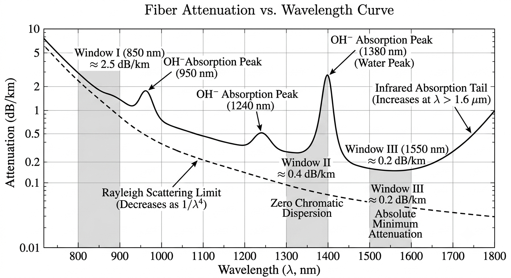
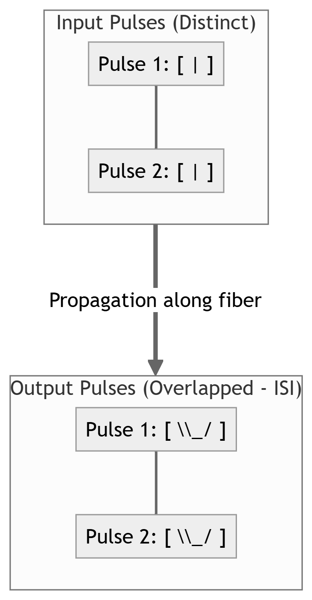
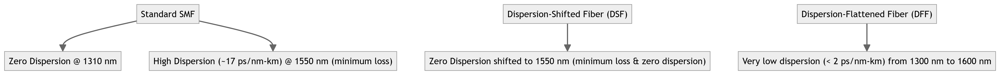
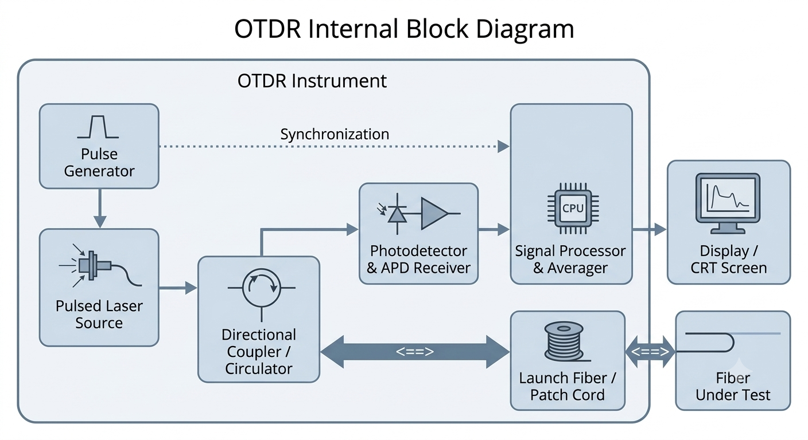
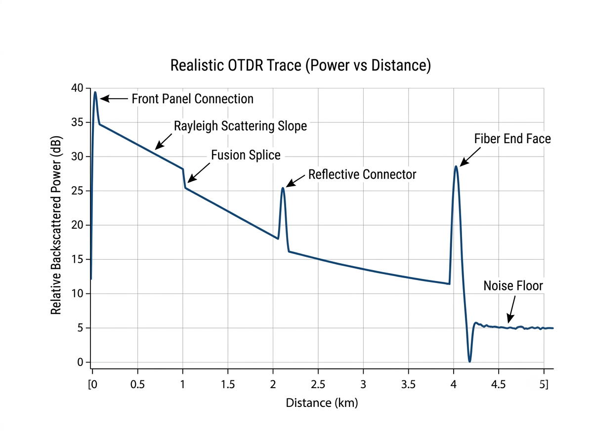
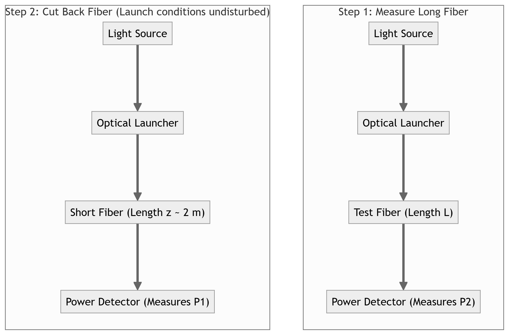

# Chapter 03: Signal Degradation in Optical Fibers

This chapter details the physical mechanisms responsible for signal degradation in optical fibers: **Attenuation** (power loss) and **Dispersion** (pulse broadening). It also covers fiber fabrication techniques, cabling methods, and optical measurement techniques, including the Optical Time Domain Reflectometer (OTDR).

---

## 1. Attenuation in Optical Fibers

### 1.1 Definition and Formula
Attenuation is the reduction in optical power as the light signal propagates through the optical fiber. It limits the maximum transmission distance (link reach) between the transmitter and receiver.
The attenuation coefficient $\alpha$ (expressed in $\text{dB/km}$) is defined as:
$$\alpha = \frac{10}{L} \log_{10}\left(\frac{P_{in}}{P_{out}}\right)$$
*Where:*
*   $P_{in}$ is the optical power launched at the input of the fiber ($W$ or $\text{mW}$).
*   $P_{out}$ is the optical power exiting the fiber at distance $L$ ($W$ or $\text{mW}$).
*   $L$ is the length of the optical fiber ($\text{km}$).

Alternatively, the output power can be expressed as:
$$P_{out} = P_{in} 10^{-\alpha L / 10}$$

### 1.2 Absorption Losses
Absorption is a material property where optical energy is converted into heat due to molecular resonances and impurities in the glass. It is categorized into two types:

#### A. Intrinsic Absorption
Intrinsic absorption is caused by the basic constituent materials of the glass (pure silica) and represents the absolute physical limit of transparency.
*   **Ultraviolet Absorption Edge:** Caused by electronic transitions of silica molecules from the valence band to the conduction band. The absorption decays exponentially with increasing wavelength and is negligible in the near-infrared region ($\lambda > 0.8\ \mu\text{m}$).
*   **Infrared Absorption Tail:** Caused by the vibrational resonances of the silicon-oxygen ($\text{Si-O}$) bonds. This absorption peak occurs around $9.0\ \mu\text{m}$, and its tail extends down to $\approx 1.6\ \mu\text{m}$, setting the upper limit of the usable infrared window.

#### B. Extrinsic Absorption
Extrinsic absorption is caused by impurities trapped in the glass during manufacturing.
*   **Transition Metal Ions:** Impurities such as Iron ($\text{Fe}^{2+}$), Copper ($\text{Cu}^{2+}$), Chromium ($\text{Cr}^{3+}$), and Nickel ($\text{Ni}^{2+}$) absorb light. To maintain losses below $1\ \text{dB/km}$, impurity concentrations must be kept under 1 part per billion (ppb).
*   **Hydroxyl ($\text{OH}^-$) Ions:** Caused by water vapor trapped in the silica glass. The $\text{OH}^-$ bond has a fundamental vibrational absorption at $2.73\ \mu\text{m}$, with overtones and combinational vibrations appearing as prominent "water peaks" at $950\text{ nm}$, $1240\text{ nm}$, and $1380\text{ nm}$.

### 1.3 Scattering Losses (Rayleigh Scattering)
Rayleigh scattering is the dominant loss mechanism in the low-loss window ($0.8\ \mu\text{m}$ to $1.6\ \mu\text{m}$).
*   **Physical Cause:** Caused by microscopic, sub-wavelength localized density and composition fluctuations frozen into the silica glass lattice when it cools from a molten state. These fluctuations create localized variations in the refractive index that scatter light in all directions.
*   **Wavelength Dependence:** The scattering loss coefficient $\alpha_{sc}$ varies inversely with the fourth power of the wavelength:
    $$\alpha_{sc} \propto \frac{1}{\lambda^4}$$
    *Consequence:* Doubling the operating wavelength reduces Rayleigh scattering loss by a factor of 16 ($2^4$).

### 1.4 Bending Losses
Bending losses occur when the optical fiber is bent, allowing guided modes to radiate power into the cladding.

#### A. Macrobending Losses
*   **Mechanism:** Occurs when the fiber has a visible curvature (bend radius of a few centimeters). Along a curved path, the phase velocity of the cladding evanescent field must exceed the speed of light in the cladding to keep up with the core field. Since this is physically impossible, the portion of the wave exceeding this limit breaks away and radiates into the cladding.
*   **Ray-Optics view:** At the outer curve of the bend, the angle of incidence of the propagating ray falls below the critical angle ($\theta_i < \theta_c$), causing the ray to refract out of the core rather than undergo total internal reflection.

#### B. Microbending Losses
*   **Mechanism:** Caused by microscopic, high-frequency axial deviations (roughness) of the fiber axis, typically having amplitudes of a few microns and periods of a few millimeters.
*   **Cause:** Caused by lateral mechanical pressures or stresses applied to the fiber during cabling or winding on a spool.
*   **Consequence:** These small bends couple power from lower-order guided modes into higher-order modes and radiation modes, which escape into the cladding.

### 1.5 Cabling of Optical Fibers
Before deployment in the field, fragile glass fibers must be housed within cables. The primary reasons for cabling are:
*   **Mechanical Protection:** Glass has high tensile strength but is highly susceptible to micro-cracks and shear fractures. Cables use strength members (e.g., Kevlar, steel wire) to bear tensile loads during pulling.
*   **Environmental Shielding:** Cables protect the fiber from moisture, hydrogen gas penetration (which causes absorption), temperature variations, and chemical attack.
*   **Microbending Mitigation:** Buffering tubes (loose or tight buffer designs) isolate the fiber from external lateral pressures, maintaining low attenuation.

---

## 2. Optical Transmission Windows

Optical fiber communication operates in specific near-infrared spectral regions where silica glass exhibits low loss.

| Transmission Window | Wavelength Range | Typical Attenuation | Dispersion Characteristic | Typical Application |
| :--- | :--- | :--- | :--- | :--- |
| **First Window** | $800 \text{ to } 900\text{ nm}$ | $\approx 2.0 \text{ to } 3.0\ \text{dB/km}$ | High chromatic dispersion | Short-reach LANs, GaAs LEDs/VCSELs |
| **Second Window (O-band)** | $1260 \text{ to } 1360\text{ nm}$ | $\approx 0.4\ \text{dB/km}$ | Zero chromatic dispersion | Medium-haul networks, standard SMF |
| **Third Window (C-band)** | $1530 \text{ to } 1565\text{ nm}$ | $\approx 0.2\ \text{dB/km}$ | Minimum loss window, high dispersion | Long-haul, DWDM systems with EDFAs |

---

## 3. Dispersion and Pulse Broadening

Dispersion is the temporal spreading of light pulses as they travel along the fiber. If pulses spread too much, they overlap with adjacent pulses, causing **Inter-Symbol Interference (ISI)**. This increases the Bit Error Rate (BER) and limits the bandwidth-distance product of the link.

### 3.1 Intermodal Dispersion
Intermodal dispersion occurs only in multimode fibers and is caused by different guided modes traveling at different group velocities.

#### A. Derivation of Delay Difference ($\Delta t_{modal}$) in a Step-Index Multimode Fiber
Consider a step-index fiber of length $L$ with core index $n_1$ and cladding index $n_2$.
1.  **Fastest Ray:** Travels straight along the fiber axis ($z$-axis). The time taken $t_{min}$ is:
    $$t_{min} = \frac{L}{v_1} = \frac{n_1 L}{c}$$
    *(where $v_1 = c/n_1$ is the velocity of light in the core).*
2.  **Slowest Ray:** Propagates at the steepest angle relative to the axis, which is the critical angle of total internal reflection ($\theta_c$). The ray travels a total path length of $L / \sin\theta_c$. The time taken $t_{max}$ is:
    $$t_{max} = \frac{L / \sin\theta_c}{v_1} = \frac{n_1 L}{c \sin\theta_c}$$
3.  Substitute the critical angle relationship $\sin\theta_c = n_2/n_1$:
    $$t_{max} = \frac{n_1^2 L}{n_2 c}$$
4.  The total delay difference $\Delta t_{modal}$ between the slowest and fastest modes is:
    $$\Delta t_{modal} = t_{max} - t_{min} = \frac{n_1^2 L}{n_2 c} - \frac{n_1 L}{c} = \frac{n_1 L}{c} \left( \frac{n_1 - n_2}{n_2} \right)$$
5.  Using the relative index difference $\Delta \approx \frac{n_1 - n_2}{n_1} \approx \frac{n_1 - n_2}{n_2}$:
    $$\Delta t_{modal} \approx \frac{n_1 L}{c}\Delta$$
6.  Expressing this in terms of the Numerical Aperture ($\text{NA} \approx n_1\sqrt{2\Delta} \implies \Delta \approx \text{NA}^2 / 2n_1^2$):
    $$\Delta t_{modal} \approx \frac{L (\text{NA})^2}{2 n_1 c}$$

#### B. RMS Pulse Broadening ($\sigma_{modal}$)
If we assume the optical power is distributed uniformly across all modes, the root-mean-square (RMS) pulse broadening due to intermodal dispersion is:
$$\sigma_{modal} = \frac{\Delta t_{modal}}{2\sqrt{3}} \approx \frac{n_1 L \Delta}{2\sqrt{3} c}$$

### 3.2 Intramodal (Chromatic) Dispersion
Intramodal dispersion occurs in all fibers (including single-mode fibers) and is caused by the spectral components of a single mode propagating at different group velocities. The total chromatic dispersion is the sum of material and waveguide dispersion.
$$\tau = D \cdot L \cdot \sigma_\lambda$$
*Where:*
*   $\tau$ is the pulse broadening (ps).
*   $D$ is the chromatic dispersion coefficient ($\text{ps/(nm}\cdot\text{km)}$).
*   $\sigma_\lambda$ is the spectral width of the light source (nm).

#### A. Material Dispersion ($D_M$)
Material dispersion is caused by the wavelength-dependence of the refractive index of the silica glass ($n_1(\lambda)$). Different spectral components of the source see different refractive indices and travel at different velocities.
$$D_M = -\frac{\lambda}{c} \left( \frac{d^2 n_1}{d\lambda^2} \right)$$

#### B. Waveguide Dispersion ($D_W$)
Waveguide dispersion is a geometric effect. It arises because the distribution of optical power in a mode between the core and the cladding varies with wavelength.
$$D_W = -\frac{n_2 \Delta}{c \lambda} V \frac{d^2(Vb)}{dV^2}$$
*(where $b$ is the normalized propagation constant and $V$ is the normalized frequency).*

### 3.3 Dispersion-Engineered Single-Mode Fibers
By modifying the refractive index profile of the fiber core, the waveguide dispersion $D_W$ (which is typically negative) can be tailored to cancel or shift the material dispersion $D_M$.

*   **Dispersion-Shifted Fiber (DSF):** The zero-dispersion wavelength is shifted from $1310\text{ nm}$ to $1550\text{ nm}$ to match the minimum attenuation window. This is achieved by using a triangular index profile to increase the negative waveguide dispersion.
*   **Dispersion-Flattened Fiber (DFF):** Uses multiple cladding layers (e.g., quadruple-clad coaxial profile) to keep the total chromatic dispersion extremely low ($< 2\ \text{ps/(nm}\cdot\text{km)}$) across the entire range from $1300\text{ nm}$ to $1600\text{ nm}$.

---

## 4. Fiber Fabrication Methods

Fabricating low-loss glass optical fibers requires a two-step process: producing a high-purity glass rod called a **preform**, and then drawing the fiber from this preform in a drawing tower.

### 4.1 Vapor-Phase Oxidation Techniques

#### A. Modified Chemical Vapor Deposition (MCVD)
*   **Process:** High-purity reactant gases ($\text{SiCl}_4, \text{GeCl}_4, \text{O}_2$) are passed inside a rotating hollow silica tube.
*   **Reaction:** An oxygen-hydrogen burner moves back and forth along the tube, heating it externally to $\approx 1600^\circ\text{C}$. This causes gas-phase reactions that deposit soot particles on the inner wall of the tube.
*   **Sintering:** The burner heats each deposited layer, sintering the soot into a solid, transparent glass layer.
*   **Collapse:** Once all core and cladding layers are deposited, the temperature is increased to $\approx 2000^\circ\text{C}$, collapsing the hollow tube into a solid glass preform rod.

#### B. Outside Vapor Deposition (OVD)
*   **Process:** Soot particles are deposited on the outside of a rotating mandrel (target rod) using a flame hydrolysis burner.
*   **Sintering & Mandrel Removal:** The mandrel is removed after deposition, leaving a porous, hollow soot preform. The preform is then placed in a consolidation furnace, dried with chlorine gas to remove water ($\text{OH}^-$ ions), and sintered into a solid glass preform.

#### C. Vapor Axial Deposition (VAD)
*   **Process:** Soot deposition occurs axially on the end of a seed rod rather than radially.
*   **Advantage:** Both core and cladding soot are deposited simultaneously using separate burners. The preform is pulled upward and sintered continuously, allowing for the fabrication of very long preforms.

### 4.2 Double-Crucible Method
*   **Process:** A direct melting process that bypasses the preform stage, used primarily for low-melting-point multicomponent glasses.
*   **Mechanism:** Core glass is placed in an inner crucible, and cladding glass is placed in a concentric outer crucible. The crucibles are heated, and the molten glasses flow out of concentric orifices at the bottom, forming a cladding-coated glass fiber that is drawn directly onto a spool.

---

## 5. Optical Measurements and OTDR

### 5.1 Optical Time Domain Reflectometer (OTDR)
An OTDR is an optoelectronic instrument used to characterize an optical fiber. it detects faults, splices, bends, and measures attenuation along the fiber from a single end.

#### A. Working Principle
The OTDR injects a high-power optical pulse into the fiber and measures the returning optical power as a function of time. The return signal is composed of:

1.  **Rayleigh Backscattering:** Continuous, low-level backscattered light caused by microscopic density fluctuations.
2.  **Fresnel Reflections:** Sharp, high-intensity reflections that occur when light encounters abrupt changes in the refractive index (e.g., at connectors, mechanical splices, or cleaved fiber ends). The reflection coefficient is:
    $$R = \left( \frac{n_1 - n_{ext}}{n_1 + n_{ext}} \right)^2$$

#### B. Trace Waveform and Analysis
An OTDR trace plots the backscattered power (in dB) against the distance along the fiber.

*   **Rayleigh Slope:** The attenuation coefficient of the fiber is determined from the slope of the linear backscatter regions: $\text{Slope} = \Delta P / \Delta z\ \text{dB/km}$.
*   **Non-Reflective Steps:** Indicate localized losses from fusion splices or macrobends.
*   **Reflective Peaks:** Indicate connectors, mechanical splices, or physical cracks.
*   **End of Fiber:** A final Fresnel peak followed by a drop in power to the receiver noise floor.

---

### 5.2 Attenuation Measurement: Cut-Back Method
The Cut-Back method is the standard technique for measuring the attenuation of an optical fiber.

1.  **Long Fiber Measurement:** Measure the output power $P_2(L)$ at the far end of the test fiber of length $L$.
2.  **Cut-Back:** Without altering the launch conditions at the input end, cut the fiber a few meters from the launcher.
3.  **Short Fiber Measurement:** Measure the output power $P_1(z)$ of this short segment (length $z \approx 2\text{ m}$).
4.  **Calculation:** The attenuation coefficient $\alpha$ is:
    $$\alpha = \frac{10}{L-z} \log_{10}\left(\frac{P_1(z)}{P_2(L)}\right)\ \text{dB/km}$$

---

### 5.3 Numerical Aperture (NA) Far-Field Measurement
The Numerical Aperture is measured by analyzing the far-field radiation pattern exiting the fiber.
1.  Light is launched into the fiber, and the exiting beam is projected onto a screen in the far field.
2.  A photodetector scans across the radiation pattern at a fixed distance $d$ from the fiber end, recording the optical intensity as a function of the angle $\theta$.
3.  The NA is calculated from the half-angle $\theta_{5\%}$ where the output intensity drops to $5\%$ of its peak on-axis value:
    $$\text{NA} = \sin(\theta_{5\%})$$

---

## 6. Worked Practice Problems

### Problem 6.1: Intermodal Dispersion
An optical link of length $L = 6\text{ km}$ consists of a multimode step-index fiber. The core refractive index is $n_1 = 1.50$ and the relative index difference is $\Delta = 1.0\%$. Estimate:
1.  The intermodal delay difference ($\Delta t_{modal}$) between the slowest and fastest modes.
2.  The RMS pulse broadening ($\sigma_{modal}$) due to intermodal dispersion.

**Solution:**
**1. Given Data:**
*   $L = 6\text{ km} = 6 \times 10^3\text{ m}$
*   $n_1 = 1.50$
*   $\Delta = 1.0\% = 0.01$
*   $c \approx 3 \times 10^8\text{ m/s}$

**2. Formula for Intermodal Delay Difference:**
$$\Delta t_{modal} = \frac{n_1 L}{c} \Delta$$

**3. Substitution:**
$$\Delta t_{modal} = \frac{1.50 \times (6 \times 10^3\text{ m})}{3 \times 10^8\text{ m/s}} \times 0.01$$
$$\Delta t_{modal} = \frac{9000}{3 \times 10^8} \times 0.01 = 3 \times 10^{-5} \times 0.01 = 3 \times 10^{-7}\text{ s} = 300\text{ ns}$$

**4. Formula for RMS Pulse Broadening:**
$$\sigma_{modal} = \frac{\Delta t_{modal}}{2\sqrt{3}}$$

**5. Calculation:**
$$\sigma_{modal} = \frac{300\text{ ns}}{2\sqrt{3}} = \frac{300}{3.464} \approx 86.6\text{ ns}$$

**Final Answer:**
1.  The intermodal delay difference is **$300\text{ ns}$**.
2.  The RMS pulse broadening is **$86.6\text{ ns}$**.

---

### Problem 6.2: Attenuation Coefficient
A $2\text{ km}$ length of optical fiber has an input power of $P_{in} = 500\ \mu\text{W}$ and an output power of $P_{out} = 250\ \mu\text{W}$. Calculate the attenuation coefficient of the fiber.

**Solution:**
**1. Given Data:**
*   $L = 2\text{ km}$
*   $P_{in} = 500\ \mu\text{W}$
*   $P_{out} = 250\ \mu\text{W}$

**2. Formula:**
$$\alpha = \frac{10}{L} \log_{10}\left(\frac{P_{in}}{P_{out}}\right)$$

**3. Substitution:**
$$\alpha = \frac{10}{2} \log_{10}\left(\frac{500}{250}\right)$$
$$\alpha = 5 \log_{10}(2)$$
$$\alpha = 5 \times 0.301 = 1.505\ \text{dB/km}$$

**Final Answer:**
The attenuation coefficient of the fiber is **$1.51\ \text{dB/km}$**.

---

## 7. Fiber Connectors, Joints, and GRIN-rod Lenses (Q3.8) [5M][★★★★]

Efficiently linking fibers requires specialized mechanical and optical components to minimize coupling losses and maintain alignment.

### 7.1 GRIN-rod Lenses (Graded-Index Rod Lenses)
A **GRIN-rod lens** is a cylindrical glass rod with a refractive index profile that decreases continuously and parabolically from the central axis outward.
*   **Working Principle:** Unlike conventional lenses which use curved glass-air interfaces to refract light, a GRIN-rod lens uses internal index grading to bend light rays continuously along sinusoidal paths.
*   **Dimensions:** The majority of GRIN-rod lenses are very compact, with typical diameters in the range of **0.5 to 2 mm**.
*   **Alignment Position:** The output face of the transmitting fiber is positioned exactly at the **focal length** (on or near the opposite lens face) of the GRIN-rod lens. This alignment collimates the light, producing a parallel beam with a low divergent angle of between **1 and 5 degrees**, which minimizes longitudinal misalignment effects.

### 7.2 Lens-Coupled Expanded-Beam Connectors
Expanded-beam connectors use a pair of lenses (often GRIN-rod lenses) to collimate the light exiting the transmitting fiber, letting it cross a small air gap as a wide parallel beam before a second lens focuses it back into the receiving fiber core.
*   **Insertion Loss:** Lens-coupled expanded-beam connectors exhibit average losses of **0.7 dB** for both single-mode and graded-index fibers.
*   **Divergence Factors:** Several factors cause the collimated beam exiting a GRIN-rod lens to diverge:
    1.  *Refractive Index Profile:* Non-ideal parabolic index distributions.
    2.  *Chromatic Aberration:* Different wavelengths focus at slightly different spots.
    3.  *Size of Fiber Core:* A larger core deviates from a perfect point source at the focal point.
    *   *Note on Lens Cut Length:* The **lens cut length** determines the collimation state (e.g. quarter-pitch length for collimation) but is a fixed design property; it is not a dynamic factor causing random beam divergence in an aligned lens.

