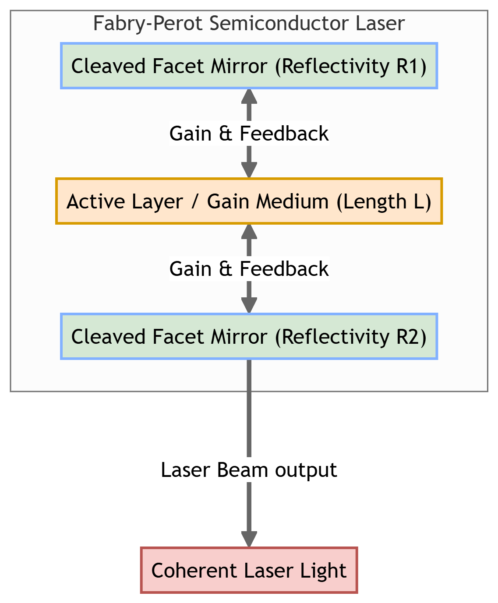
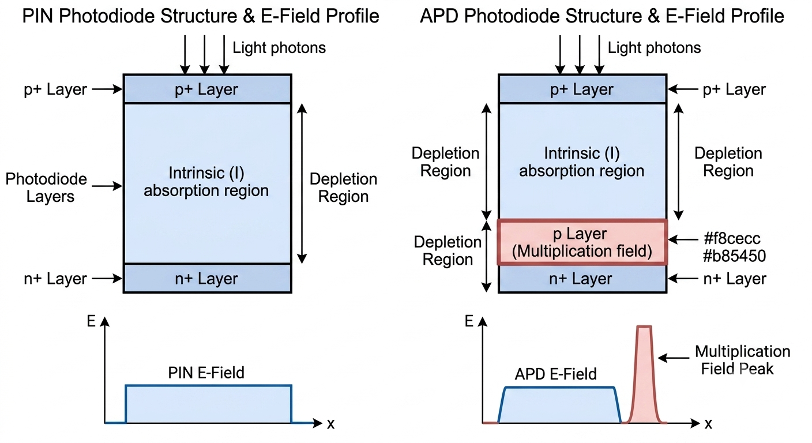
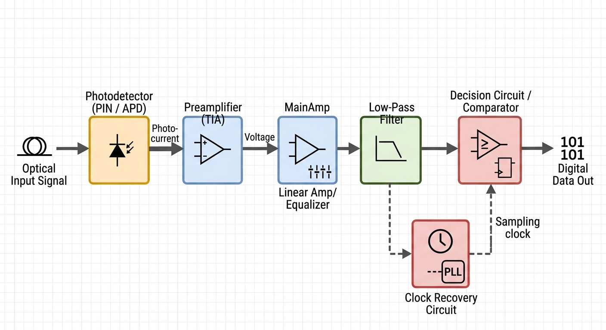

# Chapter 04: Optical Sources & Detectors

This chapter compiles study materials for **Unit IV: Optical Sources & Detectors**. It covers the working principles of optical sources (LEDs and Lasers) and photodetectors (PIN and APD), receiver noise mechanisms, and the design equations for optical links (link power budget, rise-time budget, and the quantum limit).

---

## 1. Optical Sources (LEDs vs. Laser Diodes)

Optical transmitters convert electrical signals into optical signals. The two primary semiconductor light sources used in optical fiber communication are Light Emitting Diodes (LEDs) and Laser Diodes (LDs).

### 1.1 Comparison Table

| Feature / Criteria | Light Emitting Diode (LED) | Laser Diode (LD) |
| :--- | :--- | :--- |
| **Emission Process** | Spontaneous emission (recombination of carriers without external trigger). | Stimulated emission (excited carriers triggered by incident photons). |
| **Light Output** | Incoherent light. | Highly coherent light (in-phase wavefronts). |
| **Spectral Width ($\Delta\lambda$)** | Broad ($30 \text{ to } 50\text{ nm}$). | Narrow ($< 1 \text{ to } 3\text{ nm}$ or single-frequency). |
| **Output Power** | Low (microwatts to a few milliwatts). | High (tens of milliwatts to watts). |
| **Coupling Efficiency** | Low (isotropic, Lambertian emission pattern). | High (directional, well-defined, narrow beam). |
| **Modulation Bandwidth** | Lower (up to a few hundred MHz). | Very high (up to tens of GHz). |
| **Temperature Sensitivity** | Low. | High (requires thermoelectric cooling). |
| **Lifespan & Reliability** | Extremely high, long lifetime. | High, but shorter than LEDs due to high current density. |
| **Typical Applications** | Short-reach links, local area networks (LANs). | Long-haul telecom, high-speed DWDM, CATV. |

---

### 1.2 Population Inversion
In a semiconductor at thermal equilibrium, most electrons reside in the lower energy state (valence band), and the higher energy state (conduction band) is mostly empty.
*   **Definition:** **Population Inversion** is a non-equilibrium state where the population of electrons in the conduction band (higher energy level) exceeds the population of electrons in the valence band (lower energy level).
*   **Mechanism:** Achieved by heavily doping the p-type and n-type regions to form a p-n junction, and applying a high forward bias (pumping) that injects a high density of electrons and holes into the thin active region.
*   **Significance:** It is the fundamental prerequisite for lasing. Without population inversion, incident photons are absorbed; with population inversion, stimulated emission dominates over absorption, resulting in optical gain (amplification).

---

### 1.3 Derivation of Lasing Threshold Gain Condition
Consider a semiconductor laser with an active cavity of length $L$, bounded by two cleaved facets serving as partially reflecting mirrors with power reflectivities $R_1$ and $R_2$.

1.  **Propagation Gain and Loss:** Let $g$ be the optical gain coefficient per unit length and $\alpha_t$ represent the total internal absorption and scattering loss coefficient per unit length. As an optical wave propagates in the $z$-direction, its intensity grows according to:
    $$I(z) = I(0) e^{(g - \alpha_t) z}$$
2.  **Round-Trip Propagation:** In a complete round-trip through the cavity, the wave travels a distance of $2L$ and undergoes reflections from both facets. The intensity after one round-trip is:
    $$I(2L) = I(0) R_1 R_2 e^{2(g - \alpha_t) L}$$
3.  **Lasing Threshold:** Lasing occurs when the round-trip optical gain exactly compensates for the round-trip cavity losses, allowing the wave to maintain its intensity:
    $$I(2L) = I(0) \implies R_1 R_2 e^{2(g_{th} - \alpha_t) L} = 1$$
    *(where $g_{th}$ is the threshold gain).*
4.  Taking the natural logarithm on both sides:
    $$2(g_{th} - \alpha_t) L = \ln\left(\frac{1}{R_1 R_2}\right)$$
    $$g_{th} - \alpha_t = \frac{1}{2L} \ln\left(\frac{1}{R_1 R_2}\right)$$
5.  Rearranging to solve for threshold gain $g_{th}$:
    $$g_{th} = \alpha_t + \frac{1}{2L} \ln\left(\frac{1}{R_1 R_2}\right)$$
*Conclusion:* The threshold gain $g_{th}$ must equal the sum of the internal medium losses ($\alpha_t$) and the mirror mirror-facet transmission losses ($\frac{1}{2L} \ln(1/R_1 R_2)$).

---

## 2. Optical Detectors (PIN vs. APD)

Photodetectors convert optical power into electrical current. The two main semiconductor detectors are PIN photodiodes and Avalanche Photodiodes (APDs).

### 2.1 Comparison Table

| Feature / Criteria | PIN Photodiode | Avalanche Photodiode (APD) |
| :--- | :--- | :--- |
| **Structure** | P-type and N-type layers separated by a wide intrinsic (I) region. | P-I-N structure with an additional high-field multiplication region. |
| **Internal Gain ($M$)** | None ($M = 1$). | High internal gain ($M \approx 50 \text{ to } 100$). |
| **Responsivity ($R$)** | Moderate ($0.6 \text{ to } 0.9\ \text{A/W}$). | High ($10 \text{ to } 100\ \text{A/W}$ due to gain $M$). |
| **Reverse Bias Voltage** | Low ($5 \text{ to } 15\ \text{V}$). | High ($100 \text{ to } 300\ \text{V}$). |
| **Receiver Sensitivity** | Moderate. | High ($10 \text{ to } 15\ \text{dB}$ higher than PIN). |
| **Noise Profile** | Low; limited by thermal noise of external circuits. | High; exhibits excess avalanche multiplication noise. |
| **Typical Applications** | Short/medium-reach links, LANs, receiver cards. | Long-haul transmission, undersea links, high-speed Rx. |

---

### 2.2 APD Impact Ionization and Multiplication Mechanism
An Avalanche Photodiode provides internal gain through carrier multiplication in a high electric field region.
*   **Mechanism:** The APD is operated under a high reverse bias voltage, creating an extremely strong electric field ($> 10^5\ \text{V/cm}$) across a dedicated multiplication region.
*   **Impact Ionization:** When an incident photon generates a primary electron-hole pair in the absorption region, the electron is accelerated by the high electric field. As it traverses the multiplication region, it collides with lattice atoms. If the electron has sufficient kinetic energy, it excites an electron from the valence band to the conduction band, creating a secondary electron-hole pair.
*   **Avalanche Effect:** The newly generated carriers are also accelerated by the electric field and initiate further impact ionization events, creating a cascade (avalanche) process.
*   **Gain Factor ($M$):** The total multiplication factor is defined as:
    $$M = \frac{I_{out}}{I_{primary}}$$

---

### 2.3 Detector Material Selection for the $1550\text{ nm}$ Window
The absorption of light in a photodetector is governed by the semiconductor bandgap energy $E_g$. A photon is absorbed only if its energy exceeds the bandgap: $h\nu \ge E_g \implies \frac{hc}{\lambda} \ge E_g$.
The **cutoff wavelength** $\lambda_c$ is:
$$\lambda_c = \frac{hc}{E_g} \approx \frac{1.24}{E_g(\text{eV})}\ \mu\text{m}$$

*   **Silicon (Si) Unsuitability:** Silicon has a bandgap energy $E_g \approx 1.1\ \text{eV}$, corresponding to a cutoff wavelength $\lambda_c \approx 1.1\ \mu\text{m}$. Since photons in the $1550\text{ nm}$ transmission window ($\lambda = 1.55\ \mu\text{m}$, energy $E \approx 0.8\ \text{eV}$) do not have enough energy to excite electrons across Silicon's bandgap, Si is transparent to this wavelength and cannot detect it.
*   **Preferred Materials:** **Indium Gallium Arsenide (InGaAs)** ($E_g \approx 0.73\ \text{eV}$, $\lambda_c \approx 1.7\ \mu\text{m}$) and **Germanium (Ge)** ($E_g \approx 0.67\ \text{eV}$, $\lambda_c \approx 1.85\ \mu\text{m}$) are preferred. InGaAs is highly favored for long-haul networks because of its high quantum efficiency ($> 80\%$) and low dark current.

---

## 3. Detector Responsivity & Quantum Efficiency

### 3.1 Quantum Efficiency ($\eta$)
Quantum efficiency is the fraction of incident photons that generate electron-hole pairs collected at the detector terminals:
$$\eta = \frac{\text{Electron generation rate}}{\text{Photon incident rate}} = \frac{I_p / e}{P_{in} / h\nu} = \frac{I_p h \nu}{e P_{in}}$$
*Where:*
*   $I_p$ is the photogenerated current (photocurrent).
*   $P_{in}$ is the incident optical power.
*   $e$ is the electron charge ($1.602 \times 10^{-19}\text{ C}$).
*   $h\nu$ is the energy of a single photon.

### 3.2 Responsivity ($R$)
Responsivity is the ratio of output photocurrent to incident optical power, representing the conversion efficiency:
$$R = \frac{I_p}{P_{in}}$$
Using the formula for quantum efficiency:
$$\eta = \frac{I_p h \nu}{e P_{in}} \implies I_p = \frac{\eta e P_{in}}{h\nu}$$
Substitute $I_p$ into the responsivity definition:
$$R = \frac{\eta e}{h\nu} = \frac{\eta e \lambda}{hc}$$
Substituting values for $e$, $h$, and $c$, and expressing $\lambda$ in micrometers ($\mu\text{m}$):
$$R \approx \frac{\eta \lambda(\mu\text{m})}{1.24}\ \text{A/W}$$

---

## 4. Optical Receivers & Noise Sources

### 4.1 Digital Receiver Block Diagram
A digital optical receiver converts optical pulses back into electrical data:

1.  **Photodetector:** PIN or APD converts the incident optical power waveform into a photocurrent.
2.  **Preamplifier:** Amplifies the weak photocurrent, converting it to a voltage while minimizing noise (usually transimpedance design).
3.  **Linear Channel (Equalizer & Main Amp):** Amplifies the signal and shapes the pulses (using an equalizer) to reduce inter-symbol interference.
4.  **Filter:** Restricts the bandwidth of the signal to reject out-of-band noise.
5.  **Decision Circuit:** A comparator samples the signal at clock intervals (reconstructed by a clock recovery circuit) to determine if a "1" or "0" was transmitted.

---

### 4.2 Noise Sources
The performance of a receiver is limited by noise, which fluctuates the electrical signal level at the decision circuit.

#### A. Shot Noise
Shot noise is a fundamental, signal-dependent noise caused by the discrete, random arrival of photons and generation of carrier pairs. The mean-square shot noise current is:
$$\langle i_{shot}^2 \rangle = 2e(I_p + I_d) M^2 F(M) B$$
*Where:*
*   $I_p$ is the signal photocurrent.
*   $I_d$ is the dark current (current flowing when no light is incident).
*   $M$ is the APD gain (for PIN, $M=1, F(M)=1$).
*   $F(M)$ is the excess noise factor ($F(M) \approx M^x$, where $0 < x \le 1$).
*   $B$ is the receiver bandwidth.

#### B. Thermal Noise (Johnson Noise)
Thermal noise is caused by the random thermal motion of electrons in the receiver load resistor $R_L$:
$$\langle i_{thermal}^2 \rangle = \frac{4 k_B T B}{R_L}$$
*Where $k_B$ is Boltzmann's constant and $T$ is the absolute temperature.*

#### C. Amplifier Noise
Noise generated by active transistors in the preamplifier stage, represented by a noise figure.

---

## 5. Optical Link Design

### 5.1 Link Power Budget
The **Link Power Budget** ensures that the optical transmitter launches sufficient power to overcome all link losses and deliver adequate power to the receiver.
*   **Design Equation:**
    $$P_T - P_R = \alpha L + \alpha_{sp} N_{sp} + \alpha_c N_c + M_s$$
    *Where:*
    *   $P_T$ is the transmitter launched power ($\text{dBm}$).
    *   $P_R$ is the receiver sensitivity required to maintain a target BER ($\text{dBm}$).
    *   $\alpha$ is the fiber attenuation coefficient ($\text{dB/km}$).
    *   $L$ is the fiber length ($\text{km}$).
    *   $\alpha_{sp}$ and $N_{sp}$ are the loss per splice ($\text{dB}$) and number of splices.
    *   $\alpha_c$ and $N_c$ are the loss per connector ($\text{dB}$) and number of connectors.
    *   $M_s$ is the system safety margin (typically $3 \text{ to } 6\ \text{dB}$, accounting for component aging).

---

### 5.2 Rise-Time Budget
The **Rise-Time Budget** ensures the system is fast enough to support the target transmission speed, preventing dispersion-induced pulse overlap.
*   **Design Equation:**
    $$t_{sys} = \left( t_{tx}^2 + t_{mat}^2 + t_{mod}^2 + t_{rx}^2 \right)^{1/2}$$
    *Where:*
    *   $t_{tx}$ is the transmitter rise-time (determined by source electronics).
    *   $t_{mat}$ is the material dispersion rise-time: $t_{mat} = D_M \cdot L \cdot \Delta\lambda$.
    *   $t_{mod}$ is the modal dispersion rise-time: $t_{mod} = \Delta t_{modal}$.
    *   $t_{rx}$ is the receiver rise-time: $t_{rx} = 350 / B_{rx}\ \text{ps}$ (where $B_{rx}$ is the receiver electrical bandwidth in MHz).
*   **System Limits:**
    *   For NRZ coding: $t_{sys} \le 0.7 T = \frac{0.7}{B_T}$
    *   For RZ coding: $t_{sys} \le 0.35 T = \frac{0.35}{B_T}$
    *(where $T$ is the bit period and $B_T$ is the bit rate).*

---

### 5.3 Quantum Limit of Detection
The quantum limit is the minimum number of photons required per pulse to achieve a target Bit Error Rate (BER) in an ideal receiver (zero thermal noise, zero dark current, and $100\%$ quantum efficiency).
1.  **Poisson Distribution:** The probability of generating $n$ electron-hole pairs from a pulse containing an average of $N_p$ photons is given by the Poisson distribution:
    $$P(n) = \frac{N_p^n e^{-N_p}}{n!}$$
2.  **Bit Errors:** In digital transmission, we assume a "0" bit contains no photons. An error occurs only when a "1" bit is transmitted, but it generates $0$ electron-hole pairs, causing the receiver to register a "0" (a miss).
3.  The probability of error $P_e$ (detecting 0 electrons when a "1" is sent) is:
    $$P_e = P(0) = \frac{N_p^0 e^{-N_p}}{0!} = e^{-N_p}$$
4.  For a target BER of $10^{-9}$:
    $$e^{-N_p} = 10^{-9} \implies -N_p = \ln(10^{-9}) \implies N_p \approx 20.7 \approx 21\text{ photons}$$
*Conclusion:* An ideal receiver requires an average of at least **21 photons** per "1" pulse to achieve a Bit Error Rate of $10^{-9}$.

---

## 6. Worked Practice Problems

### Problem 6.1: Quantum Efficiency & Responsivity
When $3 \times 10^{11}$ photons of wavelength $0.85\ \mu\text{m}$ are incident on a photodiode, an average of $1.2 \times 10^{11}$ electrons are collected at the terminals. Calculate:
1.  The quantum efficiency ($\eta$) of the photodiode.
2.  The responsivity ($R$) of the photodiode at $0.85\ \mu\text{m}$.

**Solution:**
**1. Given Data:**
*   Number of incident photons = $3 \times 10^{11}$
*   Number of collected electrons = $1.2 \times 10^{11}$
*   Wavelength ($\lambda$) = $0.85\ \mu\text{m}$

**2. Calculate Quantum Efficiency ($\eta$):**
$$\eta = \frac{\text{Collected electrons}}{\text{Incident photons}} = \frac{1.2 \times 10^{11}}{3 \times 10^{11}} = 0.40 = 40\%$$

**3. Formula for Responsivity ($R$):**
$$R = \frac{\eta \lambda(\mu\text{m})}{1.24}$$

**4. Calculation:**
$$R = \frac{0.40 \times 0.85}{1.24} = \frac{0.34}{1.24} \approx 0.274\ \text{A/W}$$

**Final Answer:**
1.  The quantum efficiency is **$40\%$**.
2.  The responsivity is **$0.274\ \text{A/W}$**.

---

### Problem 6.2: Link Power Budget
An optical fiber link is $50\text{ km}$ long. The optical source launches a power of $P_T = -3\text{ dBm}$ into the fiber. The fiber attenuation is $\alpha = 0.25\text{ dB/km}$. The link includes 5 splices with a loss of $0.1\text{ dB}$ each, and 2 connectors with a loss of $0.5\text{ dB}$ each. If the system safety margin is $4\text{ dB}$, calculate the minimum receiver sensitivity ($P_R$) required for the link to operate.

**Solution:**
**1. Given Data:**
*   $L = 50\text{ km}$
*   $P_T = -3\text{ dBm}$
*   $\alpha = 0.25\text{ dB/km}$
*   $N_{sp} = 5$, $\alpha_{sp} = 0.1\text{ dB}$
*   $N_c = 2$, $\alpha_c = 0.5\text{ dB}$
*   $M_s = 4\text{ dB}$

**2. Formula:**
$$P_T - P_R = \alpha L + N_{sp}\alpha_{sp} + N_c\alpha_c + M_s$$

**3. Calculate Total Link Loss:**
$$\text{Total Loss} = (0.25 \times 50) + (5 \times 0.1) + (2 \times 0.5) + 4$$
$$\text{Total Loss} = 12.5 + 0.5 + 1.0 + 4 = 18.0\text{ dB}$$

**4. Calculate Receiver Sensitivity ($P_R$):**
$$-3\text{ dBm} - P_R = 18.0\text{ dB}$$
$$-P_R = 18.0 + 3 \implies P_R = -21.0\text{ dBm}$$

**Final Answer:**
The minimum receiver sensitivity required is **$-21.0\text{ dBm}$** (any receiver with sensitivity $\le -21\text{ dBm}$ will work).
