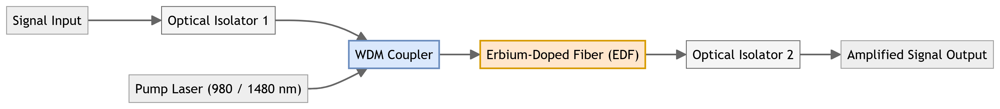
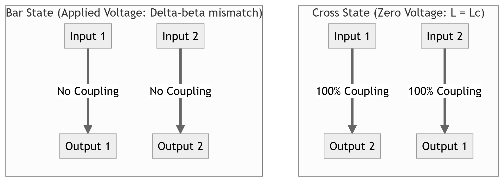
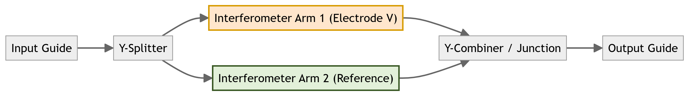
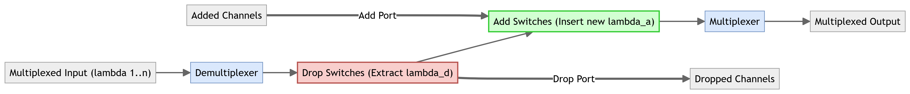
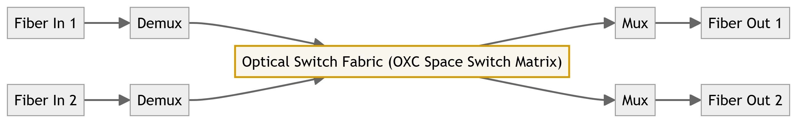
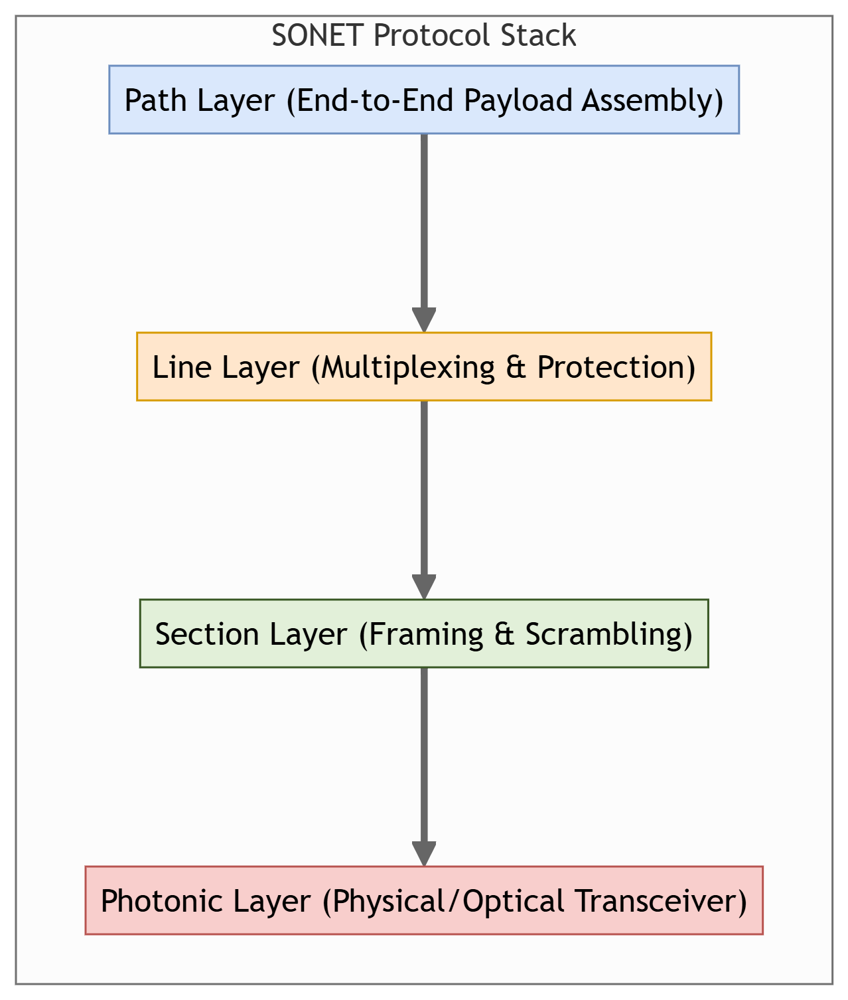

# Chapter 05: Optical Switches & Amplifiers

This chapter compiles study materials and detailed exam answers for **Unit V: Optical Switches & Amplifiers** (including WDM systems and networks). It covers optical amplifiers (EDFA and Raman), Coupled Mode Theory in directional couplers, Lithium Niobate electro-optic switches, WDM/DWDM systems, WDM network elements (OADM, OXC, RWA, wavelength conversion), and SONET transport layouts.

---

## 1. Optical Amplifiers (EDFA vs. Raman Amplifiers)

Optical amplifiers amplify optical signals directly in the optical domain without electronic regeneration (optical-to-electrical-to-optical conversion). The two most important optical amplifiers are Erbium-Doped Fiber Amplifiers (EDFAs) and Raman Amplifiers.

### 1.1 Comparison Table

| Feature / Criteria | Erbium-Doped Fiber Amplifier (EDFA) | Raman Amplifier |
| :--- | :--- | :--- |
| **Gain Medium** | Silica fiber doped with Erbium ($\text{Er}^{3+}$) ions (lumped gain). | Standard transmission silica fiber (distributed gain). |
| **Amplification Mechanism** | Stimulated emission of excited Erbium ions. | Stimulated Raman Scattering (SRS) (pump photons transfer energy to signal photons). |
| **Gain Band** | Fixed; C-band ($1530 \text{ to } 1565\text{ nm}$) and L-band ($1565 \text{ to } 1625\text{ nm}$). | Highly flexible; can operate at any wavelength depending on the pump. |
| **Typical Pump Wavelengths** | $980\text{ nm}$ or $1480\text{ nm}$. | Must be $\approx 100\text{ nm}$ shorter than signal (Stokes shift $\approx 13.2\ \text{THz}$). |
| **Noise Figure** | Low ($3 \text{ to } 5\ \text{dB}$). | Extremely low (effectively negative or near-zero due to distributed gain). |
| **Pump Power Requirement** | Moderate ($10 \text{ to } 100\ \text{mW}$). | Very high ($100\text{ mW}$ to several Watts). |
| **Cost & Complexity** | Lower cost, simple design. | Higher cost, complex high-power pump lasers and controllers. |

---

### 1.2 Erbium-Doped Fiber Amplifier (EDFA)
EDFAs operate by exploiting the three-level energy transition system of Erbium ($\text{Er}^{3+}$) ions embedded in a silica fiber core.

*   **Pumping at $980\text{ nm}$:** Er$^{3+}$ ions are excited from the ground state ($^4I_{15/2}$) to the short-lived excited state ($^4I_{11/2}$). From there, they undergo rapid, non-radiative decay ($\approx 1\ \mu\text{s}$) to the metastable state ($^4I_{13/2}$).
*   **Pumping at $1480\text{ nm}$:** Er$^{3+}$ ions are excited directly from the ground state to the metastable state ($^4I_{13/2}$).
*   **Stimulated Emission:** The metastable state has a long lifetime ($\approx 10\text{ ms}$). This long lifetime allows a population inversion to build up between the metastable state and the ground state. When signal photons (in the $1550\text{ nm}$ band) pass through the fiber, they trigger stimulated transition of the Erbium ions from the metastable state back to the ground state, emitting coherent signal photons and providing optical gain.

---

### 1.3 Raman Amplifiers
*   **Mechanism:** Based on **Stimulated Raman Scattering (SRS)**, a non-linear process where an intense pump wave launched into the fiber interacts with the silica glass vibrational modes (optical phonons).
*   **Energy Transfer:** A pump photon of frequency $\nu_p$ is scattered by a silica molecule. The molecule absorbs a portion of the photon's energy as molecular vibrational energy (phonon of frequency $\nu_{vib}$), and the remaining energy is emitted as a lower-energy scattered photon of frequency $\nu_s = \nu_p - \nu_{vib}$ (Stokes frequency).
*   **Distributed Amplification:** If a signal co-propagates at the Stokes frequency, the transfer of energy from the pump to the signal occurs continuously along the transmission fiber, providing distributed optical gain.

---

## 2. Directional Couplers & Coupled Mode Analysis

A $2 \times 2$ directional coupler consists of two parallel optical waveguides fabricated close to each other, allowing power exchange through evanescent wave coupling.

### 2.1 Coupled Mode Formulation
Let $a_1(z)$ and $a_2(z)$ be the mode amplitudes in Waveguide 1 and Waveguide 2, respectively.
The coupled differential equations governing the propagation of mode amplitudes along the propagation direction $z$ are:
$$\frac{da_1}{dz} = -j\beta_1 a_1 - j\kappa a_2$$
$$\frac{da_2}{dz} = -j\beta_2 a_2 - j\kappa a_1$$
*Where:*
*   $\beta_1, \beta_2$ are the propagation constants of Waveguides 1 and 2.
*   $\kappa$ is the coupling coefficient between the two guides (determined by waveguide geometry, refractive index profile, and waveguide separation).

---

### 2.2 Derivation of Power Transfer for Phase-Matched Guides ($\beta_1 = \beta_2 = \beta$)
1.  Assume identical waveguides, so the phase mismatch is zero ($\Delta\beta = \beta_1 - \beta_2 = 0$).
2.  The coupled equations become:
    $$\frac{da_1}{dz} = -j\beta a_1 - j\kappa a_2 \quad \text{--- (Eq 5.1)}$$
    $$\frac{da_2}{dz} = -j\beta a_2 - j\kappa a_1 \quad \text{--- (Eq 5.2)}$$
3.  Assume power $P_0$ is launched into Waveguide 1 at $z=0$:
    $$a_1(0) = \sqrt{P_0}, \quad a_2(0) = 0$$
4.  Differentiating Eq 5.1 and substituting Eq 5.2:
    $$\frac{d^2a_1}{dz^2} + 2j\beta \frac{da_1}{dz} + (\beta^2 - \kappa^2) a_1 = 0$$
5.  Solving this second-order differential equation with the boundary conditions yields:
    $$a_1(z) = \sqrt{P_0} \cos(\kappa z) e^{-j\beta z}$$
    $$a_2(z) = -j \sqrt{P_0} \sin(\kappa z) e^{-j\beta z}$$
6.  The optical power in each waveguide is:
    $$P_1(z) = |a_1(z)|^2 = P_0 \cos^2(\kappa z)$$
    $$P_2(z) = |a_2(z)|^2 = P_0 \sin^2(\kappa z)$$

---

### 2.3 Coupling Length and Switching States
*   **Coupling Length ($L_c$):** The length required for $100\%$ power transfer from Guide 1 to Guide 2:
    $$\kappa L_c = \frac{\pi}{2} \implies L_c = \frac{\pi}{2\kappa}$$
*   **Cross State (ON):** The physical length of the coupler is chosen to be $L = L_c$. Light launched into Port 1 transfers completely to Port 2 (cross path).
*   **Bar State (OFF):** An external voltage is applied across electrodes. Through the electro-optic effect, the refractive index of one waveguide increases while the other decreases, creating a phase mismatch ($\Delta\beta = \beta_1 - \beta_2 \neq 0$). Under this condition, the power coupled into Guide 2 is:
    $$P_2(z) = P_0 \frac{\kappa^2}{\kappa^2 + (\Delta\beta/2)^2} \sin^2\left(\sqrt{\kappa^2 + (\Delta\beta/2)^2} z\right)$$
    By selecting the voltage such that $\sqrt{\kappa^2 + (\Delta\beta/2)^2} L = \pi$, the power coupled to Guide 2 drops to zero ($P_2(L) = 0$), forcing all light to exit through the launch guide Port 1 (bar path).

---

## 3. Electro-Optic Switches (Lithium Niobate MZI)

High-speed optical switches are fabricated on Lithium Niobate ($\text{LiNbO}_3$) substrates because of the material's strong linear electro-optic (Pockels) effect.

*   **Structure:** A Mach-Zehnder Interferometer (MZI) consists of an input Y-splitter that divides the optical power equally into two parallel waveguide arms. The arms run parallel over a length $L$ before recombining at an output Y-junction. Electrodes are deposited along the arms.
*   **Working Principle:**
    *   **Zero Voltage (Constructive Interference):** Light travels at the same speed in both arms, arriving in-phase at the output junction. The waves interfere constructively, exiting the device (ON state).
    *   **Applied Voltage (Destructive Interference):** A voltage is applied across the electrodes. The electric field induces a refractive index change $\Delta n \propto E$, which creates a relative phase difference $\Delta\phi$ between the arms:
        $$\Delta\phi = \frac{2\pi \Delta n L}{\lambda}$$
        By applying the **switching voltage** ($V_\pi$) that induces a phase difference of $\Delta\phi = \pi$, the waves interfere destructively at the output Y-junction, radiating the optical power into the substrate (OFF state).

---

## 4. WDM & DWDM Systems

Wavelength Division Multiplexing (WDM) combines multiple optical carrier signals of different wavelengths onto a single optical fiber, increasing the link's overall capacity.

### 4.1 Comparison Table

| Feature / Criteria | Coarse WDM (CWDM) | Dense WDM (DWDM) |
| :--- | :--- | :--- |
| **Channel Spacing** | Wide; typically $20\text{ nm}$. | Narrow; $\le 1.6\text{ nm}$ ($100\text{ GHz}$ or $50\text{ GHz}$ grids). |
| **Number of Channels** | Low; typically 8 to 16 channels. | High; 80 to $160+$ channels. |
| **Laser Requirements** | Uncooled, low-precision, inexpensive lasers. | Temperature-stabilized, high-precision DFB lasers. |
| **Optical Filters** | Wide bandpass filters, low cost. | Narrow bandpass filters, high performance. |
| **Typical Range** | Short-reach (metro access, LANs, $< 50\text{ km}$). | Long-haul, regional networks ($> 100\text{ km}$). |

---

### 4.2 WDM Components
*   **Multiplexer (MUX):** Combines multiple input wavelengths onto a single output fiber.
*   **Demultiplexer (DEMUX):** Separates the multiplexed wavelengths from a single input fiber onto separate output fibers.
*   **Fused Biconical Taper (FBT) Couplers:** Fabricated by fusing and stretching two parallel fibers. They act as splitters/combiners, separating or coupling power through evanescent wave overlap.

---

### 4.3 Unidirectional vs. Bidirectional WDM
*   **Unidirectional WDM:** Wavelengths propagate in a single direction along a fiber link. Two fibers are required for duplex communication (one fiber for transmit, one fiber for receive).
*   **Bidirectional WDM:** Wavelengths propagate in both directions along a single fiber (e.g., $\lambda_1, \lambda_2, \lambda_3$ transmit from West to East, and $\lambda_4, \lambda_5, \lambda_6$ transmit from East to West). This halves the required fiber count but requires optical filters to prevent crosstalk from backscattering.

---

## 5. Principles of WDM Networks

Wavelength-routed mesh networks operate by routing signals directly in the optical domain based on their wavelength.

### 5.1 Optical Add-Drop Multiplexers (OADM)
*   **Function:** Used at intermediate nodes to selectively *drop* (extract) one or more wavelength channels from a multiplexed fiber, and *add* new signals on those same wavelengths, while letting all other channels pass through transparently.

---

### 5.2 Optical Cross-Connects (OXC)
*   **Function:** Operates at core network nodes to route optical signals from any input port/fiber to any output port/fiber on a wavelength-by-wavelength basis. It performs space-division and wavelength routing entirely in the optical domain.

---

### 5.3 Routing and Wavelength Assignment (RWA) Problem
RWA is the challenge of routing an optical connection (lightpath) from source to destination and assigning a specific wavelength to it.
*   **Wavelength Continuity Constraint:** In a transparent optical network, a lightpath must use the same wavelength on all fiber links along its route. If no single wavelength is free along the entire path, the connection is blocked, even if individual links have free capacity.

---

### 5.4 Wavelength Conversion
*   **Definition:** Translates the carrier wavelength of an optical signal from $\lambda_1$ to $\lambda_2$ at a network node without converting it to the electrical domain.
*   **Significance:** It eliminates the wavelength continuity constraint. By allowing a lightpath to change wavelengths at intermediate nodes, wavelength conversion reduces blocking probability and increases network routing flexibility.

---

## 6. SONET Payload over WDM

SONET (Synchronous Optical Network) is a standard for synchronous data transmission over optical fibers. WDM networks transport SONET payloads transparently.

### 6.1 SONET Protocol Layers

*   **Photonic (Physical) Layer:** Manages physical transmission parameters, converting electrical signals into optical pulses.
*   **Section Layer:** Manages transmission over a single physical fiber link, handling framing, scrambling, and basic link error monitoring.
*   **Line Layer:** Manages transport between multiplexers, handling synchronization, protection switching, and payload multiplexing.
*   **Path Layer:** Manages end-to-end transport between path terminating equipment (PTE), handling packet assembly, payload mapping, and end-to-end error checking.
