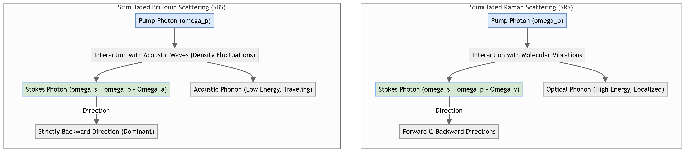
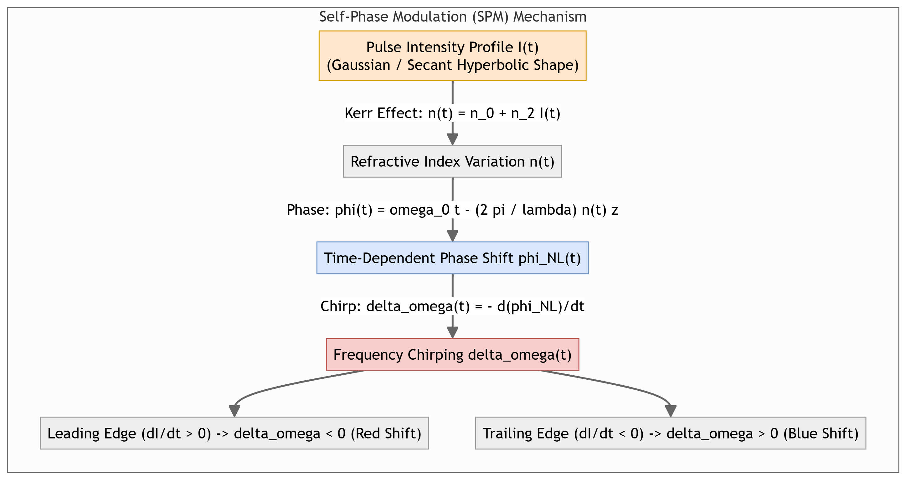
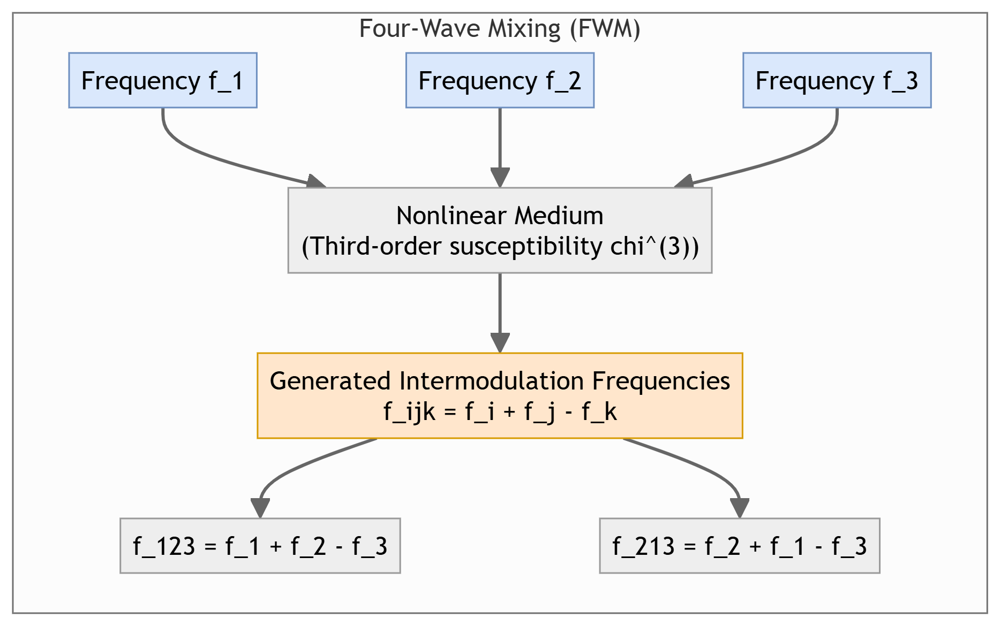
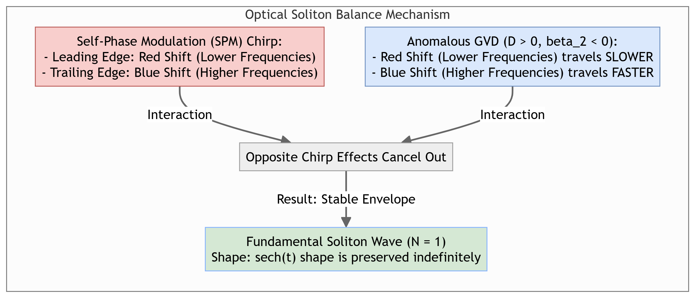

# Chapter 06: Nonlinear Effects

This chapter compiles study materials and detailed exam answers for **Unit VI: Nonlinear Effects** in optical fibers. It covers the Kerr effect (intensity-dependent refractive index), nonlinear scattering mechanisms (Stimulated Raman Scattering vs. Stimulated Brillouin Scattering), refractive-index-based nonlinearities (SPM, XPM, FWM), Group Velocity Dispersion (GVD), and the principles of optical soliton propagation in high-speed networks.

---

## 1. The Kerr Effect & Optical Refractive Index

The Kerr effect refers to the change in the refractive index of a material in response to an applied electric field, specifically showing a linear dependence on the optical intensity of the propagating lightwave (also known as the optical Kerr effect).

### 1.1 Mathematical Formulation
**[5M][★★★★★] Q6.1 (Kerr Effect Definition & Refractive Index Variation)**

*   **Definition:** In silica fibers, the refractive index $n$ experienced by an optical signal is intensity-dependent and is expressed as:
    $$n(I) = n_0 + n_2 I$$
    *   *Where:*
        *   $n_0$ is the linear refractive index of silica glass ($\approx 1.45 \text{ to } 1.48$).
        *   $n_2$ is the nonlinear refractive index coefficient of silica glass ($\approx 2.6 \times 10^{-20}\ \text{m}^2/\text{W}$).
        *   $I$ is the optical intensity in the fiber core, defined as:
            $$I = \frac{P}{A_{\text{eff}}}$$
            (with $P$ representing the optical power and $A_{\text{eff}}$ representing the effective mode-field area).
*   **Expression in terms of Power:**
    $$n(P) = n_0 + \bar{n}_2 P$$
    *   *Where:*
        *   $\bar{n}_2 = \frac{n_2}{A_{\text{eff}}}$ (in units of $\text{W}^{-1}\text{m}^{-1}$).

---

### 1.2 Nonlinear Phenomena Caused by the Kerr Effect
Because the refractive index fluctuates with power variations, several third-order susceptibility ($\chi^{(3)}$) nonlinear phenomena occur:
1.  **Self-Phase Modulation (SPM):** A single pulse alters its own phase profile, causing spectral broadening.
2.  **Cross-Phase Modulation (XPM):** The intensity fluctuations of one wavelength channel alter the phase of co-propagating channels, inducing inter-channel crosstalk.
3.  **Four-Wave Mixing (FWM):** Three channels beat together to generate new intermodulation sidebands, severely degrading WDM networks.

---

## 2. Nonlinear Scattering (SRS vs. SBS)

Nonlinear scattering effects involve the inelastic scattering of pump photons to lower-frequency Stokes photons, accompanied by the excitation of acoustic or optical vibrational states in the silica lattice.

### 2.1 Comparison Table
**[5M][★★★★★] Q6.3 (a) (SRS vs. SBS Mechanism & Comparison)**

| Feature / Criteria | Stimulated Raman Scattering (SRS) | Stimulated Brillouin Scattering (SBS) |
| :--- | :--- | :--- |
| **Physical Mechanism** | Interaction of light with optical molecular vibrations (optical phonons). | Interaction of light with acoustic density waves/sound waves (acoustic phonons). |
| **Phonon Energy** | High energy ($\approx 100\ \text{meV}$), localized molecular vibrations. | Low energy ($\approx 50\ \mu\text{eV}$), traveling acoustic wave. |
| **Scattering Direction** | Occurs in both **forward** and **backward** directions. | Occurs **strictly in the backward** direction in single-mode fibers. |
| **Frequency Shift ($f_{\text{shift}}$)** | Very large; $\approx 13.2\ \text{THz}$ (Stokes shift in silica). | Very small; $\approx 10 \text{ to } 11\ \text{GHz}$ in silica. |
| **Gain Bandwidth** | Extremely broad ($\approx 10 \text{ to } 20\ \text{THz}$). | Extremely narrow ($\approx 10 \text{ to } 100\ \text{MHz}$). |
| **Threshold Pump Power** | Very high ($\approx 500 \text{ to } 1000\ \text{mW}$). | Very low ($\approx 1 \text{ to } 10\ \text{mW}$ under CW illumination). |

---

### 2.2 Threshold Power Approximations
The threshold pump power ($P_{th}$) for the onset of stimulated scattering is the power level at which the scattered Stokes power equals the pump power at the fiber output.

*   **SBS Threshold Power Equation:**
    $$P_{th,\text{SBS}} \approx \frac{21 A_{\text{eff}}}{g_B L_{\text{eff}}}$$
    *   *Where:*
        *   $g_B$ is the Brillouin gain coefficient ($\approx 5 \times 10^{-11}\ \text{m/W}$).
        *   $L_{\text{eff}}$ is the effective fiber interaction length:
            $$L_{\text{eff}} = \frac{1 - e^{-\alpha L}}{\alpha}$$
*   **SRS Threshold Power Equation:**
    $$P_{th,\text{SRS}} \approx \frac{16 A_{\text{eff}}}{g_R L_{\text{eff}}}$$
    *   *Where:*
        *   $g_R$ is the Raman gain coefficient ($\approx 1 \times 10^{-13}\ \text{m/W}$).

---

### 2.3 Mitigation Strategies
1.  **SBS Mitigation:**
    *   **Phase Modulation / Line Broadening:** Modulating the optical source phase broadens the laser linewidth ($\Delta\nu$), which reduces the effective Brillouin gain since $\text{gain} \propto \frac{1}{\Delta\nu_s + \Delta\nu_p}$.
    *   **Keep Power Below Threshold:** Restricting the input channel power below the $10\ \text{mW}$ threshold.
2.  **SRS Mitigation:**
    *   **Channel Power Control:** Ensuring individual channel powers in WDM systems remain below the Raman threshold ($P < 500\ \text{mW}$).
    *   **Wavelength Band Separation:** Restricting WDM total band allocation width to minimize energy transfer from lower-wavelength channels to higher-wavelength channels.

---

## 3. Refractive-Index-Based Nonlinearities (SPM, XPM, FWM)

Refractive-index-based nonlinearities do not involve energy transfer to the fiber medium; instead, they originate from the intensity-dependent phase modulation of lightwaves.

### 3.1 Self-Phase Modulation (SPM)
**[15M][★★★★★] Q6.3 (b) (Self-Phase Modulation Mechanism & Phase Shift)**

*   **Physical Mechanism:** When an optical pulse propagates through a fiber, the local optical intensity $I(t)$ varies across the pulse envelope. Due to the Kerr effect, this creates a time-varying refractive index profile $n(t) = n_0 + n_2 I(t)$.
*   **Nonlinear Phase Shift:** The propagation constant becomes time-dependent, generating a nonlinear phase shift $\phi_{\text{NL}}(t)$ over a transmission length $z$:
    $$\phi_{\text{NL}}(t) = \gamma P(t) z$$
    *   *Where:*
        *   $\gamma = \frac{2\pi n_2}{\lambda A_{\text{eff}}}$ is the fiber nonlinearity parameter (in $\text{W}^{-1}\text{km}^{-1}$).
        *   $P(t)$ is the time-dependent pulse power.

*   **Frequency Chirping:** The time-varying phase shift creates a frequency shift across the pulse, known as frequency chirp $\delta\omega(t)$:
    $$\delta\omega(t) = -\frac{\partial \phi_{\text{NL}}(t)}{\partial t} = -\gamma z \frac{\partial P(t)}{\partial t}$$
    *   **Leading Edge ($\frac{\partial P}{\partial t} > 0$):** $\delta\omega < 0$, which corresponds to a shift toward lower frequencies (**Red Shift**).
    *   **Trailing Edge ($\frac{\partial P}{\partial t} < 0$):** $\delta\omega > 0$, which corresponds to a shift toward higher frequencies (**Blue Shift**).
*   **Spectral Broadening:** As the pulse propagates, new frequencies are continuously generated at the leading and trailing edges, leading to broadening of the pulse spectrum while the temporal width remains unchanged (in the absence of dispersion).

---

### 3.2 Cross-Phase Modulation (XPM)
*   **Definition:** In multi-channel WDM systems, the intensity fluctuations of one wavelength channel ($\lambda_1$) alter the refractive index of the fiber core, which in turn modulates the phase of another co-propagating channel ($\lambda_2$).
*   **Equation:** The total nonlinear phase shift for channel $i$ in a multi-channel system is:
    $$\phi_{\text{NL},i} = \gamma L_{\text{eff}} \left( P_i + 2 \sum_{j \neq i} P_j \right)$$
    *   *Note:* The factor of 2 indicates that XPM is twice as effective as SPM at inducing phase shifts.
*   **Impact:** XPM induces amplitude jitter and spectral broadening, causing severe inter-channel crosstalk.

---

### 3.3 Four-Wave Mixing (FWM)
*   **Definition:** A third-order parametric nonlinear process where three optical waves of frequencies $f_1, f_2,$ and $f_3$ interact in a fiber medium to generate a fourth wave of frequency $f_{ijk} = f_i + f_j - f_k$.
*   **Phase-Matching Condition:** For FWM to occur efficiently, the propagation constants must satisfy:
    $$\Delta k = k_i + k_j - k_k - k_{ijk} \approx 0$$
    This condition is easily met near the zero-dispersion wavelength of the fiber.

*   **Example (Degenerate Case):** If $f_1$ and $f_2$ are two WDM channels, they generate sidebands at:
    $$f_{FWM} = 2f_1 - f_2 \quad \text{and} \quad f_{FWM} = 2f_2 - f_1$$
*   **Impact:** The generated FWM sidebands often fall directly on adjacent WDM channel frequencies, causing severe coherent crosstalk.
*   **Mitigation:**
    *   **Non-Zero Dispersion-Shifted Fiber (NZ-DSF):** Introducing a small amount of local dispersion ($D \neq 0$ at the operating wavelength) causes the waves to travel at different velocities, breaking the phase-matching condition and suppressing FWM.
    *   **Unequal Channel Spacing:** Arranging WDM channels such that FWM products fall in the gaps between channels rather than directly on them.

---

## 4. Group Velocity Dispersion (GVD)

Group Velocity Dispersion (GVD) is the phenomenon where different frequency components of an optical pulse travel at different speeds, causing temporal pulse broadening.

### 4.1 Dispersion Parameter ($D$)
**[5M][★★★★★] Q6.2 (GVD Concept & Dispersion Parameter)**

*   **GVD Parameter ($\beta_2$):** Defined as the second derivative of the propagation constant $\beta$ with respect to angular frequency $\omega$:
    $$\beta_2 = \frac{d^2\beta}{d\omega^2}$$
*   **Dispersion Parameter ($D$):** Expresses dispersion in terms of wavelength ($\lambda$), with units of $\text{ps/(nm} \cdot \text{km)}$:
    $$D = -\frac{2\pi c}{\lambda^2} \beta_2$$

---

### 4.2 Dispersion Regimes
Depending on the sign of $\beta_2$ and $D$, fibers operate in two distinct regimes:

1.  **Normal Dispersion Regime ($\beta_2 > 0, D < 0$):**
    *   Occurs at wavelengths shorter than the zero-dispersion wavelength (e.g., $\lambda < 1310\text{ nm}$ in standard silica fiber).
    *   Higher-frequency (blue-shifted) components travel **slower** than lower-frequency (red-shifted) components.
2.  **Anomalous Dispersion Regime ($\beta_2 < 0, D > 0$):**
    *   Occurs at wavelengths longer than the zero-dispersion wavelength (e.g., $\lambda > 1310\text{ nm}$ in standard silica fiber, including the $1550\text{ nm}$ window).
    *   Higher-frequency (blue-shifted) components travel **faster** than lower-frequency (red-shifted) components.

---

## 5. Soliton-based Communication

An optical soliton is a localized electromagnetic wave that propagates over long distances through a nonlinear dispersive medium while preserving its shape and velocity.

### 5.1 The Nonlinear Schrödinger Equation (NLSE)
**[10M][★★★★★] Q6.4 (a) (Soliton Concept & Balancing Mechanism)**

The propagation of a pulse envelope $A(z,T)$ in a dispersive, nonlinear fiber is governed by the **Nonlinear Schrödinger Equation (NLSE)**:
$$j \frac{\partial A}{\partial z} - \frac{\beta_2}{2} \frac{\partial^2 A}{\partial T^2} + \gamma |A|^2 A = 0$$
*   *Where:*
    *   $\frac{\partial^2 A}{\partial T^2}$ term models Group Velocity Dispersion (GVD).
    *   $|A|^2 A$ term models Self-Phase Modulation (SPM).

---

### 5.2 The Balancing Mechanism
A fundamental soliton ($N=1$) exists only in the **anomalous dispersion regime** ($\beta_2 < 0$ or $D > 0$).
*   **GVD Chirp:** In the anomalous regime, dispersion induces a frequency chirp where the leading edge of the pulse shifts to the blue side (travels faster) and the trailing edge shifts to the red side (travels slower).
*   **SPM Chirp:** Self-Phase Modulation does the exact opposite: it induces a frequency chirp where the leading edge shifts to the red side and the trailing edge shifts to the blue side.
*   **Cancellation:** By launching a pulse with a specific peak power and hyperbolic-secant shape, the blue-shifting GVD chirp and red-shifting SPM chirp cancel each other out. The pulse propagates indefinitely without temporal or spectral distortion.

*   **Pulse Shape of Fundamental Soliton:**
    $$A(z, T) = \sqrt{P_0} \operatorname{sech}\left(\frac{T}{T_0}\right) e^{j z / 2 L_D}$$
    *   *Where:*
        *   $P_0 = \frac{|\beta_2|}{\gamma T_0^2}$ is the peak power required.
        *   $L_D = \frac{T_0^2}{|\beta_2|}$ is the dispersion length.

---

### 5.3 System Advantages & Disadvantages
**[10M][★★★★★] Q6.4 (b) (Advantages & Disadvantages of Soliton Links)**

#### Advantages
*   **Zero Pulse Broadening:** Solitons maintain their shape over thousands of kilometers, eliminating intersymbol interference (ISI).
*   **Ultra-High Bit Rates:** Soliton communication enables ultra-fast data rates (e.g., $> 40\ \text{Gbps}$ per channel) over transoceanic distances.
*   **Simple Dispersion Management:** Reduces the need for complex, lumped dispersion-compensating modules (DCM).

#### Disadvantages
*   **Gordon-Haus Jitter:** Interaction between solitons and amplified spontaneous emission (ASE) noise from optical amplifiers causes random fluctuations in the soliton's carrier frequency, leading to arrival time jitter at the receiver.
*   **Soliton Interactions:** Two closely spaced solitons can attract or repel each other depending on their relative phase, requiring larger channel guard bands and limiting the maximum channel capacity.
*   **Soliton Self-Frequency Shift:** Intramodal Raman scattering transfers energy from higher-frequency to lower-frequency parts of the soliton spectrum, causing a continuous downshift in carrier frequency.
*   **High Transmitter Cost:** Requires highly stable, short-pulse source lasers (e.g., mode-locked lasers) and high-speed modulation electronics.
