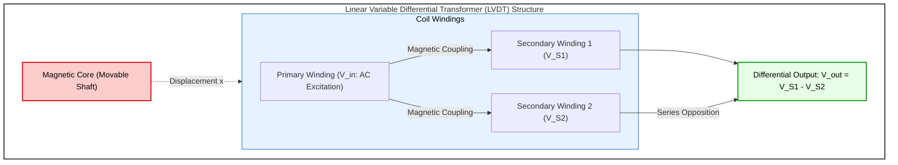
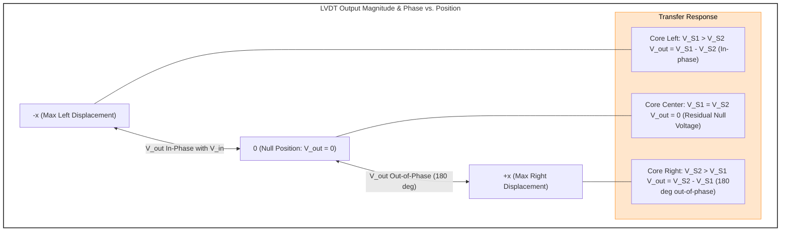
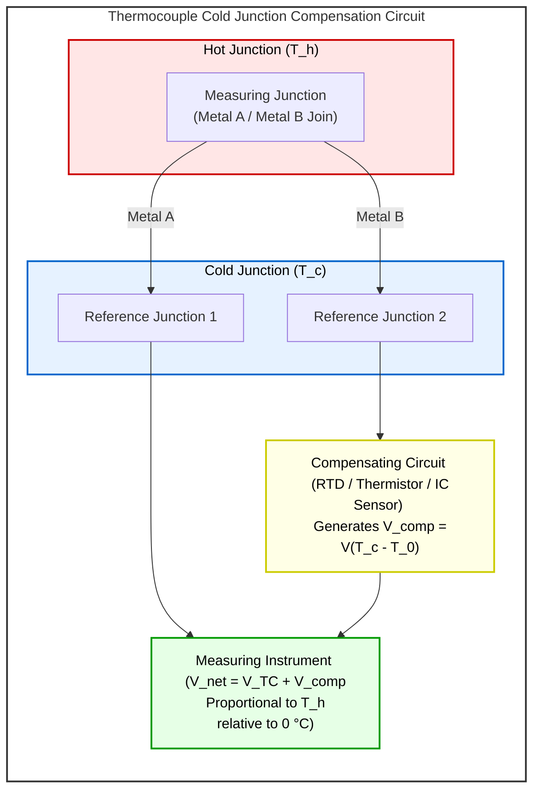
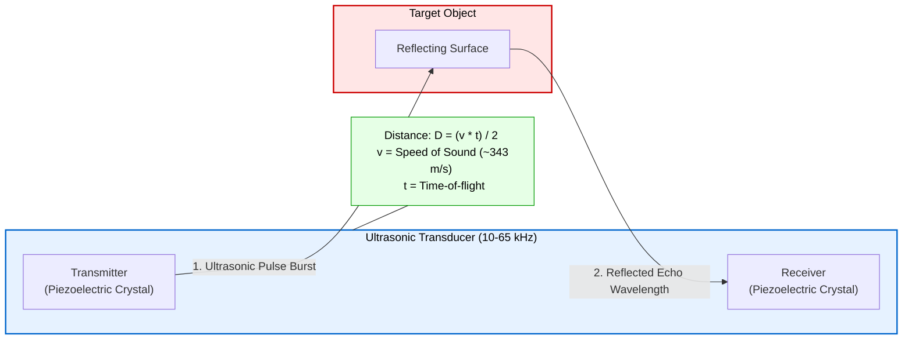
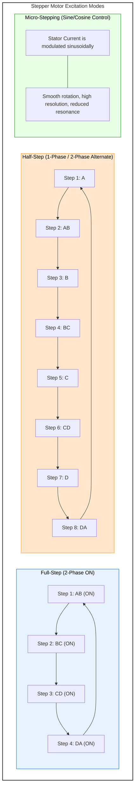
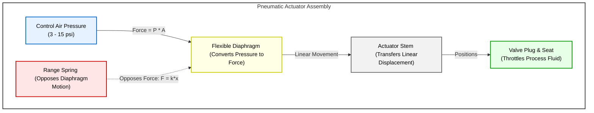
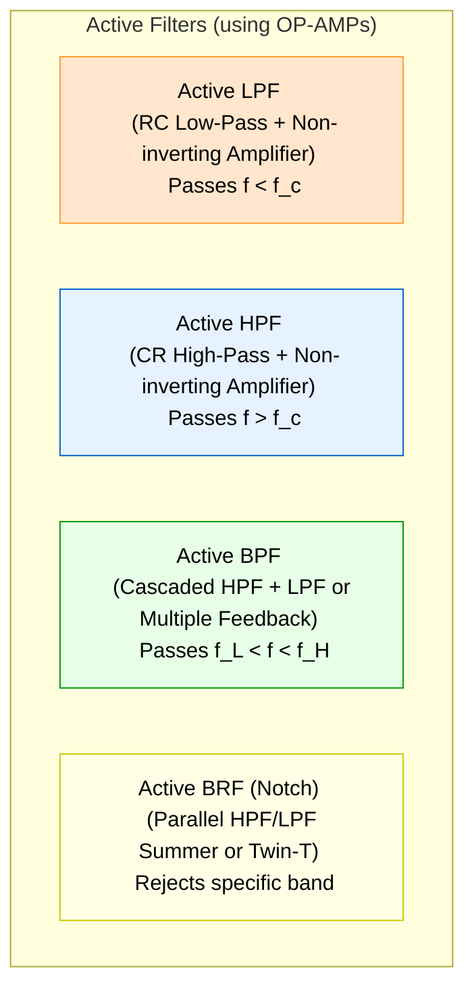
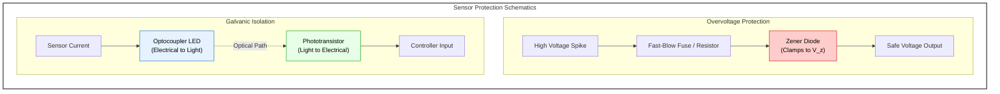
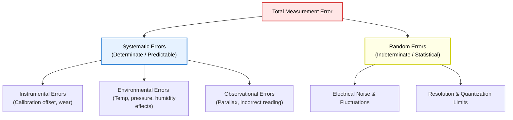

# Chapter 1 Diagrams: Sensors, Actuators & Signal Conditioning

This file contains the Mermaid diagram codes for Chapter 1. These codes can be rendered in the Mermaid Editor (local or online) to export high-quality PNGs to this directory.

---

## 1. LVDT Electro-Mechanical Schematic
* **File Name:** `lvdt_schematic.png`

---

## 2. LVDT Transfer Characteristics
* **File Name:** `lvdt_transfer_char.png`

---

## 3. Thermocouple & Cold Junction Compensation
* **File Name:** `thermocouple_compensation.png`

---

## 4. Ultrasonic Sensor Working Principle
* **File Name:** `ultrasonic_working.png`

---

## 5. Stepper Motor Drive Step Modes
* **File Name:** `stepper_half_micro.png`

---

## 6. Pneumatic Spring-Diaphragm Actuator
* **File Name:** `pneumatic_actuator.png`

---

## 7. Signal Conditioning Functional Architecture
* **File Name:** `signal_conditioning_block.png`

```mermaid
flowchart LR
    subgraph Input ["Physical Stage"]
        PV["Process Variable"]
        Sens["Sensor / Transducer"]
    end
    
    subgraph Conditioning ["Signal Conditioning Stage"]
        Prot["Protection <br> (Clamps/Fuses)"]
        Filt["Filtering <br> (LPF/HPF Active)"]
        Amp["Amplification <br> (Instrumentation Amp)"]
        Iso["Electrical Isolation <br> (Optocouplers)"]
    end
    
    subgraph Output ["Processing & Transmission"]
        ADC["ADC Converter"]
        MCU["Digital Controller <br> (PLC / DCS / PID)"]
    end
    
    PV --> Sens
    Sens -->|Low-level Signal| Prot
    Prot --> Filt
    Filt --> Amp
    Amp --> Iso
    Iso -->|Conditioned Analog| ADC
    ADC -->|Digital Bits| MCU
    
    style Input fill:#ffe6e6,stroke:#cc0000,stroke-width:2px,color:#000
    style Conditioning fill:#e6f2ff,stroke:#0066cc,stroke-width:2px,color:#000
    style Output fill:#e6ffe6,stroke:#009900,stroke-width:2px,color:#000
```

---

## 8. Active Filter Circuit Topologies
* **File Name:** `opamp_filters.png`

---

## 9. Sensor Protection Circuits
* **File Name:** `sensor_protection.png`

---

## 10. Measurement Error Taxonomy
* **File Name:** `error_classification.png`

